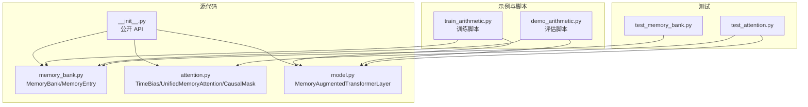
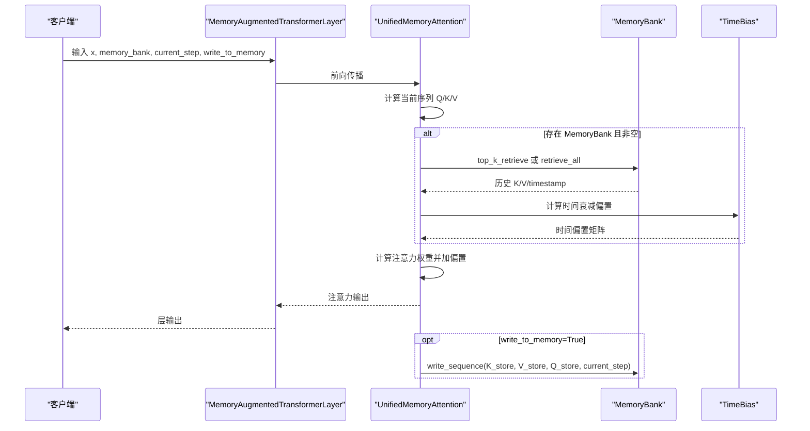
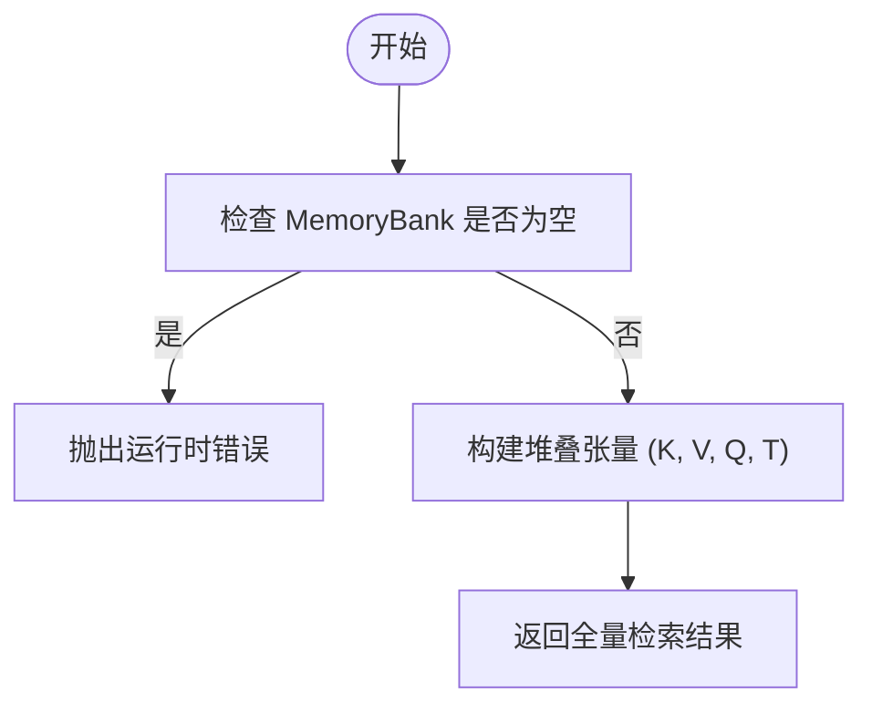
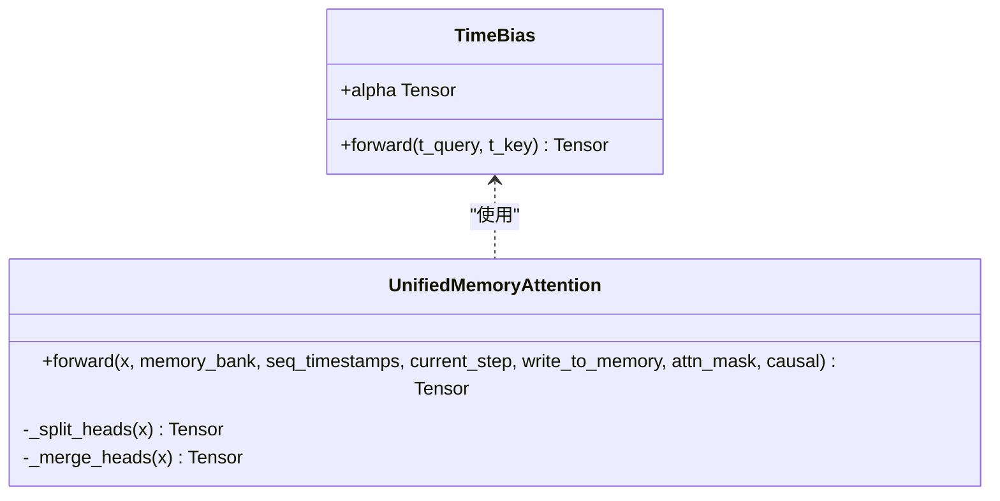
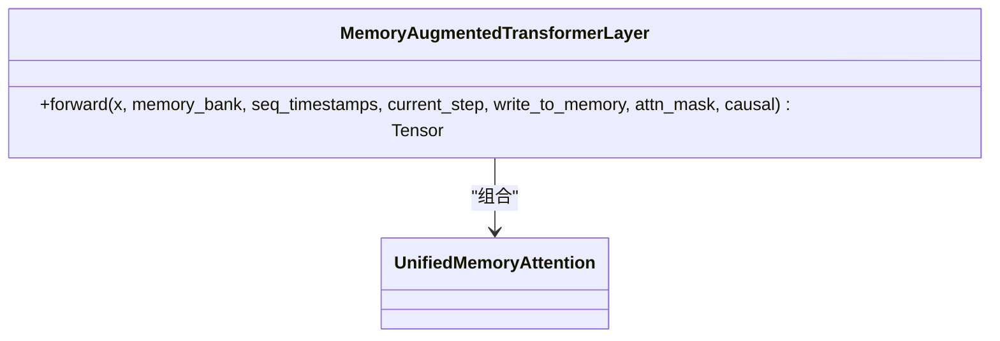
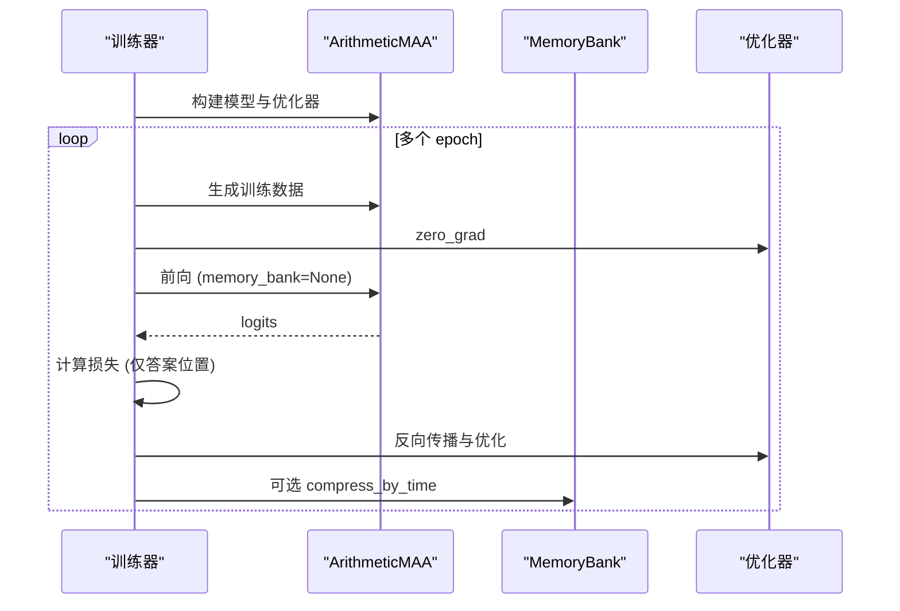
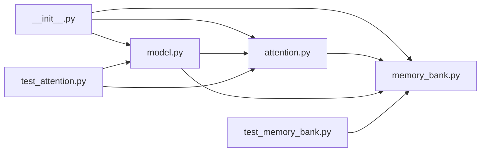

# 使用示例与教程

<cite>
**本文档引用的文件**
- [README.md](file://README.md)
- [README_zh.md](file://README_zh.md)
- [src/memory_augmented_attention/__init__.py](file://src/memory_augmented_attention/__init__.py)
- [src/memory_augmented_attention/memory_bank.py](file://src/memory_augmented_attention/memory_bank.py)
- [src/memory_augmented_attention/attention.py](file://src/memory_augmented_attention/attention.py)
- [src/memory_augmented_attention/model.py](file://src/memory_augmented_attention/model.py)
- [tests/test_memory_bank.py](file://tests/test_memory_bank.py)
- [tests/test_attention.py](file://tests/test_attention.py)
- [train_arithmetic.py](file://train_arithmetic.py)
- [demo_arithmetic.py](file://demo_arithmetic.py)
- [pyproject.toml](file://pyproject.toml)
</cite>

## 目录
1. [简介](#简介)
2. [项目结构](#项目结构)
3. [核心组件](#核心组件)
4. [架构总览](#架构总览)
5. [详细组件分析](#详细组件分析)
6. [依赖关系分析](#依赖关系分析)
7. [性能考虑](#性能考虑)
8. [故障排查指南](#故障排查指南)
9. [结论](#结论)
10. [附录](#附录)

## 简介
本教程面向希望系统掌握 Memory-Augmented Attention（MAA）的开发者与研究者，提供从基础到高级的完整使用场景。内容涵盖：
- 简单注意力计算示例
- MemoryBank 的基本操作演示
- 与 ArithmeticMAA 模型的训练集成
- 监督微调的完整流程（数据加载、模型训练、损失计算、优化器使用）
- 推理场景的多种模式（冷启动、前缀模式、银行模式）对比
- 性能优化技巧与最佳实践
- 每个示例均提供代码路径、详细注释与运行结果分析

## 项目结构
该项目采用清晰的模块化组织，核心代码位于 src/memory_augmented_attention，配套训练与评估脚本位于根目录，测试位于 tests。

**图表来源**
- [src/memory_augmented_attention/__init__.py:1-28](file://src/memory_augmented_attention/__init__.py#L1-L28)
- [src/memory_augmented_attention/memory_bank.py:1-284](file://src/memory_augmented_attention/memory_bank.py#L1-L284)
- [src/memory_augmented_attention/attention.py:1-322](file://src/memory_augmented_attention/attention.py#L1-L322)
- [src/memory_augmented_attention/model.py:1-134](file://src/memory_augmented_attention/model.py#L1-L134)
- [train_arithmetic.py:1-358](file://train_arithmetic.py#L1-L358)
- [demo_arithmetic.py:1-324](file://demo_arithmetic.py#L1-L324)
- [tests/test_memory_bank.py:1-189](file://tests/test_memory_bank.py#L1-L189)
- [tests/test_attention.py:1-231](file://tests/test_attention.py#L1-L231)

**章节来源**
- [README.md:374-394](file://README.md#L374-L394)
- [pyproject.toml:1-22](file://pyproject.toml#L1-L22)

## 核心组件
- MemoryBank：统一存储带时间戳的 (K, V, Q, timestamp) 记忆条目，支持写入、批量写入、全量/Top-K 检索、压缩与清理。
- TimeBias：可学习的时间衰减偏置模块，用于在注意力 logits 上加入时间衰减项。
- UnifiedMemoryAttention：基于统一记忆池的多头注意力，支持 causal 掩码与可选 top_k 检索。
- MemoryAugmentedTransformerLayer：封装注意力 + 前馈网络 + 层归一化残差的完整编码器层。

这些组件共同实现“当前序列 token 与历史 KV 对统一存储在共享 MemoryBank 中”的理念，并通过时间衰减偏置实现自然的遗忘与上下文选择。

**章节来源**
- [src/memory_augmented_attention/__init__.py:10-27](file://src/memory_augmented_attention/__init__.py#L10-L27)
- [src/memory_augmented_attention/memory_bank.py:43-284](file://src/memory_augmented_attention/memory_bank.py#L43-L284)
- [src/memory_augmented_attention/attention.py:40-322](file://src/memory_augmented_attention/attention.py#L40-L322)
- [src/memory_augmented_attention/model.py:27-134](file://src/memory_augmented_attention/model.py#L27-L134)

## 架构总览
MAA 的整体架构围绕 MemoryBank 与注意力模块展开：输入序列经投影得到 Q/K/V，与 MemoryBank 中的历史条目拼接后计算注意力；随后将当前序列的 Q/K/V 写入 MemoryBank，形成持续积累的历史上下文。

**图表来源**
- [src/memory_augmented_attention/model.py:87-134](file://src/memory_augmented_attention/model.py#L87-L134)
- [src/memory_augmented_attention/attention.py:181-322](file://src/memory_augmented_attention/attention.py#L181-L322)
- [src/memory_augmented_attention/memory_bank.py:128-164](file://src/memory_augmented_attention/memory_bank.py#L128-L164)

## 详细组件分析

### MemoryBank 基础操作与最佳实践
- 写入单条与批量写入：支持按 token 序列写入，自动维护时间戳。
- 检索策略：全量检索与 Top-K 检索，Top-K 基于余弦相似度，保持时间顺序。
- 写入过滤：可通过重要性阈值过滤低信息 token，避免污染记忆库。
- 压缩与清理：定期压缩保留最新条目，或清空全部条目。
- LRU 淘汰：当达到 max_size 时，自动淘汰最早条目。

**图表来源**
- [src/memory_augmented_attention/memory_bank.py:169-202](file://src/memory_augmented_attention/memory_bank.py#L169-L202)

**章节来源**
- [src/memory_augmented_attention/memory_bank.py:82-164](file://src/memory_augmented_attention/memory_bank.py#L82-L164)
- [tests/test_memory_bank.py:107-158](file://tests/test_memory_bank.py#L107-L158)

### UnifiedMemoryAttention 注意力计算
- 支持 causal 掩码，确保当前序列自回归约束。
- 支持 top_k 检索，限制注意力池大小以控制复杂度。
- 时间衰减偏置通过 TimeBias 计算并加到 logits 上。
- 输出经过线性变换与残差连接。

**图表来源**
- [src/memory_augmented_attention/attention.py:40-94](file://src/memory_augmented_attention/attention.py#L40-L94)
- [src/memory_augmented_attention/attention.py:101-322](file://src/memory_augmented_attention/attention.py#L101-L322)

**章节来源**
- [src/memory_augmented_attention/attention.py:181-322](file://src/memory_augmented_attention/attention.py#L181-L322)
- [tests/test_attention.py:101-177](file://tests/test_attention.py#L101-L177)

### MemoryAugmentedTransformerLayer 层实现
- 预归一化残差结构：注意力子层 → FFN 子层 → LayerNorm + Dropout。
- 与 MemoryBank 的集成：在前向过程中将当前序列写入 MemoryBank。
- 支持 attn_mask 与 causal 参数。

**图表来源**
- [src/memory_augmented_attention/model.py:27-134](file://src/memory_augmented_attention/model.py#L27-L134)
- [src/memory_augmented_attention/attention.py:101-322](file://src/memory_augmented_attention/attention.py#L101-L322)

**章节来源**
- [src/memory_augmented_attention/model.py:87-134](file://src/memory_augmented_attention/model.py#L87-L134)
- [tests/test_attention.py:184-231](file://tests/test_attention.py#L184-L231)

### 算术教学任务训练与评估
- 训练脚本 train_arithmetic.py：构建字符级词汇表，生成带 Y/N 判决的 in-context 演示，定义 ArithmeticMAA 模型，实现监督微调与评估。
- 评估脚本 demo_arithmetic.py：实现四种推理模式（Cold/Prefix/PrefixNoisy/Bank）与五级难度（L1–L5）评测，比较不同模式下的准确率。

**图表来源**
- [train_arithmetic.py:209-252](file://train_arithmetic.py#L209-L252)
- [train_arithmetic.py:257-307](file://train_arithmetic.py#L257-L307)

**章节来源**
- [train_arithmetic.py:1-358](file://train_arithmetic.py#L1-L358)
- [demo_arithmetic.py:1-324](file://demo_arithmetic.py#L1-L324)

## 依赖关系分析
- 模块导入关系：__init__.py 导出 MemoryBank、TimeBias、UnifiedMemoryAttention、MemoryAugmentedTransformerLayer。
- 组件耦合：UnifiedMemoryAttention 依赖 MemoryBank 与 TimeBias；MemoryAugmentedTransformerLayer 组合 UnifiedMemoryAttention。
- 测试覆盖：测试文件覆盖 MemoryBank 的写入/检索/压缩等核心功能，以及注意力模块与层的正确性。

**图表来源**
- [src/memory_augmented_attention/__init__.py:18-27](file://src/memory_augmented_attention/__init__.py#L18-L27)
- [src/memory_augmented_attention/attention.py:32-32](file://src/memory_augmented_attention/attention.py#L32-L32)
- [src/memory_augmented_attention/model.py:23-24](file://src/memory_augmented_attention/model.py#L23-L24)

**章节来源**
- [src/memory_augmented_attention/__init__.py:18-27](file://src/memory_augmented_attention/__init__.py#L18-L27)
- [tests/test_memory_bank.py:6-10](file://tests/test_memory_bank.py#L6-L10)
- [tests/test_attention.py:7-9](file://tests/test_attention.py#L7-L9)

## 性能考虑
- 复杂度与可扩展性：全量注意力复杂度为 O((L + M)² · d)，建议使用 Top-K 检索、时间压缩与 LRU 兜底相结合的策略。
- 推荐策略：近期 token 使用全量注意力，较旧 token 使用 Top-K，超出物理上限时进行归纳/总结。
- 超参数建议：top_k 通常设置在 32–128；init_alpha 0.5–2.0；max_size 1024–16384；importance_threshold 0.0–0.5。
- 训练与推理：训练时可使用 MemoryBank，但注意定期压缩；推理时可持久化 MemoryBank 以获得更好的上下文累积效果。

**章节来源**
- [README.md:151-170](file://README.md#L151-L170)
- [README.md:331-340](file://README.md#L331-L340)
- [README_zh.md:126-151](file://README_zh.md#L126-L151)
- [README_zh.md:313-321](file://README_zh.md#L313-L321)

## 故障排查指南
- MemoryBank 空检索报错：当 MemoryBank 为空时，retrieve_all 与 top_k_retrieve 会抛出运行时错误。请在调用前检查 bank 是否为空或先写入条目。
- 重要性阈值导致写入失败：当 value 的 L2 范数低于阈值时，write 返回 False。可适当降低阈值或提高 token 重要性。
- 头数与 d_model 不匹配：UnifiedMemoryAttention 要求 d_model 能被 n_heads 整除，否则抛出异常。
- 梯度流与数值稳定性：注意力输出应为有限值；若出现 NaN，请检查输入张量与掩码设置。

**章节来源**
- [tests/test_memory_bank.py:107-111](file://tests/test_memory_bank.py#L107-L111)
- [tests/test_memory_bank.py:85-100](file://tests/test_memory_bank.py#L85-L100)
- [tests/test_attention.py:85-88](file://tests/test_attention.py#L85-L88)
- [tests/test_attention.py:18-59](file://tests/test_attention.py#L18-L59)

## 结论
MAA 提供了一种统一的内存视角：将当前序列 token 与历史 KV 对等同处理，通过 MemoryBank 与时间衰减偏置实现自然的上下文选择与遗忘。结合 Top-K 检索、时间压缩与 LRU 兜底，可在有限资源下实现接近无限的上下文容量。训练与评估脚本展示了如何在算术教学任务中利用 Y/N 判决与 Bank/Prefix 双通道验证模型的推理能力。建议在实际应用中根据场景调整超参数，并在推理阶段持久化 MemoryBank 以提升上下文一致性。

## 附录

### 示例清单与代码路径
- 基础注意力计算示例
  - 代码路径：[src/memory_augmented_attention/attention.py:181-322](file://src/memory_augmented_attention/attention.py#L181-L322)
  - 说明：展示如何在无 MemoryBank 的情况下使用 UnifiedMemoryAttention 进行自注意力计算。
- MemoryBank 基本操作演示
  - 代码路径：[src/memory_augmented_attention/memory_bank.py:82-164](file://src/memory_augmented_attention/memory_bank.py#L82-L164)
  - 说明：演示写入单条、批量写入、Top-K 检索、压缩与清理。
- 与 ArithmeticMAA 模型的训练集成
  - 代码路径：[train_arithmetic.py:209-252](file://train_arithmetic.py#L209-L252)
  - 说明：定义模型、构建数据集、前向传播、损失计算与优化器使用。
- 监督微调完整流程
  - 代码路径：[train_arithmetic.py:257-307](file://train_arithmetic.py#L257-L307)
  - 说明：遍历 epoch 与 batch，零梯度、前向、反向、优化与可选压缩。
- 推理场景模式对比（冷启动/前缀/银行）
  - 代码路径：[demo_arithmetic.py:189-236](file://demo_arithmetic.py#L189-L236)
  - 说明：实现四种模式与五级难度评测，比较不同模式下的准确率。
- 性能优化与最佳实践
  - 代码路径：[README.md:151-170](file://README.md#L151-L170), [README_zh.md:126-151](file://README_zh.md#L126-L151)
  - 说明：Top-K 检索、时间压缩、LRU 兜底与超参数建议。

**章节来源**
- [src/memory_augmented_attention/attention.py:181-322](file://src/memory_augmented_attention/attention.py#L181-L322)
- [src/memory_augmented_attention/memory_bank.py:82-164](file://src/memory_augmented_attention/memory_bank.py#L82-L164)
- [train_arithmetic.py:209-307](file://train_arithmetic.py#L209-L307)
- [demo_arithmetic.py:189-236](file://demo_arithmetic.py#L189-L236)
- [README.md:151-170](file://README.md#L151-L170)
- [README_zh.md:126-151](file://README_zh.md#L126-L151)