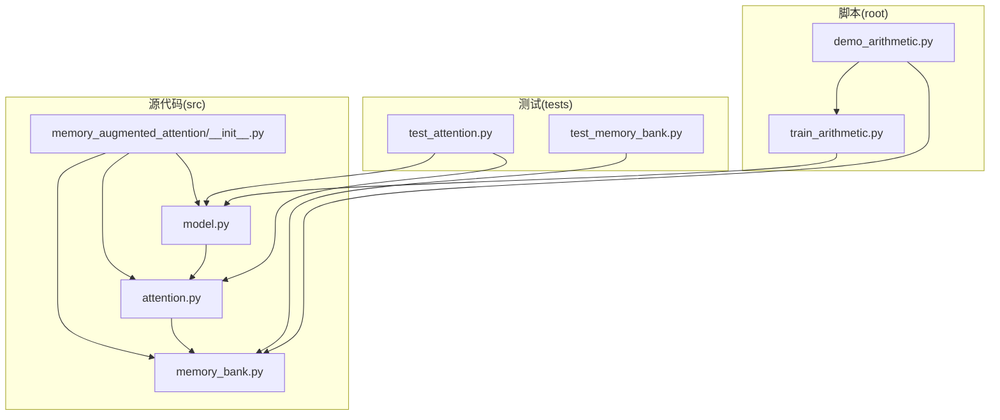
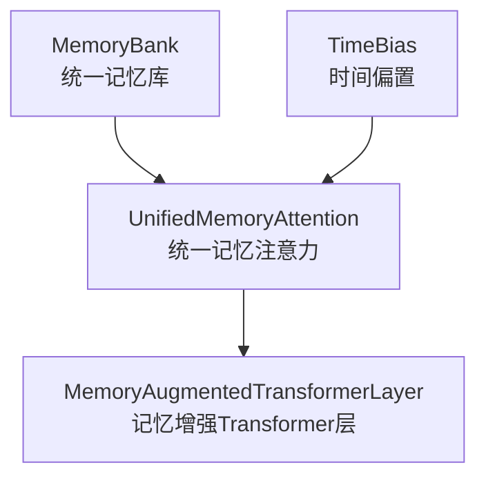
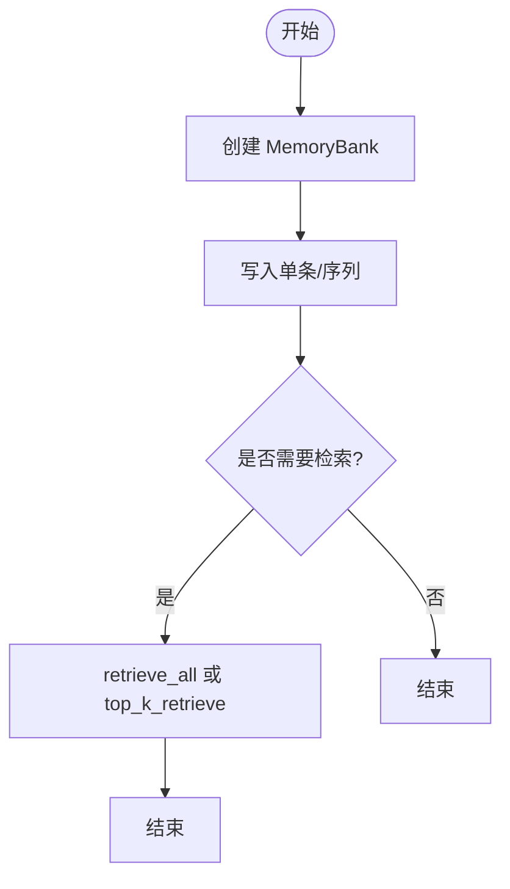
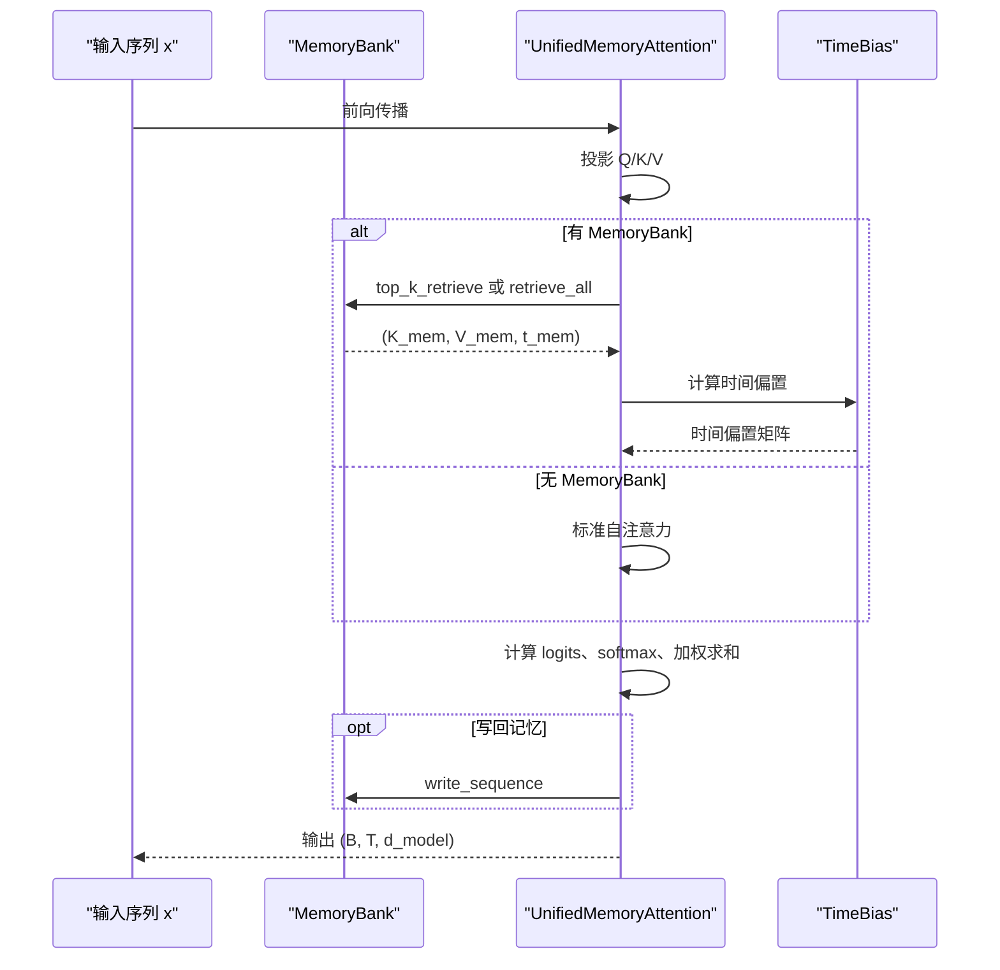
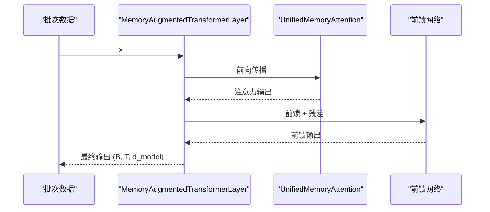
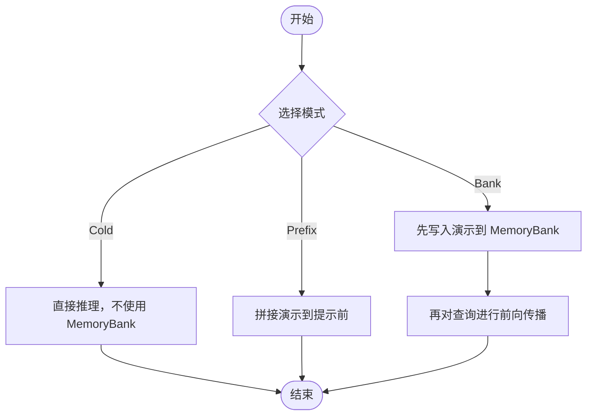
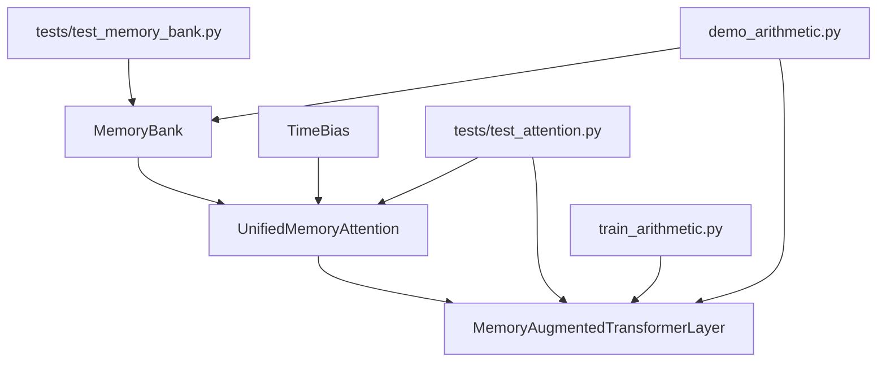

# 基础使用示例

<cite>
**本文引用的文件**
- [src/memory_augmented_attention/__init__.py](file://src/memory_augmented_attention/__init__.py)
- [src/memory_augmented_attention/memory_bank.py](file://src/memory_augmented_attention/memory_bank.py)
- [src/memory_augmented_attention/attention.py](file://src/memory_augmented_attention/attention.py)
- [src/memory_augmented_attention/model.py](file://src/memory_augmented_attention/model.py)
- [tests/test_memory_bank.py](file://tests/test_memory_bank.py)
- [tests/test_attention.py](file://tests/test_attention.py)
- [demo_arithmetic.py](file://demo_arithmetic.py)
- [train_arithmetic.py](file://train_arithmetic.py)
- [README.md](file://README.md)
- [pyproject.toml](file://pyproject.toml)
</cite>

## 目录
1. [简介](#简介)
2. [项目结构](#项目结构)
3. [核心组件](#核心组件)
4. [架构总览](#架构总览)
5. [详细组件分析](#详细组件分析)
6. [依赖分析](#依赖分析)
7. [性能考虑](#性能考虑)
8. [故障排查指南](#故障排查指南)
9. [结论](#结论)
10. [附录](#附录)

## 简介
本文件面向初学者，提供 Memory-Augmented Attention 的基础使用示例，涵盖以下内容：
- 使用 MemoryBank 进行基本的记忆写入与检索
- 展示 UnifiedMemoryAttention 的简单注意力计算流程
- 提供 MemoryAugmentedTransformerLayer 的最小化使用案例：模型初始化、数据准备与前向传播
- 演示冷启动推理、前缀模式与银行模式的简单实现思路
- 包含参数说明与预期输出结果，确保示例可直接运行并展示核心功能

## 项目结构
该项目采用模块化组织，核心代码位于 src/memory_augmented_attention，单元测试位于 tests，训练与演示脚本位于根目录。

图表来源
- [src/memory_augmented_attention/__init__.py:18-27](file://src/memory_augmented_attention/__init__.py#L18-L27)
- [src/memory_augmented_attention/memory_bank.py:43-284](file://src/memory_augmented_attention/memory_bank.py#L43-L284)
- [src/memory_augmented_attention/attention.py:101-322](file://src/memory_augmented_attention/attention.py#L101-L322)
- [src/memory_augmented_attention/model.py:27-134](file://src/memory_augmented_attention/model.py#L27-L134)
- [tests/test_memory_bank.py:1-189](file://tests/test_memory_bank.py#L1-L189)
- [tests/test_attention.py:1-231](file://tests/test_attention.py#L1-L231)
- [demo_arithmetic.py:1-324](file://demo_arithmetic.py#L1-L324)
- [train_arithmetic.py:1-358](file://train_arithmetic.py#L1-L358)

章节来源
- [README.md:374-393](file://README.md#L374-L393)

## 核心组件
- MemoryBank：统一的时间戳记忆库，存储 (K, V, Q, timestamp)，支持写入、序列写入、全量检索、Top-K 检索、压缩与清理等。
- TimeBias：可学习的时间偏置模块，基于对数形式的时间衰减，用于注意力 logits 的时间惩罚。
- UnifiedMemoryAttention：统一记忆注意力，对当前序列与历史记忆池（MemoryBank）联合计算注意力，支持 top_k 限制、因果掩码与写回记忆。
- MemoryAugmentedTransformerLayer：带统一记忆注意力的编码器层，包含前馈网络与残差归一化。

章节来源
- [src/memory_augmented_attention/__init__.py:10-27](file://src/memory_augmented_attention/__init__.py#L10-L27)
- [src/memory_augmented_attention/memory_bank.py:43-284](file://src/memory_augmented_attention/memory_bank.py#L43-L284)
- [src/memory_augmented_attention/attention.py:40-322](file://src/memory_augmented_attention/attention.py#L40-L322)
- [src/memory_augmented_attention/model.py:27-134](file://src/memory_augmented_attention/model.py#L27-L134)

## 架构总览
下图展示了 MemoryBank 与注意力模块之间的交互，以及 Transformer 层如何组合注意力与前馈网络。

图表来源
- [src/memory_augmented_attention/attention.py:101-322](file://src/memory_augmented_attention/attention.py#L101-L322)
- [src/memory_augmented_attention/model.py:27-134](file://src/memory_augmented_attention/model.py#L27-L134)

## 详细组件分析

### MemoryBank 基础使用示例
- 初始化与写入
  - 创建 MemoryBank，设置最大容量与重要性阈值
  - 使用 write 或 write_sequence 写入单条或整段序列
- 检索
  - retrieve_all 返回全部条目张量
  - top_k_retrieve 基于余弦相似度返回最相关的 k 条
- 清理与压缩
  - clear 清空所有条目
  - compress_by_time 仅保留最近的 keep_newest 条目

图表来源
- [src/memory_augmented_attention/memory_bank.py:82-163](file://src/memory_augmented_attention/memory_bank.py#L82-L163)
- [src/memory_augmented_attention/memory_bank.py:169-253](file://src/memory_augmented_attention/memory_bank.py#L169-L253)

章节来源
- [src/memory_augmented_attention/memory_bank.py:43-284](file://src/memory_augmented_attention/memory_bank.py#L43-L284)
- [tests/test_memory_bank.py:26-189](file://tests/test_memory_bank.py#L26-L189)

### UnifiedMemoryAttention 简单注意力计算示例
- 输入
  - x：形状为 (B, T, d_model) 的当前序列
  - memory_bank：可选的 MemoryBank
  - seq_timestamps：每个 token 的全局步长时间戳
  - current_step：第一个 token 对应的全局步长
  - write_to_memory：是否将当前序列的 K/V/Q 写回记忆库
  - attn_mask：(T, T_all) 或 (B, H, T, T_all) 的加性掩码
  - causal：是否应用因果掩码（仅对当前序列部分）
- 输出
  - 形状为 (B, T, d_model) 的注意力输出

图表来源
- [src/memory_augmented_attention/attention.py:181-322](file://src/memory_augmented_attention/attention.py#L181-L322)

章节来源
- [src/memory_augmented_attention/attention.py:101-322](file://src/memory_augmented_attention/attention.py#L101-L322)
- [tests/test_attention.py:66-177](file://tests/test_attention.py#L66-L177)

### MemoryAugmentedTransformerLayer 最小化使用案例
- 模型初始化
  - d_model、n_heads、d_ff、dropout、top_k、init_alpha
- 数据准备
  - 将输入张量 x 设为 (B, T, d_model)
  - 准备 memory_bank（可选）
  - 设置 current_step 与 seq_timestamps（可选）
- 前向传播
  - layer(x, memory_bank, current_step, write_to_memory, attn_mask, causal)

图表来源
- [src/memory_augmented_attention/model.py:87-134](file://src/memory_augmented_attention/model.py#L87-L134)

章节来源
- [src/memory_augmented_attention/model.py:27-134](file://src/memory_augmented_attention/model.py#L27-L134)
- [tests/test_attention.py:184-231](file://tests/test_attention.py#L184-L231)

### 冷启动推理、前缀模式与银行模式的简单实现
- 冷启动推理（Cold）
  - 不使用 MemoryBank，仅用模型权重进行推理
  - 适合无上下文或首次调用
- 前缀模式（Prefix）
  - 将若干演示拼接在提示前，形成较长上下文
  - 适合传统提示工程方式
- 银行模式（Bank）
  - 先对演示块执行一次前向传播，将 K/V 写入 MemoryBank
  - 再单独对查询执行前向传播，利用统一记忆池
  - 适合需要“消化”演示后再查询的场景

图表来源
- [demo_arithmetic.py:188-236](file://demo_arithmetic.py#L188-L236)
- [demo_arithmetic.py:167-183](file://demo_arithmetic.py#L167-L183)

章节来源
- [demo_arithmetic.py:1-324](file://demo_arithmetic.py#L1-L324)
- [train_arithmetic.py:209-252](file://train_arithmetic.py#L209-L252)

## 依赖分析
- 依赖关系
  - MemoryBank 由 torch 张量与数据类组成，无外部依赖
  - TimeBias 与 UnifiedMemoryAttention 依赖 MemoryBank
  - MemoryAugmentedTransformerLayer 依赖 UnifiedMemoryAttention 与 MemoryBank
  - 测试覆盖 MemoryBank、TimeBias、UnifiedMemoryAttention 与 MemoryAugmentedTransformerLayer
  - 训练与演示脚本使用 MemoryBank 与 MemoryAugmentedTransformerLayer

图表来源
- [src/memory_augmented_attention/memory_bank.py:43-284](file://src/memory_augmented_attention/memory_bank.py#L43-L284)
- [src/memory_augmented_attention/attention.py:40-322](file://src/memory_augmented_attention/attention.py#L40-L322)
- [src/memory_augmented_attention/model.py:27-134](file://src/memory_augmented_attention/model.py#L27-L134)
- [tests/test_memory_bank.py:1-189](file://tests/test_memory_bank.py#L1-L189)
- [tests/test_attention.py:1-231](file://tests/test_attention.py#L1-L231)
- [train_arithmetic.py:34-358](file://train_arithmetic.py#L34-L358)
- [demo_arithmetic.py:38-53](file://demo_arithmetic.py#L38-L53)

章节来源
- [pyproject.toml:11-18](file://pyproject.toml#L11-L18)

## 性能考虑
- 复杂度与可扩展性
  - Naive 全量注意力 O((L + M)² · d)，M 为历史条目数量
  - 三种策略控制复杂度：Top-K 检索、时间压缩、LRU 淘汰
  - 推荐：近期条目全量注意，旧条目 Top-K，归档压缩
- 超参数建议
  - top_k：32–128（更大上下文但更高计算）
  - init_alpha：0.5–2.0（更强时间衰减）
  - max_size：1024–16384（内存上限）
  - importance_threshold：0.0–0.5（过滤低信息条目）

章节来源
- [README.md:151-169](file://README.md#L151-L169)
- [README.md:331-339](file://README.md#L331-L339)

## 故障排查指南
- MemoryBank
  - 空库检索会抛出异常；请先写入再检索
  - 重要性阈值过高会导致写入被拒绝
  - 容量满时自动 LRU 淘汰最旧条目
- UnifiedMemoryAttention
  - d_model 必须能被 n_heads 整除
  - 未提供 MemoryBank 时退化为标准自注意力
  - causal 掩码仅作用于当前序列部分
- MemoryAugmentedTransformerLayer
  - 前馈网络与残差连接确保输出非平凡
  - 多次前向传播会累积历史记忆

章节来源
- [tests/test_memory_bank.py:107-158](file://tests/test_memory_bank.py#L107-L158)
- [tests/test_attention.py:85-177](file://tests/test_attention.py#L85-L177)
- [tests/test_attention.py:184-231](file://tests/test_attention.py#L184-L231)

## 结论
通过上述基础示例，您可以：
- 使用 MemoryBank 进行记忆写入与检索
- 在 UnifiedMemoryAttention 中体验统一记忆注意力的计算流程
- 使用 MemoryAugmentedTransformerLayer 构建最小化的记忆增强层
- 实现冷启动、前缀与银行模式的推理思路

这些示例可直接运行并展示核心功能，为进一步扩展（如多维动态权重、层级记忆等）奠定基础。

## 附录
- 示例运行环境
  - Python ≥ 3.9
  - PyTorch ≥ 2.0
  - 可选：pytest 运行测试
- 快速安装
  - 可使用可编辑安装以运行示例与测试

章节来源
- [README.md:173-179](file://README.md#L173-L179)
- [pyproject.toml:1-22](file://pyproject.toml#L1-L22)