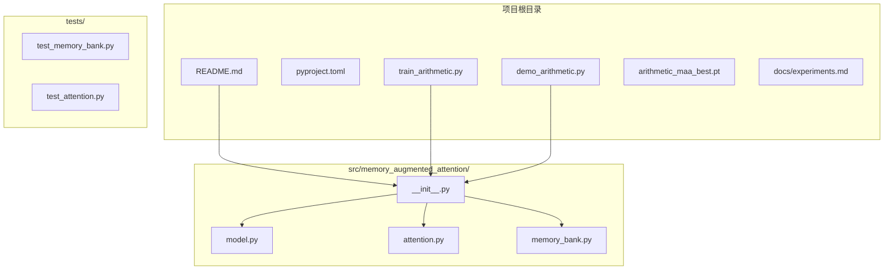
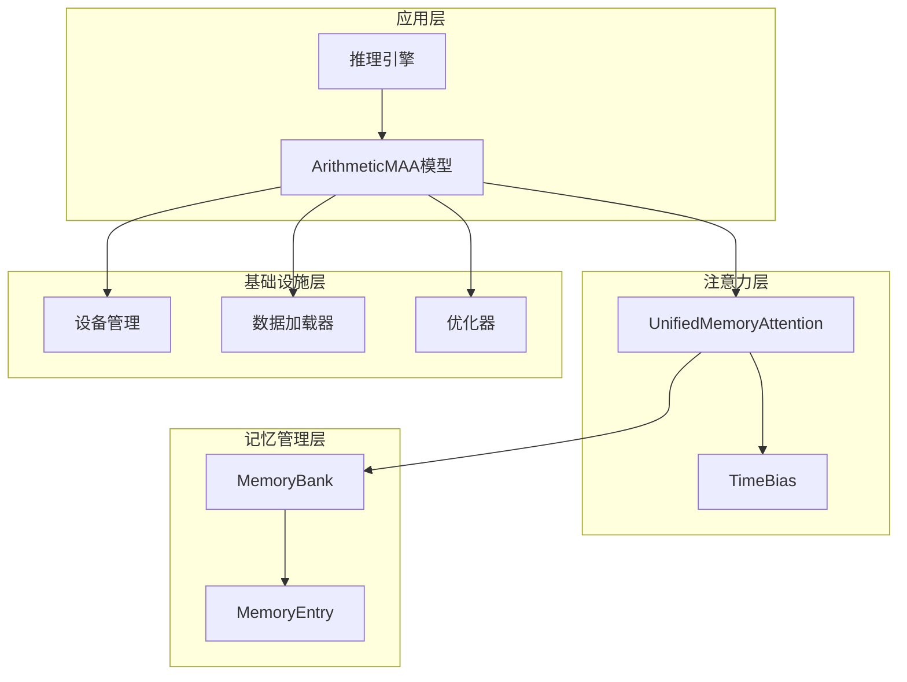
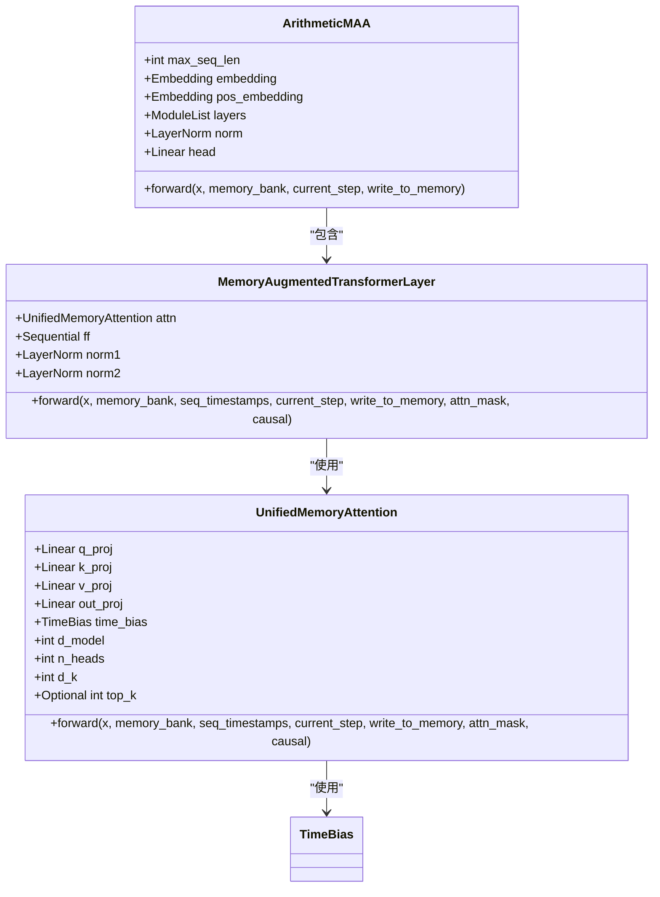
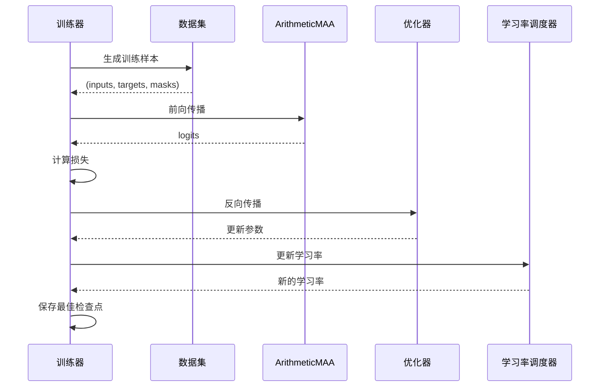
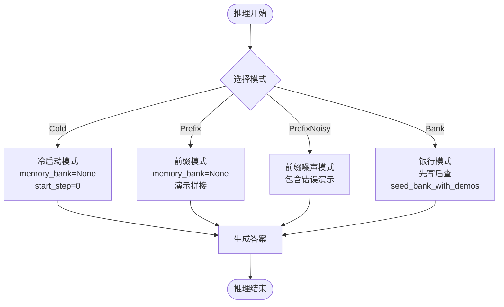
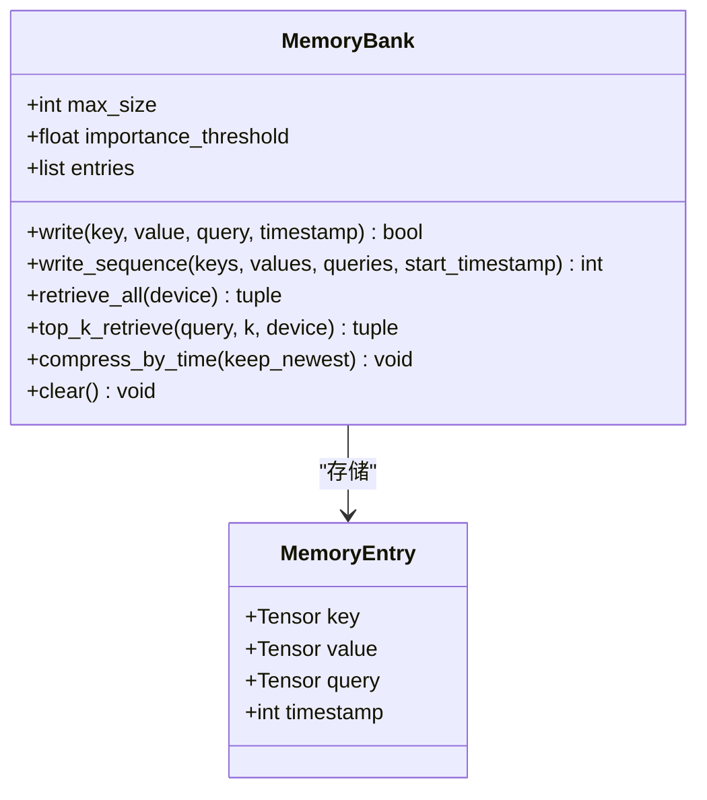
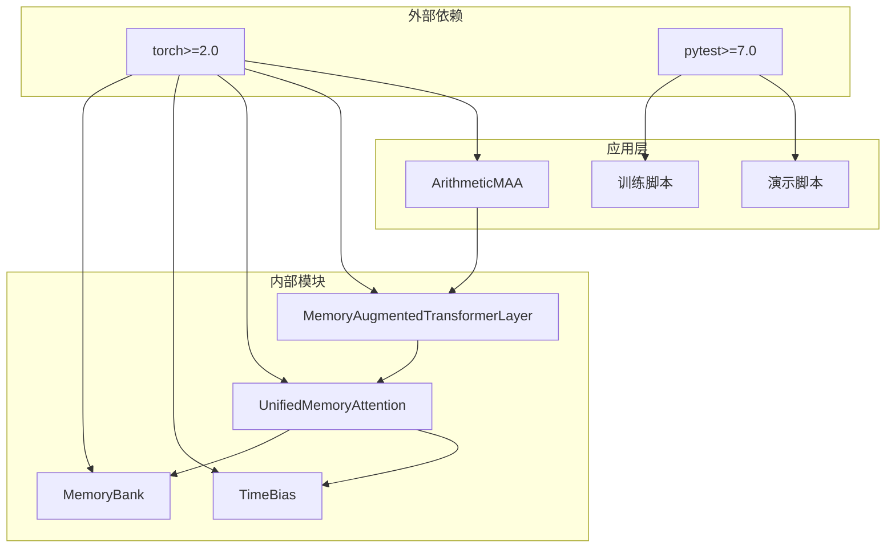

# 高级应用场景

<cite>
**本文档引用的文件**
- [README.md](file://README.md)
- [train_arithmetic.py](file://train_arithmetic.py)
- [demo_arithmetic.py](file://demo_arithmetic.py)
- [model.py](file://src/memory_augmented_attention/model.py)
- [attention.py](file://src/memory_augmented_attention/attention.py)
- [memory_bank.py](file://src/memory_augmented_attention/memory_bank.py)
- [test_memory_bank.py](file://tests/test_memory_bank.py)
- [test_attention.py](file://tests/test_attention.py)
- [experiments.md](file://docs/experiments.md)
- [pyproject.toml](file://pyproject.toml)
</cite>

## 目录
1. [简介](#简介)
2. [项目结构](#项目结构)
3. [核心组件](#核心组件)
4. [架构概览](#架构概览)
5. [详细组件分析](#详细组件分析)
6. [依赖关系分析](#依赖关系分析)
7. [性能考虑](#性能考虑)
8. [故障排除指南](#故障排除指南)
9. [结论](#结论)
10. [附录](#附录)

## 简介

Memory-Augmented Attention (MAA) 是一个基于PyTorch的统一记忆增强注意力实现，它将当前序列标记（短期记忆）和历史KV对（长期记忆）存储在一个共享的时间戳化Memory Bank中，并使用时间衰减偏置进行联合注意。该框架的核心创新在于将时间维度显式纳入每个记忆条目，使注意力机制能够自动降低距离过去较远的条目的权重。

该项目特别针对算术教学任务进行了优化，通过在训练中引入带噪声的演示（Y/N标记）来验证模型是否能够区分可信和不可信的信息。该实现展示了四种推理模式：冷启动（Cold）、前缀（Prefix）、前缀噪声（PrefixNoisy）和银行（Bank）模式，每种模式都有其特定的应用场景和实现差异。

## 项目结构

项目采用模块化的文件组织方式，主要包含以下核心目录和文件：

**图表来源**
- [README.md:374-393](file://README.md#L374-L393)
- [pyproject.toml:1-22](file://pyproject.toml#L1-L22)

**章节来源**
- [README.md:374-393](file://README.md#L374-L393)
- [pyproject.toml:1-22](file://pyproject.toml#L1-L22)

## 核心组件

MAA框架由四个核心组件构成，每个组件都承担着特定的功能职责：

### MemoryBank - 统一记忆库
MemoryBank是整个框架的核心存储组件，负责存储所有时间戳化的(K, V, Q)条目。它支持LRU逐出、重要性过滤和时间压缩等机制来管理内存使用。

### TimeBias - 时间衰减偏置
TimeBias是一个可学习的时间衰减模块，通过单个可学习标量alpha实现对注意力分数的时间偏置。其公式为`TimeBias(t_q, t_k) = -alpha * log(1 + |t_q - t_k|)`。

### UnifiedMemoryAttention - 统一记忆注意力
这是MAA的核心注意力机制，它将当前序列和历史记忆统一在一个注意力池中进行计算。支持Top-K检索、因果掩码和时间衰减偏置。

### MemoryAugmentedTransformerLayer - 记忆增强Transformer层
这是一个完整的Transformer编码器层，包含统一记忆注意力、前馈网络和层归一化残差连接。

**章节来源**
- [memory_bank.py:43-284](file://src/memory_augmented_attention/memory_bank.py#L43-L284)
- [attention.py:40-322](file://src/memory_augmented_attention/attention.py#L40-L322)
- [model.py:27-134](file://src/memory_augmented_attention/model.py#L27-L134)

## 架构概览

MAA的整体架构采用了分层设计，从底层的记忆管理到高层的推理应用形成了清晰的抽象层次：

**图表来源**
- [model.py:27-134](file://src/memory_augmented_attention/model.py#L27-L134)
- [attention.py:101-322](file://src/memory_augmented_attention/attention.py#L101-L322)
- [memory_bank.py:43-284](file://src/memory_augmented_attention/memory_bank.py#L43-L284)

## 详细组件分析

### ArithmeticMAA模型架构

ArithmeticMAA是专门为算术教学任务设计的字符级因果Transformer，具有以下特点：

#### 模型配置参数
- **d_model**: 192 - 模型嵌入维度
- **n_heads**: 6 - 注意力头数量
- **d_ff**: 512 - 前馈网络隐藏维度
- **dropout**: 0.1 - Dropout概率
- **top_k**: 64 - Top-K检索大小
- **init_alpha**: 1.0 - 初始时间衰减系数
- **n_layers**: 4 - Transformer层数

#### 数据流处理
模型采用字符级嵌入和位置编码，通过多个MemoryAugmentedTransformerLayer进行堆叠，最终通过线性层映射到词汇表空间。

**图表来源**
- [train_arithmetic.py:209-252](file://train_arithmetic.py#L209-L252)
- [model.py:27-134](file://src/memory_augmented_attention/model.py#L27-L134)
- [attention.py:101-162](file://src/memory_augmented_attention/attention.py#L101-L162)

**章节来源**
- [train_arithmetic.py:209-252](file://train_arithmetic.py#L209-L252)
- [model.py:27-134](file://src/memory_augmented_attention/model.py#L27-L134)

### 训练流程详解

ArithmeticMAA的训练流程包含了完整的数据生成、模型配置、训练循环和检查点保存过程：

#### 数据生成策略
训练数据采用混合宽度加法生成，支持1-和2位数运算，每个样本包含0-6条上下文演示。演示标记为'Y'（正确）或'N'（错误），用于训练模型区分可信信息。

#### 训练循环实现
训练采用批量处理策略，支持梯度裁剪和余弦退火学习率调度。损失函数仅计算查询答案位置的交叉熵，且扩展监督到答案后的PAD位置以防止溢出。

**图表来源**
- [train_arithmetic.py:257-357](file://train_arithmetic.py#L257-L357)

**章节来源**
- [train_arithmetic.py:257-357](file://train_arithmetic.py#L257-L357)

### 推理场景四种模式

MAA框架提供了四种不同的推理模式，每种模式都有其特定的实现逻辑和适用场景：

#### 冷启动模式 (Cold)
- **实现特点**: 完全依赖模型权重，不使用任何外部演示
- **适用场景**: 验证模型的基础算术能力
- **实现差异**: `memory_bank=None`，`start_step=0`

#### 前缀模式 (Prefix)
- **实现特点**: 将正确演示直接拼接到提示词前端
- **适用场景**: 标准的少样本学习场景
- **实现差异**: `memory_bank=None`，演示作为输入的一部分

#### 前缀噪声模式 (PrefixNoisy)
- **实现特点**: 包含部分错误演示，测试模型的可信度判断能力
- **适用场景**: 验证模型区分可信和不可信信息的能力
- **实现差异**: 演示中包含'N'标记的错误示例

#### 银行模式 (Bank)
- **实现特点**: 先将演示写入MemoryBank，然后单独查询
- **适用场景**: 验证统一记忆假设的有效性
- **实现差异**: 使用`seed_bank_with_demos`预热银行

**图表来源**
- [demo_arithmetic.py:204-235](file://demo_arithmetic.py#L204-L235)

**章节来源**
- [demo_arithmetic.py:204-235](file://demo_arithmetic.py#L204-L235)

### MemoryBank内存管理机制

MemoryBank实现了多种内存管理策略来控制内存使用和提高效率：

#### LRU逐出机制
当MemoryBank达到最大容量时，最旧的条目会被自动逐出，确保内存使用的可控性。

#### 重要性过滤
通过`importance_threshold`参数过滤掉低信息量的条目，避免内存污染。

#### 时间压缩
支持按时间压缩功能，定期合并旧条目为摘要向量，减少内存占用。

**图表来源**
- [memory_bank.py:43-284](file://src/memory_augmented_attention/memory_bank.py#L43-L284)

**章节来源**
- [memory_bank.py:43-284](file://src/memory_augmented_attention/memory_bank.py#L43-L284)

## 依赖关系分析

MAA框架的依赖关系相对简洁，遵循了模块化设计原则：

**图表来源**
- [pyproject.toml:11-18](file://pyproject.toml#L11-L18)
- [model.py:23-24](file://src/memory_augmented_attention/model.py#L23-L24)
- [attention.py:32-32](file://src/memory_augmented_attention/attention.py#L32-L32)

**章节来源**
- [pyproject.toml:11-18](file://pyproject.toml#L11-L18)

## 性能考虑

### 内存管理优化

MAA框架提供了三种互补的复杂度管理策略：

#### Top-K检索
只对K个最相关的条目进行注意力计算，K是固定超参数（32-128）。这将复杂度从O((L+M)²·d)降低到O(L·K·d)。

#### 时间压缩
定期将旧条目合并为摘要向量，调用`bank.compress_by_time(keep_newest)`。

#### LRU逐出
当银行满时，最旧的条目会自动被逐出，保持内存使用稳定。

### 批处理策略

训练过程中采用随机打乱和批量处理策略：
- **批量大小**: 64
- **随机采样**: 使用`torch.randperm`进行数据随机化
- **梯度裁剪**: `torch.nn.utils.clip_grad_norm_(model.parameters(), 1.0)`
- **学习率调度**: 余弦退火调度器

### 推理加速方法

#### 分段处理
推理时采用分段处理策略，每次只处理不超过`MAX_SEQ_LEN`长度的序列。

#### 缓存利用
MemoryBank作为持久化缓存，在多次推理之间保持状态。

**章节来源**
- [README.md:151-169](file://README.md#L151-L169)
- [train_arithmetic.py:257-282](file://train_arithmetic.py#L257-L282)

## 故障排除指南

### 常见问题及解决方案

#### 问题1：注意力泄漏（Causal Mask）
**症状**: 训练准确率100%，但测试Cold只有25%
**原因**: UnifiedMemoryAttention默认双向注意力，教师强制下当前位置能看到未来答案token
**解决方案**: 添加`causal: bool = False`参数，构造(T, T_all)因果掩码

#### 问题2：缺少停止监督
**症状**: 训练准确率1.0，但测试时答案多生成一位
**原因**: loss只监督答案位置，答案后的PAD位置无监督
**解决方案**: 扩展mask到`ans_end + 1`，让模型学会在答案后预测PAD

#### 问题3：Bank作弊
**症状**: 训练时跨batch共享bank，训练准确率100%但测试25%
**原因**: bank变成答案查询表，模型学会"搜相同问题复制答案"
**解决方案**: 训练时`memory_bank=None`

### 调试技巧

#### 内存使用监控
使用`bank.__len__()`检查MemoryBank当前存储条目数量，确保不会超过`max_size`。

#### 梯度检查
在反向传播后检查参数梯度是否存在，确保训练正常进行。

#### 设备兼容性
使用`_pick_device()`函数自动检测可用设备（CUDA > MPS > CPU）。

**章节来源**
- [experiments.md:96-122](file://docs/experiments.md#L96-L122)

## 结论

Memory-Augmented Attention框架通过统一的记忆管理机制，成功地将短期序列记忆和长期历史记忆整合到一个共享的注意力池中。该框架在算术教学任务上的成功验证表明，统一记忆假设和可信度判决假设都是有效的。

四个推理模式各有其独特价值：
- **Cold模式**验证了模型的基础算术能力
- **Prefix模式**展示了标准少样本学习的效果  
- **PrefixNoisy模式**测试了模型区分可信信息的能力
- **Bank模式**验证了统一记忆机制的有效性

框架的内存管理策略（Top-K检索、时间压缩、LRU逐出）有效地控制了复杂度增长，使其能够在保持性能的同时扩展到更大的上下文长度。

## 附录

### 超参数调优建议

#### 训练阶段
- **top_k**: 32-128（平衡上下文丰富性和计算成本）
- **init_alpha**: 0.5-2.0（控制时间衰减强度）
- **max_size**: 1024-16384（根据内存限制调整）
- **importance_threshold**: 0.0-0.5（过滤低信息量条目）

#### 推理阶段
- **batch_size**: 根据GPU内存调整
- **max_seq_len**: 96（字符级模型的合理上限）
- **temperature**: 0.7-1.0（采样温度控制）

### 实验设计最佳实践

#### 数据生成
- 混合1-和2位数运算，确保训练分布的多样性
- 错误演示比例约30%，提供足够的挑战性
- 演示数量0-6条，模拟真实少样本场景

#### 模型评估
- 使用5个难度级别（L1-L5）全面评估泛化能力
- 每个条件200次随机试验，确保统计显著性
- 记录详细的结果对比和分析