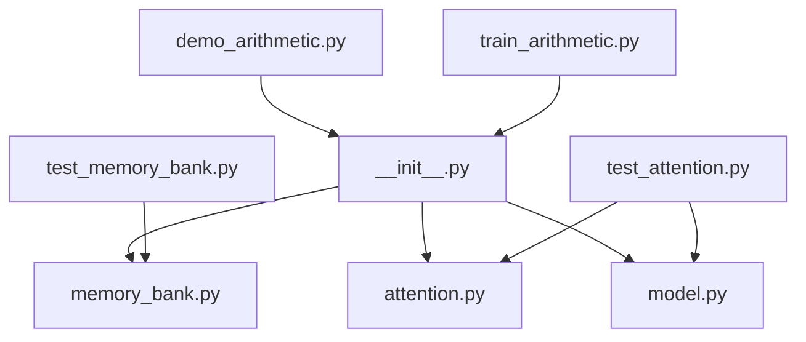

# 安装与环境配置

<cite>
**本文档引用的文件**
- [README.md](file://README.md)
- [pyproject.toml](file://pyproject.toml)
- [src/memory_augmented_attention/__init__.py](file://src/memory_augmented_attention/__init__.py)
- [src/memory_augmented_attention/memory_bank.py](file://src/memory_augmented_attention/memory_bank.py)
- [src/memory_augmented_attention/attention.py](file://src/memory_augmented_attention/attention.py)
- [src/memory_augmented_attention/model.py](file://src/memory_augmented_attention/model.py)
- [tests/test_memory_bank.py](file://tests/test_memory_bank.py)
- [tests/test_attention.py](file://tests/test_attention.py)
- [demo_arithmetic.py](file://demo_arithmetic.py)
- [train_arithmetic.py](file://train_arithmetic.py)
</cite>

## 目录
1. [简介](#简介)
2. [系统要求](#系统要求)
3. [安装步骤](#安装步骤)
4. [环境验证](#环境验证)
5. [依赖关系详解](#依赖关系详解)
6. [操作系统特定安装指南](#操作系统特定安装指南)
7. [常见问题解决](#常见问题解决)
8. [故障排除指南](#故障排除指南)
9. [最佳实践建议](#最佳实践建议)

## 简介

Memory-Augmented Attention (MAA) 是一个基于 PyTorch 的统一记忆增强注意力机制实现。该项目将当前序列标记（短期记忆）和历史 KV 对（长期记忆）存储在一个共享的时间戳化内存库中，并使用时间衰减偏置进行联合注意计算。

该实现提供了：
- 统一的记忆银行架构
- 时间衰减偏置机制
- 可扩展的注意力池管理
- 多种记忆管理策略（Top-K 检索、时间压缩、LRU 驱逐）

## 系统要求

### Python 版本要求
- **最低要求**: Python ≥ 3.9
- **推荐版本**: Python 3.9 或更高版本

### PyTorch 版本要求
- **最低要求**: PyTorch ≥ 2.0
- **兼容版本**: PyTorch 2.x 系列

### 硬件要求
- **CPU**: 支持现代 x86_64 架构
- **GPU**: CUDA 兼容 GPU（可选，用于加速训练）
- **内存**: 至少 8GB RAM（推荐 16GB+）
- **存储**: 至少 1GB 可用空间

## 安装步骤

### 方法一：标准安装（推荐）

```bash
# 使用 pip 安装项目
pip install .

# 或者使用可编辑模式进行开发
pip install -e .
```

### 方法二：开发模式安装

```bash
# 安装开发依赖（包含测试工具）
pip install -e ".[dev]"
```

### 方法三：从源码安装

```bash
# 克隆仓库后进入目录
cd memory-augmented-attention

# 安装到本地环境
pip install -e .
```

### 验证安装

```bash
# 导入模块验证安装
python -c "import memory_augmented_attention; print('Installation successful')"
```

**章节来源**
- [README.md:173-180](file://README.md#L173-L180)
- [pyproject.toml:10-13](file://pyproject.toml#L10-L13)

## 环境验证

### 基础功能测试

```python
# 测试基本导入
import torch
from memory_augmented_attention import MemoryBank, MemoryAugmentedTransformerLayer

# 创建基础组件
bank = MemoryBank(max_size=1024)
layer = MemoryAugmentedTransformerLayer(
    d_model=256,
    n_heads=8,
    d_ff=1024,
    dropout=0.1
)

print("所有组件导入成功！")
```

### 运行单元测试

```bash
# 运行完整测试套件
pytest tests/ -v

# 运行特定测试文件
pytest tests/test_memory_bank.py -v
pytest tests/test_attention.py -v
```

### 训练脚本验证

```bash
# 运行简短的训练示例
python train_arithmetic.py --epochs 1 --num-train 10 --num-eval 5
```

**章节来源**
- [tests/test_memory_bank.py:1-189](file://tests/test_memory_bank.py#L1-L189)
- [tests/test_attention.py:1-231](file://tests/test_attention.py#L1-L231)
- [README.md:422-427](file://README.md#L422-L427)

## 依赖关系详解

### 核心依赖

| 依赖项 | 版本要求 | 用途描述 |
|--------|----------|----------|
| Python | ≥ 3.9 | 语言运行时环境 |
| PyTorch | ≥ 2.0 | 深度学习框架核心 |

### 开发依赖

| 依赖项 | 版本要求 | 用途描述 |
|--------|----------|----------|
| pytest | ≥ 7.0 | 单元测试框架 |

### 内部模块依赖



**图表来源**
- [src/memory_augmented_attention/__init__.py:18-27](file://src/memory_augmented_attention/__init__.py#L18-L27)
- [demo_arithmetic.py:38-52](file://demo_arithmetic.py#L38-L52)
- [train_arithmetic.py:34](file://train_arithmetic.py#L34)

**章节来源**
- [pyproject.toml:15-18](file://pyproject.toml#L15-L18)
- [src/memory_augmented_attention/__init__.py:18-27](file://src/memory_augmented_attention/__init__.py#L18-L27)

## 操作系统特定安装指南

### Windows 系统

#### PowerShell 方式

```powershell
# 使用 PowerShell 安装
python -m pip install --upgrade pip
pip install torch>=2.0
pip install -e ".[dev]"

# 验证安装
python -c "import torch; import memory_augmented_attention; print('Windows 安装成功')"
```

#### CMD 方式

```cmd
@echo off
pip install torch>=2.0
pip install -e ".[dev]"
python -c "import memory_augmented_attention; print('Windows 环境验证通过')"
```

### macOS 系统

#### Homebrew Python

```bash
# 使用 Homebrew Python
brew install python@3.11
pip install torch>=2.0
pip install -e ".[dev]"

# 验证安装
python3 -c "import memory_augmented_attention; print('macOS 安装完成')"
```

#### Apple Silicon (M系列芯片)

```bash
# 使用 Metal 性能优化
pip install torch --index-url https://download.pytorch.org/whl/cpu
pip install -e ".[dev]"

# 验证 MPS 设备
python3 -c "import torch; print('MPS 设备可用:', torch.backends.mps.is_available())"
```

### Linux 系统

#### Ubuntu/Debian

```bash
# 更新包管理器
sudo apt update
sudo apt install python3.9 python3.9-dev python3.9-venv

# 创建虚拟环境
python3.9 -m venv maa_env
source maa_env/bin/activate

# 安装依赖
pip install --upgrade pip
pip install torch>=2.0
pip install -e ".[dev]"

# 验证安装
python -c "import memory_augmented_attention; print('Ubuntu 安装成功')"
```

#### CentOS/RHEL/Fedora

```bash
# 使用 dnf 包管理器
sudo dnf install python3.9 python3.9-devel

# 创建虚拟环境
python3.9 -m venv maa_env
source maa_env/bin/activate

# 安装项目
pip install torch>=2.0
pip install -e ".[dev]"

# 验证安装
python -c "import memory_augmented_attention; print('CentOS 安装完成')"
```

## 常见问题解决

### 问题1：Python 版本不兼容

**症状**：
```
ERROR: This requirement conflicts with the installed torch>=2.0
```

**解决方案**：
```bash
# 检查 Python 版本
python --version

# 如果版本过低，升级 Python 到 3.9+
# 然后重新安装
pip install --force-reinstall torch>=2.0
pip install -e ".[dev]"
```

### 问题2：PyTorch 安装失败

**症状**：
```
ERROR: Could not find a version that satisfies the requirement torch>=2.0
```

**解决方案**：
```bash
# 尝试不同的 PyTorch 安装源
pip install torch --index-url https://download.pytorch.org/whl/cpu
pip install torch --index-url https://download.pytorch.org/whl/cu118

# 或者使用 conda
conda install pytorch torchvision torchaudio cpuonly -c pytorch
```

### 问题3：内存不足错误

**症状**：
```
RuntimeError: CUDA out of memory
```

**解决方案**：
```python
# 在训练脚本中添加内存管理
import torch

# 设置较小的批次大小
BATCH_SIZE = 16  # 减少到原来的 1/4

# 启用梯度检查点
# 在模型初始化时设置
model = MemoryAugmentedTransformerLayer(
    d_model=192,
    n_heads=6,
    dropout=0.1,
    top_k=32  # 减少记忆池大小
)
```

### 问题4：模块导入错误

**症状**：
```
ModuleNotFoundError: No module named 'memory_augmented_attention'
```

**解决方案**：
```bash
# 确保在正确的目录中
cd memory-augmented-attention

# 使用可编辑安装
pip install -e .

# 或者添加到 Python 路径
export PYTHONPATH="${PYTHONPATH}:$(pwd)/src"
```

## 故障排除指南

### 环境诊断脚本

```python
#!/usr/bin/env python3
"""
环境诊断工具
"""

def diagnose_environment():
    """诊断 Python 和 PyTorch 环境"""
    
    print("=== 环境诊断报告 ===")
    
    # 检查 Python 版本
    import sys
    print(f"Python 版本: {sys.version}")
    
    # 检查 PyTorch 安装
    try:
        import torch
        print(f"PyTorch 版本: {torch.__version__}")
        print(f"CUDA 可用: {torch.cuda.is_available()}")
        
        if torch.cuda.is_available():
            print(f"CUDA 版本: {torch.version.cuda}")
            print(f"GPU 数量: {torch.cuda.device_count()}")
            
    except ImportError:
        print("PyTorch 未安装")
        return False
    
    # 检查项目模块
    try:
        import memory_augmented_attention as maa
        print("项目模块导入成功")
        print(f"可用组件: {maa.__all__}")
    except ImportError as e:
        print(f"项目模块导入失败: {e}")
        return False
    
    # 检查依赖完整性
    try:
        from memory_augmented_attention import MemoryBank, MemoryAugmentedTransformerLayer
        print("核心组件导入成功")
    except ImportError as e:
        print(f"核心组件导入失败: {e}")
        return False
    
    print("=== 诊断完成 ===")
    return True

if __name__ == "__main__":
    diagnose_environment()
```

### 性能优化建议

```python
# 训练性能优化配置
import torch

# 启用混合精度训练
scaler = torch.cuda.amp.GradScaler()

# 设置更小的 top_k 值以减少内存使用
layer = MemoryAugmentedTransformerLayer(
    d_model=192,
    n_heads=6,
    top_k=32  # 从默认的 64 减少到 32
)

# 使用梯度累积
accumulation_steps = 4
for i, batch in enumerate(data_loader):
    loss.backward()
    
    if (i + 1) % accumulation_steps == 0:
        optimizer.step()
        optimizer.zero_grad()
```

### 内存管理最佳实践

```python
# 训练过程中的内存管理
def train_with_memory_management(model, dataloader, epochs):
    """带内存管理的训练函数"""
    
    for epoch in range(epochs):
        bank = MemoryBank(max_size=2048)  # 每个 epoch 创建新银行
        global_step = 0
        
        for batch_idx, batch in enumerate(dataloader):
            # 训练步骤...
            
            global_step += batch['input_ids'].shape[1]
            
            # 定期压缩内存银行
            if global_step % 4096 == 0:
                bank.compress_by_time(keep_newest=512)
                
            # 清理不需要的中间变量
            del batch
```

## 最佳实践建议

### 1. 虚拟环境管理

```bash
# 创建隔离的 Python 环境
python -m venv maa_env
source maa_env/bin/activate  # Linux/macOS
# 或
maa_env\Scripts\activate  # Windows

# 安装项目依赖
pip install torch>=2.0
pip install -e ".[dev]"
```

### 2. 版本锁定

```toml
# requirements.txt
torch>=2.0,<3.0
pytest>=7.0
```

### 3. 性能监控

```python
import torch
import psutil

def monitor_memory_usage():
    """监控内存使用情况"""
    process = psutil.Process()
    memory_info = process.memory_info()
    print(f"内存使用: {memory_info.rss / 1024 / 1024:.2f} MB")

# 在训练循环中定期调用
monitor_memory_usage()
```

### 4. 错误处理

```python
try:
    # 项目相关操作
    pass
except ImportError as e:
    print(f"导入错误: {e}")
    print("请确保已正确安装项目依赖")
except RuntimeError as e:
    if "CUDA out of memory" in str(e):
        print("内存不足，请减少批次大小或增加 top_k")
    else:
        print(f"运行时错误: {e}")
```

### 5. 日志记录

```python
import logging

logging.basicConfig(
    level=logging.INFO,
    format='%(asctime)s - %(levelname)s - %(message)s',
    handlers=[
        logging.FileHandler('maa_install.log'),
        logging.StreamHandler()
    ]
)

logger = logging.getLogger(__name__)
logger.info("开始安装 Memory-Augmented Attention")
```

通过遵循这些安装和配置指南，您应该能够成功部署 Memory-Augmented Attention 项目并在各种环境中正常运行。如果遇到任何问题，请参考故障排除部分或检查项目的问题跟踪页面。