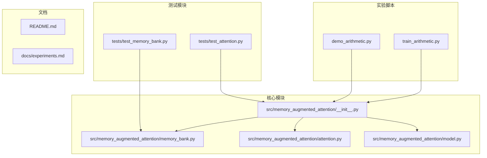
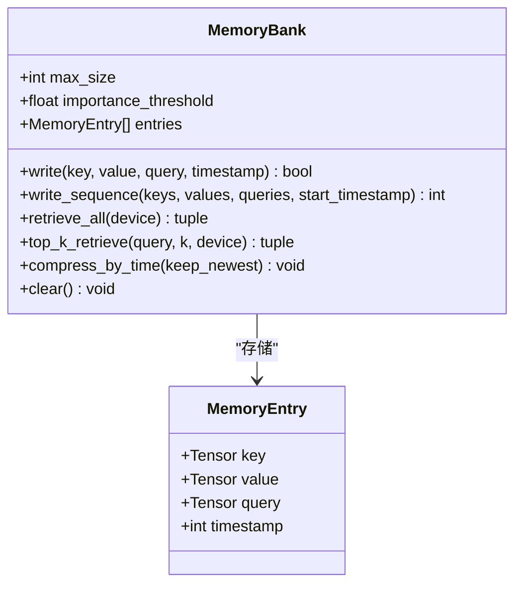
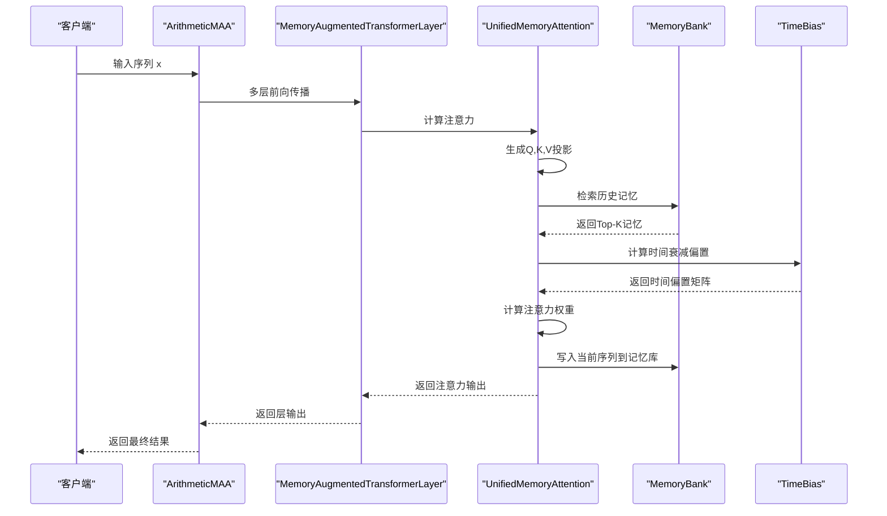
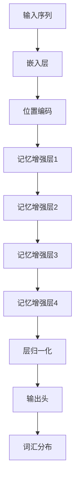
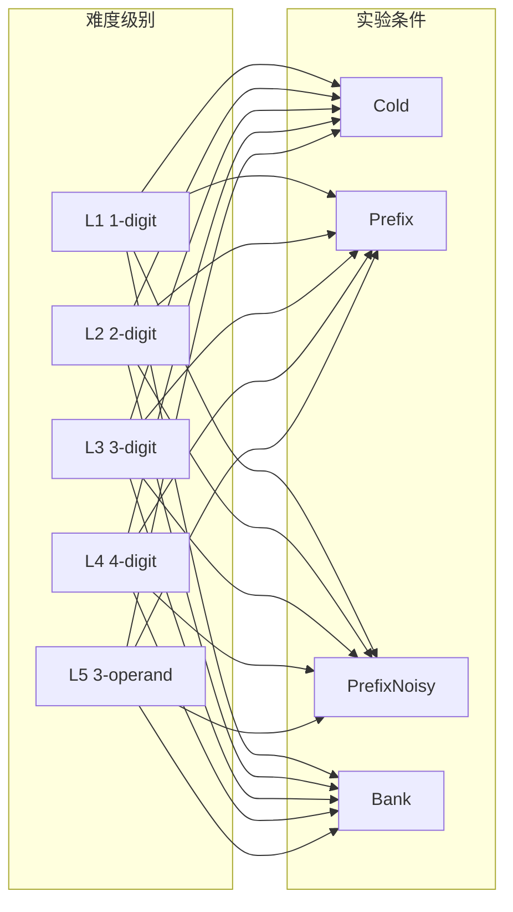
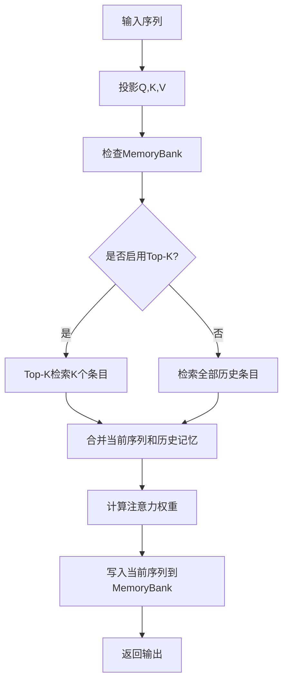
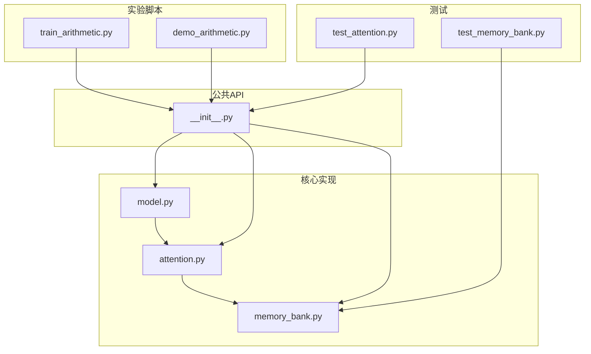

# 实验与基准测试

<cite>
**本文档引用的文件**
- [README.md](file://README.md)
- [docs/experiments.md](file://docs/experiments.md)
- [train_arithmetic.py](file://train_arithmetic.py)
- [demo_arithmetic.py](file://demo_arithmetic.py)
- [src/memory_augmented_attention/__init__.py](file://src/memory_augmented_attention/__init__.py)
- [src/memory_augmented_attention/model.py](file://src/memory_augmented_attention/model.py)
- [src/memory_augmented_attention/attention.py](file://src/memory_augmented_attention/attention.py)
- [src/memory_augmented_attention/memory_bank.py](file://src/memory_augmented_attention/memory_bank.py)
- [tests/test_attention.py](file://tests/test_attention.py)
- [tests/test_memory_bank.py](file://tests/test_memory_bank.py)
</cite>

## 目录
1. [简介](#简介)
2. [项目结构](#项目结构)
3. [核心组件](#核心组件)
4. [架构概览](#架构概览)
5. [详细组件分析](#详细组件分析)
6. [实验设计与目标](#实验设计与目标)
7. [实验结果分析](#实验结果分析)
8. [性能基准测试](#性能基准测试)
9. [依赖关系分析](#依赖关系分析)
10. [性能考虑](#性能考虑)
11. [故障排除指南](#故障排除指南)
12. [结论](#结论)
13. [附录](#附录)

## 简介

Memory-Augmented Attention (MAA) 是一个基于PyTorch的统一记忆增强注意力机制实现。该系统的核心创新在于将当前序列令牌（短期记忆）和历史KV对（长期记忆）存储在一个共享的时间戳化Memory Bank中，并通过时间衰减偏置进行联合注意。

该项目专注于验证统一记忆假设的有效性，通过算术教学任务展示了模型如何区分可信和不可信信息，以及如何在不同难度级别和条件下进行推理。

## 项目结构



**图表来源**
- [src/memory_augmented_attention/__init__.py:1-28](file://src/memory_augmented_attention/__init__.py#L1-L28)
- [train_arithmetic.py:1-358](file://train_arithmetic.py#L1-L358)
- [demo_arithmetic.py:1-324](file://demo_arithmetic.py#L1-L324)

**章节来源**
- [README.md:374-393](file://README.md#L374-L393)
- [src/memory_augmented_attention/__init__.py:10-27](file://src/memory_augmented_attention/__init__.py#L10-L27)

## 核心组件

### MemoryBank - 统一记忆库

MemoryBank是MAA系统的核心组件，负责存储和管理所有记忆条目。每个条目包含键(K)、值(V)、查询(Q)和全局步骤时间戳。



**图表来源**
- [src/memory_augmented_attention/memory_bank.py:33-41](file://src/memory_augmented_attention/memory_bank.py#L33-L41)
- [src/memory_augmented_attention/memory_bank.py:43-61](file://src/memory_augmented_attention/memory_bank.py#L43-L61)

### UnifiedMemoryAttention - 统一记忆注意力

UnifiedMemoryAttention实现了统一的记忆增强注意力机制，将当前序列和历史记忆池合并进行注意力计算。

**章节来源**
- [src/memory_augmented_attention/attention.py:101-133](file://src/memory_augmented_attention/attention.py#L101-L133)
- [src/memory_augmented_attention/attention.py:181-321](file://src/memory_augmented_attention/attention.py#L181-L321)

## 架构概览



**图表来源**
- [src/memory_augmented_attention/model.py:87-133](file://src/memory_augmented_attention/model.py#L87-L133)
- [src/memory_augmented_attention/attention.py:181-321](file://src/memory_augmented_attention/attention.py#L181-L321)

## 详细组件分析

### 时间衰减偏置 TimeBias

TimeBias实现了可学习的时间衰减机制，采用对数形式的时间衰减函数：

```
TimeBias(t_q, t_k) = -α * log(1 + |t_q - t_k|)
```

其中α是可学习标量参数，当α=0时退化为标准注意力。

**章节来源**
- [src/memory_augmented_attention/attention.py:40-94](file://src/memory_augmented_attention/attention.py#L40-L94)

### 记忆增强注意力机制

UnifiedMemoryAttention的关键特性包括：

1. **统一记忆池**：将当前序列和历史记忆合并
2. **Top-K检索**：限制注意力池大小以控制计算复杂度
3. **因果掩码**：确保自回归推理的正确性
4. **时间衰减**：为不同时间步的记忆分配不同的权重

**章节来源**
- [src/memory_augmented_attention/attention.py:101-321](file://src/memory_augmented_attention/attention.py#L101-L321)

### 训练模型架构

ArithmeticMAA是一个字符级因果变换器，包含多个记忆增强层：



**图表来源**
- [src/memory_augmented_attention/model.py:27-86](file://src/memory_augmented_attention/model.py#L27-L86)
- [train_arithmetic.py:209-251](file://train_arithmetic.py#L209-L251)

**章节来源**
- [src/memory_augmented_attention/model.py:27-133](file://src/memory_augmented_attention/model.py#L27-L133)
- [train_arithmetic.py:209-251](file://train_arithmetic.py#L209-L251)

## 实验设计与目标

### 实验目标验证

MAA框架的三个核心假设：

1. **统一记忆假设**：验证MemoryBank中的演示能否被有效检索并影响推理
2. **可信度判决假设**：验证模型能否读取Y/N标记，忽略错误演示
3. **教学-测试分离假设**：验证在简单数据训练后能否在复杂数据上借助演示泛化

### 算术教学实验设计

#### 训练数据配置

| 参数 | 值 | 描述 |
|------|-----|------|
| 操作数范围 | 0-99 | 混合位数加法 |
| 演示数量 | 0-6条 | 格式 a+b=cY/cN |
| 错误演示比例 | ~30% | 答案随机扰动±1/2/5/10 |
| 分隔符 | `;`和`|` | 区分演示和查询 |

#### 测试矩阵设计

**5个难度级别**：
- L1：1位数加法 (a+b, a,b∈0..9)
- L2：2位数加法 (ab+cd, a,b∈10..99) - 训练内分布
- L3：3位数加法 (abc+def) - OOD
- L4：4位数加法 (abcd+efgh) - 远 OOD
- L5：3操作数 (a+b+c) - 语法 OOD

**4种条件**（每条件200次trial）：
- **Cold**：无演示，纯权重知识
- **Prefix**：5条正确演示拼在提示前
- **PrefixNoisy**：3正确+2错误演示（标N）
- **Bank**：演示先写进MemoryBank，查询单独输入

**章节来源**
- [docs/experiments.md:13-53](file://docs/experiments.md#L13-L53)
- [demo_arithmetic.py:12-27](file://demo_arithmetic.py#L12-L27)

## 实验结果分析

### 关键发现

#### 1. 统一记忆假设 ✅ 成立

Bank模式L2达到89.5%，与Prefix的100%接近。demos写进bank后仍能被有效检索，证明bank的KV存储保留了足够的语义信息。

#### 2. 可信度判决假设 ✅ 成立

PrefixNoisy在L2达到100%。模型面对错误演示（标N）时**不盲抄**，而是依赖自身计算。证明Y/N作为普通token已被模型赋予了语义。

#### 3. 教学-测试分离假设 ⚠️ 部分成立

- **训练内分布（L1/L2）**：完美，Cold 100%证明模型学到了加法规则
- **OOD（L3/L4）**：0%。字符级1.4M参数模型无法泛化进位链
- **语法OOD（L5）**：~15%，接近随机，说明a+b+c的语法模式未被学到

#### 4. Bank模式表现差异

Bank始终略低于Prefix（L1: 42.5% vs 100%，L2: 89.5% vs 100%）。

**原因分析**：
- 演示通过`seed_bank_with_demos`写进bank时，时间戳从0开始
- 查询输入时`current_step`跳到演示长度之后
- TimeBias惩罚了这个时间差：log(1+5)≈1.8，导致演示的attention权重被衰减
- **教学演示不应受时间惩罚**——这引出了"多维度动态权重"的设计演进

**章节来源**
- [docs/experiments.md:55-94](file://docs/experiments.md#L55-L94)
- [demo_arithmetic.py:204-235](file://demo_arithmetic.py#L204-L235)

### 统计分析

基于v3评测结果的统计分析：



**图表来源**
- [docs/experiments.md:57-63](file://docs/experiments.md#L57-L63)

## 性能基准测试

### 计算复杂度分析

MAA提供了三种互补的策略来控制复杂度：

| 策略 | 复杂度 | 说明 |
|------|--------|------|
| **Top-K检索** | O(L·K·d) | 每次前向只关注K个最相关的条目 |
| **时间压缩** | O(L·d) | 定期将旧条目合并为摘要向量 |
| **LRU驱逐** | O(1) | 当bank满时自动驱逐最旧条目 |

### 内存使用分析



**图表来源**
- [src/memory_augmented_attention/attention.py:241-321](file://src/memory_augmented_attention/attention.py#L241-L321)

### 扩展性测试方法

1. **序列长度扩展**：测试不同序列长度下的性能变化
2. **记忆库大小测试**：评估max_size对性能的影响
3. **Top-K参数敏感性**：分析k值对准确率和速度的影响
4. **多GPU并行**：验证分布式训练的可行性

**章节来源**
- [README.md:151-169](file://README.md#L151-L169)

## 依赖关系分析



**图表来源**
- [src/memory_augmented_attention/__init__.py:18-27](file://src/memory_augmented_attention/__init__.py#L18-L27)

**章节来源**
- [src/memory_augmented_attention/__init__.py:10-27](file://src/memory_augmented_attention/__init__.py#L10-L27)

## 性能考虑

### 训练过程中的关键Bug修复

#### Bug 1：注意力泄漏（Causal Mask）

**症状**：训练eval_acc 100%，但测试Cold只有25%
**原因**：UnifiedMemoryAttention默认双向（encoder式），teacher-forcing下当前位置能看到未来答案token
**修复**：添加`causal: bool = False`参数，构造(T, T_all)因果掩码，memory-bank始终可见，seq部分上三角为-inf

#### Bug 2：缺少停止监督

**症状**：eval_acc 1.0，但测试时答案多生成一位（`0+4=` → `44`）
**原因**：loss只监督答案位置，答案后的PAD位置无监督
**修复**：扩展mask到`ans_end + 1`，让模型学会在答案后预测PAD

#### Bug 3：Bank作弊

**症状**：训练时跨batch共享bank，eval_acc 100%但测试25%
**原因**：bank变成答案查询表，模型学会"搜相同问题复制答案"
**修复**：训练时`memory_bank=None`

**章节来源**
- [docs/experiments.md:96-122](file://docs/experiments.md#L96-L122)

## 故障排除指南

### 常见问题诊断

#### 记忆库为空错误
**症状**：`RuntimeError: MemoryBank is empty; nothing to retrieve.`
**解决方案**：确保在调用`top_k_retrieve`或`retrieve_all`之前至少写入一条记忆

#### 参数配置错误
**症状**：`ValueError: d_model ({d_model}) must be divisible by n_heads ({n_heads})`
**解决方案**：确保d_model能被n_heads整除

#### 内存溢出
**症状**：GPU/CPU内存不足
**解决方案**：
1. 减少`max_size`参数
2. 使用`compress_by_time`定期压缩
3. 降低`top_k`值
4. 增加重要性阈值过滤低质量记忆

**章节来源**
- [tests/test_attention.py:85-87](file://tests/test_attention.py#L85-L87)
- [tests/test_memory_bank.py:33-41](file://tests/test_memory_bank.py#L33-L41)

## 结论

MAA框架在训练内分布上成功验证了统一记忆和可信度判决的核心假设。OOD泛化失败是模型容量/数据分布问题（字符级小模型无法学会进位链），不是框架缺陷。

关键发现：
1. **统一记忆假设**得到证实：Bank模式与Prefix模式表现相近
2. **可信度判决假设**得到证实：模型能够识别和忽略错误演示
3. **教学-测试分离**在训练内分布上成功，但在复杂任务上仍有局限性
4. **时间衰减机制**有效工作，但需要进一步的多维度动态权重设计

## 附录

### 实验框架和基准测试标准

#### 基准测试流程

```mermaid
flowchart TD
A[准备数据集] --> B[训练模型]
B --> C[保存最佳检查点]
C --> D[加载检查点]
D --> E[设置实验条件]
E --> F[运行评估]
F --> G[收集结果]
G --> H[统计分析]
H --> I[生成报告]
```



#### 实验参数建议

| 参数类型 | 推荐范围 | 说明 |
|----------|----------|------|
| `top_k` | 32-128 | 控制注意力池大小，平衡质量和性能 |
| `init_alpha` | 0.5-2.0 | 时间衰减强度，越大衰减越强 |
| `max_size` | 1024-16384 | 历史条目最大数量 |
| `importance_threshold` | 0.0-0.5 | 过滤低质量记忆的阈值 |

#### 可视化建议

1. **性能曲线图**：显示不同条件在各难度级别上的准确率变化
2. **热力图**：展示注意力权重随时间的变化
3. **散点图**：比较Bank模式与Prefix模式的性能差异
4. **箱线图**：显示不同超参数设置下的性能分布

**章节来源**
- [README.md:331-339](file://README.md#L331-L339)
- [docs/experiments.md:124-129](file://docs/experiments.md#L124-L129)