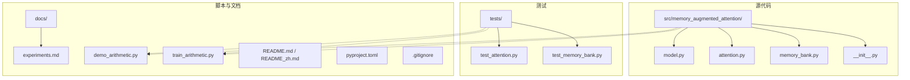
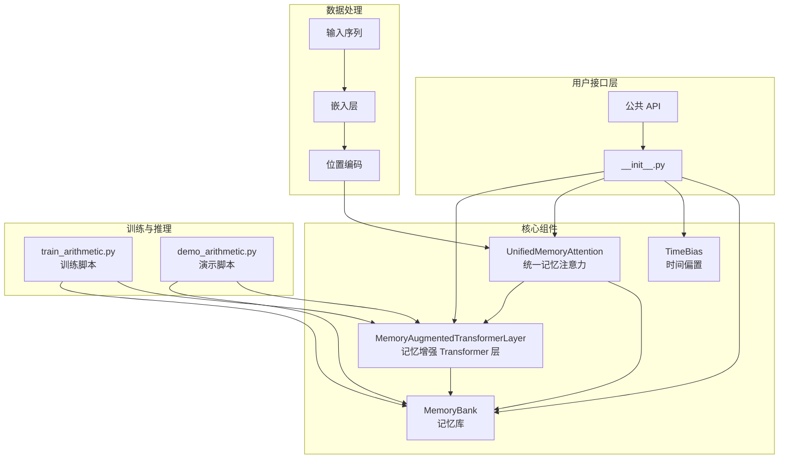
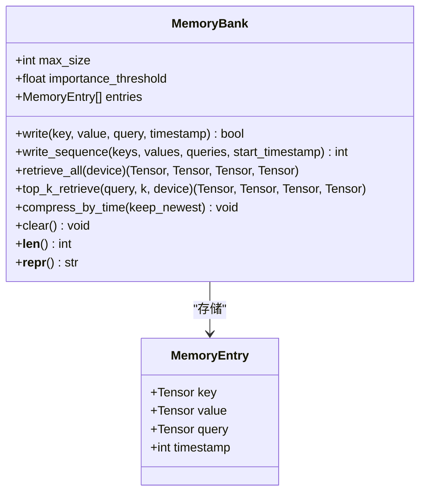
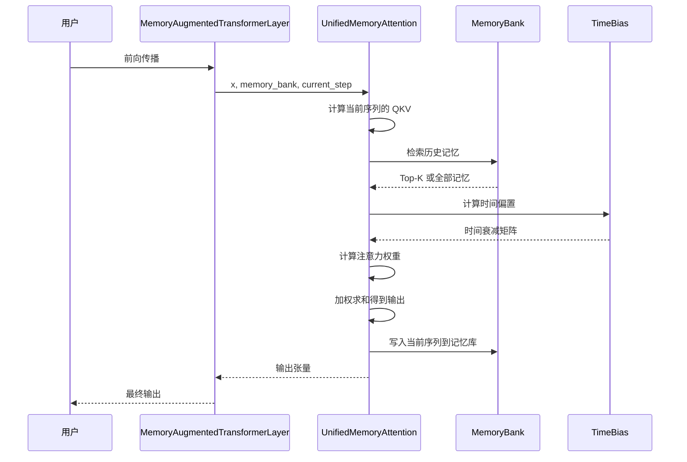
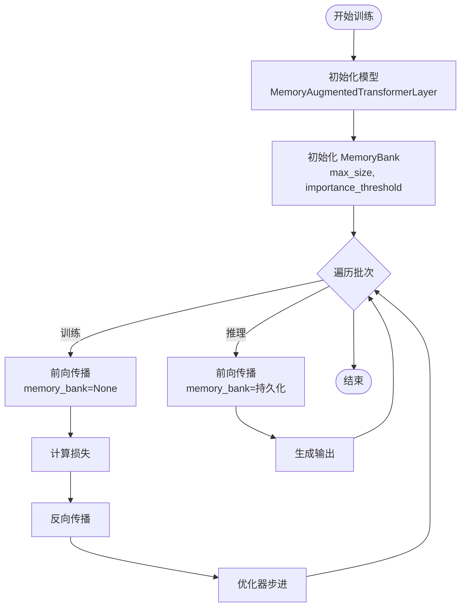
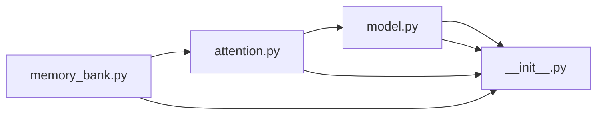

# 开发者指南

<cite>
**本文档引用的文件**
- [README.md](file://README.md)
- [README_zh.md](file://README_zh.md)
- [pyproject.toml](file://pyproject.toml)
- [src/memory_augmented_attention/__init__.py](file://src/memory_augmented_attention/__init__.py)
- [src/memory_augmented_attention/memory_bank.py](file://src/memory_augmented_attention/memory_bank.py)
- [src/memory_augmented_attention/attention.py](file://src/memory_augmented_attention/attention.py)
- [src/memory_augmented_attention/model.py](file://src/memory_augmented_attention/model.py)
- [tests/test_memory_bank.py](file://tests/test_memory_bank.py)
- [tests/test_attention.py](file://tests/test_attention.py)
- [demo_arithmetic.py](file://demo_arithmetic.py)
- [train_arithmetic.py](file://train_arithmetic.py)
- [.gitignore](file://.gitignore)
- [docs/experiments.md](file://docs/experiments.md)
</cite>

## 目录
1. [简介](#简介)
2. [项目结构](#项目结构)
3. [开发环境搭建](#开发环境搭建)
4. [代码规范与编程约定](#代码规范与编程约定)
5. [贡献流程](#贡献流程)
6. [核心组件](#核心组件)
7. [架构概览](#架构概览)
8. [详细组件分析](#详细组件分析)
9. [依赖分析](#依赖分析)
10. [性能考虑](#性能考虑)
11. [调试技巧与开发工具](#调试技巧与开发工具)
12. [故障排除指南](#故障排除指南)
13. [结论](#结论)
14. [附录](#附录)

## 简介
Memory-Augmented Attention (MAA) 是一个基于 PyTorch 的统一记忆增强注意力实现，将当前序列 token（短期记忆）与历史 KV 对（长期记忆）统一存储在一个带时间戳的共享 Memory Bank 中，并通过时间衰减偏置进行联合注意力计算。该库提供了完整的训练与推理脚本，以及详尽的单元测试，适合在对话系统、个性化助手等需要长期记忆的场景中使用。

## 项目结构
该项目采用清晰的模块化组织，核心代码位于 src/memory_augmented_attention 目录下，测试位于 tests 目录，训练与演示脚本位于根目录。

**图表来源**
- [src/memory_augmented_attention/__init__.py:1-28](file://src/memory_augmented_attention/__init__.py#L1-L28)
- [src/memory_augmented_attention/memory_bank.py:1-284](file://src/memory_augmented_attention/memory_bank.py#L1-L284)
- [src/memory_augmented_attention/attention.py:1-322](file://src/memory_augmented_attention/attention.py#L1-L322)
- [src/memory_augmented_attention/model.py:1-134](file://src/memory_augmented_attention/model.py#L1-L134)
- [tests/test_memory_bank.py:1-189](file://tests/test_memory_bank.py#L1-L189)
- [tests/test_attention.py:1-231](file://tests/test_attention.py#L1-L231)
- [demo_arithmetic.py:1-324](file://demo_arithmetic.py#L1-L324)
- [train_arithmetic.py:1-358](file://train_arithmetic.py#L1-L358)
- [docs/experiments.md:1-129](file://docs/experiments.md#L1-L129)

**章节来源**
- [README.md:374-393](file://README.md#L374-L393)
- [README_zh.md:356-375](file://README_zh.md#L356-L375)

## 开发环境搭建
本节提供完整的开发环境搭建步骤，包括 Python 虚拟环境配置、依赖安装和开发工具设置。

### 系统要求
- Python 版本：≥ 3.9
- PyTorch 版本：≥ 2.0
- 推荐操作系统：Linux/macOS/Windows（均支持）

### 步骤 1：创建并激活 Python 虚拟环境
- 推荐使用 venv 创建隔离的 Python 环境
- 激活虚拟环境后，确保 pip 版本较新

### 步骤 2：安装项目依赖
- 使用可编辑安装方式安装项目及其开发依赖
- 该命令会同时安装测试所需的 pytest

### 步骤 3：验证安装
- 运行测试套件验证安装是否成功
- 运行训练脚本或演示脚本进行功能验证

**章节来源**
- [README.md:173-179](file://README.md#L173-L179)
- [README_zh.md:154-161](file://README_zh.md#L154-L161)
- [pyproject.toml:15-18](file://pyproject.toml#L15-L18)
- [README.md:422-426](file://README.md#L422-L426)

## 代码规范与编程约定
本项目遵循清晰的代码风格与约定，确保代码的一致性和可维护性。

### 命名规则
- 类名：采用 PascalCase（如 MemoryBank、UnifiedMemoryAttention）
- 函数与方法：采用 snake_case（如 write、top_k_retrieve）
- 常量：采用 UPPER_CASE（如 MAX_SEQ_LEN、VOCAB_SIZE）
- 模块名：采用 snake_case（如 memory_bank.py、attention.py）

### 注释标准
- 模块级文档字符串：使用三重引号，描述模块目的与设计要点
- 类文档字符串：包含类的功能说明与参数说明
- 方法文档字符串：详细说明参数、返回值与行为
- 复杂逻辑：使用简洁注释解释关键步骤

### 文档格式
- 使用 reStructuredText 格式编写文档
- README 文件包含英文与中文版本，便于国际化
- API 参考部分提供详细的参数说明与使用示例

### 代码组织
- 每个模块专注于单一职责，避免过度耦合
- 使用 dataclass 简化数据结构定义
- 通过 __all__ 显式声明公共 API

**章节来源**
- [src/memory_augmented_attention/__init__.py:1-28](file://src/memory_augmented_attention/__init__.py#L1-L28)
- [src/memory_augmented_attention/memory_bank.py:1-284](file://src/memory_augmented_attention/memory_bank.py#L1-L284)
- [src/memory_augmented_attention/attention.py:1-322](file://src/memory_augmented_attention/attention.py#L1-L322)
- [src/memory_augmented_attention/model.py:1-134](file://src/memory_augmented_attention/model.py#L1-L134)

## 贡献流程
本节详细说明贡献流程，包括代码提交、分支管理和 Pull Request 流程。

### 分支策略
- 主分支：保持稳定，仅合并经过充分测试的功能
- 开发分支：用于日常开发，定期与主分支同步
- 功能分支：针对特定功能开发，完成后合并到开发分支

### 提交流程
1. Fork 仓库并在本地创建功能分支
2. 编写代码并添加相应测试
3. 运行所有测试确保通过
4. 更新文档（如有必要）
5. 提交代码并创建 Pull Request
6. 等待代码审查并根据反馈修改

### 代码审查要点
- 代码质量：遵循项目编码规范
- 测试覆盖：新增功能需包含单元测试
- 文档更新：API 变更需更新文档
- 性能影响：重大变更需评估性能影响

### Pull Request 要求
- 提交信息清晰描述变更内容
- 包含必要的测试用例
- 通过所有自动化检查
- 至少一名维护者批准

**章节来源**
- [README.md:422-426](file://README.md#L422-L426)
- [.gitignore:1-27](file://.gitignore#L1-L27)

## 核心组件
本节深入分析项目的核心组件，包括 MemoryBank、TimeBias、UnifiedMemoryAttention 和 MemoryAugmentedTransformerLayer。

### MemoryBank（记忆库）
MemoryBank 是统一记忆系统的核心，负责存储带时间戳的 (K, V, Q) 条目，并提供检索与管理功能。

#### 主要特性
- 固定容量管理：通过 max_size 控制物理容量
- LRU 淘汰：满载时自动淘汰最旧条目
- 重要性过滤：通过 importance_threshold 过滤低价值条目
- Top-K 检索：基于余弦相似度的高效检索
- 时间压缩：支持将旧条目压缩为摘要

#### 关键方法
- write：写入单个条目
- write_sequence：批量写入序列条目
- retrieve_all：返回所有条目
- top_k_retrieve：Top-K 检索
- compress_by_time：时间压缩
- clear：清空所有条目

**章节来源**
- [src/memory_augmented_attention/memory_bank.py:43-284](file://src/memory_augmented_attention/memory_bank.py#L43-L284)

### TimeBias（时间偏置）
TimeBias 实现可学习的时间衰减偏置，模拟人类记忆的幂律遗忘曲线。

#### 设计原理
- 使用对数形式的时间衰减：TimeBias(t_q, t_k) = -alpha * log(1 + |t_q - t_k|)
- alpha 为可学习标量，alpha = 0 时退化为标准注意力
- 对角线元素为 0，表示同一时间点无衰减

#### 数学特性
- 新近条目惩罚较小，远古条目惩罚较大
- 随时间差增大，相对惩罚差距趋于收敛
- 支持梯度更新，alpha 自适应学习

**章节来源**
- [src/memory_augmented_attention/attention.py:40-94](file://src/memory_augmented_attention/attention.py#L40-L94)

### UnifiedMemoryAttention（统一记忆注意力）
UnifiedMemoryAttention 实现基于统一记忆池的多头注意力机制。

#### 核心机制
- 统一池：当前序列与历史记忆共同组成注意力池
- 时间衰减：为注意力分数添加时间偏置
- Top-K 检索：可选的高效检索策略
- 写入机制：注意力计算后将当前序列写入记忆库

#### 关键参数
- d_model：模型维度
- n_heads：注意力头数
- dropout：注意力权重的 dropout 概率
- top_k：Top-K 检索的 K 值
- init_alpha：时间衰减系数的初始值

**章节来源**
- [src/memory_augmented_attention/attention.py:101-322](file://src/memory_augmented_attention/attention.py#L101-L322)

### MemoryAugmentedTransformerLayer（记忆增强 Transformer 层）
MemoryAugmentedTransformerLayer 提供完整的编码器层实现。

#### 架构组成
- 前向子层：UnifiedMemoryAttention + 残差连接 + 层归一化
- 前馈网络：两层线性变换 + ReLU + Dropout
- 输出投影：最终线性变换

#### 关键特性
- 预归一化残差连接
- 可配置的注意力头数与前馈维度
- 支持因果掩码的自回归训练
- 可选的写入记忆开关

**章节来源**
- [src/memory_augmented_attention/model.py:27-134](file://src/memory_augmented_attention/model.py#L27-L134)

## 架构概览
本节展示系统的整体架构，包括组件间的交互关系与数据流。

**图表来源**
- [src/memory_augmented_attention/__init__.py:18-27](file://src/memory_augmented_attention/__init__.py#L18-L27)
- [src/memory_augmented_attention/memory_bank.py:43-284](file://src/memory_augmented_attention/memory_bank.py#L43-L284)
- [src/memory_augmented_attention/attention.py:101-322](file://src/memory_augmented_attention/attention.py#L101-L322)
- [src/memory_augmented_attention/model.py:27-134](file://src/memory_augmented_attention/model.py#L27-L134)
- [train_arithmetic.py:209-252](file://train_arithmetic.py#L209-L252)
- [demo_arithmetic.py:134-165](file://demo_arithmetic.py#L134-L165)

## 详细组件分析

### MemoryBank 类关系图

**图表来源**
- [src/memory_augmented_attention/memory_bank.py:33-76](file://src/memory_augmented_attention/memory_bank.py#L33-L76)
- [src/memory_augmented_attention/memory_bank.py:43-284](file://src/memory_augmented_attention/memory_bank.py#L43-L284)

### UnifiedMemoryAttention 数据流

**图表来源**
- [src/memory_augmented_attention/model.py:87-134](file://src/memory_augmented_attention/model.py#L87-L134)
- [src/memory_augmented_attention/attention.py:181-322](file://src/memory_augmented_attention/attention.py#L181-L322)
- [src/memory_augmented_attention/memory_bank.py:128-163](file://src/memory_augmented_attention/memory_bank.py#L128-L163)

### 训练与推理流程

**图表来源**
- [train_arithmetic.py:257-282](file://train_arithmetic.py#L257-L282)
- [demo_arithmetic.py:134-165](file://demo_arithmetic.py#L134-L165)

**章节来源**
- [src/memory_augmented_attention/memory_bank.py:1-284](file://src/memory_augmented_attention/memory_bank.py#L1-L284)
- [src/memory_augmented_attention/attention.py:1-322](file://src/memory_augmented_attention/attention.py#L1-L322)
- [src/memory_augmented_attention/model.py:1-134](file://src/memory_augmented_attention/model.py#L1-L134)
- [train_arithmetic.py:1-358](file://train_arithmetic.py#L1-L358)
- [demo_arithmetic.py:1-324](file://demo_arithmetic.py#L1-L324)

## 依赖分析
本节分析组件间的依赖关系与耦合度。

### 内部依赖关系
- MemoryAugmentedTransformerLayer 依赖 UnifiedMemoryAttention
- UnifiedMemoryAttention 依赖 MemoryBank 和 TimeBias
- MemoryBank 独立运行，不依赖其他组件
- __init__.py 导出所有公共 API

### 外部依赖
- PyTorch：深度学习框架
- pytest：测试框架（开发依赖）

### 耦合度评估
- 低耦合：各模块职责明确，接口清晰
- 可测试性：良好的模块化设计便于单元测试
- 可扩展性：接口稳定，易于添加新功能

**图表来源**
- [src/memory_augmented_attention/__init__.py:18-27](file://src/memory_augmented_attention/__init__.py#L18-L27)
- [src/memory_augmented_attention/memory_bank.py:1-284](file://src/memory_augmented_attention/memory_bank.py#L1-L284)
- [src/memory_augmented_attention/attention.py:1-322](file://src/memory_augmented_attention/attention.py#L1-L322)
- [src/memory_augmented_attention/model.py:1-134](file://src/memory_augmented_attention/model.py#L1-L134)

**章节来源**
- [pyproject.toml:11-13](file://pyproject.toml#L11-L13)
- [src/memory_augmented_attention/__init__.py:18-27](file://src/memory_augmented_attention/__init__.py#L18-L27)

## 性能考虑
本节讨论性能相关的考虑因素与优化建议。

### 复杂度分析
- 记忆库全量注意力：O((L + M)² · d)，其中 L 为当前序列长度，M 为记忆库大小
- Top-K 检索：O(L · K · d)，K 为检索数量
- 时间压缩：O(L · d)，将旧条目压缩为摘要

### 优化策略
- Top-K 检索：合理设置 K 值平衡上下文丰富度与计算成本
- 时间压缩：定期调用 compress_by_time 保持记忆库大小可控
- LRU 兜底：max_size 设置过大时，确保及时进行归纳总结

### 内存管理
- importance_threshold：过滤低价值条目，减少内存占用
- max_size：物理容量护栏，防止 OOM
- compress_by_time：主动释放内存，避免依赖 LRU 默默丢弃

**章节来源**
- [README.md:151-169](file://README.md#L151-L169)
- [README_zh.md:126-151](file://README_zh.md#L126-L151)
- [src/memory_augmented_attention/memory_bank.py:263-273](file://src/memory_augmented_attention/memory_bank.py#L263-L273)

## 调试技巧与开发工具
本节提供实用的调试技巧与开发工具使用指南。

### 调试方法
- 使用 torch.no_grad() 进行推理阶段的内存优化
- 通过打印中间张量形状验证数据流
- 使用小批量数据快速定位问题
- 分模块测试：先测试 MemoryBank，再测试注意力，最后测试完整层

### 开发工具
- pytest：运行单元测试，支持参数化测试
- IDE 断点调试：利用现代 IDE 的断点功能
- 日志记录：在关键路径添加日志输出
- 性能分析：使用 PyTorch Profiler 分析热点

### 常见问题排查
- 形状不匹配：检查注意力头数与维度的整除关系
- 梯度消失：调整学习率和网络深度
- 内存泄漏：确保及时清理不需要的张量
- OOM：降低 batch size 或增加 max_size 的压缩频率

**章节来源**
- [tests/test_attention.py:1-231](file://tests/test_attention.py#L1-L231)
- [tests/test_memory_bank.py:1-189](file://tests/test_memory_bank.py#L1-L189)
- [train_arithmetic.py:285-307](file://train_arithmetic.py#L285-L307)

## 故障排除指南
本节提供常见问题的诊断与解决方案。

### 训练相关问题
- **注意力泄漏**：确保使用 causal=True 进行自回归训练
- **停止信号缺失**：扩展答案掩码到 ans_end + 1，让模型学会输出 PAD
- **Bank 作弊**：训练时使用 memory_bank=None，避免答案查询表

### 推理相关问题
- **MemoryBank 为空**：在使用前确保 MemoryBank 已正确初始化
- **Top-K 检索异常**：检查 K 值是否小于等于记忆库大小
- **时间衰减过强**：调整 init_alpha 参数，平衡近期与远期记忆的重要性

### 性能问题
- **内存不足**：降低 max_size 或增加 compress_by_time 的频率
- **计算缓慢**：启用 Top-K 检索，适当减少 K 值
- **精度下降**：检查 importance_threshold 设置，避免过滤掉重要信息

**章节来源**
- [docs/experiments.md:96-122](file://docs/experiments.md#L96-L122)
- [src/memory_augmented_attention/attention.py:288-298](file://src/memory_augmented_attention/attention.py#L288-L298)

## 结论
Memory-Augmented Attention 提供了一个优雅的统一记忆框架，通过将当前序列与历史记忆统一处理，实现了灵活且高效的长期记忆机制。项目结构清晰、文档完善、测试全面，为开发者提供了良好的开发体验。通过合理的参数配置与内存管理策略，可以在多种应用场景中获得优秀的性能表现。

## 附录

### API 参考
- MemoryBank：记忆库管理与检索
- TimeBias：时间衰减偏置模块
- UnifiedMemoryAttention：统一记忆注意力
- MemoryAugmentedTransformerLayer：完整 Transformer 层

### 训练与演示
- train_arithmetic.py：算术教学任务的完整训练流程
- demo_arithmetic.py：分级评测脚本，验证统一记忆假设

### 实验记录
- docs/experiments.md：详细的实验设计与结果分析

**章节来源**
- [README.md:215-272](file://README.md#L215-L272)
- [README_zh.md:196-253](file://README_zh.md#L196-L253)
- [train_arithmetic.py:209-252](file://train_arithmetic.py#L209-L252)
- [demo_arithmetic.py:134-165](file://demo_arithmetic.py#L134-L165)