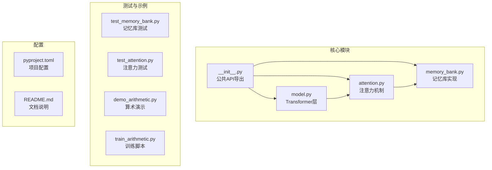
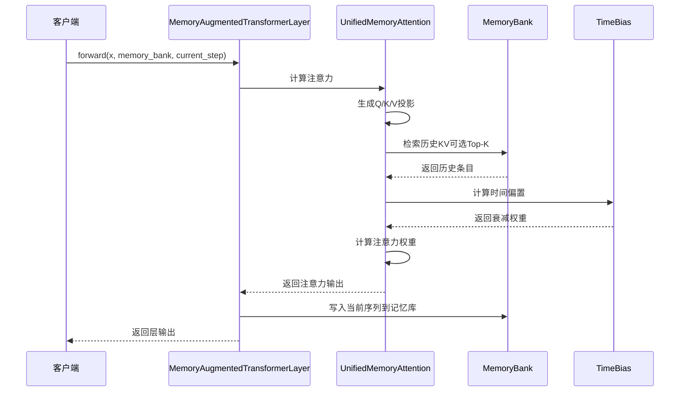
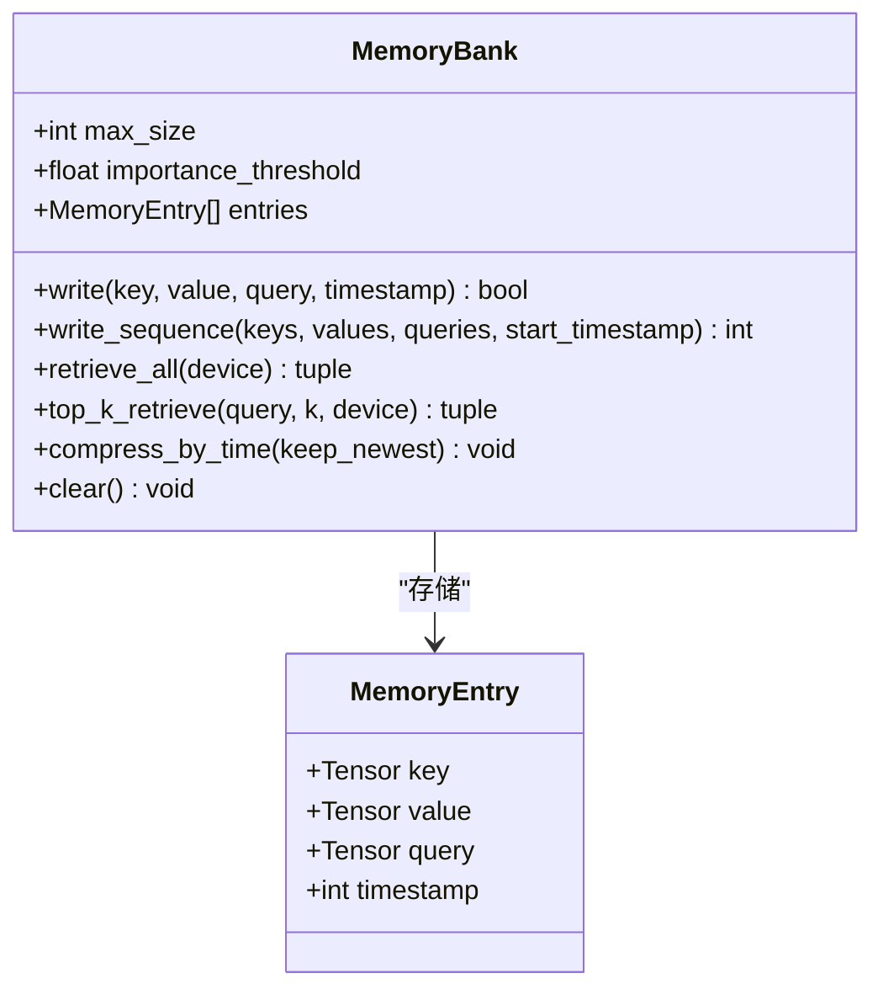
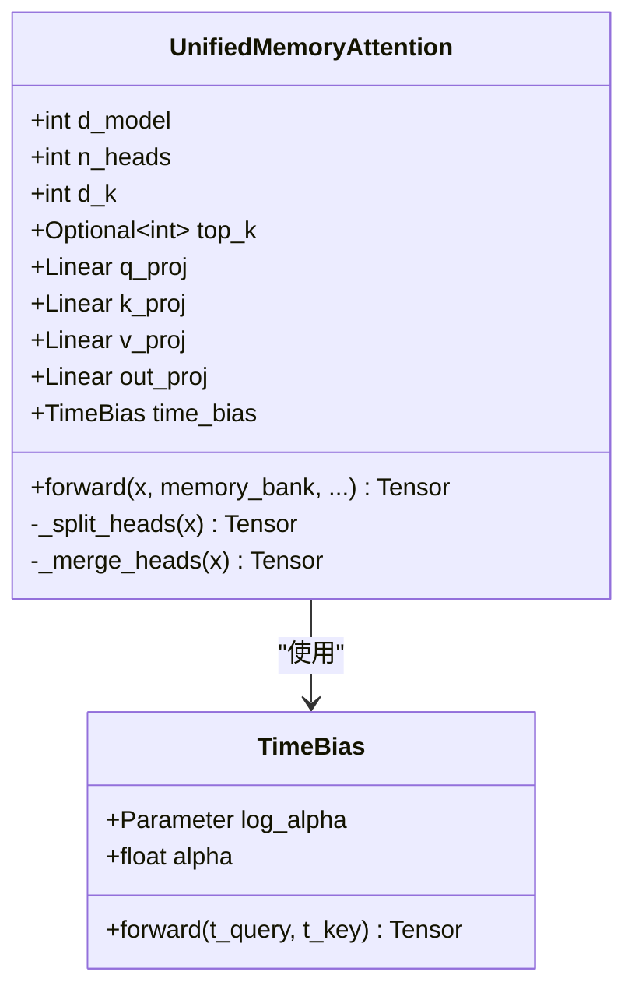
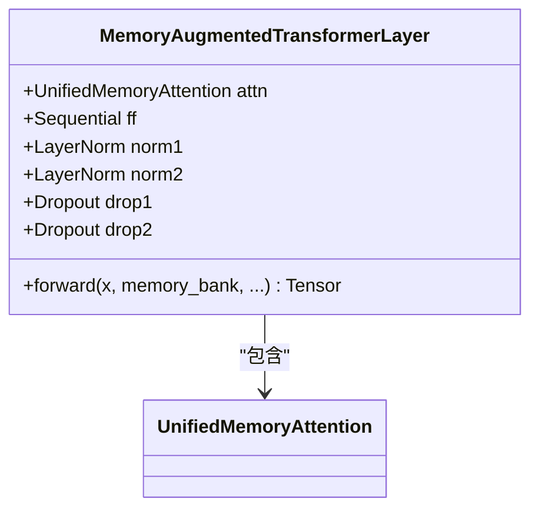
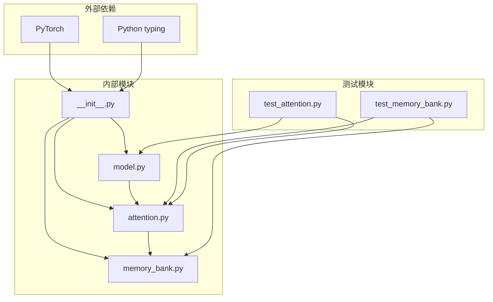

# 快速开始

<cite>
**本文档引用的文件**
- [README.md](file://README.md)
- [__init__.py](file://src/memory_augmented_attention/__init__.py)
- [memory_bank.py](file://src/memory_augmented_attention/memory_bank.py)
- [attention.py](file://src/memory_augmented_attention/attention.py)
- [model.py](file://src/memory_augmented_attention/model.py)
- [test_memory_bank.py](file://tests/test_memory_bank.py)
- [test_attention.py](file://tests/test_attention.py)
- [demo_arithmetic.py](file://demo_arithmetic.py)
- [train_arithmetic.py](file://train_arithmetic.py)
</cite>

## 目录
1. [简介](#简介)
2. [项目结构](#项目结构)
3. [核心组件](#核心组件)
4. [架构概览](#架构概览)
5. [详细组件分析](#详细组件分析)
6. [依赖关系分析](#依赖关系分析)
7. [性能考虑](#性能考虑)
8. [故障排除指南](#故障排除指南)
9. [结论](#结论)

## 简介

Memory-Augmented Attention (MAA) 是一个统一的记忆增强注意力机制，它将当前序列标记和历史KV缓存都视为共享记忆库中的时间戳记忆条目。该系统通过时间偏置项自然地降低较旧记忆的影响，为标准Transformer提供了持久的记忆能力。

本快速开始指南将帮助您在几分钟内上手MAA，展示如何导入核心类MemoryBank和MemoryAugmentedTransformerLayer，以及基本的使用模式。

## 项目结构

该项目采用清晰的模块化设计，主要包含以下核心文件：

**图表来源**
- [__init__.py:1-28](file://src/memory_augmented_attention/__init__.py#L1-L28)
- [memory_bank.py:1-284](file://src/memory_augmented_attention/memory_bank.py#L1-L284)
- [attention.py:1-322](file://src/memory_augmented_attention/attention.py#L1-L322)
- [model.py:1-134](file://src/memory_augmented_attention/model.py#L1-L134)

**章节来源**
- [README.md:374-393](file://README.md#L374-L393)

## 核心组件

### MemoryBank - 记忆库

MemoryBank是MAA的核心组件，负责存储和检索时间戳化的(K, V, Q)条目。它支持两种检索模式：全量检索和Top-K检索。

关键特性：
- 固定容量管理（LRU逐出）
- 时间戳排序（按全局步进索引）
- 重要性过滤（基于值向量的L2范数）
- 支持批量写入和检索

### MemoryAugmentedTransformerLayer - 记忆增强Transformer层

这是完整的编码器层实现，包含：
- 统一的记忆增强注意力
- 前馈神经网络
- 层归一化和残差连接
- 可选的因果掩码

### UnifiedMemoryAttention - 统一记忆注意力

实现统一的记忆增强多头注意力机制，支持：
- 当前序列短时记忆
- 历史KV长时记忆
- 时间衰减偏置
- Top-K检索优化

**章节来源**
- [memory_bank.py:43-284](file://src/memory_augmented_attention/memory_bank.py#L43-L284)
- [model.py:27-134](file://src/memory_augmented_attention/model.py#L27-L134)
- [attention.py:101-322](file://src/memory_augmented_attention/attention.py#L101-L322)

## 架构概览

**图表来源**
- [model.py:87-134](file://src/memory_augmented_attention/model.py#L87-L134)
- [attention.py:181-322](file://src/memory_augmented_attention/attention.py#L181-L322)
- [memory_bank.py:203-253](file://src/memory_augmented_attention/memory_bank.py#L203-L253)

## 详细组件分析

### MemoryBank 类分析

**图表来源**
- [memory_bank.py:33-41](file://src/memory_augmented_attention/memory_bank.py#L33-L41)
- [memory_bank.py:43-76](file://src/memory_augmented_attention/memory_bank.py#L43-L76)

### UnifiedMemoryAttention 类分析

**图表来源**
- [attention.py:40-94](file://src/memory_augmented_attention/attention.py#L40-L94)
- [attention.py:101-162](file://src/memory_augmented_attention/attention.py#L101-L162)

### MemoryAugmentedTransformerLayer 类分析

**图表来源**
- [model.py:27-86](file://src/memory_augmented_attention/model.py#L27-L86)

## 依赖关系分析

**图表来源**
- [__init__.py:18-27](file://src/memory_augmented_attention/__init__.py#L18-L27)
- [attention.py:22-32](file://src/memory_augmented_attention/attention.py#L22-L32)
- [model.py:15-25](file://src/memory_augmented_attention/model.py#L15-L25)

**章节来源**
- [__init__.py:18-27](file://src/memory_augmented_attention/__init__.py#L18-L27)

## 性能考虑

MAA实现了三种互补的策略来控制复杂度：

| 策略 | 复杂度 | 说明 |
|------|--------|------|
| Top-K检索 | O(L · K · d) | 仅对K个最相关条目进行注意力计算 |
| 时间压缩 | O(L · d) | 定期合并旧条目为摘要向量 |
| LRU逐出 | O(1) | 银河系满时自动逐出最旧条目 |

推荐配置：
- `top_k`: 32-128（平衡上下文丰富度和计算成本）
- `init_alpha`: 0.5-2.0（控制时间衰减强度）
- `max_size`: 1024-16384（RAM中最大历史条目数）

**章节来源**
- [README.md:151-169](file://README.md#L151-L169)

## 故障排除指南

### 常见问题及解决方案

1. **ValueError: d_model must be divisible by n_heads**
   - 确保d_model能被n_heads整除
   - 常见组合：d_model=256, n_heads=8；d_model=512, n_heads=8

2. **MemoryBank空错误**
   - 在调用top_k_retrieve或retrieve_all前确保有条目
   - 使用write方法先写入数据

3. **梯度不流动**
   - 确保输入张量requires_grad=True
   - 检查dropout设置是否正确

**章节来源**
- [test_attention.py:85-88](file://tests/test_attention.py#L85-L88)
- [test_memory_bank.py:107-110](file://tests/test_memory_bank.py#L107-L110)

## 结论

Memory-Augmented Attention为标准Transformer提供了强大的持久记忆能力。通过统一的时间戳记忆库和时间衰减偏置，MAA能够在保持计算效率的同时实现无限上下文长度。

本快速开始指南展示了从零开始使用MAA的基本流程，包括：
1. 导入核心类
2. 创建MAA层
3. 初始化MemoryBank
4. 进行前向传播
5. 管理全局步进索引

建议从简单的单层示例开始，逐步扩展到多层模型和更复杂的记忆管理策略。