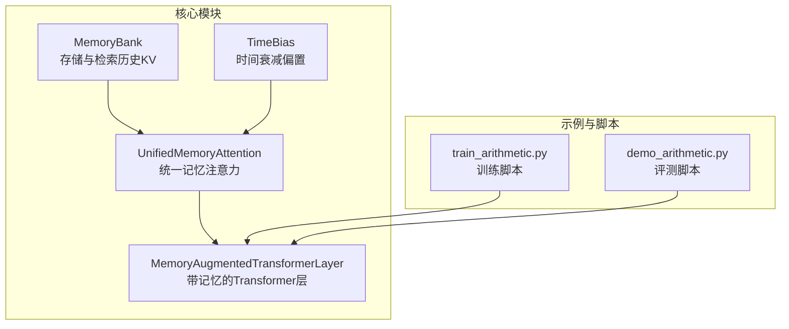
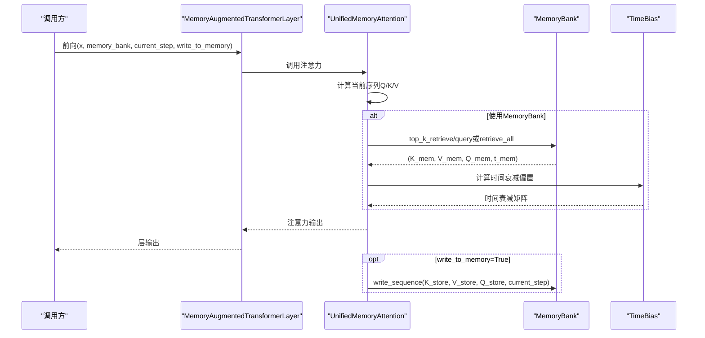
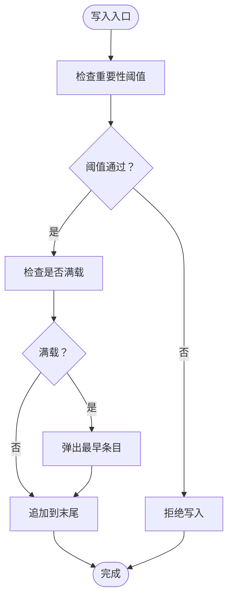
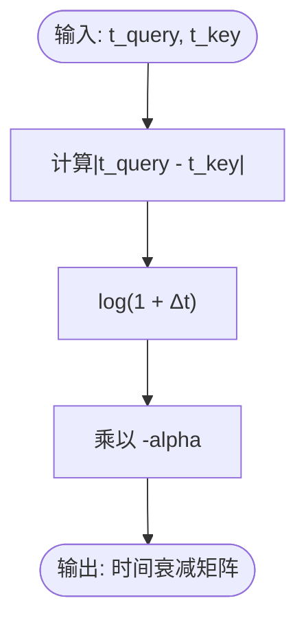
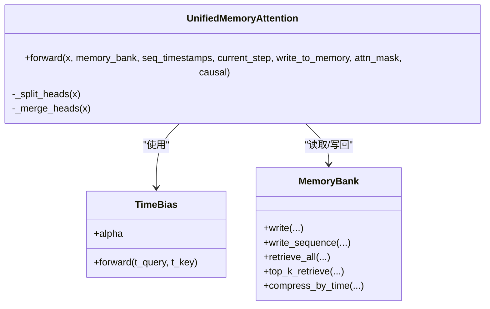
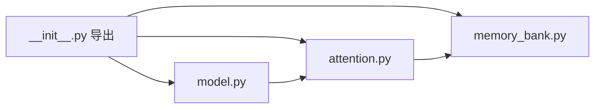

# 故障排除与常见问题

<cite>
**本文引用的文件**
- [README.md](file://README.md)
- [README_zh.md](file://README_zh.md)
- [pyproject.toml](file://pyproject.toml)
- [src/memory_augmented_attention/__init__.py](file://src/memory_augmented_attention/__init__.py)
- [src/memory_augmented_attention/memory_bank.py](file://src/memory_augmented_attention/memory_bank.py)
- [src/memory_augmented_attention/attention.py](file://src/memory_augmented_attention/attention.py)
- [src/memory_augmented_attention/model.py](file://src/memory_augmented_attention/model.py)
- [tests/test_attention.py](file://tests/test_attention.py)
- [tests/test_memory_bank.py](file://tests/test_memory_bank.py)
- [demo_arithmetic.py](file://demo_arithmetic.py)
- [train_arithmetic.py](file://train_arithmetic.py)
- [docs/experiments.md](file://docs/experiments.md)
</cite>

## 目录
1. [简介](#简介)
2. [项目结构](#项目结构)
3. [核心组件](#核心组件)
4. [架构总览](#架构总览)
5. [详细组件分析](#详细组件分析)
6. [依赖分析](#依赖分析)
7. [性能考虑](#性能考虑)
8. [故障排除指南](#故障排除指南)
9. [结论](#结论)
10. [附录](#附录)

## 简介
本指南面向使用 Memory-Augmented Attention（MAA）的开发者与技术支持人员，聚焦安装、配置、性能与兼容性问题的排查与解决。文档结合项目源码与实验记录，提供可操作的调试步骤、常见数值问题定位方法、内存与显存监控策略，以及不同 PyTorch 版本的兼容性说明与迁移建议。同时给出问题分类与处理流程，帮助快速定位根因并恢复稳定运行。

## 项目结构
- 核心模块位于 src/memory_augmented_attention，包含 MemoryBank、TimeBias、UnifiedMemoryAttention、MemoryAugmentedTransformerLayer。
- 示例与训练脚本位于根目录，提供算术教学任务的训练与评测。
- 文档与测试覆盖 API 使用、边界条件与关键 Bug 的复现与修复记录。
- 依赖声明与版本要求在 pyproject.toml 中明确。

**图表来源**
- [src/memory_augmented_attention/memory_bank.py:43-284](file://src/memory_augmented_attention/memory_bank.py#L43-L284)
- [src/memory_augmented_attention/attention.py:40-322](file://src/memory_augmented_attention/attention.py#L40-L322)
- [src/memory_augmented_attention/model.py:27-134](file://src/memory_augmented_attention/model.py#L27-L134)
- [train_arithmetic.py:209-251](file://train_arithmetic.py#L209-L251)
- [demo_arithmetic.py:133-182](file://demo_arithmetic.py#L133-L182)

**章节来源**
- [README.md: 374-393:374-393](file://README.md#L374-L393)
- [README_zh.md: 356-375:356-375](file://README_zh.md#L356-L375)

## 核心组件
- MemoryBank：统一存储带时间戳的 (K, V, Q, timestamp)，支持写入、批量写入、全量检索、Top-K 检索、压缩与清理。
- TimeBias：可学习的时间衰减偏置模块，用于对注意力分数加入时间惩罚项。
- UnifiedMemoryAttention：在统一记忆池上执行多头注意力，支持 causal 掩码、Top-K 检索与写回机制。
- MemoryAugmentedTransformerLayer：封装注意力 + 前馈网络 + 层归一化残差，适配持久化 MemoryBank。

**章节来源**
- [src/memory_augmented_attention/memory_bank.py: 43-284:43-284](file://src/memory_augmented_attention/memory_bank.py#L43-L284)
- [src/memory_augmented_attention/attention.py: 40-322:40-322](file://src/memory_augmented_attention/attention.py#L40-L322)
- [src/memory_augmented_attention/model.py: 27-134:27-134](file://src/memory_augmented_attention/model.py#L27-L134)

## 架构总览
MAA 的关键路径是“当前序列注意力 + 历史记忆检索 + 时间衰减偏置 + 可选因果掩码”，并在每次前向后将当前序列的投影写入 MemoryBank，形成持续的记忆积累。

**图表来源**
- [src/memory_augmented_attention/model.py: 87-133:87-133](file://src/memory_augmented_attention/model.py#L87-L133)
- [src/memory_augmented_attention/attention.py: 181-321:181-321](file://src/memory_augmented_attention/attention.py#L181-L321)
- [src/memory_augmented_attention/memory_bank.py: 128-163:128-163](file://src/memory_augmented_attention/memory_bank.py#L128-L163)
- [src/memory_augmented_attention/attention.py: 73-93:73-93](file://src/memory_augmented_attention/attention.py#L73-L93)

## 详细组件分析

### MemoryBank 组件
- 写入策略：支持单条写入与批量写入，满载时按时间戳顺序淘汰最旧条目；可启用重要性阈值过滤。
- 检索策略：全量检索与 Top-K 检索，Top-K 基于余弦相似度并保持时间顺序。
- 压缩策略：按时间保留最新条目，减少物理占用。
- 设计要点：概念上记忆无限，物理上限通过 max_size 与压缩策略协同控制。

**图表来源**
- [src/memory_augmented_attention/memory_bank.py: 82-126:82-126](file://src/memory_augmented_attention/memory_bank.py#L82-L126)

**章节来源**
- [src/memory_augmented_attention/memory_bank.py: 43-284:43-284](file://src/memory_augmented_attention/memory_bank.py#L43-L284)
- [tests/test_memory_bank.py: 48-100:48-100](file://tests/test_memory_bank.py#L48-L100)

### TimeBias 组件
- 参数 alpha：可学习的标量，alpha=0 退化为标准注意力。
- 时间衰减：对查询与键之间的时间差施加负对数衰减，越远越弱。
- 数值稳定性：对数项保证单调递减，避免极端惩罚。

**图表来源**
- [src/memory_augmented_attention/attention.py: 73-93:73-93](file://src/memory_augmented_attention/attention.py#L73-L93)

**章节来源**
- [src/memory_augmented_attention/attention.py: 40-94:40-94](file://src/memory_augmented_attention/attention.py#L40-L94)
- [tests/test_attention.py: 17-60:17-60](file://tests/test_attention.py#L17-L60)

### UnifiedMemoryAttention 组件
- 多头注意力：支持 causal 掩码与可选 Top-K 检索，避免全量注意力带来的 O(N^2) 复杂度。
- 写回机制：默认将当前序列的投影写回 MemoryBank，便于后续调用复用。
- 掩码与因果：支持传入任意形状的 additive 掩码，或启用内置 causal 掩码。

**图表来源**
- [src/memory_augmented_attention/attention.py: 101-322:101-322](file://src/memory_augmented_attention/attention.py#L101-L322)
- [src/memory_augmented_attention/memory_bank.py: 43-284:43-284](file://src/memory_augmented_attention/memory_bank.py#L43-L284)
- [src/memory_augmented_attention/attention.py: 40-94:40-94](file://src/memory_augmented_attention/attention.py#L40-L94)

**章节来源**
- [src/memory_augmented_attention/attention.py: 101-322:101-322](file://src/memory_augmented_attention/attention.py#L101-L322)
- [tests/test_attention.py: 66-177:66-177](file://tests/test_attention.py#L66-L177)

### MemoryAugmentedTransformerLayer 组件
- 结构：注意力 → Add & Norm → 前馈 → Add & Norm。
- 与 MemoryBank 的交互：通过 forward 参数传递 bank、时间步与写回开关。
- 适用场景：可直接替换标准 TransformerEncoderLayer，仅需管理 MemoryBank 生命周期。

**章节来源**
- [src/memory_augmented_attention/model.py: 27-134:27-134](file://src/memory_augmented_attention/model.py#L27-L134)
- [tests/test_attention.py: 184-231:184-231](file://tests/test_attention.py#L184-L231)

## 依赖分析
- Python ≥ 3.9，PyTorch ≥ 2.0。
- 可选开发依赖：pytest。
- 模块间依赖：MemoryAugmentedTransformerLayer 依赖 UnifiedMemoryAttention；UnifiedMemoryAttention 依赖 MemoryBank 与 TimeBias。

**图表来源**
- [src/memory_augmented_attention/__init__.py: 18-27:18-27](file://src/memory_augmented_attention/__init__.py#L18-L27)
- [src/memory_augmented_attention/model.py: 23-24:23-24](file://src/memory_augmented_attention/model.py#L23-L24)
- [src/memory_augmented_attention/attention.py: 32-32:32-32](file://src/memory_augmented_attention/attention.py#L32-L32)

**章节来源**
- [pyproject.toml: 5-18:5-18](file://pyproject.toml#L5-L18)
- [src/memory_augmented_attention/__init__.py: 18-27:18-27](file://src/memory_augmented_attention/__init__.py#L18-L27)

## 性能考虑
- 复杂度控制：通过 Top-K 检索、时间压缩与 LRU 兜底，将注意力复杂度从 O((L+M)^2·d) 降至 O(L·K·d) 或 O(L·d)。
- 推荐策略：近期 token 全量注意力，旧 token Top-K，压缩阶段保留最新条目。
- 训练与推理差异：训练时通常不共享 MemoryBank，避免“答案查询表”式过拟合；推理时可持久化 bank 以累积上下文。

**章节来源**
- [README.md: 151-169:151-169](file://README.md#L151-L169)
- [README_zh.md: 126-150:126-150](file://README_zh.md#L126-L150)
- [docs/experiments.md: 96-121:96-121](file://docs/experiments.md#L96-L121)

## 故障排除指南

### 一、安装与环境问题
- 症状：安装时报错或导入失败。
- 可能原因：
  - Python 版本过低（< 3.9）。
  - PyTorch 版本过低（< 2.0）。
  - 未安装可选开发依赖导致测试无法运行。
- 解决方案：
  - 确认 Python ≥ 3.9，PyTorch ≥ 2.0。
  - 使用可编辑安装并包含 dev 依赖：pip install -e ".[dev]"。
  - 如需运行测试，确保 pytest 已安装。
- 验证方法：
  - 运行 pytest tests/ -v。
  - 导入模块并检查 __all__ 是否包含所需类。

**章节来源**
- [pyproject.toml: 10-18:10-18](file://pyproject.toml#L10-L18)
- [README.md: 173-177:173-177](file://README.md#L173-L177)
- [tests/test_attention.py: 1-L14:1-14](file://tests/test_attention.py#L1-L14)

### 二、配置错误
- 症状：d_model 不能被 n_heads 整除，抛出异常。
- 根因：注意力头维数必须整除。
- 解决方案：调整 d_model 使其能被 n_heads 整除，或修改 n_heads。
- 验证方法：参考单元测试对无效头数的断言。

**章节来源**
- [src/memory_augmented_attention/attention.py: 144-L147:144-147](file://src/memory_augmented_attention/attention.py#L144-L147)
- [tests/test_attention.py: 85-L88:85-88](file://tests/test_attention.py#L85-L88)

- 症状：MemoryBank 初始化参数非法（max_size < 1 或 importance_threshold < 0）。
- 根因：参数校验失败。
- 解决方案：确保 max_size ≥ 1，importance_threshold ≥ 0。
- 验证方法：参考单元测试对非法参数的断言。

**章节来源**
- [src/memory_augmented_attention/memory_bank.py: 68-L73:68-73](file://src/memory_augmented_attention/memory_bank.py#L68-L73)
- [tests/test_memory_bank.py: 33-L41:33-41](file://tests/test_memory_bank.py#L33-L41)

- 症状：MemoryBank 为空却尝试检索，抛出运行时错误。
- 根因：检索前未写入或已被清空。
- 解决方案：在写入后再检索；或在调用前检查 len(bank) > 0。
- 验证方法：参考单元测试对空 bank 检索的断言。

**章节来源**
- [src/memory_augmented_attention/memory_bank.py: 186-L201:186-201](file://src/memory_augmented_attention/memory_bank.py#L186-L201)
- [tests/test_memory_bank.py: 107-L111:107-111](file://tests/test_memory_bank.py#L107-L111)

### 三、性能问题
- 症状：显存占用过高或 OOM。
- 根因：MemoryBank 过大、未压缩、Top-K 设置过小导致上下文不足。
- 解决方案：
  - 合理设置 max_size，定期调用 compress_by_time 保留最新条目。
  - 适当增大 top_k，平衡上下文与计算成本。
  - 在推理阶段持久化 bank，避免频繁重建。
- 验证方法：监控 global_step 与 bank 长度，按固定步长压缩。

**章节来源**
- [README_zh.md: 255-L266:255-266](file://README_zh.md#L255-L266)
- [src/memory_augmented_attention/memory_bank.py: 263-L273:263-273](file://src/memory_augmented_attention/memory_bank.py#L263-L273)
- [train_arithmetic.py: 308-L310:308-310](file://train_arithmetic.py#L308-L310)

- 症状：推理速度慢。
- 根因：全量注意力导致 O(N^2) 复杂度。
- 解决方案：启用 top_k，或在旧 token 使用 Top-K 检索。
- 验证方法：对比开启/关闭 top_k 的吞吐量。

**章节来源**
- [README.md: 151-L169:151-169](file://README.md#L151-L169)
- [src/memory_augmented_attention/attention.py: 127-L132:127-132](file://src/memory_augmented_attention/attention.py#L127-L132)

### 四、数值问题
- 症状：输出包含 NaN/Inf。
- 可能原因：
  - 时间戳类型不匹配（int/float）导致数值不稳定。
  - 掩码形状不匹配或值域异常。
  - 梯度爆炸未裁剪。
- 解决方案：
  - 确保 seq_timestamps 与 t_all 为浮点张量，再进行广播。
  - 检查 attn_mask 形状与值域，必要时使用 -inf。
  - 训练中启用梯度裁剪。
- 验证方法：单元测试对输出有限性的断言。

**章节来源**
- [src/memory_augmented_attention/attention.py: 230-L234:230-234](file://src/memory_augmented_attention/attention.py#L230-L234)
- [src/memory_augmented_attention/attention.py: 284-L297:284-297](file://src/memory_augmented_attention/attention.py#L284-L297)
- [tests/test_attention.py: 80-L83:80-83](file://tests/test_attention.py#L80-L83)
- [train_arithmetic.py: 276-L276:276-276](file://train_arithmetic.py#L276-L276)

- 症状：TimeBias 输出异常（非正偏置或对角线不为零）。
- 根因：alpha 初始化或计算错误。
- 解决方案：确认 alpha 初始化与 log_alpha 的使用；检查对角线为零的断言。
- 验证方法：参考单元测试对零滞后与单调性的断言。

**章节来源**
- [src/memory_augmented_attention/attention.py: 60-L72:60-72](file://src/memory_augmented_attention/attention.py#L60-L72)
- [tests/test_attention.py: 25-L50:25-50](file://tests/test_attention.py#L25-L50)

### 五、兼容性问题
- Python 版本：要求 ≥ 3.9。
- PyTorch 版本：要求 ≥ 2.0。
- 迁移建议：
  - 若升级 PyTorch，请先运行单元测试确保注意力与张量运算行为一致。
  - 若出现设备不匹配（CPU/GPU），确保输入张量与 MemoryBank 的设备一致。
- 验证方法：查看依赖声明与运行测试。

**章节来源**
- [pyproject.toml: 10-L13:10-13](file://pyproject.toml#L10-L13)
- [tests/test_attention.py: 1-L14:1-14](file://tests/test_attention.py#L1-L14)

### 六、内存与显存泄漏检测
- 建议策略：
  - 使用 torch.cuda.memory_allocated()/reserved() 监控显存变化。
  - 在关键路径前后打印 bank 长度与 global_step，确认压缩节奏。
  - 使用 torch.autograd.set_detect_anomaly(True) 定位梯度异常。
- 常见泄漏点：
  - 未及时 compress_by_time 导致 bank 持续增长。
  - 多次重复创建 MemoryBank 且未清理。
  - 掩码/时间戳设备不一致导致额外拷贝。

**章节来源**
- [src/memory_augmented_attention/memory_bank.py: 263-L273:263-273](file://src/memory_augmented_attention/memory_bank.py#L263-L273)
- [train_arithmetic.py: 308-L310:308-310](file://train_arithmetic.py#L308-L310)

### 七、日志分析与性能监控
- 日志建议：
  - 记录 epoch、batch、loss、eval_acc、bank 长度、global_step。
  - 记录 top_k、alpha 值、compress_by_time 触发频率。
- 性能指标：
  - 每步耗时、吞吐（tokens/s）、显存峰值。
  - Attention 计算占比、检索耗时占比。
- 工具：
  - 使用 Python time.perf_counter() 或 torch.cuda.Event()。
  - 使用 torch.profiler.profile() 分析热点。

**章节来源**
- [train_arithmetic.py: 337-L350:337-350](file://train_arithmetic.py#L337-L350)

### 八、典型问题与案例
- 问题：训练时 eval_acc 很高，但测试 Cold 低。
  - 根因：注意力泄漏（未启用因果掩码）。
  - 解决：在前向中启用 causal 掩码，确保当前步不看到未来答案。
  - 验证：对比启用/禁用 causal 的表现。

**章节来源**
- [docs/experiments.md: 98-L104:98-104](file://docs/experiments.md#L98-L104)

- 问题：答案多生成一位。
  - 根因：停止监督缺失。
  - 解决：将损失掩码扩展到答案结束+1，监督停止 token。
  - 验证：对比修复前后的生成长度分布。

**章节来源**
- [docs/experiments.md: 106-L112:106-112](file://docs/experiments.md#L106-L112)

- 问题：Bank 模式效果低于 Prefix。
  - 根因：TimeBias 对时间差施加惩罚。
  - 解决：引入多维度动态权重（设计演进方向），对教学演示降低时间惩罚。
  - 验证：参考实验记录对 Bank 与 Prefix 的对比。

**章节来源**
- [docs/experiments.md: 87-L92:87-92](file://docs/experiments.md#L87-L92)

### 九、技术支持问题分类与处理流程
- 分类：
  - 安装与环境：版本不符、依赖缺失。
  - 配置与参数：头数/维度不匹配、非法参数。
  - 性能与资源：OOM、速度慢、显存泄漏。
  - 数值与收敛：NaN/Inf、注意力泄漏、停止监督缺失。
  - 兼容性：PyTorch 版本差异、设备不一致。
- 处理流程：
  1) 复现最小样例，隔离问题范围。
  2) 检查依赖与版本，修正环境。
  3) 校验参数与输入形状，修复配置。
  4) 应用性能优化策略（top_k、压缩、因果掩码）。
  5) 启用日志与监控，定位数值异常。
  6) 验证修复，回归测试。

**章节来源**
- [tests/test_attention.py: 1-L231:1-231](file://tests/test_attention.py#L1-L231)
- [tests/test_memory_bank.py: 1-L189:1-189](file://tests/test_memory_bank.py#L1-L189)

## 结论
通过本指南，您可以在安装、配置、性能与兼容性方面快速定位并解决问题。建议在生产环境中：
- 明确版本要求并定期回归测试；
- 合理设置 MemoryBank 的 max_size 与压缩策略；
- 启用因果掩码与停止监督；
- 使用监控工具持续跟踪显存与吞吐；
- 遇到数值异常时启用异常检测与日志分析。

## 附录
- 快速检查清单：
  - Python ≥ 3.9，PyTorch ≥ 2.0。
  - d_model 能被 n_heads 整除。
  - MemoryBank 参数合法（max_size≥1，threshold≥0）。
  - 启用 causal 掩码与停止监督。
  - 定期 compress_by_time，合理设置 top_k。
  - 监控显存与吞吐，定位异常路径。