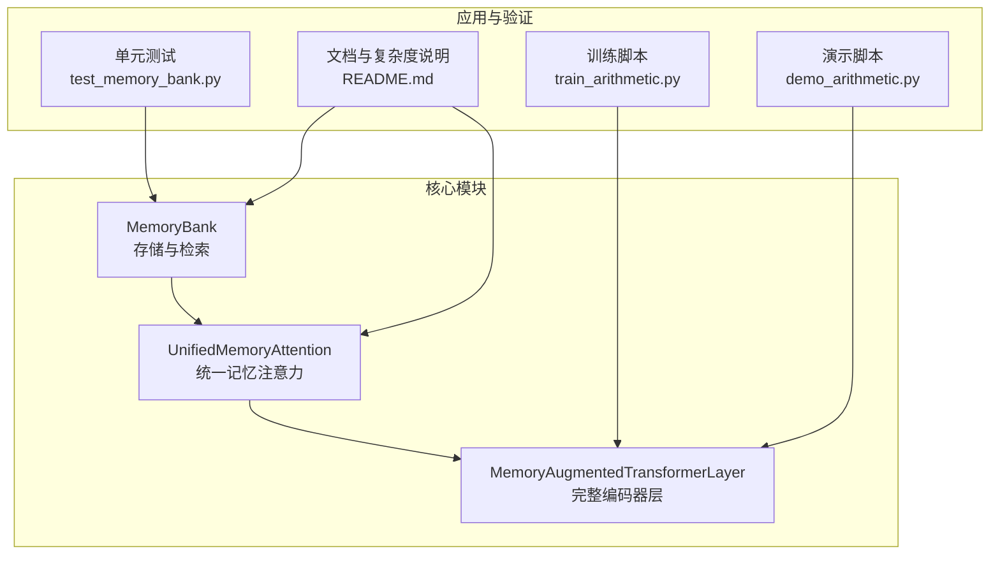
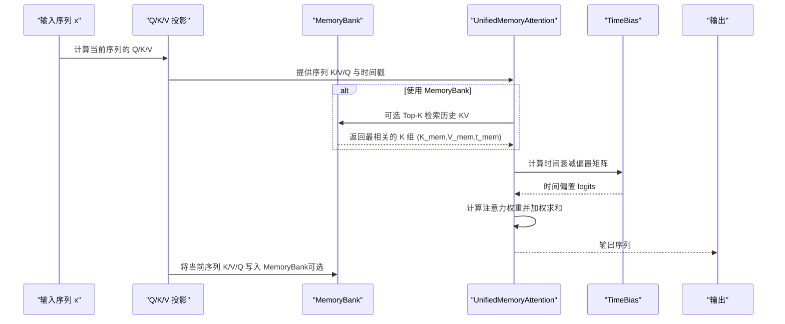
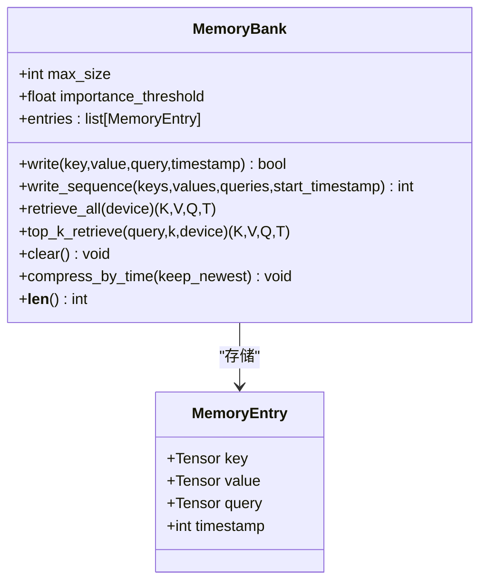
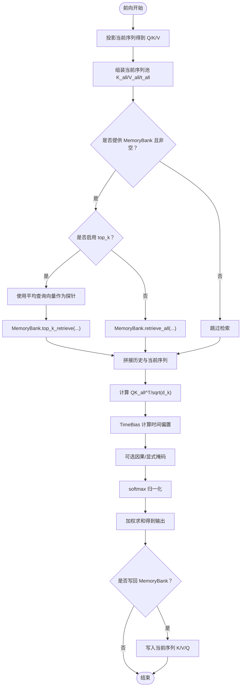
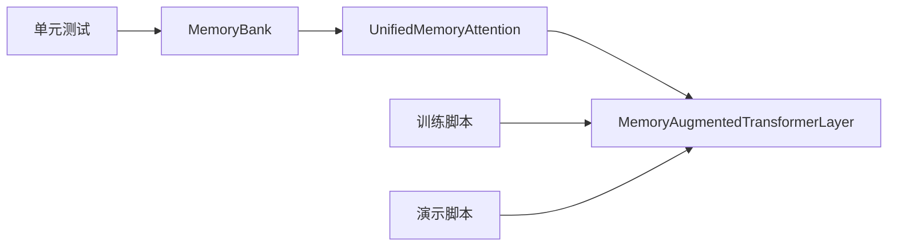

# 复杂度分析与可扩展性设计

<cite>
**本文引用的文件**
- [memory_bank.py](file://src/memory_augmented_attention/memory_bank.py)
- [attention.py](file://src/memory_augmented_attention/attention.py)
- [model.py](file://src/memory_augmented_attention/model.py)
- [test_memory_bank.py](file://tests/test_memory_bank.py)
- [README.md](file://README.md)
- [demo_arithmetic.py](file://demo_arithmetic.py)
- [train_arithmetic.py](file://train_arithmetic.py)
</cite>

## 目录
1. [引言](#引言)
2. [项目结构](#项目结构)
3. [核心组件](#核心组件)
4. [架构总览](#架构总览)
5. [详细组件分析](#详细组件分析)
6. [依赖关系分析](#依赖关系分析)
7. [性能与复杂度分析](#性能与复杂度分析)
8. [可扩展性设计策略](#可扩展性设计策略)
9. [Top-K检索性能优化](#top-k检索性能优化)
10. [可配置参数与调优建议](#可配置参数与调优建议)
11. [性能基准与调优指南](#性能基准与调优指南)
12. [故障排查](#故障排查)
13. [结论](#结论)

## 引言
本文件面向开发者与研究者，系统梳理 MemoryBank 的时空复杂度与可扩展性设计，重点覆盖以下目标：
- 写入操作 O(1)、Top-K 检索 O(N log K)、LRU 淘汰 O(N) 的理论分析与实现依据
- 批处理优化、内存池管理、GPU 加速等可扩展性策略
- Top-K 检索的向量化操作、内存访问模式优化与缓存友好数据结构
- 可配置参数对性能的影响与调优建议（max_size、importance_threshold、k 值）
- 性能基准与调优实践，帮助在不同场景下做出最佳配置选择

## 项目结构
该项目采用模块化设计，核心围绕 MemoryBank、UnifiedMemoryAttention 与 MemoryAugmentedTransformerLayer 展开，并提供训练与演示脚本以验证统一记忆范式在教学任务中的有效性。

图表来源
- [memory_bank.py:43-284](file://src/memory_augmented_attention/memory_bank.py#L43-L284)
- [attention.py:101-322](file://src/memory_augmented_attention/attention.py#L101-L322)
- [model.py:27-134](file://src/memory_augmented_attention/model.py#L27-L134)
- [train_arithmetic.py:209-252](file://train_arithmetic.py#L209-L252)
- [demo_arithmetic.py:134-183](file://demo_arithmetic.py#L134-L183)
- [test_memory_bank.py:1-189](file://tests/test_memory_bank.py#L1-L189)
- [README.md:151-170](file://README.md#L151-L170)

章节来源
- [README.md:374-393](file://README.md#L374-L393)

## 核心组件
- MemoryBank：统一存储当前序列与历史 KV 对的带时间戳内存池，支持写入、批量写入、全量检索与 Top-K 检索，以及按时间压缩与清空等维护操作。
- UnifiedMemoryAttention：在统一记忆池上执行多头注意力，结合时间衰减偏置，支持可选的 Top-K 检索与因果掩码。
- MemoryAugmentedTransformerLayer：包含注意力子层与前馈网络的完整编码器层，支持持久化 MemoryBank 以累积历史上下文。

章节来源
- [memory_bank.py:43-284](file://src/memory_augmented_attention/memory_bank.py#L43-L284)
- [attention.py:101-322](file://src/memory_augmented_attention/attention.py#L101-L322)
- [model.py:27-134](file://src/memory_augmented_attention/model.py#L27-L134)

## 架构总览
统一记忆注意力将“当前序列”与“历史 KV”统一到一个 MemoryBank 中，通过时间戳参与注意力打分，形成“短时记忆 + 长时记忆”的联合注意池。

图表来源
- [attention.py:181-322](file://src/memory_augmented_attention/attention.py#L181-L322)
- [memory_bank.py:203-253](file://src/memory_augmented_attention/memory_bank.py#L203-L253)

## 详细组件分析

### MemoryBank 组件
- 数据结构：entries 列表按时间顺序存储 MemoryEntry，便于 O(N) 检索与 O(1) 写入（在容量允许时）。
- 写入流程：可选重要性阈值过滤；满容量时弹出最早元素；追加新元素。
- 批量写入：按序列长度循环写入，保持时间戳连续。
- 检索：retrieve_all 返回全部条目张量；top_k_retrieve 基于余弦相似度进行 Top-K 选择并保持时间顺序。
- 维护：clear 清空；compress_by_time 仅保留最新条目；__len__ 返回当前数量。

图表来源
- [memory_bank.py:33-284](file://src/memory_augmented_attention/memory_bank.py#L33-L284)

章节来源
- [memory_bank.py:63-163](file://src/memory_augmented_attention/memory_bank.py#L63-L163)
- [memory_bank.py:169-253](file://src/memory_augmented_attention/memory_bank.py#L169-L253)
- [memory_bank.py:259-284](file://src/memory_augmented_attention/memory_bank.py#L259-L284)

### UnifiedMemoryAttention 组件
- 多头注意力在统一池上计算，支持可选 top_k 限制注意力池大小。
- 在前向过程中，根据当前序列的平均查询向量作为探针进行 Top-K 检索。
- 注意力 logits 包含 QK^T/sqrt(d_k) 与时间偏置项，可选因果掩码与显式掩码。
- 将当前序列的 K/V/Q 投影写回 MemoryBank，实现“写后再读”的记忆循环。

图表来源
- [attention.py:181-322](file://src/memory_augmented_attention/attention.py#L181-L322)
- [memory_bank.py:203-253](file://src/memory_augmented_attention/memory_bank.py#L203-L253)

章节来源
- [attention.py:101-322](file://src/memory_augmented_attention/attention.py#L101-L322)

### MemoryAugmentedTransformerLayer 组件
- 结构：预归一化风格，注意力子层 + 前馈网络 + 层归一化与残差。
- 支持传入 MemoryBank 以跨步累积历史；可控制是否写回当前序列。

章节来源
- [model.py:27-134](file://src/memory_augmented_attention/model.py#L27-L134)

## 依赖关系分析
- MemoryBank 为纯 Python 列表存储，无外部依赖，便于在 CPU/GPU 上高效运行。
- UnifiedMemoryAttention 依赖 MemoryBank 进行检索，同时内部实现向量化注意力计算。
- MemoryAugmentedTransformerLayer 聚合注意力与前馈网络，作为完整编码器层使用。

图表来源
- [memory_bank.py:43-284](file://src/memory_augmented_attention/memory_bank.py#L43-L284)
- [attention.py:101-322](file://src/memory_augmented_attention/attention.py#L101-L322)
- [model.py:27-134](file://src/memory_augmented_attention/model.py#L27-L134)
- [train_arithmetic.py:209-252](file://train_arithmetic.py#L209-L252)
- [demo_arithmetic.py:134-183](file://demo_arithmetic.py#L134-L183)
- [test_memory_bank.py:1-189](file://tests/test_memory_bank.py#L1-L189)

## 性能与复杂度分析

### 写入操作 O(1)
- 实现要点：MemoryBank.write 在容量允许时直接 append，pop(0) 淘汰最旧条目。
- 列表尾部插入与头部删除在 Python 列表中为摊还 O(1)，受内存重分配影响较小。
- 重要性阈值过滤在写入前进行，避免无效条目进入内存池。

章节来源
- [memory_bank.py:82-126](file://src/memory_augmented_attention/memory_bank.py#L82-L126)

### Top-K 检索 O(N log K)
- 实现要点：top_k_retrieve 将所有键向量展平并归一化，计算与探针的余弦相似度，随后使用 topk 选出 K 个最相关条目，最后按时间顺序排序。
- 时间复杂度分解：
  - 归一化与点积：O(N·D)，其中 N 为条目数，D 为向量维度
  - topk 选择：O(N log K)
  - 排序：O(K log K)，在 N >> K 时可忽略
- 因此整体复杂度约为 O(N·D + N log K)。当 K << N 时，主导项为 O(N log K)。

章节来源
- [memory_bank.py:203-253](file://src/memory_augmented_attention/memory_bank.py#L203-L253)

### LRU 淘汰 O(N)
- 实现要点：当容量达到 max_size 时，pop(0) 弹出最早条目，保持内存上限。
- 在检索路径中，若未启用 Top-K，则 retrieve_all 需要遍历全部条目并堆叠张量，复杂度 O(N·D)。

章节来源
- [memory_bank.py:114-126](file://src/memory_augmented_attention/memory_bank.py#L114-L126)
- [memory_bank.py:169-201](file://src/memory_augmented_attention/memory_bank.py#L169-L201)

### 注意力计算复杂度
- 当启用 Top-K 时，注意力池大小为 K，注意力 logits 计算复杂度为 O(B·H·T·(K+T))，其中 B 为批次、H 为头数、T 为序列长度。
- 当未启用 Top-K 时，注意力池大小为 N+T，复杂度为 O(B·H·T·(N+T))。
- 时间偏置矩阵为 O(T·(N+T))，可广播到 B×H 维度。

章节来源
- [attention.py:275-299](file://src/memory_augmented_attention/attention.py#L275-L299)

## 可扩展性设计策略

### 批处理优化
- 批量写入：write_sequence 一次性写入整个序列，减少多次写入的开销，适合长序列或高吞吐场景。
- 向量化检索：top_k_retrieve 使用整批键向量的矩阵乘与归一化，充分利用 GPU 并行能力。

章节来源
- [memory_bank.py:128-163](file://src/memory_augmented_attention/memory_bank.py#L128-L163)
- [memory_bank.py:203-253](file://src/memory_augmented_attention/memory_bank.py#L203-L253)

### 内存池管理
- 物理上限：max_size 作为硬性上限，防止 OOM；满载时自动 LRU 淘汰最旧条目。
- 重要性过滤：importance_threshold 基于值向量 L2 范数过滤低信息条目，降低冗余存储。
- 时间压缩：compress_by_time 仅保留最新 keep_newest 条目，显著降低后续检索成本。

章节来源
- [memory_bank.py:63-76](file://src/memory_augmented_attention/memory_bank.py#L63-L76)
- [memory_bank.py:263-273](file://src/memory_augmented_attention/memory_bank.py#L263-L273)

### GPU 加速技术
- 张量运算：所有检索与注意力计算基于 PyTorch 张量，可在 CUDA 设备上高效执行。
- 设备迁移：top_k_retrieve 与 retrieve_all 支持指定设备，便于在 GPU 上完成计算。

章节来源
- [memory_bank.py:169-201](file://src/memory_augmented_attention/memory_bank.py#L169-L201)
- [memory_bank.py:203-253](file://src/memory_augmented_attention/memory_bank.py#L203-L253)

## Top-K检索性能优化

### 向量化操作
- 使用整批键向量的归一化与矩阵乘计算相似度，避免 Python 循环，充分利用 BLAS/GEMM。
- topk 选择与索引排序在单次调用中完成，减少中间张量拷贝。

章节来源
- [memory_bank.py:237-246](file://src/memory_augmented_attention/memory_bank.py#L237-L246)

### 内存访问模式优化
- 检索时将键向量展平为 (N, D) 矩阵，提高内存局部性与缓存命中率。
- 保持返回结果按时间顺序排列，有助于后续注意力权重的稳定传播。

章节来源
- [memory_bank.py:237-246](file://src/memory_augmented_attention/memory_bank.py#L237-L246)

### 缓存友好数据结构设计
- MemoryEntry 以独立张量字段存储，便于堆叠与切片；entries 列表按时间顺序组织，利于 O(N) 检索与 O(1) 写入。
- 在检索路径中，尽量复用已归一化的中间结果，减少重复计算。

章节来源
- [memory_bank.py:33-41](file://src/memory_augmented_attention/memory_bank.py#L33-L41)
- [memory_bank.py:169-201](file://src/memory_augmented_attention/memory_bank.py#L169-L201)

## 可配置参数与调优建议

### max_size
- 作用：物理上限，防止 OOM；满载时触发 LRU 淘汰。
- 调优建议：
  - 训练阶段：根据显存与序列长度设置，确保能容纳典型会话的历史。
  - 推理阶段：根据对话轮数与上下文长度估算，预留一定冗余空间。

章节来源
- [memory_bank.py:63-76](file://src/memory_augmented_attention/memory_bank.py#L63-L76)
- [README.md:337-338](file://README.md#L337-L338)

### importance_threshold
- 作用：过滤低信息条目，减少冗余存储与检索开销。
- 调优建议：
  - 较高阈值：仅保留显著信息，可能丢失细粒度上下文。
  - 较低阈值：保留更多信息，但增加检索与存储成本。
  - 建议从 0.1–0.3 起步，结合任务效果微调。

章节来源
- [memory_bank.py:52-55](file://src/memory_augmented_attention/memory_bank.py#L52-L55)
- [README.md:338-338](file://README.md#L338-L338)

### k 值（top_k）
- 作用：限制注意力池大小，显著降低复杂度。
- 调优建议：
  - 小规模任务：32–64
  - 中等规模任务：64–128
  - 大规模任务：128–256 或更高，需评估显存与延迟
- 与 max_size 协同：max_size 应大于 top_k，避免检索退化为全量。

章节来源
- [attention.py:127-130](file://src/memory_augmented_attention/attention.py#L127-L130)
- [README.md:335-335](file://README.md#L335-L335)

### init_alpha（时间衰减强度）
- 作用：控制时间偏置的衰减速度，alpha 越大，越强调近期记忆。
- 调优建议：
  - 0.5–2.0 为常见范围；聊天类任务可偏高，教学类任务可偏低。
- 注意：alpha 为可学习参数，训练中会自适应调整。

章节来源
- [attention.py:127-132](file://src/memory_augmented_attention/attention.py#L127-L132)
- [README.md:336-336](file://README.md#L336-L336)

## 性能基准与调优指南

### 基准场景与预期表现
- 算术教学任务：在 L2（训练内分布）上，Bank 模式可达 89.5%，与 Prefix 模式接近，验证统一记忆的有效性。
- OOD 场景：随着难度提升，准确率下降，主要受限于模型容量与数据分布。

章节来源
- [README.md:75-90](file://README.md#L75-L90)
- [docs/experiments.md:57-63](file://docs/experiments.md#L57-L63)

### 调优步骤建议
- 显存与吞吐平衡：优先调整 top_k 与 max_size，确保 OOM 风险可控。
- 检索质量：通过 importance_threshold 控制存储质量，避免噪声干扰。
- 训练稳定性：在训练脚本中固定 d_model、n_heads、dropout 等超参，逐步微调 top_k 与 init_alpha。
- 推理优化：在推理阶段启用设备迁移与批处理写入，减少主机端同步开销。

章节来源
- [train_arithmetic.py:39-64](file://train_arithmetic.py#L39-L64)
- [demo_arithmetic.py:134-183](file://demo_arithmetic.py#L134-L183)

## 故障排查
- 空 MemoryBank 检索报错：当 bank 为空时，retrieve_all 与 top_k_retrieve 会抛出异常。请确保在写入后再检索。
- Top-K 超出存储数量：top_k_retrieve 会自动裁剪至实际存储数量，不会报错。
- 写入被拒绝：当值向量范数低于 importance_threshold 时，写入返回 False。
- 时间压缩后顺序：compress_by_time 仅保留最新条目，时间戳顺序保持不变。

章节来源
- [memory_bank.py:169-170](file://src/memory_augmented_attention/memory_bank.py#L169-L170)
- [memory_bank.py:203-208](file://src/memory_augmented_attention/memory_bank.py#L203-L208)
- [memory_bank.py:82-112](file://src/memory_augmented_attention/memory_bank.py#L82-L112)
- [memory_bank.py:263-273](file://src/memory_augmented_attention/memory_bank.py#L263-L273)
- [test_memory_bank.py:107-111](file://tests/test_memory_bank.py#L107-L111)
- [test_memory_bank.py:153-157](file://tests/test_memory_bank.py#L153-L157)

## 结论
MemoryBank 通过统一的时间戳存储与 Top-K 检索，在保证检索质量的同时显著降低了注意力计算复杂度。配合批处理、重要性过滤与时间压缩等策略，可在不同规模与场景下实现良好的可扩展性。合理配置 max_size、importance_threshold 与 top_k，能够平衡显存占用、计算效率与模型性能，满足从教学任务到对话系统的多样化需求。