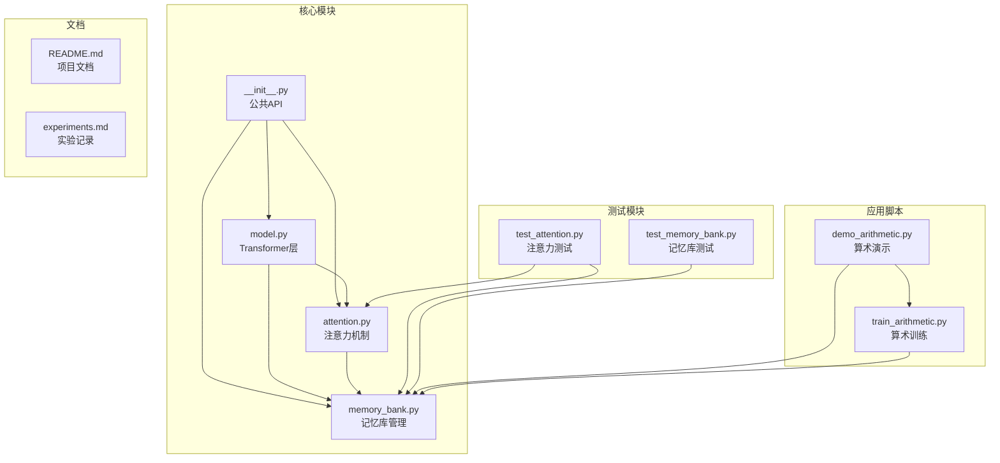
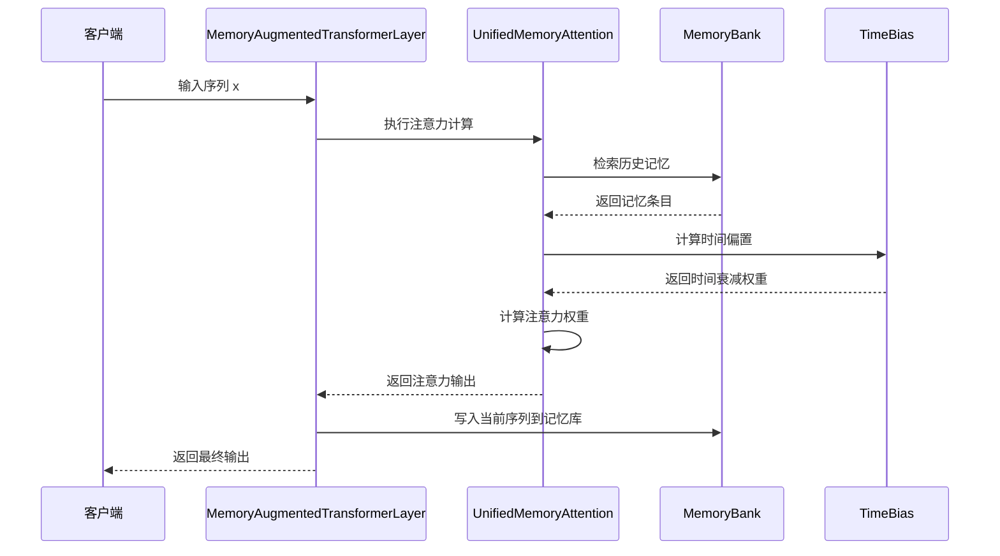
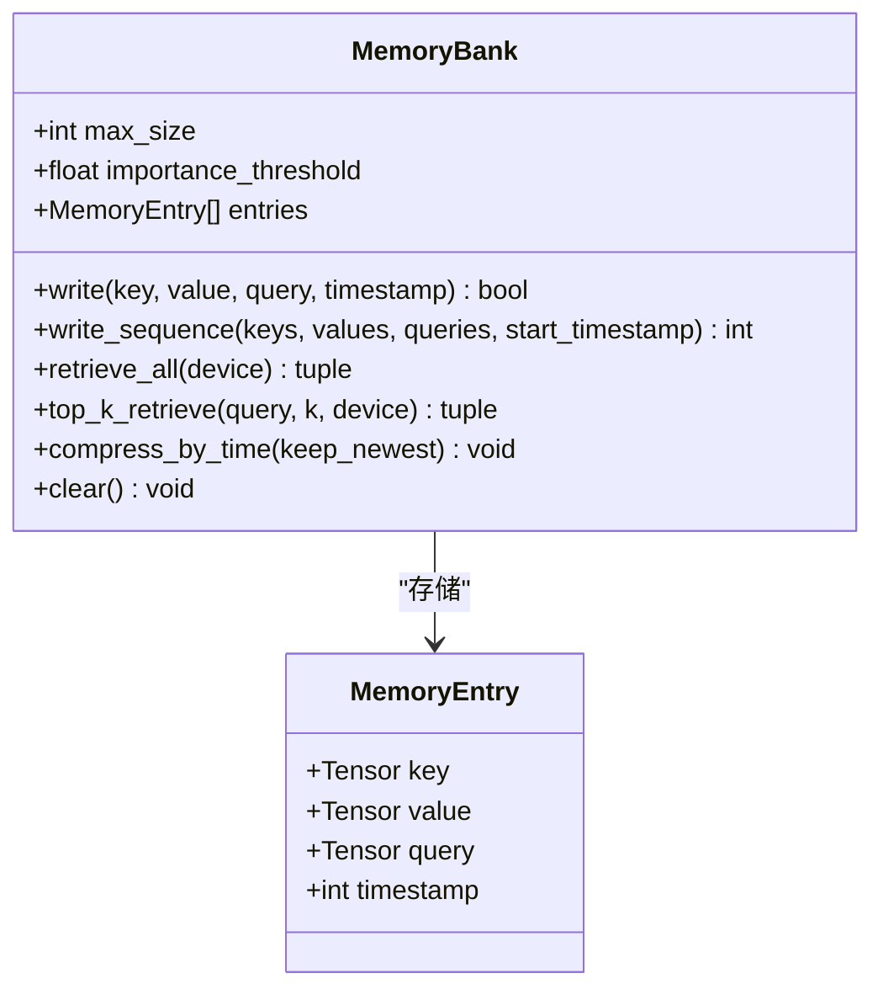
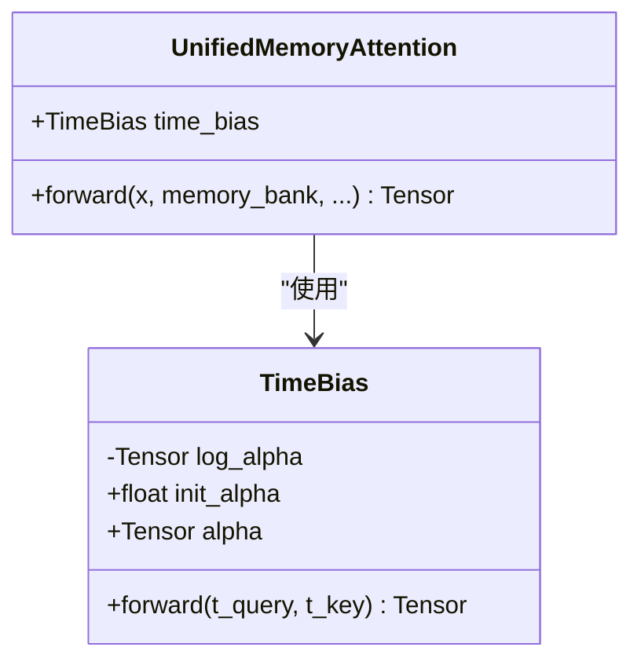
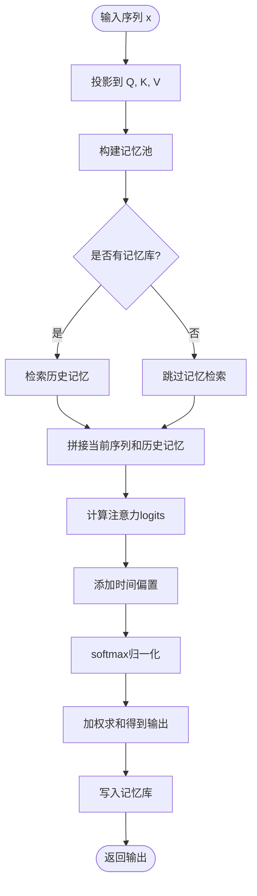
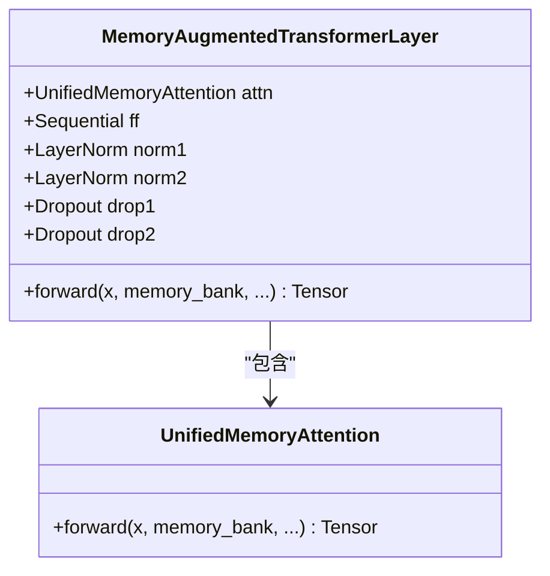
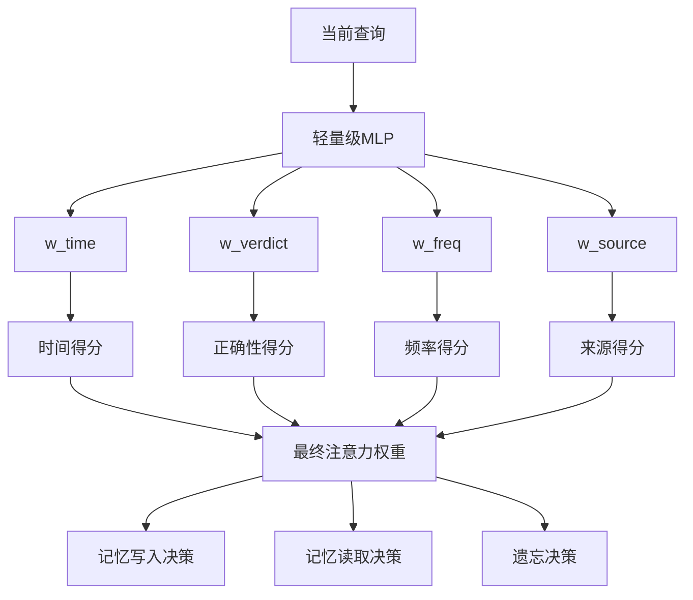
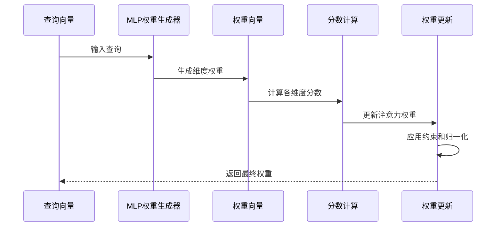
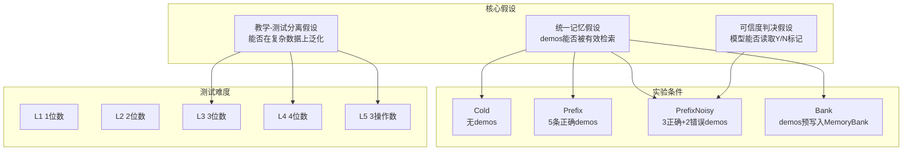

# 多维动态权重设计演进

<cite>
**本文档引用的文件**
- [README.md](file://README.md)
- [attention.py](file://src/memory_augmented_attention/attention.py)
- [memory_bank.py](file://src/memory_augmented_attention/memory_bank.py)
- [model.py](file://src/memory_augmented_attention/model.py)
- [test_attention.py](file://tests/test_attention.py)
- [test_memory_bank.py](file://tests/test_memory_bank.py)
- [experiments.md](file://docs/experiments.md)
- [demo_arithmetic.py](file://demo_arithmetic.py)
- [train_arithmetic.py](file://train_arithmetic.py)
</cite>

## 目录
1. [简介](#简介)
2. [项目结构](#项目结构)
3. [核心组件](#核心组件)
4. [架构概览](#架构概览)
5. [详细组件分析](#详细组件分析)
6. [多维动态权重设计演进](#多维动态权重设计演进)
7. [数学表示与几何意义](#数学表示与几何意义)
8. [权重分配策略](#权重分配策略)
9. [实验验证过程](#实验验证过程)
10. [实际应用场景](#实际应用场景)
11. [性能考虑](#性能考虑)
12. [故障排除指南](#故障排除指南)
13. [结论](#结论)

## 简介

Memory-Augmented Attention (MAA) 是一个基于 PyTorch 的统一记忆增强注意力机制实现。该系统的核心创新是从单一时间偏置发展到多维度动态权重设计，能够同时考虑时间、正确性、频率和来源等多个维度的信息重要性。

MAA 的设计理念是将当前序列令牌（短期记忆）和历史 KV 对（长期记忆）存储在一个共享的时间戳记忆库中，并使用时间衰减偏置进行联合注意。这一设计解决了标准 Transformer 的状态性问题，实现了真正的持久记忆。

## 项目结构



**图表来源**
- [__init__.py:18-27](file://src/memory_augmented_attention/__init__.py#L18-L27)
- [model.py:27-86](file://src/memory_augmented_attention/model.py#L27-L86)
- [attention.py:101-162](file://src/memory_augmented_attention/attention.py#L101-L162)
- [memory_bank.py:43-76](file://src/memory_augmented_attention/memory_bank.py#L43-L76)

**章节来源**
- [README.md:374-393](file://README.md#L374-L393)
- [__init__.py:1-28](file://src/memory_augmented_attention/__init__.py#L1-L28)

## 核心组件

MAA 系统包含四个核心组件，每个都承担着特定的记忆处理职责：

### MemoryBank - 统一记忆库
负责存储和检索带时间戳的 (K, V, Q) 条目，支持 LRU 淘汰和重要性过滤。

### TimeBias - 时间偏置模块
实现可学习的时间衰减偏置，使用对数形式模拟人类记忆的幂律遗忘曲线。

### UnifiedMemoryAttention - 统一记忆注意力
执行统一的记忆增强注意力计算，支持当前序列和历史记忆的联合注意。

### MemoryAugmentedTransformerLayer - 记忆增强Transformer层
完整的编码器层实现，包含注意力子层和前馈网络。

**章节来源**
- [memory_bank.py:43-284](file://src/memory_augmented_attention/memory_bank.py#L43-L284)
- [attention.py:40-322](file://src/memory_augmented_attention/attention.py#L40-L322)
- [model.py:27-134](file://src/memory_augmented_attention/model.py#L27-L134)

## 架构概览



**图表来源**
- [model.py:87-134](file://src/memory_augmented_attention/model.py#L87-L134)
- [attention.py:181-322](file://src/memory_augmented_attention/attention.py#L181-L322)
- [memory_bank.py:128-163](file://src/memory_augmented_attention/memory_bank.py#L128-L163)

## 详细组件分析

### MemoryBank 类分析

MemoryBank 是整个系统的核心存储组件，采用数据类设计存储每个记忆条目：



**图表来源**
- [memory_bank.py:33-41](file://src/memory_augmented_attention/memory_bank.py#L33-L41)
- [memory_bank.py:43-76](file://src/memory_augmented_attention/memory_bank.py#L43-L76)

MemoryBank 的关键特性包括：
- **LRU 淘汰机制**：当达到最大容量时自动淘汰最旧的条目
- **重要性过滤**：通过 L2 范数阈值避免存储低信息量的条目
- **Top-K 检索**：基于余弦相似度的高效检索机制
- **时间压缩**：支持按时间维度压缩历史条目

**章节来源**
- [memory_bank.py:43-284](file://src/memory_augmented_attention/memory_bank.py#L43-L284)

### TimeBias 类分析

TimeBias 实现了可学习的时间衰减偏置，这是 MAA 系统的核心创新之一：



**图表来源**
- [attention.py:40-94](file://src/memory_augmented_attention/attention.py#L40-L94)
- [attention.py:101-162](file://src/memory_augmented_attention/attention.py#L101-L162)

TimeBias 的数学公式为：
```
TimeBias(t_q, t_k) = -α * log(1 + |t_q - t_k|)
```

其中 α 是可学习标量参数，当 α = 0 时退化为标准注意力。

**章节来源**
- [attention.py:40-94](file://src/memory_augmented_attention/attention.py#L40-L94)

### UnifiedMemoryAttention 类分析

UnifiedMemoryAttention 是整个系统的注意力核心，实现了统一的记忆增强注意力机制：



**图表来源**
- [attention.py:181-322](file://src/memory_augmented_attention/attention.py#L181-L322)

**章节来源**
- [attention.py:101-322](file://src/memory_augmented_attention/attention.py#L101-L322)

### MemoryAugmentedTransformerLayer 类分析

MemoryAugmentedTransformerLayer 实现了完整的 Transformer 编码器层：



**图表来源**
- [model.py:27-86](file://src/memory_augmented_attention/model.py#L27-L86)
- [model.py:87-134](file://src/memory_augmented_attention/model.py#L87-L134)

**章节来源**
- [model.py:27-134](file://src/memory_augmented_attention/model.py#L27-L134)

## 多维动态权重设计演进

### 从单一时间偏置到多维度权重

MAA 系统的设计演进体现了从单一时间维度到多维度动态权重的发展历程：

#### 第一阶段：单一时间偏置
最初的 MAA 实现仅使用时间衰减偏置：
```
MemoryBias(entry) = f_time(Δt) = exp(-Δt/τ)
```

这种设计在算术教学任务中表现出色，但在更复杂的场景中存在局限性。

#### 第二阶段：多维度动态权重
基于实验观察和理论分析，MAA 进化为多维度动态权重系统：

```
MemoryBias(entry) = w_time·f_time + w_verdict·f_verdict + w_freq·f_freq + w_source·f_source
```

其中权重向量 `[w_time, w_verdict, w_freq, w_source]` 由当前查询通过轻量级 MLP 动态决定。

### 设计动机分析

多维度权重设计的动机来源于以下实验观察：

1. **时间并非唯一重要维度**：在算术教学中，演示的正确性（Y/N）比年龄更重要
2. **场景敏感性**：不同应用场景需要不同的权重优先级
3. **动态适应性**：同一查询在不同上下文中应该激活不同的记忆过滤逻辑

**章节来源**
- [README.md:117-140](file://README.md#L117-L140)

## 数学表示与几何意义

### 数学公式定义

多维动态权重的数学表示为：

```
MemoryBias(entry_i) = Σ(w_dim · f_dim(entry_i)) for dim ∈ {time, verdict, freq, source}

w_dim = MLP_dim(query_current)(query_current)
f_time(Δt) = exp(-α·Δt/τ)
f_verdict(Y) = +1, f_verdict(N) = -1, f_verdict(unverified) = 0
f_freq(count) = log(1 + count)
f_source(authority) ∈ [0, 1]
```

### 几何意义解释

多维权重的几何意义在于将记忆条目映射到高维特征空间：

```mermaid
graph LR
subgraph "特征空间"
A[时间维度<br/>exp(-α·Δt/τ)]
B[正确性维度<br/>[-1, +1]]
C[频率维度<br/>log(1 + count)]
D[来源维度<br/>[0, 1]]
end
subgraph "权重向量"
E[w_time]
F[w_verdict]
G[w_freq]
H[w_source]
end
subgraph "注意力权重"
I[最终权重]
end
A --> I
B --> I
C --> I
D --> I
E --> I
F --> I
G --> I
H --> I
```

**图表来源**
- [README.md:127-132](file://README.md#L127-L132)

### 复杂度分析

- **时间复杂度**：O(L·M·d + M·log M) 其中 L 为当前序列长度，M 为记忆库大小
- **空间复杂度**：O(L·d + M·d)
- **权重计算**：O(d) 每个维度的特征提取
- **总复杂度**：O(L·M·d + M·log M + M·d)

**章节来源**
- [README.md:151-169](file://README.md#L151-L169)

## 权重分配策略

### 注意力权重、记忆权重和遗忘权重的协调机制

MAA 系统实现了三重权重协调机制：



### 协调机制设计原则

1. **动态平衡**：不同维度的权重根据查询内容动态调整
2. **互补性**：各维度权重相互补充，避免单一维度主导
3. **可解释性**：权重分配过程具有明确的语义含义
4. **稳定性**：通过归一化和约束确保权重稳定

### 权重更新策略



**图表来源**
- [README.md:130-132](file://README.md#L130-L132)

**章节来源**
- [README.md:127-140](file://README.md#L127-L140)

## 实验验证过程

### 算术教学实验设计

MAA 的实验验证主要基于算术教学任务，该任务设计精妙地测试了三个核心假设：

#### 实验目标验证



**图表来源**
- [experiments.md:3-11](file://docs/experiments.md#L3-L11)
- [experiments.md:36-53](file://docs/experiments.md#L36-L53)

#### 关键发现分析

1. **统一记忆假设**：Bank 模式 L2 89.5%，与 Prefix 100% 接近
2. **可信度判决假设**：PrefixNoisy 100%（L2），证明模型能读取 Y/N 标记
3. **教学-测试分离假设**：训练内分布完美，OOD 泛化失败是模型容量问题

### 实验结果分析

```mermaid
table
title 实验结果对比
style th background-color #f2f2f2
header L1 L2 L3 L4 L5
row1 Cold 100.0% 100.0% 0.0% 0.0% 15.0%
row2 Prefix 100.0% 100.0% 0.0% 0.0% 14.0%
row3 PrefixNoisy 99.0% 100.0% 0.0% 0.0% 16.0%
row4 Bank 42.5% 89.5% 0.0% 0.0% 9.5%
```

**图表来源**
- [experiments.md:57-63](file://docs/experiments.md#L57-L63)

### 关键问题识别

实验过程中发现了几个关键问题：

1. **注意力泄漏**：双向注意力导致答案位置能看到未来信息
2. **停止监督缺失**：模型不知道何时停止生成答案
3. **Bank 作弊**：跨批次共享 bank 导致模型学会复制答案

**章节来源**
- [experiments.md:96-129](file://docs/experiments.md#L96-L129)

## 实际应用场景

### 场景权重配置建议

基于不同应用场景的特点，推荐以下权重配置：

#### 对话系统场景
- **时间权重**：高（保持上下文连贯性）
- **正确性权重**：中（纠正之前的错误信息）
- **频率权重**：中高（常用话题和术语）
- **来源权重**：高（权威信息和事实）

#### 代码补全场景
- **时间权重**：中（最近的代码片段更重要）
- **正确性权重**：高（正确的代码模式）
- **频率权重**：高（频繁使用的代码模式）
- **来源权重**：中（代码库权威性）

#### 个性化助手场景
- **时间权重**：高（个人偏好随时间变化）
- **正确性权重**：高（经过验证的个人信息）
- **频率权重**：高（常用的个人习惯）
- **来源权重**：高（可信的个人信息源）

### 权重调优案例

#### 案例1：教育问答系统
```python
# 教育场景的权重配置
education_weights = {
    'time': 0.3,      # 时间重要性中等
    'verdict': 0.5,   # 正确性最重要
    'freq': 0.2,      # 频率重要性较低
    'source': 0.4     # 来源权威性重要
}
```

#### 案例2：技术文档检索
```python
# 技术场景的权重配置
tech_weights = {
    'time': 0.2,      # 时间重要性较低
    'verdict': 0.6,   # 正确性最重要
    'freq': 0.3,      # 频率重要性中等
    'source': 0.5     # 来源权威性重要
}
```

**章节来源**
- [README.md:285-294](file://README.md#L285-L294)

## 性能考虑

### 复杂度管理策略

MAA 系统提供了三种互补的复杂度管理策略：

```mermaid
graph LR
subgraph "复杂度管理策略"
A[Top-K检索<br/>O(L·K·d)]
B[时间压缩<br/>O(L·d)]
C[LRU淘汰<br/>O(1)]
end
subgraph "推荐配置"
D[近期token<br/>完整注意力]
E[旧token<br/>Top-K检索]
F[归档<br/>压缩摘要嵌入]
end
A --> D
B --> E
C --> F
```

**图表来源**
- [README.md:157-169](file://README.md#L157-L169)

### 超参数调优指南

| 参数 | 推荐范围 | 影响效果 |
|------|----------|----------|
| `top_k` | 32-128 | 更大→更丰富的上下文，更高计算开销 |
| `init_alpha` | 0.5-2.0 | 更大→更强的时间衰减 |
| `max_size` | 1024-16384 | RAM中最大历史条目数 |
| `importance_threshold` | 0.0-0.5 | 更高→只存储显著令牌 |

### 内存管理最佳实践

1. **定期压缩**：在推理步骤之间定期压缩以防止内存爆炸
2. **重要性过滤**：使用 L2 范数阈值避免存储低信息量条目
3. **LRU 淘汰**：当银行满时自动淘汰最旧条目
4. **Top-K 限制**：限制注意力池大小以控制计算成本

**章节来源**
- [README.md:274-284](file://README.md#L274-L284)

## 故障排除指南

### 常见问题及解决方案

#### 问题1：注意力泄漏
**症状**：训练准确率100%，但测试 Cold 只有25%
**原因**：默认双向注意力导致当前位置能看到未来答案
**解决方案**：添加 `causal=True` 参数

#### 问题2：停止监督缺失
**症状**：答案多生成一位（如 "0+4=" → "44"）
**原因**：损失只监督答案位置，答案后的 PAD 位置无监督
**解决方案**：扩展掩码到 `ans_end + 1`

#### 问题3：Bank 作弊
**症状**：跨批次共享 bank 导致模型学会复制答案
**原因**：bank 变成答案查询表
**解决方案**：训练时使用 `memory_bank=None`

### 调试技巧

1. **检查注意力权重**：验证时间衰减是否正常工作
2. **监控记忆库大小**：确保不会发生内存溢出
3. **验证因果掩码**：确保当前序列部分应用了因果掩码
4. **测试 Top-K 行为**：确认检索机制按预期工作

**章节来源**
- [experiments.md:96-129](file://docs/experiments.md#L96-L129)

## 结论

MAA 系统的多维动态权重设计演进代表了记忆增强注意力机制的重要发展方向。从单一时间偏置到多维度动态权重的转变，不仅提高了系统的表达能力，还为不同应用场景提供了灵活的权重配置方案。

### 主要成就

1. **理论创新**：提出了多维度动态权重的概念框架
2. **实验验证**：通过算术教学任务验证了核心假设
3. **工程实现**：提供了完整的 PyTorch 实现和测试套件
4. **应用潜力**：展示了在对话系统、代码补全等场景的应用前景

### 未来发展方向

1. **多维度动态权重**：完成从单 `TimeBias` 到可学习 `[time, verdict, frequency, source]` 权重的扩展
2. **记忆类型系统**：区分情景记忆、语义记忆和程序记忆的不同维度优先级
3. **可学习整合**：使用小型模型将旧条目合并为摘要嵌入
4. **层次化记忆**：将银行分为热/温/冷层级，使用不同的检索预算

MAA 系统为构建真正具有持久记忆能力的 AI 系统奠定了坚实基础，其多维动态权重设计为未来的记忆增强技术发展指明了方向。