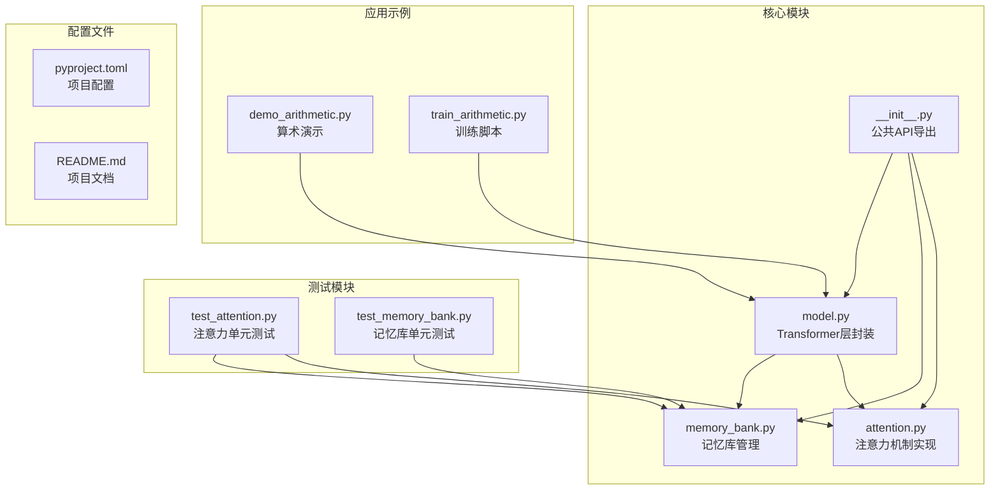
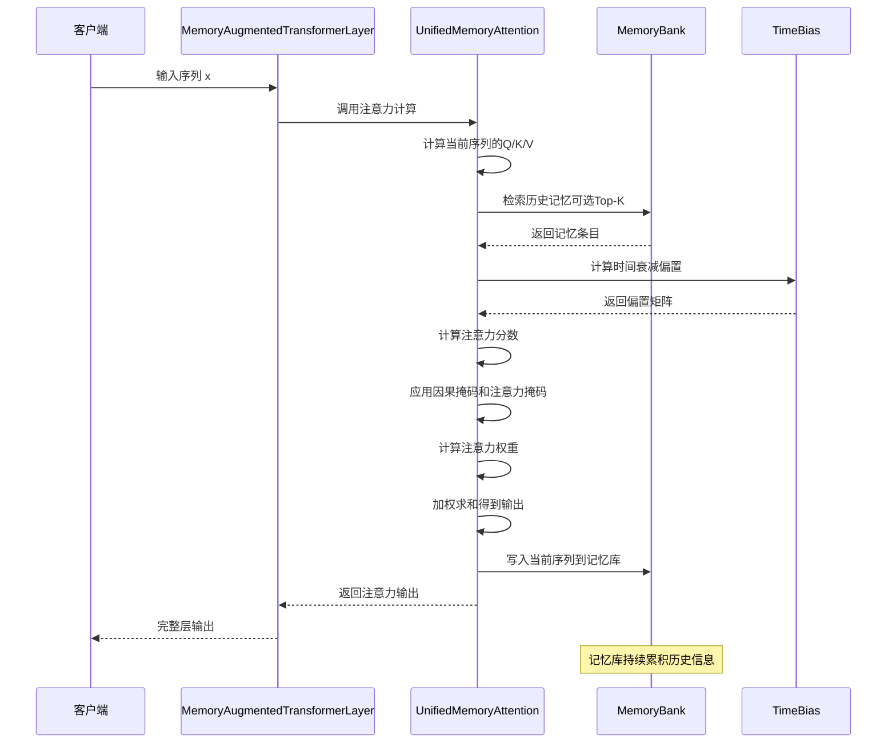
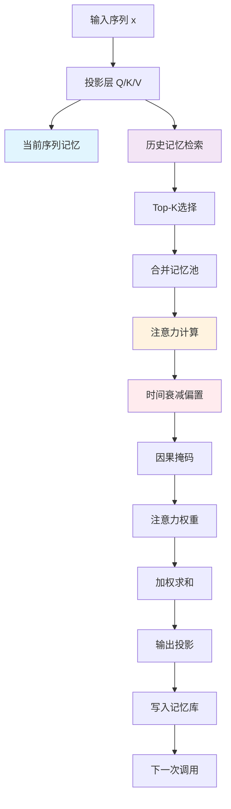
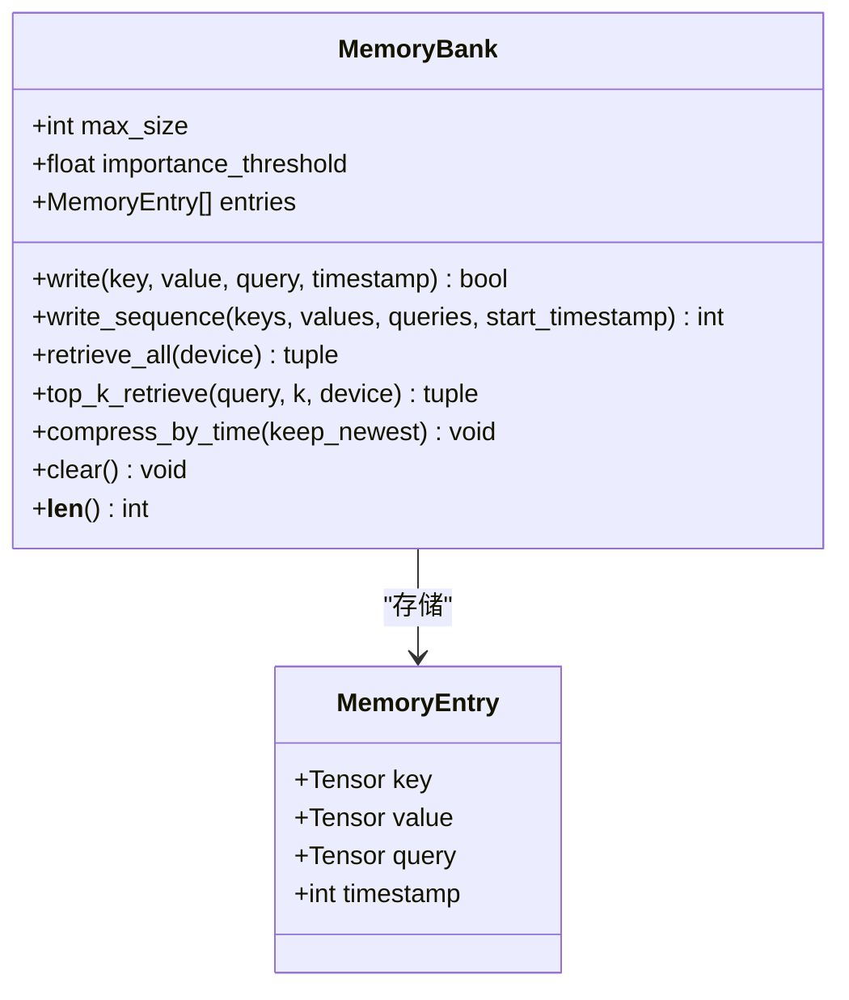
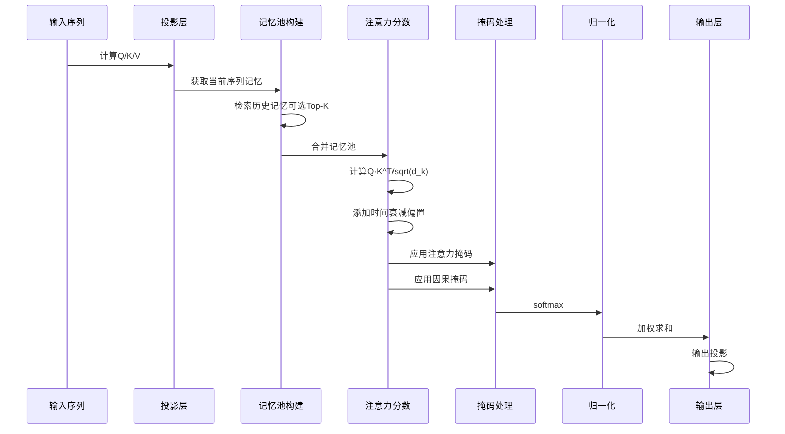
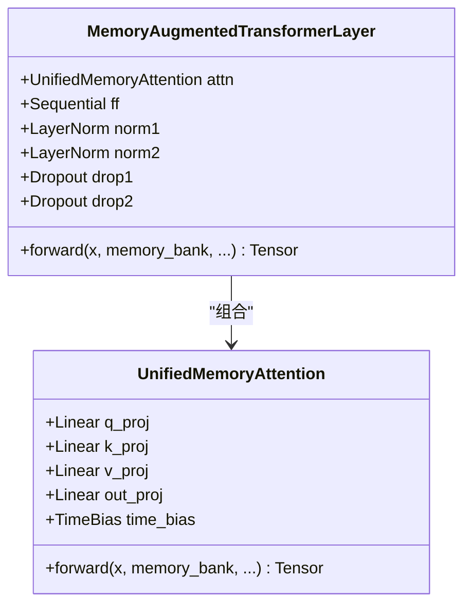
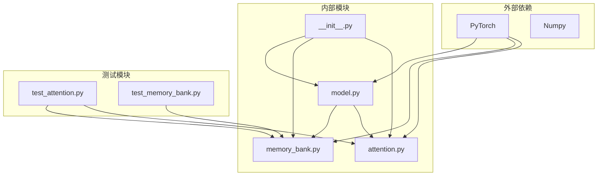

# 架构设计与实现

<cite>
**本文档引用的文件**
- [__init__.py](file://src/memory_augmented_attention/__init__.py)
- [attention.py](file://src/memory_augmented_attention/attention.py)
- [memory_bank.py](file://src/memory_augmented_attention/memory_bank.py)
- [model.py](file://src/memory_augmented_attention/model.py)
- [README.md](file://README.md)
- [test_attention.py](file://tests/test_attention.py)
- [test_memory_bank.py](file://tests/test_memory_bank.py)
- [demo_arithmetic.py](file://demo_arithmetic.py)
- [train_arithmetic.py](file://train_arithmetic.py)
</cite>

## 目录
1. [简介](#简介)
2. [项目结构](#项目结构)
3. [核心组件](#核心组件)
4. [架构概览](#架构概览)
5. [详细组件分析](#详细组件分析)
6. [依赖关系分析](#依赖关系分析)
7. [性能考虑](#性能考虑)
8. [故障排除指南](#故障排除指南)
9. [结论](#结论)

## 简介

Memory-Augmented Attention (MAA) 是一个创新的注意力机制实现，它将当前序列和历史记忆统一处理在一个共享的时间戳记忆库中。该系统的核心理念是：**序列中的每个token都是记忆的一部分，无论它们来自当前输入还是过去的交互**。

### 设计哲学

MAA 的核心设计决策基于以下观察：
- 标准Transformer是无状态的，每次前向传播只处理当前上下文窗口
- 当前序列本身可以被视为短期记忆
- 将当前序列和历史KV对统一存储在带时间戳的记忆库中，通过时间衰减偏置自然降低旧记忆的影响

### 技术优势

1. **统一记忆架构**：消除了短期记忆和长期记忆的二元区分
2. **时间感知**：通过时间戳为每个记忆条目提供明确的时间维度
3. **渐进式遗忘**：使用对数衰减函数模拟人类记忆的幂律遗忘曲线
4. **可扩展性**：通过Top-K检索、时间压缩和LRU淘汰策略管理内存复杂度

## 项目结构



**图表来源**
- [__init__.py:1-28](file://src/memory_augmented_attention/__init__.py#L1-L28)
- [attention.py:1-322](file://src/memory_augmented_attention/attention.py#L1-L322)
- [memory_bank.py:1-284](file://src/memory_augmented_attention/memory_bank.py#L1-L284)
- [model.py:1-134](file://src/memory_augmented_attention/model.py#L1-L134)

**章节来源**
- [__init__.py:1-28](file://src/memory_augmented_attention/__init__.py#L1-L28)
- [README.md:374-393](file://README.md#L374-L393)

## 核心组件

### MemoryBank - 统一记忆库

MemoryBank是整个系统的基石，负责存储带时间戳的(K, V, Q)三元组。其设计特点：

- **固定容量管理**：当达到最大容量时，自动淘汰最旧的条目（LRU策略）
- **重要性过滤**：可选的重要度阈值过滤器，避免低信息量token污染记忆库
- **时间压缩**：支持按时间保留最新条目，减少内存占用
- **Top-K检索**：基于余弦相似度的高效检索机制

### TimeBias - 时间衰减偏置

TimeBias模块实现了学习的时间衰减函数：
```
TimeBias(t_q, t_k) = -α * log(1 + |t_q - t_k|)
```

其中α是可学习标量参数，log形式模拟人类记忆的幂律遗忘曲线。

### UnifiedMemoryAttention - 统一记忆注意力

这是MAA的核心实现，将当前序列和历史记忆统一处理：
- 支持可选的Top-K检索限制注意力池大小
- 实现因果掩码以确保自回归性质
- 自动将当前序列写入记忆库供后续使用

### MemoryAugmentedTransformerLayer - 完整Transformer层

封装了标准Transformer编码器层的结构，但使用MAA替代标准注意力：
- 预归一化残差连接
- 前馈网络 + 残差连接
- 可选的记忆库共享机制

**章节来源**
- [memory_bank.py:43-284](file://src/memory_augmented_attention/memory_bank.py#L43-L284)
- [attention.py:40-322](file://src/memory_augmented_attention/attention.py#L40-L322)
- [model.py:27-134](file://src/memory_augmented_attention/model.py#L27-L134)

## 架构概览



**图表来源**
- [model.py:87-134](file://src/memory_augmented_attention/model.py#L87-L134)
- [attention.py:181-322](file://src/memory_augmented_attention/attention.py#L181-L322)
- [memory_bank.py:203-253](file://src/memory_augmented_attention/memory_bank.py#L203-L253)

### 数据流图



**图表来源**
- [attention.py:236-322](file://src/memory_augmented_attention/attention.py#L236-L322)
- [memory_bank.py:203-253](file://src/memory_augmented_attention/memory_bank.py#L203-L253)

## 详细组件分析

### MemoryBank 实现详解

MemoryBank采用数据类存储每个记忆条目，包含键、值、查询和时间戳：



**图表来源**
- [memory_bank.py:33-76](file://src/memory_augmented_attention/memory_bank.py#L33-L76)
- [memory_bank.py:43-163](file://src/memory_augmented_attention/memory_bank.py#L43-L163)

#### Top-K检索算法

Top-K检索是MemoryBank的核心功能，其实现步骤：

1. **向量化比较**：将查询和所有存储条目的键向量化
2. **L2归一化**：对查询和键进行L2归一化
3. **余弦相似度计算**：通过点积计算余弦相似度
4. **Top-K选择**：使用`torch.topk`获取最相关的k个条目
5. **排序保持**：保持原始时间顺序

**章节来源**
- [memory_bank.py:203-253](file://src/memory_augmented_attention/memory_bank.py#L203-L253)

### TimeBias 数学原理

TimeBias模块实现了学习的时间衰减函数：

```mermaid
flowchart TD
A[时间差 |t_q - t_k|] --> B[加1]
B --> C[取对数 log(1 + |t_q - t_k|)]
C --> D[乘以学习参数 α]
D --> E[取负号 -α * log(1 + |t_q - t_k|)]
style A fill:#e8f5e8
style E fill:#ffebee
```

**图表来源**
- [attention.py:40-94](file://src/memory_augmented_attention/attention.py#L40-L94)

#### 数学特性分析

- **零延迟**：当`|t_q - t_k| = 0`时，偏置为0，表示对自身完全不惩罚
- **单调递减**：随着延迟增加，偏置越来越负，表示遗忘增强
- **渐近行为**：对于大延迟，偏置趋近于线性衰减，符合幂律遗忘
- **可学习性**：参数α通过反向传播学习最优衰减强度

**章节来源**
- [attention.py:40-94](file://src/memory_augmented_attention/attention.py#L40-L94)

### UnifiedMemoryAttention 核心算法

UnifiedMemoryAttention的完整工作流程：



**图表来源**
- [attention.py:181-322](file://src/memory_augmented_attention/attention.py#L181-L322)

#### 因果掩码实现

因果掩码仅应用于当前序列部分，确保自回归性质：

- **适用范围**：仅影响当前序列的注意力分数
- **历史记忆**：始终可见，因为它们代表严格更早的历史
- **实现方式**：创建零矩阵，然后在当前序列区域应用上三角掩码

**章节来源**
- [attention.py:288-297](file://src/memory_augmented_attention/attention.py#L288-L297)

### MemoryAugmentedTransformerLayer 结构



**图表来源**
- [model.py:27-86](file://src/memory_augmented_attention/model.py#L27-L86)
- [attention.py:101-162](file://src/memory_augmented_attention/attention.py#L101-L162)

**章节来源**
- [model.py:27-134](file://src/memory_augmented_attention/model.py#L27-L134)

## 依赖关系分析



**图表来源**
- [__init__.py:18-27](file://src/memory_augmented_attention/__init__.py#L18-L27)
- [attention.py:22-32](file://src/memory_augmented_attention/attention.py#L22-L32)
- [memory_bank.py:23-31](file://src/memory_augmented_attention/memory_bank.py#L23-L31)
- [model.py:15-25](file://src/memory_augmented_attention/model.py#L15-L25)

### 模块间耦合分析

- **低耦合高内聚**：各模块职责明确，接口清晰
- **单向依赖**：model依赖attention，attention依赖memory_bank
- **可测试性**：独立的单元测试覆盖所有核心功能

**章节来源**
- [__init__.py:18-27](file://src/memory_augmented_attention/__init__.py#L18-L27)

## 性能考虑

### 复杂度分析

MAA通过三种互补策略控制复杂度：

| 策略 | 复杂度 | 说明 | 适用场景 |
|------|--------|------|----------|
| **Top-K检索** | O(L·K·d) | 仅关注K个最相关条目 | 大规模记忆库 |
| **时间压缩** | O(L·d) | 合并旧条目为摘要向量 | 长期记忆管理 |
| **LRU淘汰** | O(1) | 自动淘汰最旧条目 | 内存容量限制 |

### 优化策略

1. **Top-K参数调优**
   - `top_k=32-128`是推荐范围
   - 更大K值提供更丰富的上下文，但增加计算开销

2. **重要性过滤**
   - `importance_threshold=0.0-0.5`
   - 过滤低信息量token，提高记忆质量

3. **时间压缩策略**
   - 定期调用`compress_by_time(keep_newest)`
   - 在推理步骤之间进行内存整理

4. **批量写入优化**
   - 使用`write_sequence`批量写入序列
   - 减少重复的内存分配和拷贝操作

### 数值稳定性保证

1. **梯度裁剪**：在训练中使用梯度范数裁剪防止爆炸
2. **softmax稳定**：通过减去最大值避免数值溢出
3. **对数域计算**：TimeBias在对数域计算，避免直接的除零错误
4. **类型转换**：确保时间戳在浮点域进行精确计算

**章节来源**
- [README.md:151-169](file://README.md#L151-L169)
- [train_arithmetic.py:276](file://train_arithmetic.py#L276)

## 故障排除指南

### 常见问题诊断

#### 内存相关问题

**问题**：MemoryBank满载导致溢出
```python
# 解决方案：检查容量设置
bank = MemoryBank(max_size=4096)  # 确保足够大
```

**问题**：Top-K检索返回空结果
```python
# 解决方案：检查记忆库是否为空
if len(memory_bank) > 0:
    keys, values, queries, timestamps = memory_bank.top_k_retrieve(...)
```

#### 计算相关问题

**问题**：注意力权重出现NaN
```python
# 解决方案：检查输入张量的数值稳定性
assert torch.isfinite(x).all(), "输入包含非有限值"
```

**问题**：梯度消失或爆炸
```python
# 解决方案：启用梯度裁剪和适当的初始化
torch.nn.utils.clip_grad_norm_(model.parameters(), 1.0)
```

### 单元测试验证

通过完整的单元测试套件验证核心功能：

- **TimeBias测试**：验证对角线为零、单调递减、参数可学习
- **UnifiedMemoryAttention测试**：验证形状正确性、梯度流动、Top-K限制
- **MemoryBank测试**：验证LRU淘汰、Top-K检索、重要性过滤

**章节来源**
- [test_attention.py:17-231](file://tests/test_attention.py#L17-L231)
- [test_memory_bank.py:26-189](file://tests/test_memory_bank.py#L26-L189)

## 结论

Memory-Augmented Attention提供了一个优雅而强大的统一记忆架构解决方案。其核心价值在于：

1. **理论创新**：将当前序列和历史记忆统一处理，消除了传统框架中的二元区分
2. **工程实用**：通过Top-K检索、时间压缩和LRU淘汰实现了可扩展的记忆管理
3. **数值稳定**：精心设计的数学公式和实现细节确保了训练和推理的稳定性
4. **易于集成**：作为标准Transformer的直接替换，降低了采用成本

### 未来发展方向

根据项目路线图，MAA正在向多维动态权重发展：
- 从单一TimeBias扩展到多维度记忆权重
- 引入记忆类型系统（情景记忆、语义记忆、程序记忆）
- 实现可学习的记忆整合机制

这一架构为构建真正具有持久记忆能力的AI系统奠定了坚实基础，有望在对话系统、知识问答和长序列建模等应用场景中发挥重要作用。