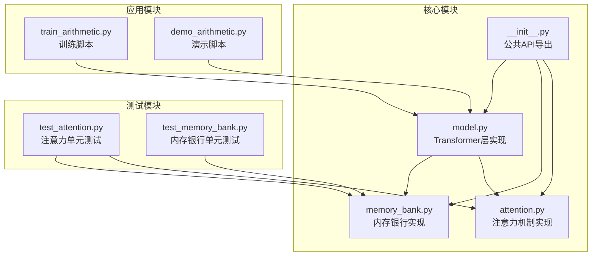
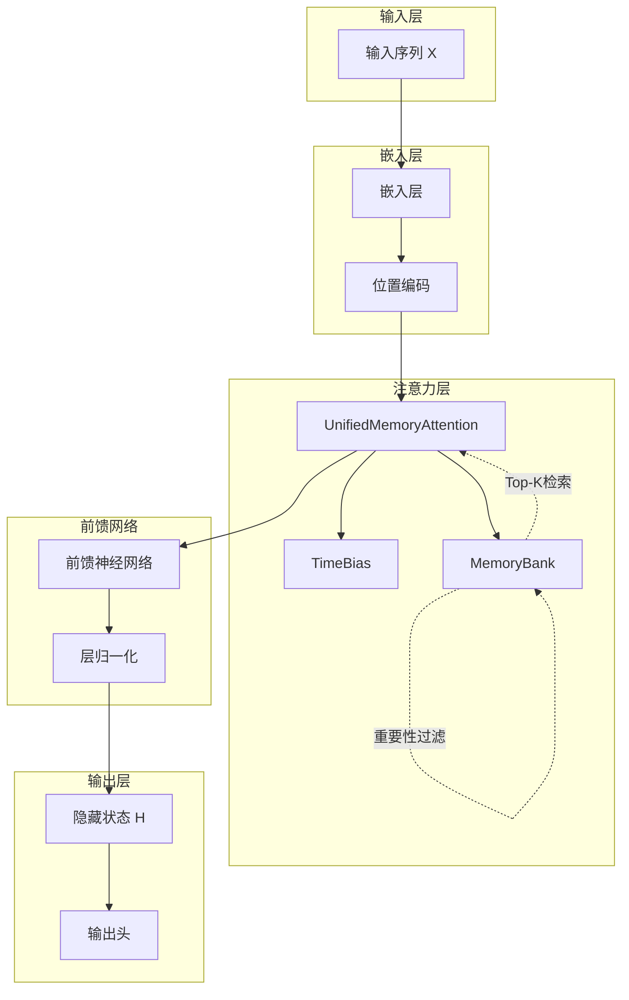
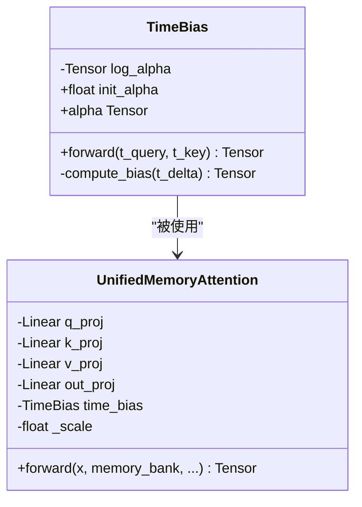
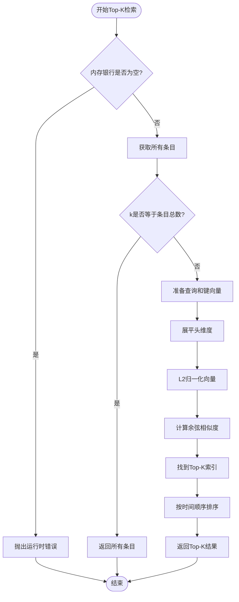
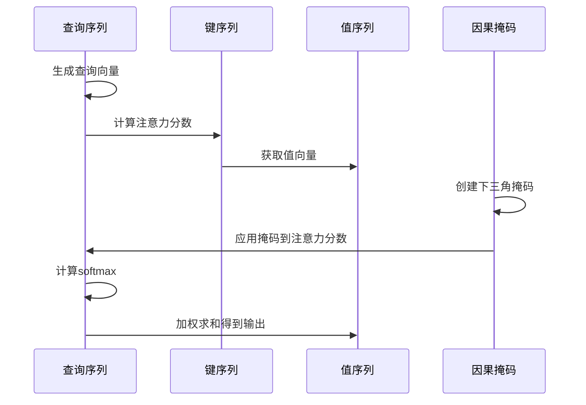
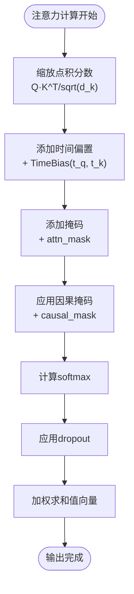
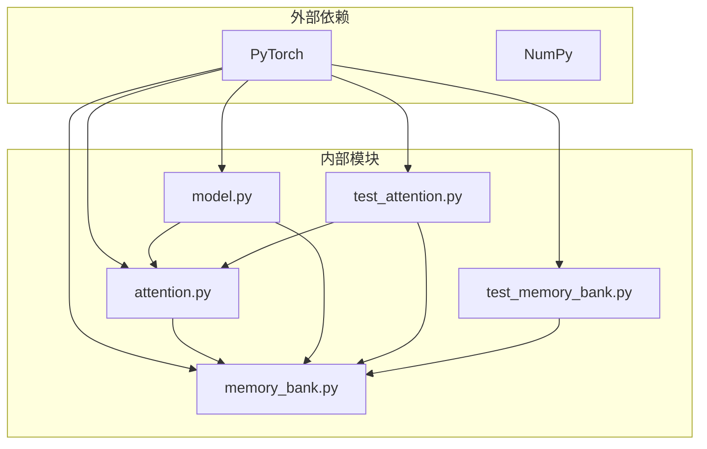

# 核心算法实现细节

<cite>
**本文档引用的文件**
- [attention.py](file://src/memory_augmented_attention/attention.py)
- [memory_bank.py](file://src/memory_augmented_attention/memory_bank.py)
- [model.py](file://src/memory_augmented_attention/model.py)
- [test_attention.py](file://tests/test_attention.py)
- [test_memory_bank.py](file://tests/test_memory_bank.py)
- [README.md](file://README.md)
- [train_arithmetic.py](file://train_arithmetic.py)
- [demo_arithmetic.py](file://demo_arithmetic.py)
</cite>

## 目录
1. [简介](#简介)
2. [项目结构](#项目结构)
3. [核心组件](#核心组件)
4. [架构概览](#架构概览)
5. [详细组件分析](#详细组件分析)
6. [依赖关系分析](#依赖关系分析)
7. [性能考虑](#性能考虑)
8. [故障排除指南](#故障排除指南)
9. [结论](#结论)

## 简介

Memory-Augmented Attention (MAA) 是一个统一的内存增强注意力机制，它将当前序列标记和历史KV缓存都视为共享内存库中的带时间戳的记忆条目。该系统的核心创新在于引入了时间衰减偏置(TimeBias)，通过自然地降低较旧记忆的权重来模拟人类记忆的人工遗忘曲线。

本技术文档深入分析了三个核心算法的实现细节：时间衰减偏置、Top-K检索算法和因果掩码处理机制。文档提供了详细的数学原理、实现策略、数值稳定性保证以及关键算法的伪代码和流程图。

## 项目结构

该项目采用模块化设计，主要包含以下核心模块：



**图表来源**
- [__init__.py:18-27](file://src/memory_augmented_attention/__init__.py#L18-L27)
- [attention.py:1-322](file://src/memory_augmented_attention/attention.py#L1-L322)
- [memory_bank.py:1-284](file://src/memory_augmented_attention/memory_bank.py#L1-L284)
- [model.py:1-134](file://src/memory_augmented_attention/model.py#L1-L134)

**章节来源**
- [__init__.py:1-28](file://src/memory_augmented_attention/__init__.py#L1-L28)
- [README.md:374-394](file://README.md#L374-L394)

## 核心组件

### 时间衰减偏置(TimeBias)

TimeBias是MAA系统的核心创新，它为注意力分数添加了一个可学习的时间衰减偏置项。其数学公式为：

```
TimeBias(t_q, t_k) = -α * log(1 + |t_q - t_k|)
```

其中α是一个可学习的标量参数，当α=0时退化为标准注意力。

### 统一内存注意力(UnifiedMemoryAttention)

UnifiedMemoryAttention实现了统一的内存增强多头注意力机制，它将当前序列和历史记忆池合并为一个统一的注意力池。其注意力分数公式为：

```
logit(q, k) = (Q · K^T) / sqrt(d_k) + TimeBias(t_q, t_k)
```

### 内存银行(MemoryBank)

MemoryBank存储带时间戳的(K, V, Q)条目，支持LRU逐出、重要性过滤和Top-K检索功能。

**章节来源**
- [attention.py:40-94](file://src/memory_augmented_attention/attention.py#L40-L94)
- [attention.py:101-162](file://src/memory_augmented_attention/attention.py#L101-L162)
- [memory_bank.py:43-76](file://src/memory_augmented_attention/memory_bank.py#L43-L76)

## 架构概览

MAA的整体架构采用分层设计，从底层的内存管理到高层的Transformer层：



**图表来源**
- [model.py:27-86](file://src/memory_augmented_attention/model.py#L27-L86)
- [attention.py:101-162](file://src/memory_augmented_attention/attention.py#L101-L162)
- [memory_bank.py:43-76](file://src/memory_augmented_attention/memory_bank.py#L43-L76)

## 详细组件分析

### 时间衰减偏置(TimeBias)实现

#### 数学原理与初始化策略

TimeBias模块实现了基于对数函数的时间衰减机制，具有以下特点：

1. **可学习参数初始化**：
   - 当`init_alpha = 0`时，使用`log(ε)`存储以避免数值问题
   - 其他值时使用`log(init_alpha)`
   - 通过`alpha = exp(log_alpha)`确保参数为正

2. **时间衰减特性**：
   - 对角线元素(查询与自身)为0
   - 随着时间差增大，衰减值逐渐增加但趋于饱和
   - 模拟人类记忆的幂律遗忘曲线



**图表来源**
- [attention.py:40-94](file://src/memory_augmented_attention/attention.py#L40-L94)
- [attention.py:101-162](file://src/memory_augmented_attention/attention.py#L101-L162)

#### 参数更新策略

TimeBias的参数更新遵循标准的反向传播过程：

1. **梯度计算**：通过`loss.backward()`自动计算`log_alpha.grad`
2. **参数更新**：优化器自动更新`log_alpha`参数
3. **数值稳定性**：始终通过指数函数确保`alpha > 0`

**章节来源**
- [attention.py:40-94](file://src/memory_augmented_attention/attention.py#L40-L94)
- [test_attention.py:51-58](file://tests/test_attention.py#L51-L58)

### Top-K检索算法实现

#### 相似度计算与L2归一化

Top-K检索算法实现了高效的近邻搜索，其核心流程如下：



**图表来源**
- [memory_bank.py:203-253](file://src/memory_augmented_attention/memory_bank.py#L203-L253)

#### 处理步骤详解

1. **输入验证**：检查内存银行是否为空
2. **数据准备**：获取所有条目的键、值、查询和时间戳
3. **向量化处理**：将查询和键向量展平为二维矩阵
4. **L2归一化**：对查询和键向量进行单位化处理
5. **相似度计算**：使用点积计算余弦相似度
6. **Top-K选择**：使用`torch.topk`找到最相关的k个条目
7. **时间排序**：保持原始的时间顺序

#### 排序优化策略

- **批量计算**：使用矩阵乘法一次性计算所有相似度
- **GPU加速**：所有操作在PyTorch张量上执行
- **内存效率**：仅返回必要的索引而非完整数据集

**章节来源**
- [memory_bank.py:203-253](file://src/memory_augmented_attention/memory_bank.py#L203-L253)
- [test_memory_bank.py:128-150](file://tests/test_memory_bank.py#L128-L150)

### 因果掩码(Causal Mask)处理机制

#### 自回归训练保护

因果掩码确保了自回归训练的安全性，防止信息泄露：



**图表来源**
- [attention.py:288-297](file://src/memory_augmented_attention/attention.py#L288-L297)

#### 掩码应用策略

1. **局部应用**：仅对当前序列的尾部应用因果掩码
2. **历史保护**：内存银行条目(严格更早)始终可见
3. **形状适配**：掩码形状为`(T, T_all)`或`(B, H, T, T_all)`
4. **数值稳定**：使用负无穷值屏蔽无效位置

#### 信息泄露防护

- **时间一致性**：确保每个位置只能看到之前的位置
- **内存隔离**：历史记忆条目不受因果掩码影响
- **训练推理一致性**：训练和推理阶段的行为保持一致

**章节来源**
- [attention.py:288-297](file://src/memory_augmented_attention/attention.py#L288-L297)
- [train_arithmetic.py:246-251](file://train_arithmetic.py#L246-L251)

### 注意力权重计算的数值稳定性

#### 梯度消失和爆炸防护

注意力权重计算采用了多重数值稳定性措施：

1. **缩放因子**：使用`sqrt(d_k)`进行缩放，防止点积过大
2. **对数域计算**：在softmax之前进行对数域处理
3. **掩码应用**：使用负无穷值确保无效位置权重为0
4. **梯度裁剪**：在训练中使用梯度裁剪防止爆炸



**图表来源**
- [attention.py:275-305](file://src/memory_augmented_attention/attention.py#L275-L305)

#### 数值稳定性保证

- **缩放因子**：确保注意力分数在合理范围内
- **对数域偏置**：时间偏置在数值稳定的对数域内计算
- **掩码策略**：使用负无穷值而非零值，确保数值精度
- **梯度控制**：结合梯度裁剪和学习率调度

**章节来源**
- [attention.py:275-305](file://src/memory_augmented_attention/attention.py#L275-L305)
- [train_arithmetic.py:276-277](file://train_arithmetic.py#L276-L277)

## 依赖关系分析

### 模块间依赖关系



**图表来源**
- [attention.py:27-30](file://src/memory_augmented_attention/attention.py#L27-L30)
- [memory_bank.py:28-30](file://src/memory_augmented_attention/memory_bank.py#L28-L30)
- [model.py:19-24](file://src/memory_augmented_attention/model.py#L19-L24)

### 关键算法依赖

1. **注意力模块依赖**：
   - PyTorch张量操作
   - 线性层投影
   - softmax函数

2. **内存银行依赖**：
   - 列表数据结构
   - LRU逐出策略
   - Top-K检索算法

3. **测试模块依赖**：
   - PyTest框架
   - 断言机制
   - 异常处理

**章节来源**
- [attention.py:27-30](file://src/memory_augmented_attention/attention.py#L27-L30)
- [memory_bank.py:28-30](file://src/memory_augmented_attention/memory_bank.py#L28-L30)
- [model.py:19-24](file://src/memory_augmented_attention/model.py#L19-L24)

## 性能考虑

### 复杂度分析

MAA系统采用了多种策略来控制计算复杂度：

| 策略 | 复杂度 | 说明 |
|------|--------|------|
| 完整注意力 | O((L + M)² · d) | L为序列长度，M为记忆数量 |
| Top-K检索 | O(L · K · d) | K为检索数量，固定超参数 |
| 时间压缩 | O(L · d) | 合并旧条目为摘要向量 |
| LRU逐出 | O(1) | 自动逐出最老条目 |

### 内存管理策略

1. **物理保护**：通过`max_size`防止内存溢出
2. **重要性过滤**：使用L2范数阈值避免存储低信息内容
3. **时间压缩**：定期合并旧条目减少存储需求
4. **Top-K限制**：限制每次注意力的条目数量

### 推荐配置

- **Top-K范围**：32-128之间
- **初始alpha**：0.5-2.0之间
- **最大存储大小**：1024-16384之间
- **重要性阈值**：0.0-0.5之间

**章节来源**
- [README.md:151-169](file://README.md#L151-L169)
- [README.md:331-338](file://README.md#L331-L338)

## 故障排除指南

### 常见问题诊断

#### 时间偏置问题

1. **偏置不变化**：
   - 检查`requires_grad`属性
   - 验证损失函数是否正确计算
   - 确认优化器正确更新参数

2. **数值不稳定**：
   - 检查`log_alpha`的范围
   - 验证`alpha`的正值约束
   - 确认softmax输入的合理性

#### Top-K检索问题

1. **检索结果异常**：
   - 检查L2归一化的正确性
   - 验证相似度计算的准确性
   - 确认索引排序的逻辑

2. **内存不足**：
   - 检查`max_size`设置
   - 实施定期压缩策略
   - 调整重要性阈值

#### 因果掩码问题

1. **信息泄露**：
   - 验证掩码形状匹配
   - 检查负无穷值的应用
   - 确认时间顺序的正确性

2. **训练不稳定**：
   - 调整学习率
   - 实施梯度裁剪
   - 检查批次大小

**章节来源**
- [test_attention.py:17-59](file://tests/test_attention.py#L17-L59)
- [test_memory_bank.py:107-157](file://tests/test_memory_bank.py#L107-L157)

### 调试技巧

1. **单元测试**：利用现有的测试套件验证各组件功能
2. **数值检查**：验证梯度流和输出形状
3. **可视化分析**：检查注意力权重分布
4. **性能监控**：跟踪内存使用和计算时间

**章节来源**
- [test_attention.py:1-231](file://tests/test_attention.py#L1-L231)
- [test_memory_bank.py:1-189](file://tests/test_memory_bank.py#L1-L189)

## 结论

Memory-Augmented Attention通过统一的内存管理机制和时间衰减偏置，实现了强大的长期依赖建模能力。该系统的核心优势包括：

1. **理论创新**：将时间维度明确纳入注意力机制
2. **实现高效**：通过Top-K检索和LRU逐出控制复杂度
3. **数值稳定**：采用多种策略确保训练稳定性
4. **易于使用**：提供简洁的API接口

该实现为构建具有持久记忆能力的Transformer模型奠定了坚实基础，特别适用于需要长期依赖建模的任务场景。