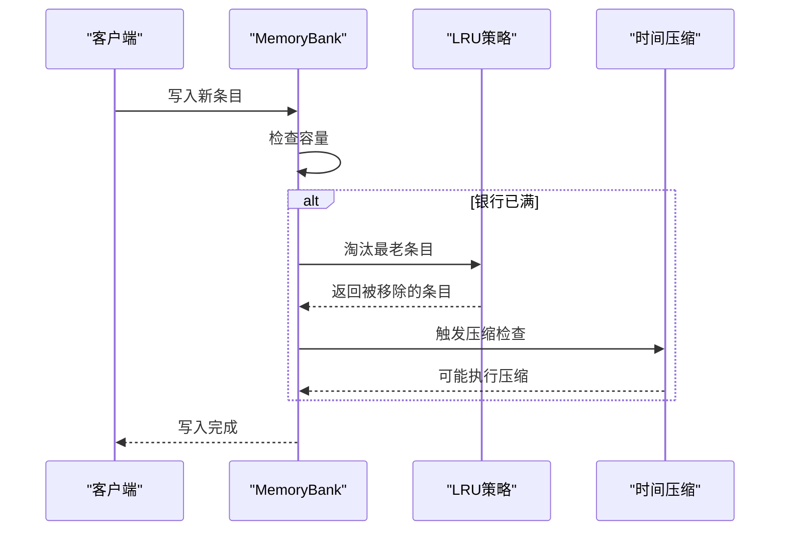
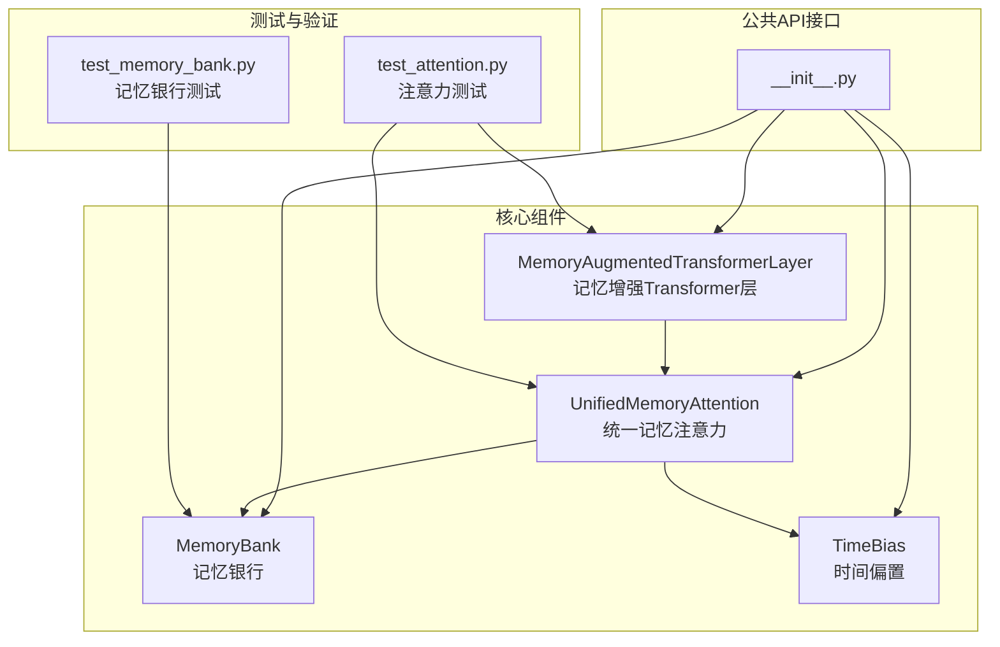
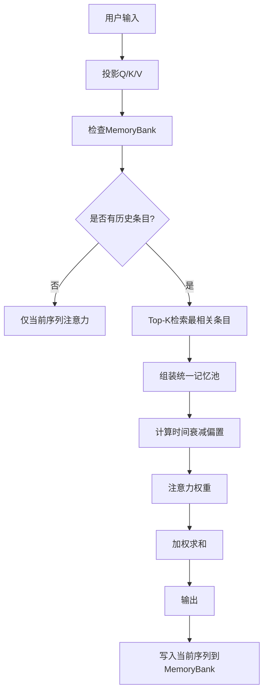

# 设计理念与架构决策

<cite>
**本文档引用的文件**
- [README.md](file://README.md)
- [memory_bank.py](file://src/memory_augmented_attention/memory_bank.py)
- [attention.py](file://src/memory_augmented_attention/attention.py)
- [model.py](file://src/memory_augmented_attention/model.py)
- [__init__.py](file://src/memory_augmented_attention/__init__.py)
- [test_memory_bank.py](file://tests/test_memory_bank.py)
- [test_attention.py](file://tests/test_attention.py)
- [demo_arithmetic.py](file://demo_arithmetic.py)
- [train_arithmetic.py](file://train_arithmetic.py)
- [pyproject.toml](file://pyproject.toml)
</cite>

## 目录
1. [引言](#引言)
2. [统一记忆架构的核心理念](#统一记忆架构的核心理念)
3. [时间戳记忆库的设计原理](#时间戳记忆库的设计原理)
4. [设计权衡与架构决策](#设计权衡与架构决策)
5. [技术选型分析](#技术选型分析)
6. [模块化设计优势](#模块化设计优势)
7. [内存管理策略](#内存管理策略)
8. [性能考量](#性能考量)
9. [故障排除指南](#故障排除指南)
10. [结论](#结论)

## 引言

Memory-Augmented Attention (MAA) 是一个创新的注意力机制设计，它将当前序列令牌和历史KV缓存统一视为具有时间戳的记忆库。这一设计理念突破了传统Transformer的局限性，为模型提供了真正的持久状态和上下文记忆能力。

该项目的核心价值在于证明了"序列令牌本身就是短期记忆"这一洞察，通过统一的抽象将传统的两个分离的记忆池合并为一个共享的时间维度记忆库。

## 统一记忆架构的核心理念

### 序列令牌即记忆

传统记忆增强Transformer将序列令牌和历史记忆视为两个不同的类别：

```
Attention(Q, [K_seq ; K_memory], [V_seq ; V_memory])   # 两个独立的池
```

而MAA的设计理念是：**每个令牌——无论是来自当前输入还是过去交互——都只是在特定时间点存储的(K, V, Q, 时间戳)元组**。

```mermaid
graph TB
subgraph "传统方法"
A[K_seq] --> C[Attention]
B[V_seq] --> C
D[K_memory] --> C
E[V_memory] --> C
C --> F[y_t]
end
subgraph "MAA统一方法"
G[(K_seq, V_seq, Q_seq, t_seq)] --> H[Unified Memory Pool]
I[(K_memory, V_memory, Q_memory, t_memory)] --> H
H --> J[TimeBias(t_t, t_all)]
J --> K[y_t]
end
```

**图表来源**
- [attention.py:96-118](file://src/memory_augmented_attention/attention.py#L96-L118)
- [memory_bank.py:43-61](file://src/memory_augmented_attention/memory_bank.py#L43-L61)

### 时间维度的重要性

添加时间戳`t`到每个记忆条目使模型能够：

1. **偏好近期上下文** —— 通过时间衰减偏置
2. **理解事件顺序** —— 模型可以学习`t_i < t_j`意味着事件i发生在事件j之前
3. **实现遗忘机制** —— 旧的、不太相关的条目在没有显式删除的情况下被折扣

**章节来源**
- [README.md:54-64](file://README.md#L54-L64)

## 时间戳记忆库的设计原理

### 核心公式

MAA的统一记忆注意力公式为：

```
M_all = M_memory ∪ { (K_seq, V_seq, Q_seq, t_seq) }
y_t = softmax( (Q_t · K_all^T) / sqrt(d_k) + TimeBias(t_t, t_all) ) · V_all
```

其中时间衰减偏置定义为：
```
TimeBias(t_q, t_k) = -α * log(1 + |t_q - t_k|)
```

### 时间衰减偏置的数学特性

时间衰减偏置采用对数形式，这与人类记忆中的幂律遗忘曲线相匹配：最近的条目受到温和惩罚，而非常遥远的条目受到更严厉的惩罚，但随着滞后量增大，相对差距会收缩。

```mermaid
flowchart TD
A[时间差 Δt] --> B[计算 |t_q - t_k|]
B --> C[加1后取对数]
C --> D[乘以学习参数 α]
D --> E[取负值作为偏置]
E --> F[softmax前的注意力权重]
```

**图表来源**
- [attention.py:73-93](file://src/memory_augmented_attention/attention.py#L73-L93)

**章节来源**
- [README.md:96-116](file://README.md#L96-L116)
- [attention.py:40-94](file://src/memory_augmented_attention/attention.py#L40-L94)

## 设计权衡与架构决策

### 内存效率 vs 计算复杂度平衡

MAA面临的核心挑战是在内存效率和计算复杂度之间找到平衡点。当M（历史条目数量）增长时，朴素注意力的复杂度会爆炸性增长到O((L + M)² · d)。

为了解决这个问题，MAA采用了三种互补的策略：

| 策略 | 复杂度 | 说明 |
|------|--------|------|
| **Top-K检索** | O(L · K · d) | 只有K个最相关的条目参与注意力；K是固定超参数（例如32-128） |
| **时间压缩** | O(L · d) | 定期将旧条目合并为摘要向量；调用`bank.compress_by_time(keep_newest)` |
| **LRU淘汰** | O(1) | 当银行满时，自动淘汰最老的条目 |

### 推荐使用场景

```
最近令牌 (< N步)  → 完整注意力
较旧令牌       → 仅Top-K检索
归档          → 压缩的摘要嵌入
```

### 实时性 vs 准确性的取舍

MAA通过以下机制在实时性和准确性之间进行权衡：

1. **分层检索策略**：最近的令牌使用完整注意力以确保准确性，而历史条目使用Top-K限制以保证实时性
2. **重要性过滤**：通过重要性阈值防止低信息令牌污染记忆库
3. **渐进式压缩**：定期压缩旧条目，平衡内存占用和信息保留

**章节来源**
- [README.md:151-169](file://README.md#L151-L169)
- [memory_bank.py:18-21](file://src/memory_augmented_attention/memory_bank.py#L18-L21)

## 技术选型分析

### 为什么选择固定容量的LRU淘汰策略

MAA选择了固定容量的LRU（最近最少使用）淘汰策略而非动态调整，主要基于以下考虑：

#### 简单性和确定性
- **固定容量**：提供明确的内存边界，便于资源规划和OOM防护
- **LRU规则**：基于访问频率的简单启发式，无需复杂的在线学习算法
- **确定性行为**：每次都会淘汰最老的条目，避免不可预测的行为

#### 性能优势
- **O(1)复杂度**：淘汰操作的时间复杂度为常数级
- **避免昂贵的重新计算**：不需要为每个新条目重新评估整个集合的价值
- **稳定的延迟**：不会因为复杂的决策过程而产生不可预测的延迟

#### 与项目目标的一致性
- **渐进式压缩**：结合时间压缩策略，可以在不牺牲准确性的情况下控制内存使用
- **Top-K检索**：通过限制参与注意力的条目数量，进一步平衡性能和准确性



**图表来源**
- [memory_bank.py:114-126](file://src/memory_augmented_attention/memory_bank.py#L114-L126)
- [memory_bank.py:263-273](file://src/memory_augmented_attention/memory_bank.py#L263-L273)

### 时间偏置的学习参数设计

TimeBias类采用`log_alpha`参数而不是直接的`alpha`，这是为了数值稳定性考虑：

- **数值稳定**：使用`log_alpha`避免`alpha=0`时的数值问题
- **梯度友好**：对数空间中的参数更新更加稳定
- **零衰减处理**：当`alpha=0`时，存储为`log(ε)`并夹断为零，确保偏置恒为零

**章节来源**
- [attention.py:60-72](file://src/memory_augmented_attention/attention.py#L60-L72)

## 模块化设计优势

### 清晰的职责分离

MAA采用了高度模块化的架构设计，每个组件都有明确的职责：



**图表来源**
- [__init__.py:18-27](file://src/memory_augmented_attention/__init__.py#L18-L27)
- [memory_bank.py:43-61](file://src/memory_augmented_attention/memory_bank.py#L43-L61)
- [attention.py:101-133](file://src/memory_augmented_attention/attention.py#L101-L133)
- [model.py:27-53](file://src/memory_augmented_attention/model.py#L27-L53)

### 可维护性的实现

#### 明确的接口契约
每个模块都提供了清晰的接口文档，包括：
- **参数类型和范围**：严格的输入验证
- **返回值规范**：一致的数据结构
- **错误处理**：明确的异常类型和消息

#### 独立的单元测试
每个核心组件都有对应的单元测试，确保：
- **功能正确性**：核心算法按预期工作
- **边界条件**：处理各种边界情况
- **性能特征**：满足性能要求

**章节来源**
- [memory_bank.py:63-76](file://src/memory_augmented_attention/memory_bank.py#L63-L76)
- [attention.py:135-147](file://src/memory_augmented_attention/attention.py#L135-L147)
- [model.py:55-63](file://src/memory_augmented_attention/model.py#L55-L63)

## 内存管理策略

### 多层次内存保护机制

MAA实现了多层次的内存保护机制，确保系统在各种使用场景下的稳定性：

| 机制 | 配置 | 行为 |
|------|------|------|
| **物理防护栏** | `max_size` | 防止OOM；满载时触发LRU淘汰 |
| **重要性过滤器** | `importance_threshold` | 写入时丢弃`||V||₂ < 阈值`的条目 |
| **验证标签** | `verdict`（每个条目） | `+1.0`=确认正确，`-1.0`=错误，`0.0`=未验证 |
| **时间压缩** | `compress_by_time(keep_newest)` | 在推理步骤间积极修剪银行 |
| **Top-K检索** | `top_k`在注意力层 | 将注意力池限制为K个最相关的条目 |
| **LRU回退** | （自动） | 当整合落后时仅淘汰最老条目 |

### 记忆类型与维度权重

不同类型的记忆对不同维度敏感：

| 记忆类型 | 示例 | 主导维度 | 理由 |
|----------|------|----------|------|
| **情景记忆** | "用户昨天说喜欢蓝色" | 时间 + 频率 | 旧信息会衰减；经常使用的知识会持久 |
| **语义记忆** | "1+1=2" | 验证 + 来源 | 正确性不随时间变化 |
| **程序记忆** | "如何骑自行车" | 频率 | 练习造就完美 |

### 实际应用示例



**图表来源**
- [attention.py:241-321](file://src/memory_augmented_attention/attention.py#L241-L321)

**章节来源**
- [README.md:274-294](file://README.md#L274-L294)
- [memory_bank.py:263-273](file://src/memory_augmented_attention/memory_bank.py#L263-L273)

## 性能考量

### 复杂度分析

MAA通过多种策略控制复杂度：

#### 标准注意力复杂度
- **朴素实现**：O((L + M)² · d)，其中L是当前序列长度，M是历史条目数
- **MAA实现**：通过Top-K检索将复杂度降低到O(L · K · d)

#### 内存使用优化
- **固定容量**：通过`max_size`参数控制最大内存占用
- **重要性过滤**：避免存储低价值条目
- **时间压缩**：定期减少存储需求

### 超参数调优建议

| 参数 | 推荐范围 | 效果 |
|------|----------|------|
| `top_k` | 32 - 128 | 更大→更丰富的上下文，更高计算成本 |
| `init_alpha` | 0.5 - 2.0 | 更大→更强的时间衰减 |
| `max_size` | 1024 - 16384 | RAM中最大历史条目数 |
| `importance_threshold` | 0.0 - 0.5 | 更高→只存储显著令牌 |

## 故障排除指南

### 常见问题诊断

#### 内存相关问题
- **OOM错误**：检查`max_size`设置是否过小
- **内存泄漏**：确认`compress_by_time`定期调用
- **性能下降**：检查`top_k`设置是否过大

#### 功能相关问题
- **注意力权重异常**：检查`TimeBias`参数初始化
- **记忆丢失**：确认`write_to_memory`标志设置正确
- **序列错位**：检查`current_step`和时间戳管理

### 调试技巧

#### 单元测试验证
通过运行测试套件验证各组件功能：
```bash
pytest tests/ -v
```

#### 关键测试覆盖
- **MemoryBank**：容量管理、LRU淘汰、Top-K检索
- **UnifiedMemoryAttention**：注意力计算、时间衰减、因果掩码
- **MemoryAugmentedTransformerLayer**：完整层功能、残差连接

**章节来源**
- [test_memory_bank.py:26-41](file://tests/test_memory_bank.py#L26-L41)
- [test_attention.py:17-59](file://tests/test_attention.py#L17-L59)

## 结论

Memory-Augmented Attention的设计理念体现了深度的架构思考和技术权衡。通过将当前序列令牌和历史KV缓存统一为具有时间戳的记忆库，MAA不仅解决了传统Transformer的状态缺失问题，还为未来的多维动态权重扩展奠定了基础。

### 核心设计优势

1. **概念简洁性**：统一抽象简化了架构复杂度
2. **性能可控性**：多层内存管理策略确保可预测的性能
3. **可扩展性**：模块化设计支持未来功能扩展
4. **实用性**：经过实证验证的有效性

### 未来发展方向

MAA项目规划了多个发展方向，包括：
- 多维动态权重扩展
- 记忆类型系统
- 可学习的整合机制
- 分层记忆架构

这些发展将继续推动记忆增强注意力机制向更智能、更高效的方向演进。