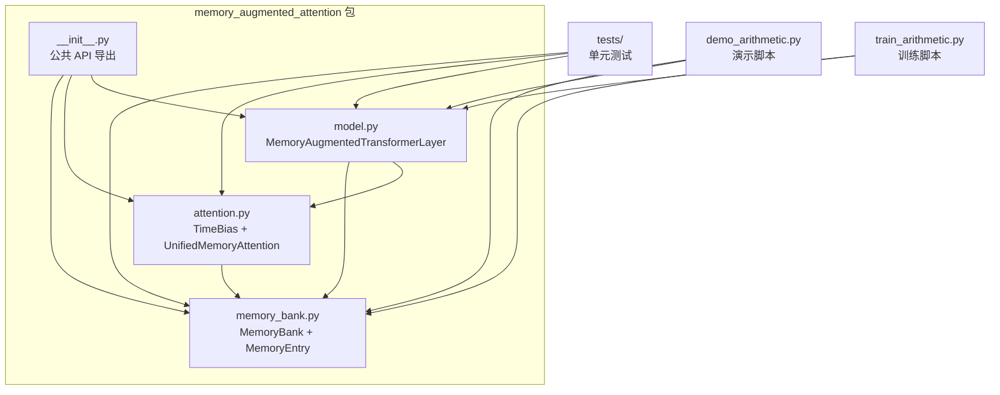
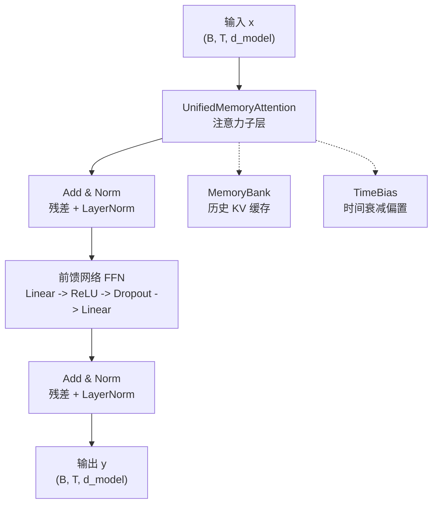
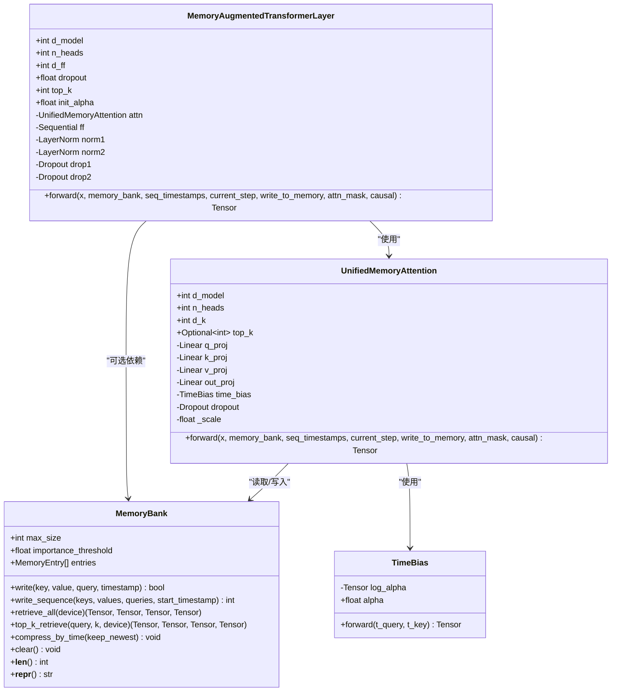
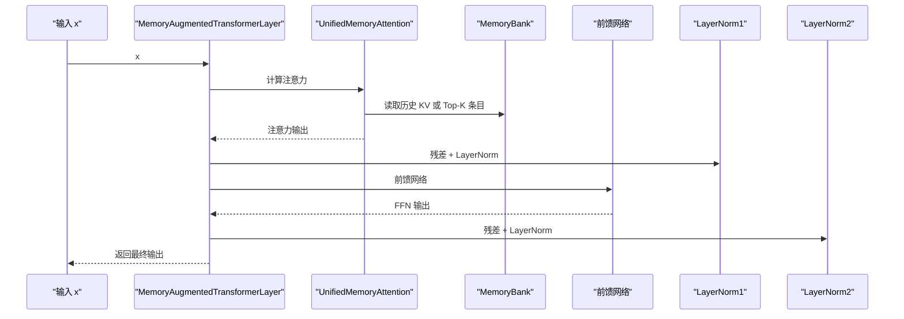
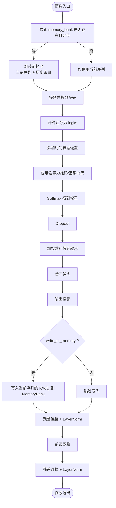
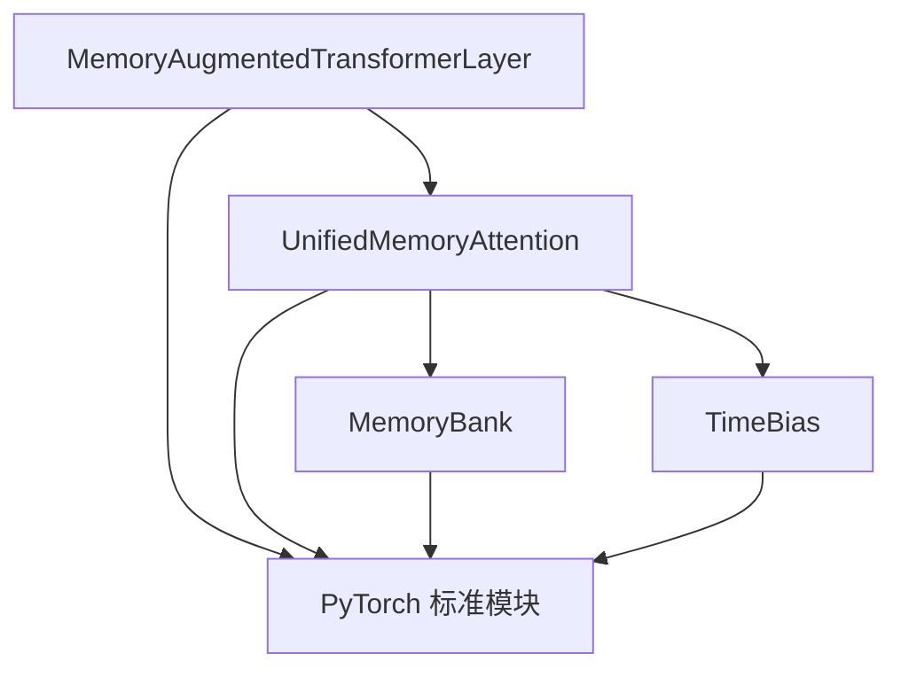

# MemoryAugmentedTransformerLayer API 参考文档

<cite>
**本文档引用的文件**
- [model.py](file://src/memory_augmented_attention/model.py)
- [attention.py](file://src/memory_augmented_attention/attention.py)
- [memory_bank.py](file://src/memory_augmented_attention/memory_bank.py)
- [__init__.py](file://src/memory_augmented_attention/__init__.py)
- [README.md](file://README.md)
- [test_attention.py](file://tests/test_attention.py)
- [test_memory_bank.py](file://tests/test_memory_bank.py)
- [train_arithmetic.py](file://train_arithmetic.py)
- [demo_arithmetic.py](file://demo_arithmetic.py)
</cite>

## 目录
1. [简介](#简介)
2. [项目结构](#项目结构)
3. [核心组件](#核心组件)
4. [架构概览](#架构概览)
5. [详细组件分析](#详细组件分析)
6. [依赖关系分析](#依赖关系分析)
7. [性能考虑](#性能考虑)
8. [故障排除指南](#故障排除指南)
9. [结论](#结论)
10. [附录：最佳实践与集成示例](#附录最佳实践与集成示例)

## 简介
MemoryAugmentedTransformerLayer 是一个完整的编码器层实现，它将统一的记忆增强注意力（Unified Memory-Augmented Attention）与标准 Transformer 的前馈网络（FFN）相结合，形成“注意力 + 残差连接 + 层归一化 + 前馈网络 + 残差连接 + 层归一化”的堆叠结构。该层的核心创新在于引入了共享的 MemoryBank 实例，使得多个连续的前向传递能够累积历史上下文，从而在推理阶段实现“持久记忆”。

与标准 Transformer 层相比，MemoryAugmentedTransformerLayer 的主要区别和优势包括：
- 统一的记忆池：当前序列（短期记忆）与历史 KV 缓存（长期记忆）被统一存储在一个时间戳化的 MemoryBank 中，注意力计算覆盖整个记忆池。
- 时间衰减偏置：通过 TimeBias 模块对时间距离进行可学习的对数衰减惩罚，模拟人类记忆的幂律遗忘曲线，使近期信息更受重视。
- 可选的 Top-K 检索：通过 top_k 参数限制每次前向传递中参与注意力计算的历史条目数量，平衡上下文丰富度与计算复杂度。
- 写入机制：在每次前向传递后，当前序列的投影（K、V、Q）会被写入 MemoryBank，供后续调用使用，形成“写入-检索”的循环。

本 API 文档将详细介绍 MemoryAugmentedTransformerLayer 的参数、前向传播流程、梯度流动、内存使用策略，并提供与其他组件的集成示例与最佳实践。

## 项目结构
该项目采用模块化设计，核心代码位于 src/memory_augmented_attention 包中，包含以下关键模块：
- model.py：定义 MemoryAugmentedTransformerLayer 类及其前向传播逻辑。
- attention.py：定义 TimeBias 和 UnifiedMemoryAttention，以及注意力计算与时间衰减偏置。
- memory_bank.py：定义 MemoryBank 和 MemoryEntry，负责记忆条目的存储、检索与管理。
- __init__.py：导出公共 API，便于外部导入。
- README.md：项目说明、API 参考与使用示例。
- tests/：单元测试，验证 MemoryBank、TimeBias、UnifiedMemoryAttention 和 MemoryAugmentedTransformerLayer 的行为。
- demo_arithmetic.py 与 train_arithmetic.py：演示与训练脚本，展示如何在实际任务中使用 MemoryAugmentedTransformerLayer。

**图表来源**
- [__init__.py:18-27](file://src/memory_augmented_attention/__init__.py#L18-L27)
- [model.py:27-134](file://src/memory_augmented_attention/model.py#L27-L134)
- [attention.py:101-322](file://src/memory_augmented_attention/attention.py#L101-L322)
- [memory_bank.py:43-284](file://src/memory_augmented_attention/memory_bank.py#L43-L284)

**章节来源**
- [__init__.py:10-27](file://src/memory_augmented_attention/__init__.py#L10-L27)
- [README.md:374-393](file://README.md#L374-L393)

## 核心组件
本节将深入解析 MemoryAugmentedTransformerLayer 的内部结构与实现细节，包括其与 UnifiedMemoryAttention、MemoryBank 的协作关系。

- MemoryAugmentedTransformerLayer
  - 功能：实现标准 Transformer 编码器层的注意力子层与前馈子层，但使用 MemoryAugmentedAttention 替代标准自注意力。
  - 关键属性：
    - attn：UnifiedMemoryAttention 实例，负责计算注意力。
    - ff：前馈网络，由两个线性层与 ReLU 激活组成，中间包含 Dropout。
    - norm1/norm2：两组 LayerNorm，分别用于注意力子层与前馈子层后的残差连接。
    - drop1/drop2：两组 Dropout，分别应用于注意力输出与前馈输出。
  - 关键方法：
    - forward(x, memory_bank, seq_timestamps, current_step, write_to_memory, attn_mask, causal)：执行前向传播，返回形状为 (B, T, d_model) 的张量。

- UnifiedMemoryAttention
  - 功能：在统一的记忆池上执行多头注意力，记忆池包含当前序列与 MemoryBank 中的历史条目。
  - 关键特性：
    - 支持 top_k 限制以减少计算开销。
    - 使用 TimeBias 对时间距离施加可学习的对数衰减惩罚。
    - 可选择应用因果掩码，仅允许当前序列内的自回归约束。
    - 在前向传播结束后，将当前序列的投影写入 MemoryBank（当 write_to_memory 为 True 时）。

- MemoryBank
  - 功能：存储时间戳化的 (K, V, Q, timestamp) 条目，支持全量检索与 Top-K 检索，具备重要性过滤与 LRU 淘汰策略。
  - 关键方法：
    - write/write_sequence：写入单个或批量条目。
    - retrieve_all/top_k_retrieve：检索所有或 Top-K 条目。
    - compress_by_time/clear：压缩与清理操作。
    - __len__/__repr__：长度查询与字符串表示。

- TimeBias
  - 功能：对注意力 logits 添加时间衰减偏置，形式为 -alpha * log(1 + |t_query - t_key|)，其中 alpha 为可学习标量。
  - 关键特性：
    - alpha 初始化为正数时，采用 log_alpha 参数化；alpha=0 时退化为标准注意力。
    - 输出为负值，对时间距离较远的条目施加惩罚。

**章节来源**
- [model.py:27-134](file://src/memory_augmented_attention/model.py#L27-L134)
- [attention.py:101-322](file://src/memory_augmented_attention/attention.py#L101-L322)
- [memory_bank.py:43-284](file://src/memory_augmented_attention/memory_bank.py#L43-L284)
- [attention.py:40-94](file://src/memory_augmented_attention/attention.py#L40-L94)

## 架构概览
MemoryAugmentedTransformerLayer 的整体架构遵循标准 Transformer 编码器层的残差连接与层归一化模式，但注意力子层替换为 MemoryAugmentedAttention，使其能够访问统一的记忆池。

**图表来源**
- [model.py:87-134](file://src/memory_augmented_attention/model.py#L87-L134)
- [attention.py:181-322](file://src/memory_augmented_attention/attention.py#L181-L322)
- [memory_bank.py:43-284](file://src/memory_augmented_attention/memory_bank.py#L43-L284)

## 详细组件分析

### MemoryAugmentedTransformerLayer 类图

**图表来源**
- [model.py:27-134](file://src/memory_augmented_attention/model.py#L27-L134)
- [attention.py:101-322](file://src/memory_augmented_attention/attention.py#L101-L322)
- [memory_bank.py:43-284](file://src/memory_augmented_attention/memory_bank.py#L43-L284)
- [attention.py:40-94](file://src/memory_augmented_attention/attention.py#L40-L94)

### 前向传播序列图

**图表来源**
- [model.py:87-134](file://src/memory_augmented_attention/model.py#L87-L134)
- [attention.py:181-322](file://src/memory_augmented_attention/attention.py#L181-L322)
- [memory_bank.py:169-253](file://src/memory_augmented_attention/memory_bank.py#L169-L253)

### 前向传播流程图

**图表来源**
- [attention.py:181-322](file://src/memory_augmented_attention/attention.py#L181-L322)
- [model.py:87-134](file://src/memory_augmented_attention/model.py#L87-L134)

### 超参数与配置详解
- d_model：模型维度，必须能被 n_heads 整除。
- n_heads：注意力头数，决定每个头的维度 d_k = d_model / n_heads。
- d_ff：前馈网络隐藏维度，默认为 4 * d_model。
- dropout：注意力与子层之间的 Dropout 概率。
- top_k：统一记忆注意力中限制参与注意力的历史条目数量，None 表示使用全部条目。
- init_alpha：TimeBias 的初始衰减系数，alpha=0 时退化为标准注意力。
- memory_bank：MemoryBank 实例，用于跨前向传递累积历史上下文。
- seq_timestamps：当前序列的时间戳张量，形状为 (T,)，默认使用 current_step 推导。
- current_step：当前序列第一个 token 的全局步长，用于时间戳与写入 MemoryBank。
- write_to_memory：是否将当前序列的投影写入 MemoryBank。
- attn_mask：注意力掩码，形状为 (T, T_all) 或 (B, H, T, T_all)。
- causal：是否应用因果掩码，仅对当前序列内部施加下三角掩码。

**章节来源**
- [model.py:37-63](file://src/memory_augmented_attention/model.py#L37-L63)
- [model.py:96-118](file://src/memory_augmented_attention/model.py#L96-L118)
- [attention.py:119-142](file://src/memory_augmented_attention/attention.py#L119-L142)
- [attention.py:191-226](file://src/memory_augmented_attention/attention.py#L191-L226)

### 与标准 Transformer 层的区别与优势
- 记忆池统一：标准 Transformer 仅在当前窗口内进行注意力计算，而 MemoryAugmentedTransformerLayer 将当前序列与历史 KV 统一纳入记忆池，实现“持久记忆”。
- 时间衰减：通过 TimeBias 对时间距离施加可学习的对数衰减，模拟人类记忆的幂律遗忘，使近期信息更受重视。
- 可扩展性：通过 top_k 限制参与注意力的历史条目数量，结合 MemoryBank 的 LRU 淘汰与重要性过滤，实现可控的复杂度增长。
- 写入-检索循环：每次前向传递后将当前序列的投影写入 MemoryBank，形成“写入-检索”的闭环，支持跨步长的上下文累积。

**章节来源**
- [README.md:14-116](file://README.md#L14-L116)
- [attention.py:40-94](file://src/memory_augmented_attention/attention.py#L40-L94)

### MemoryBank 集成方式
- 共享实例：在模型初始化时创建 MemoryBank，并将其作为参数传入 MemoryAugmentedTransformerLayer 的 forward 调用。
- 写入策略：write_to_memory 控制是否将当前序列的投影写入 MemoryBank；通常在训练或演示阶段启用，推理阶段可按需关闭。
- 时间戳管理：current_step 与 seq_timestamps 协同工作，确保 MemoryBank 中条目的时间顺序正确。
- 清理与压缩：可通过 compress_by_time 与 clear 方法控制 MemoryBank 的大小与内容，避免内存爆炸。

**章节来源**
- [model.py:96-118](file://src/memory_augmented_attention/model.py#L96-L118)
- [attention.py:181-322](file://src/memory_augmented_attention/attention.py#L181-L322)
- [memory_bank.py:169-253](file://src/memory_augmented_attention/memory_bank.py#L169-L253)

### 梯度流动与内存使用分析
- 梯度流动：MemoryAugmentedTransformerLayer 的前向传播包含注意力、前馈网络与层归一化三个子层，均支持反向传播。测试用例验证了梯度能够正常流经各子层。
- 内存使用：MemoryBank 的最大容量由 max_size 控制，超出时触发 LRU 淘汰；重要性阈值 importance_threshold 可过滤低信息条目；Top-K 检索进一步限制每次注意力计算的条目数量，从而控制显存占用。
- 复杂度：标准注意力对全历史条目计算为 O((L + M)² · d)，通过 Top-K 检索降至 O(L · K · d)，结合压缩策略可实现近似线性增长。

**章节来源**
- [test_attention.py:21-231](file://tests/test_attention.py#L21-L231)
- [memory_bank.py:63-76](file://src/memory_augmented_attention/memory_bank.py#L63-L76)
- [README.md:151-169](file://README.md#L151-L169)

## 依赖关系分析
MemoryAugmentedTransformerLayer 与其它组件的依赖关系如下：
- 依赖 UnifiedMemoryAttention：注意力子层的核心实现。
- 依赖 MemoryBank：可选的历史 KV 存储与检索。
- 依赖 TimeBias：时间衰减偏置模块。
- 依赖标准 PyTorch 模块：nn.Linear、nn.Sequential、nn.LayerNorm、nn.Dropout、F.softmax 等。

**图表来源**
- [model.py:23-24](file://src/memory_augmented_attention/model.py#L23-L24)
- [attention.py:32](file://src/memory_augmented_attention/attention.py#L32)
- [memory_bank.py:28-30](file://src/memory_augmented_attention/memory_bank.py#L28-L30)

**章节来源**
- [model.py:23-24](file://src/memory_augmented_attention/model.py#L23-L24)
- [attention.py:32](file://src/memory_augmented_attention/attention.py#L32)
- [memory_bank.py:28-30](file://src/memory_augmented_attention/memory_bank.py#L28-L30)

## 性能考虑
- 复杂度控制：优先使用 top_k 限制参与注意力的历史条目数量；定期调用 compress_by_time 进行压缩；设置合适的 importance_threshold 过滤低信息条目。
- 显存优化：在推理阶段可关闭 write_to_memory 以减少写入开销；合理设置 MemoryBank 的 max_size 与 importance_threshold。
- 训练稳定性：适当调整 init_alpha 与 dropout，确保模型在记忆增强的同时保持稳定收敛。

[本节提供一般性指导，无需特定文件来源]

## 故障排除指南
- d_model 必须能被 n_heads 整除：若不满足，构造 UnifiedMemoryAttention 会抛出异常。
- MemoryBank 为空时检索：retrieve_all 与 top_k_retrieve 在空库时会抛出运行时错误，需确保先写入条目。
- 重要性过滤：当 importance_threshold > 0 时，低信息条目会被拒绝写入，导致 MemoryBank 不增长。
- 梯度问题：若发现梯度不流动，检查 requires_grad 设置与前向传播路径，确保所有可训练参数均可被反向传播。

**章节来源**
- [attention.py:144-147](file://src/memory_augmented_attention/attention.py#L144-L147)
- [memory_bank.py:186-201](file://src/memory_augmented_attention/memory_bank.py#L186-L201)
- [memory_bank.py:228-253](file://src/memory_augmented_attention/memory_bank.py#L228-L253)
- [test_attention.py:89-94](file://tests/test_attention.py#L89-L94)

## 结论
MemoryAugmentedTransformerLayer 提供了一种将“短期记忆（当前序列）”与“长期记忆（历史 KV 缓存）”统一建模的注意力机制，通过 TimeBias 实现时间衰减，通过 MemoryBank 实现持久存储与检索，并通过 top_k 与重要性过滤控制复杂度与内存使用。该层在保持标准 Transformer 层残差与层归一化结构的同时，显著增强了模型的上下文累积能力与泛化潜力，适用于需要长期依赖与持续交互的任务场景。

[本节为总结性内容，无需特定文件来源]

## 附录：最佳实践与集成示例

### 最佳实践
- 训练阶段：启用 write_to_memory，以便模型从演示中学习并积累经验；定期调用 compress_by_time 进行压缩。
- 推理阶段：根据任务需求决定是否启用 write_to_memory；对于对话系统，建议启用以维持上下文连贯性。
- 超参数调优：top_k 通常设置在 32–128 之间；init_alpha 设置在 0.5–2.0 之间；importance_threshold 根据数据分布调整。
- 内存管理：合理设置 MemoryBank 的 max_size，避免 OOM；在长时间推理中定期清理或压缩。

**章节来源**
- [README.md:331-339](file://README.md#L331-L339)
- [README.md:274-284](file://README.md#L274-L284)

### 集成示例
- 基础使用：参考 README 中的快速开始示例，创建 MemoryAugmentedTransformerLayer 与 MemoryBank，并在循环中调用 forward。
- 训练脚本：ArithmeticMAA 模型展示了如何在字符级因果 Transformer 中集成 MemoryAugmentedTransformerLayer，逐层堆叠并在每层中使用 MemoryBank。
- 演示脚本：demo_arithmetic.py 展示了如何在推理阶段使用 MemoryBank，先进行“预热”写入演示，再单独查询以验证统一记忆的效果。

**章节来源**
- [README.md:183-212](file://README.md#L183-L212)
- [train_arithmetic.py:209-251](file://train_arithmetic.py#L209-L251)
- [demo_arithmetic.py:167-183](file://demo_arithmetic.py#L167-L183)