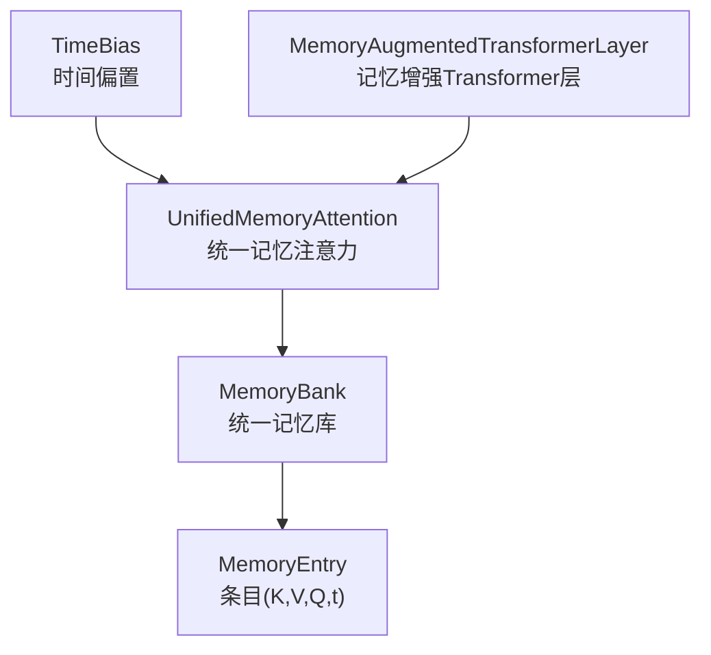
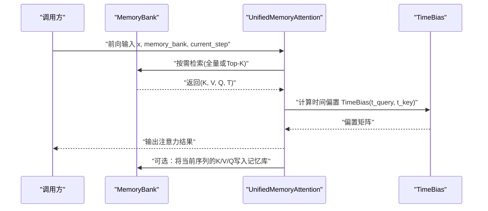
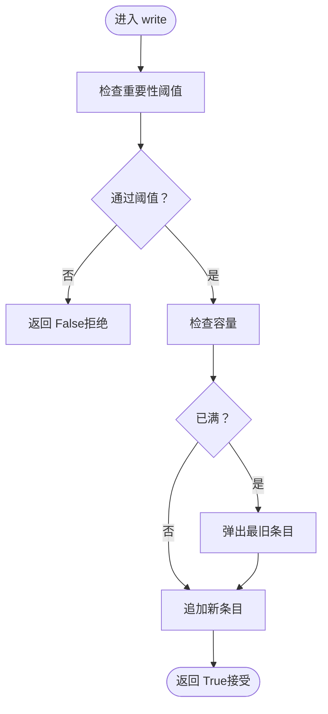
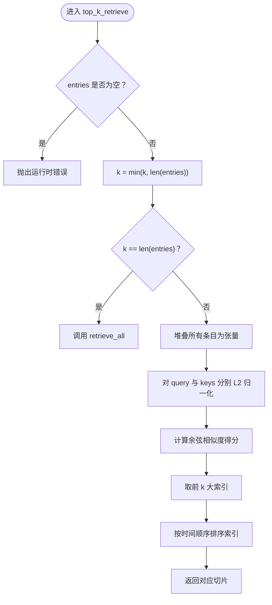
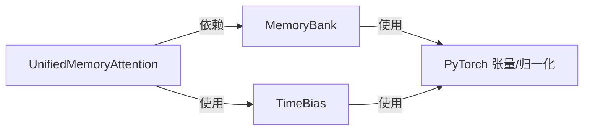

# MemoryBank API

<cite>
**本文引用的文件**
- [memory_bank.py](file://src/memory_augmented_attention/memory_bank.py)
- [test_memory_bank.py](file://tests/test_memory_bank.py)
- [README.md](file://README.md)
- [attention.py](file://src/memory_augmented_attention/attention.py)
- [__init__.py](file://src/memory_augmented_attention/__init__.py)
</cite>

## 目录
1. [简介](#简介)
2. [项目结构](#项目结构)
3. [核心组件](#核心组件)
4. [架构总览](#架构总览)
5. [详细组件分析](#详细组件分析)
6. [依赖关系分析](#依赖关系分析)
7. [性能与内存管理](#性能与内存管理)
8. [故障排查指南](#故障排查指南)
9. [结论](#结论)
10. [附录：参数与使用示例](#附录参数与使用示例)

## 简介
MemoryBank 是统一记忆库的核心数据结构，用于存储带时间戳的键-值-查询三元组（K, V, Q），既可作为当前序列的短期记忆，也可作为历史 KV 对的长期记忆。它支持单条写入、批量写入、全量检索与 Top-K 检索，并提供基于时间的压缩与清空等维护能力。其设计遵循 LRU（最近最少使用）淘汰策略：当容量达到上限时，最旧的条目会被自动移除；同时通过重要性阈值过滤低信息量条目，避免污染。

本参考文档面向开发者与研究者，系统阐述 MemoryBank 的数据结构、方法签名、行为特性、性能考量与最佳实践，并给出常见问题的排查建议。

## 项目结构
- 核心模块
  - memory_bank.py：定义 MemoryEntry 数据结构与 MemoryBank 类
  - attention.py：包含 TimeBias 与 UnifiedMemoryAttention，后者在前向中调用 MemoryBank
  - model.py：MemoryAugmentedTransformerLayer，封装注意力与前馈网络
- 测试
  - test_memory_bank.py：覆盖构造、写入、检索、压缩与清理等行为
- 文档
  - README.md：整体设计、公式、复杂度与使用示例

图表来源
- [memory_bank.py:33-41](file://src/memory_augmented_attention/memory_bank.py#L33-L41)
- [memory_bank.py:43-284](file://src/memory_augmented_attention/memory_bank.py#L43-L284)
- [attention.py:40-94](file://src/memory_augmented_attention/attention.py#L40-L94)
- [attention.py:101-200](file://src/memory_augmented_attention/attention.py#L101-L200)

章节来源
- [__init__.py:10-27](file://src/memory_augmented_attention/__init__.py#L10-L27)
- [README.md:374-393](file://README.md#L374-L393)

## 核心组件
- MemoryEntry：单个记忆槽位，包含键张量、值张量、查询张量与全局步长时间戳。
- MemoryBank：统一记忆库，支持写入、批量写入、全量检索、Top-K 检索、按时间压缩、清空与长度统计。

章节来源
- [memory_bank.py:33-41](file://src/memory_augmented_attention/memory_bank.py#L33-L41)
- [memory_bank.py:43-77](file://src/memory_augmented_attention/memory_bank.py#L43-L77)

## 架构总览
MemoryBank 与注意力模块协同工作：
- MemoryBank 负责持久化与检索
- UnifiedMemoryAttention 在前向计算中根据是否启用 top_k 决定对全库或 Top-K 进行注意力
- TimeBias 提供时间衰减偏置，使远期记忆权重下降

图表来源
- [attention.py:181-200](file://src/memory_augmented_attention/attention.py#L181-L200)
- [memory_bank.py:169-201](file://src/memory_augmented_attention/memory_bank.py#L169-L201)
- [memory_bank.py:203-253](file://src/memory_augmented_attention/memory_bank.py#L203-L253)
- [attention.py:73-93](file://src/memory_augmented_attention/attention.py#L73-L93)

## 详细组件分析

### MemoryEntry 数据结构
- 字段
  - key：形状为 (head, d_k)，表示该条目的键向量
  - value：形状为 (head, d_v)，表示该条目的值向量
  - query：形状为 (head, d_k)，表示该条目的查询向量
  - timestamp：整数，表示该条目写入时的全局步长
- 作用
  - key/value/query 用于注意力计算
  - timestamp 用于时间衰减偏置与 LRU 淘汰顺序

章节来源
- [memory_bank.py:33-41](file://src/memory_augmented_attention/memory_bank.py#L33-L41)

### MemoryBank 类
- 构造参数
  - max_size：最大容量，超过后触发 LRU 淘汰
  - importance_threshold：写入重要性阈值，低于阈值的条目被丢弃
- 属性
  - entries：按时间顺序排列的条目列表（最旧在前）

#### 写入接口
- write(key, value, query, timestamp) -> bool
  - 功能：写入单条记忆
  - 行为：若启用重要性过滤且 value 的 L2 范数小于阈值则拒绝；若已满则弹出最旧条目；追加新条目
  - 返回：是否成功写入
- write_sequence(keys, values, queries, start_timestamp) -> int
  - 功能：批量写入序列，按顺序分配时间戳
  - 返回：下一个可用时间戳

图表来源
- [memory_bank.py:82-126](file://src/memory_augmented_attention/memory_bank.py#L82-L126)

章节来源
- [memory_bank.py:82-163](file://src/memory_augmented_attention/memory_bank.py#L82-L163)

#### 检索接口
- retrieve_all(device=None) -> (keys, values, queries, timestamps)
  - 功能：返回所有条目的堆叠张量
  - 行为：若为空则抛出运行时错误；可选择移动到指定设备
  - 返回：(N, ... , d_k) 的 key、(N, ... , d_v) 的 value、(N, ... , d_k) 的 query、(N,) 的 timestamp
- top_k_retrieve(query, k, device=None) -> (keys, values, queries, timestamps)
  - 功能：按查询与键的余弦相似度返回最相关的 k 条
  - 行为：若为空则抛出运行时错误；k 会裁剪到现有数量；保持时间顺序
  - 返回：与 retrieve_all 相同的结构，但 N 取 min(k, len(entries))

图表来源
- [memory_bank.py:169-201](file://src/memory_augmented_attention/memory_bank.py#L169-L201)
- [memory_bank.py:203-253](file://src/memory_augmented_attention/memory_bank.py#L203-L253)

章节来源
- [memory_bank.py:169-253](file://src/memory_augmented_attention/memory_bank.py#L169-L253)

#### 维护接口
- clear() -> None
  - 功能：清空所有条目
- compress_by_time(keep_newest) -> None
  - 功能：仅保留最新的 keep_newest 条目
- __len__() -> int
  - 功能：返回当前条目数量
- __repr__() -> str
  - 功能：返回人类可读的描述字符串

章节来源
- [memory_bank.py:259-284](file://src/memory_augmented_attention/memory_bank.py#L259-L284)

### LRU 淘汰机制与配置
- 实现原理
  - 使用 list 存储条目，最旧条目位于索引 0，写入时若满则 pop(0) 弹出最旧项
  - 时间戳由调用方递增提供，确保顺序稳定
- 配置选项
  - max_size：物理上限，防止 OOM
  - importance_threshold：写入前的重要性过滤，避免噪声进入
- 建议
  - 合理设置 max_size 以匹配硬件内存预算
  - 结合 compress_by_time 与 top_k_retrieve 控制检索规模

章节来源
- [memory_bank.py:63-76](file://src/memory_augmented_attention/memory_bank.py#L63-L76)
- [memory_bank.py:114-126](file://src/memory_augmented_attention/memory_bank.py#L114-L126)
- [README.md:274-284](file://README.md#L274-L284)

## 依赖关系分析
- MemoryBank 依赖于 PyTorch 张量操作与归一化函数
- UnifiedMemoryAttention 依赖 MemoryBank 进行检索与可选写回
- TimeBias 为注意力提供时间衰减偏置

图表来源
- [memory_bank.py:28-30](file://src/memory_augmented_attention/memory_bank.py#L28-L30)
- [attention.py:24-30](file://src/memory_augmented_attention/attention.py#L24-L30)
- [attention.py:101-160](file://src/memory_augmented_attention/attention.py#L101-L160)

章节来源
- [memory_bank.py:28-30](file://src/memory_augmented_attention/memory_bank.py#L28-L30)
- [attention.py:24-30](file://src/memory_augmented_attention/attention.py#L24-L30)

## 性能与内存管理
- 复杂度与策略
  - 全量注意力：O((L + M)² · d)，其中 L 为当前序列长度，M 为记忆库大小
  - Top-K 检索：O(L · K · d)，K 为固定超参（如 32–128）
  - 时间压缩：O(L · d)，周期性合并旧条目
  - LRU 淘汰：O(1)，满时弹出最旧条目
- 内存管理策略
  - 物理上限 max_size：防止 OOM
  - 重要性过滤 importance_threshold：过滤低信息量条目
  - Top-K 检索：限制注意力池大小
  - 时间压缩 compress_by_time：减少长期占用
  - 清空 clear：重置状态
- 最佳实践
  - 训练阶段：按步长推进时间戳，定期 compress_by_time
  - 推断阶段：持久化 MemoryBank，每次写入当前序列的 K/V/Q
  - 调参建议：top_k 32–128；max_size 1024–16384；importance_threshold 0.0–0.5

章节来源
- [README.md:151-169](file://README.md#L151-L169)
- [README.md:274-284](file://README.md#L274-L284)
- [README.md:331-339](file://README.md#L331-L339)

## 故障排查指南
- 写入被拒绝
  - 检查 importance_threshold 是否过高导致 value 的 L2 范数过小
  - 参考测试：[test_importance_threshold_rejects_small_values:85-93](file://tests/test_memory_bank.py#L85-L93)
- 写入后容量未增长
  - 检查是否已满并触发 LRU 淘汰
  - 参考测试：[test_write_evicts_oldest_when_full:56-69](file://tests/test_memory_bank.py#L56-L69)
- 检索时报空库错误
  - 确保先写入再检索
  - 参考测试：[test_retrieve_all_empty_raises:107-111](file://tests/test_memory_bank.py#L107-L111)
- Top-K 结果数量不足
  - k 被裁剪到现有条目数；确认实际存储数量
  - 参考测试：[test_top_k_retrieve_fewer_than_k:128-137](file://tests/test_memory_bank.py#L128-L137)
- 时间压缩后顺序异常
  - 确认 compress_by_time 的参数与期望保留数量一致
  - 参考测试：[test_compress_by_time:174-182](file://tests/test_memory_bank.py#L174-L182)

章节来源
- [test_memory_bank.py:85-100](file://tests/test_memory_bank.py#L85-L100)
- [test_memory_bank.py:56-69](file://tests/test_memory_bank.py#L56-L69)
- [test_memory_bank.py:107-111](file://tests/test_memory_bank.py#L107-L111)
- [test_memory_bank.py:128-137](file://tests/test_memory_bank.py#L128-L137)
- [test_memory_bank.py:174-182](file://tests/test_memory_bank.py#L174-L182)

## 结论
MemoryBank 通过统一的记忆槽位（K, V, Q, t）与 LRU 淘汰、重要性过滤、Top-K 检索、时间压缩等机制，为记忆增强注意力提供了高效、可控的底层支撑。结合 TimeBias 的时间衰减与注意力模块的联合优化，可在有限内存预算下实现更丰富的上下文利用与更好的泛化表现。

## 附录：参数与使用示例

### 方法与参数说明
- MemoryBank(max_size=1024, importance_threshold=0.0)
  - max_size：最大容量（≥1）
  - importance_threshold：写入重要性阈值（≥0）
- write(key, value, query, timestamp) -> bool
  - key/value/query：形状分别为 (..., d_k), (..., d_v), (..., d_k)
  - timestamp：整数，全局步长
- write_sequence(keys, values, queries, start_timestamp) -> int
  - keys/values/queries：形状分别为 (seq_len, ..., d_k), (seq_len, ..., d_v), (seq_len, ..., d_k)
  - start_timestamp：起始时间戳
- retrieve_all(device=None) -> (keys, values, queries, timestamps)
  - device：可选目标设备
- top_k_retrieve(query, k, device=None) -> (keys, values, queries, timestamps)
  - query：形状为 (d_k) 或 (heads, d_k)
  - k：返回条目数量（≤当前存储数）
- compress_by_time(keep_newest) -> None
  - keep_newest：保留的最新条目数
- clear() -> None
- __len__() -> int
- __repr__() -> str

章节来源
- [memory_bank.py:43-77](file://src/memory_augmented_attention/memory_bank.py#L43-L77)
- [memory_bank.py:82-163](file://src/memory_augmented_attention/memory_bank.py#L82-L163)
- [memory_bank.py:169-253](file://src/memory_augmented_attention/memory_bank.py#L169-L253)
- [memory_bank.py:259-284](file://src/memory_augmented_attention/memory_bank.py#L259-L284)

### 使用示例与最佳实践
- 快速开始
  - 参考：[Quick Start 示例:183-212](file://README.md#L183-L212)
- 训练阶段
  - 参考：[训练示例:297-330](file://README.md#L297-L330)
- 推断阶段
  - 参考：[推理示例:340-353](file://README.md#L340-L353)
- 关键超参数范围
  - 参考：[关键超参数:331-339](file://README.md#L331-L339)