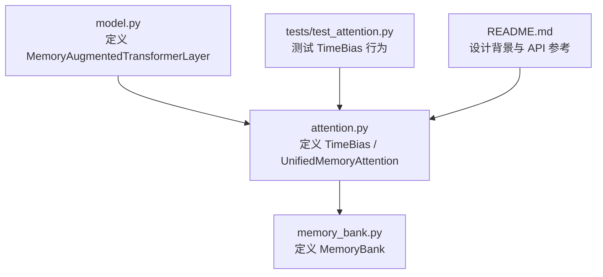
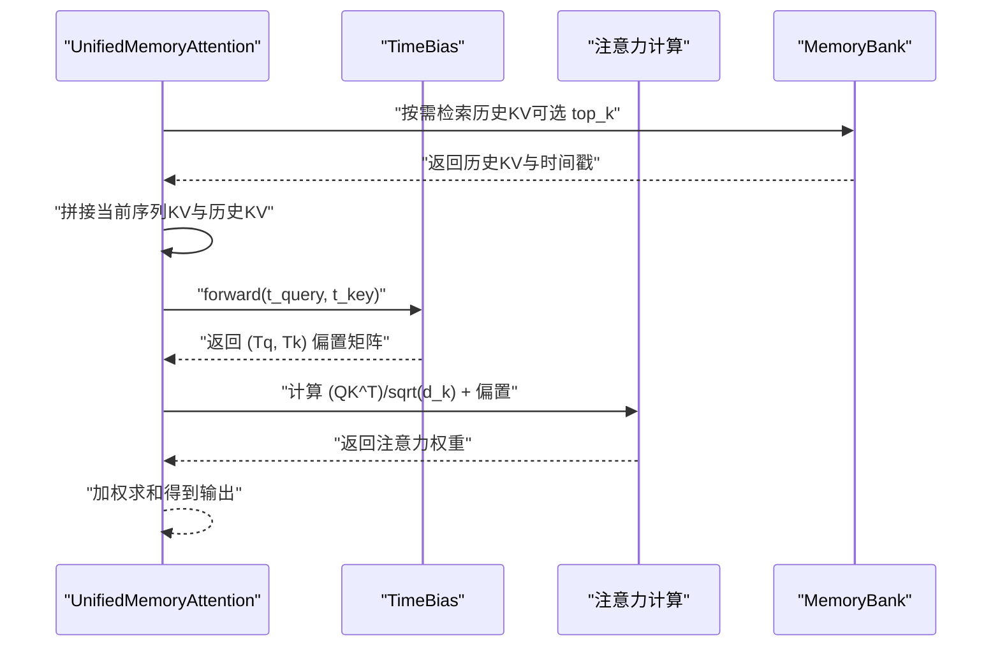
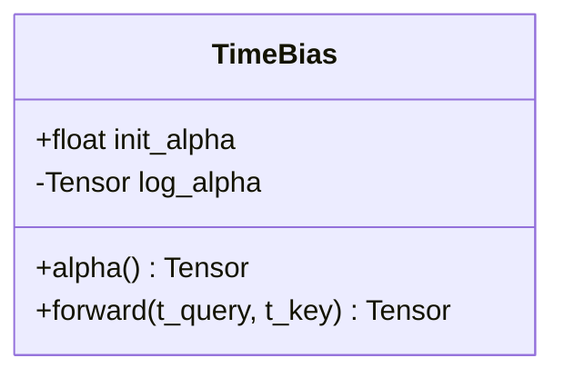
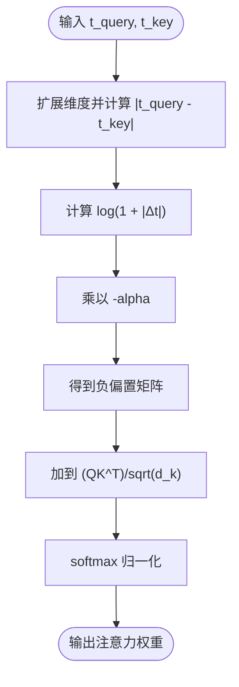
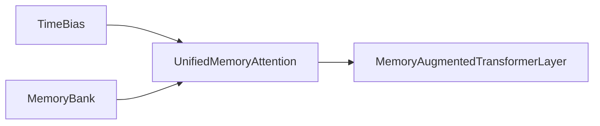

# TimeBias API

<cite>
**本文引用的文件**
- [attention.py](file://src/memory_augmented_attention/attention.py)
- [memory_bank.py](file://src/memory_augmented_attention/memory_bank.py)
- [model.py](file://src/memory_augmented_attention/model.py)
- [test_attention.py](file://tests/test_attention.py)
- [README.md](file://README.md)
</cite>

## 目录
1. [简介](#简介)
2. [项目结构](#项目结构)
3. [核心组件](#核心组件)
4. [架构总览](#架构总览)
5. [详细组件分析](#详细组件分析)
6. [依赖关系分析](#依赖关系分析)
7. [性能考量](#性能考量)
8. [故障排查指南](#故障排查指南)
9. [结论](#结论)
10. [附录](#附录)

## 简介
本文件为 TimeBias 类的详细 API 参考与实现解析，围绕“时间衰减偏置”的数学原理、参数学习机制、在注意力权重中的影响方式、可选的时间衰减策略、初始化与梯度更新、数值稳定性以及实际使用示例与性能调优建议展开。TimeBias 是统一记忆增强注意力（Unified Memory-Augmented Attention）中的关键模块，通过引入可学习的时间衰减系数 alpha，对注意力 logits 添加负值偏置，使较旧的历史记忆在注意力分配中被自然地抑制，从而模拟人类记忆的幂律遗忘曲线。

## 项目结构
TimeBias 所属的核心模块位于 memory_augmented_attention 包内，主要涉及以下文件：
- attention.py：定义 TimeBias、UnifiedMemoryAttention 等核心注意力组件
- memory_bank.py：定义 MemoryBank，用于存储带时间戳的历史 KVQ 记忆
- model.py：定义 MemoryAugmentedTransformerLayer，封装注意力子层与前馈网络
- tests/test_attention.py：针对 TimeBias 的单元测试，覆盖形状、零延迟偏置、非正性、随时间衰减等行为
- README.md：提供高层设计说明、公式与 API 参考

图表来源
- [attention.py:1-322](file://src/memory_augmented_attention/attention.py#L1-L322)
- [memory_bank.py:1-284](file://src/memory_augmented_attention/memory_bank.py#L1-L284)
- [model.py:1-134](file://src/memory_augmented_attention/model.py#L1-L134)
- [test_attention.py:1-231](file://tests/test_attention.py#L1-L231)
- [README.md:1-427](file://README.md#L1-L427)

章节来源
- [attention.py:1-322](file://src/memory_augmented_attention/attention.py#L1-L322)
- [memory_bank.py:1-284](file://src/memory_augmented_attention/memory_bank.py#L1-L284)
- [model.py:1-134](file://src/memory_augmented_attention/model.py#L1-L134)
- [test_attention.py:1-231](file://tests/test_attention.py#L1-L231)
- [README.md:1-427](file://README.md#L1-L427)

## 核心组件
- TimeBias：可学习的时间衰减偏置模块，接收查询与键的时间戳，输出一个形状为 (T_query, T_key) 的负值偏置矩阵，加到注意力 logits 上，使时间差越大，偏置越负，注意力权重越小。
- UnifiedMemoryAttention：在统一记忆池上执行多头注意力，支持从 MemoryBank 检索历史 KV，并可选择 top-k 限制检索规模；内部调用 TimeBias 计算时间偏置。
- MemoryAugmentedTransformerLayer：在标准 Transformer 编码器层基础上，以 UnifiedMemoryAttention 替代标准自注意力，包含前馈网络与残差归一化。

章节来源
- [attention.py:40-94](file://src/memory_augmented_attention/attention.py#L40-L94)
- [attention.py:101-321](file://src/memory_augmented_attention/attention.py#L101-L321)
- [model.py:27-133](file://src/memory_augmented_attention/model.py#L27-L133)

## 架构总览
TimeBias 在注意力计算中的位置如下：
- 输入：当前序列的 Q、K、V 投影，以及统一记忆池（历史 KV 与当前序列 KV）的时间戳向量
- 处理：计算 Q·K^T/sqrt(d_k)，随后加上 TimeBias(t_query, t_key) 得到 logits
- 输出：softmax(logits) 与 V 的加权和，得到注意力输出

图表来源
- [attention.py:247-321](file://src/memory_augmented_attention/attention.py#L247-L321)
- [attention.py:73-93](file://src/memory_augmented_attention/attention.py#L73-L93)

章节来源
- [attention.py:115-117](file://src/memory_augmented_attention/attention.py#L115-L117)
- [attention.py:275-300](file://src/memory_augmented_attention/attention.py#L275-L300)

## 详细组件分析

### TimeBias 类详解
- 数学公式
  - 时间偏置定义为：TimeBias(t_q, t_k) = -alpha * log(1 + |t_q - t_k|)
  - 其中 alpha 为可学习标量，log(1 + |·|) 形式模拟人类记忆的幂律遗忘曲线，对近期记忆惩罚较小，对极远记忆惩罚较大但相对差距随时间拉大而缩小
- 参数与初始化
  - init_alpha：初始衰减系数，alpha=0 表示无时间衰减（等价于标准注意力）
  - 内部以 log_alpha 作为可训练参数，避免直接优化 alpha 导致的数值不稳定
  - 当 init_alpha=0 时，内部存储为 log(epsilon) 并夹紧为 0，确保偏置恒为 0
- 前向传播
  - 输入：t_query、t_key 分别为查询与键的时间戳向量（整数或浮点），支持自动广播
  - 输出：形状为 (T_query, T_key) 的负值偏置矩阵，加到注意力 logits 前进行 softmax
- 学习与梯度
  - alpha 通过 log_alpha 的梯度更新，alpha = exp(log_alpha)
  - 单元测试验证了 alpha 在反向传播中可学习（log_alpha.grad 非空）

图表来源
- [attention.py:40-94](file://src/memory_augmented_attention/attention.py#L40-L94)

章节来源
- [attention.py:40-94](file://src/memory_augmented_attention/attention.py#L40-L94)
- [test_attention.py:51-59](file://tests/test_attention.py#L51-L59)

### 时间偏置计算与对注意力权重的影响
- 计算流程
  - 将 t_query 与 t_key 分别扩展维度后取绝对值差 delta
  - 使用 log1p(delta) 计算对数项，再乘以 -alpha 得到负偏置
  - 将该偏置矩阵广播到 (B, H, T_query, T_key) 维度后加到 logits
- 对注意力权重的影响
  - 时间差越大，偏置越负，softmax 后对应权重越小
  - 对角线（t_query==t_key）处偏置为 0，不改变对自身的注意力
  - 通过 alpha 控制整体衰减强度：alpha 越大，衰减越强；alpha=0 等价于标准注意力

图表来源
- [attention.py:73-93](file://src/memory_augmented_attention/attention.py#L73-L93)
- [attention.py:275-282](file://src/memory_augmented_attention/attention.py#L275-L282)

章节来源
- [attention.py:73-93](file://src/memory_augmented_attention/attention.py#L73-L93)
- [attention.py:275-282](file://src/memory_augmented_attention/attention.py#L275-L282)

### learnable_temporal_decay 参数的作用与调优
- 作用
  - learnable_temporal_decay 即 alpha，控制时间衰减的强度
  - alpha=0：无时间衰减，退化为标准注意力
  - alpha>0：随时间差增大，注意力权重呈对数级下降
- 调优建议
  - 初始值：推荐范围 0.5–2.0，具体取决于任务与上下文长度
  - 过大：可能导致历史信息被过度抑制，影响长程依赖建模
  - 过小：可能无法有效抑制过时信息，导致注意力分散
  - 结合 top_k 与 MemoryBank 的重要性阈值共同调节，避免内存爆炸与无效记忆污染

章节来源
- [README.md:331-339](file://README.md#L331-L339)
- [attention.py:60-71](file://src/memory_augmented_attention/attention.py#L60-L71)

### 不同时间衰减策略与使用场景
- 标准注意力（alpha=0）
  - 场景：短窗口任务、对历史无偏好、需要完全对齐当前上下文
  - 特点：TimeBias 恒为 0，不引入时间偏好
- 对数时间衰减（默认）
  - 场景：对话、长文档阅读、需要自然遗忘历史
  - 特点：幂律遗忘曲线，近期更受重视，远期适度抑制
- 其他策略（扩展方向）
  - 设计文档指出未来将扩展为多维动态权重 MemoryBias(entry) = w_time·f_time + w_verdict·f_verdict + w_freq·f_freq + w_source·f_source，由查询动态决定各维度权重
  - 适用场景：教学演示（正确性优先）、代码补全（频率优先）、问答（权威性优先）

章节来源
- [README.md:104-140](file://README.md#L104-L140)
- [attention.py:40-58](file://src/memory_augmented_attention/attention.py#L40-L58)

### 参数初始化、梯度更新与数值稳定性
- 初始化
  - 若 init_alpha=0，则 log_alpha 初始化为负无穷，确保 alpha=0
  - 否则 log_alpha 初始化为 log(init_alpha)
- 梯度更新
  - 通过优化器更新 log_alpha，alpha=exp(log_alpha)，保证 alpha>0
  - 单元测试验证了 alpha 在反向传播中可学习
- 数值稳定性
  - 使用 log1p(delta) 防止 delta 接近 0 时的数值问题
  - 对 alpha=0 的特殊处理避免了直接优化 alpha=0 时的边界情况

章节来源
- [attention.py:60-71](file://src/memory_augmented_attention/attention.py#L60-L71)
- [test_attention.py:51-59](file://tests/test_attention.py#L51-L59)

### 实际使用示例与最佳实践
- 基础用法
  - 在 UnifiedMemoryAttention 中传入 init_alpha 控制时间衰减强度
  - 在 MemoryAugmentedTransformerLayer 中同样可通过 init_alpha 设置
- 训练与推理
  - 训练阶段：可结合 MemoryBank 的 importance_threshold 与 compress_by_time 控制内存占用
  - 推理阶段：保持 MemoryBank 持久化，逐步推进 global_step，实现跨轮次记忆累积
- 性能调优
  - top_k：限制每次前向仅关注 K 个最相关的记忆条目，平衡质量与速度
  - max_size：控制 MemoryBank 最大容量，避免 OOM
  - importance_threshold：过滤低信息内容，减少冗余记忆写入

章节来源
- [README.md:183-212](file://README.md#L183-L212)
- [README.md:297-340](file://README.md#L297-L340)
- [model.py:67-73](file://src/memory_augmented_attention/model.py#L67-L73)

## 依赖关系分析
- TimeBias 依赖 PyTorch 的张量运算与函数式接口
- UnifiedMemoryAttention 依赖 MemoryBank 进行历史检索与写入
- MemoryAugmentedTransformerLayer 依赖 UnifiedMemoryAttention 与前馈网络

图表来源
- [attention.py:158-159](file://src/memory_augmented_attention/attention.py#L158-L159)
- [model.py:67-73](file://src/memory_augmented_attention/model.py#L67-L73)

章节来源
- [attention.py:158-159](file://src/memory_augmented_attention/attention.py#L158-L159)
- [model.py:67-73](file://src/memory_augmented_attention/model.py#L67-L73)

## 性能考量
- 复杂度
  - Naive 统一记忆注意力为 O((L+M)^2·d)，其中 L 为当前序列长度，M 为历史记忆数量
  - 通过 top_k、时间压缩与 LRU 淘汰等策略可显著降低计算与内存开销
- 建议
  - 使用 top_k 限制检索规模（如 32–128）
  - 定期调用 compress_by_time 保留最新条目
  - 合理设置 importance_threshold，避免写入噪声

章节来源
- [README.md:151-169](file://README.md#L151-L169)
- [memory_bank.py:263-273](file://src/memory_augmented_attention/memory_bank.py#L263-L273)

## 故障排查指南
- 偏置不生效
  - 检查是否传入了 MemoryBank 或是否设置了 write_to_memory=True
  - 确认 alpha 是否被正确更新（log_alpha.grad 是否存在）
- 注意力输出异常
  - 检查输入张量是否为有限值（NaN/Inf）
  - 确认 d_model 与 n_heads 的整除关系
- 记忆池过大
  - 使用 compress_by_time 或降低 max_size
  - 提高 importance_threshold，减少噪声写入

章节来源
- [test_attention.py:80-83](file://tests/test_attention.py#L80-L83)
- [attention.py:144-147](file://src/memory_augmented_attention/attention.py#L144-L147)
- [memory_bank.py:114-126](file://src/memory_augmented_attention/memory_bank.py#L114-L126)

## 结论
TimeBias 通过可学习的时间衰减偏置，将时间维度显式纳入注意力计算，使模型能够自然地对历史信息进行遗忘与筛选。其对数形式的衰减函数与 alpha 的可学习性，使其在不同任务与上下文中具备良好的适应性。配合 MemoryBank 的 top_k 检索、时间压缩与重要性过滤，可在保证性能的同时实现稳定的长期记忆管理。

## 附录
- API 参考
  - TimeBias(init_alpha=1.0)：创建可学习时间衰减偏置模块
  - UnifiedMemoryAttention(d_model, n_heads, dropout=0.0, top_k=None, init_alpha=1.0)：统一记忆注意力
  - MemoryAugmentedTransformerLayer(...)：带记忆增强的 Transformer 层

章节来源
- [README.md:234-271](file://README.md#L234-L271)