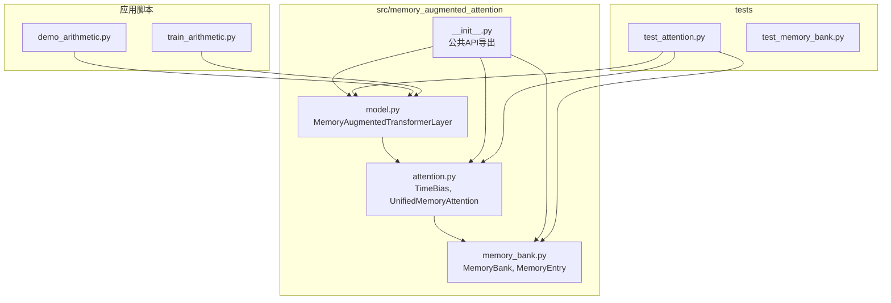
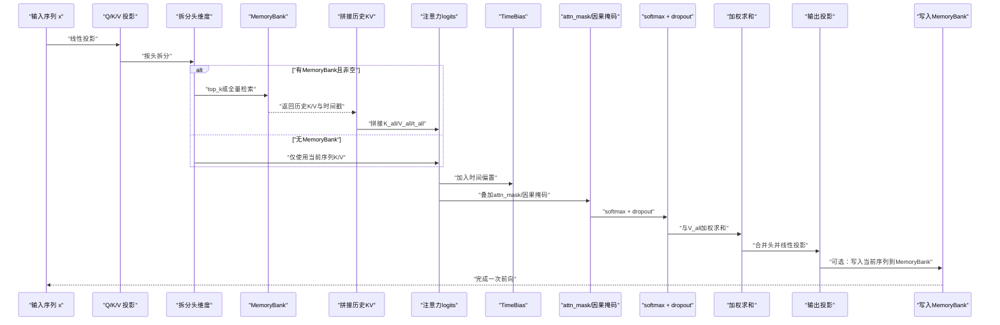
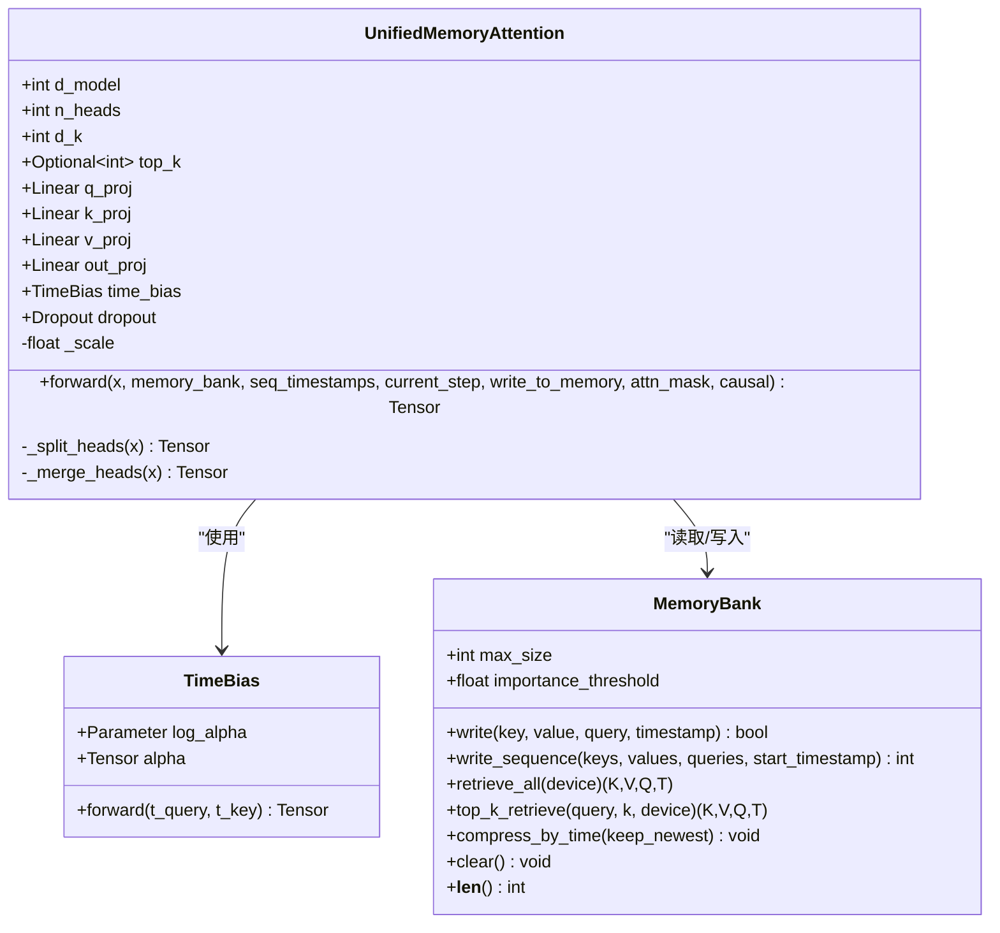
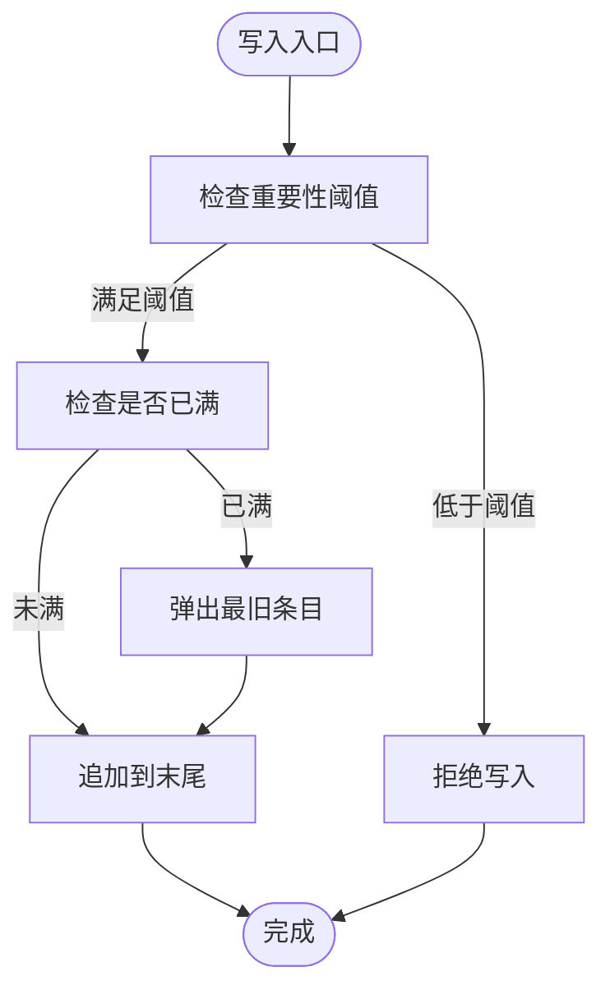
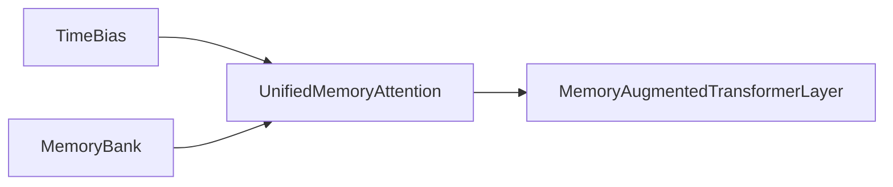

# UnifiedMemoryAttention API

<cite>
**本文引用的文件**
- [attention.py](file://src/memory_augmented_attention/attention.py)
- [memory_bank.py](file://src/memory_augmented_attention/memory_bank.py)
- [model.py](file://src/memory_augmented_attention/model.py)
- [__init__.py](file://src/memory_augmented_attention/__init__.py)
- [test_attention.py](file://tests/test_attention.py)
- [README.md](file://README.md)
- [demo_arithmetic.py](file://demo_arithmetic.py)
- [train_arithmetic.py](file://train_arithmetic.py)
</cite>

## 目录
1. [简介](#简介)
2. [项目结构](#项目结构)
3. [核心组件](#核心组件)
4. [架构总览](#架构总览)
5. [详细组件分析](#详细组件分析)
6. [依赖关系分析](#依赖关系分析)
7. [性能与数值稳定性](#性能与数值稳定性)
8. [故障排查指南](#故障排查指南)
9. [结论](#结论)
10. [附录：使用示例与最佳实践](#附录使用示例与最佳实践)

## 简介
UnifiedMemoryAttention 是本仓库提供的统一记忆增强注意力模块，其核心思想是将“当前序列（短时记忆）”与“历史KV缓存（长时记忆）”统一纳入一个共享的、带时间戳的记忆库中，通过可学习的时间衰减偏置对不同时间步的键值进行降权，从而在一次前向计算中同时利用当前上下文与历史知识。该模块支持多头注意力、因果掩码、可选的Top-K检索以控制长程注意力复杂度，并在每次前向后将当前序列的Q/K/V写入记忆库，形成持续增长的历史池。

## 项目结构
本项目采用按功能分层的组织方式：
- memory_augmented_attention 包含核心实现：注意力、记忆库、以及基于注意力的Transformer层
- tests 提供针对注意力、记忆库与层的单元测试
- demo_arithmetic.py 与 train_arithmetic.py 展示了在字符级算术任务上的训练与推理用法

图表来源
- [attention.py:1-322](file://src/memory_augmented_attention/attention.py#L1-L322)
- [memory_bank.py:1-284](file://src/memory_augmented_attention/memory_bank.py#L1-L284)
- [model.py:1-134](file://src/memory_augmented_attention/model.py#L1-L134)
- [__init__.py:1-28](file://src/memory_augmented_attention/__init__.py#L1-L28)

章节来源
- [README.md:374-393](file://README.md#L374-L393)

## 核心组件
- TimeBias：可学习的时间衰减偏置模块，用于在注意力logits上添加负的随时间递减项，使远期记忆被自然地抑制。
- UnifiedMemoryAttention：统一记忆增强的多头注意力，负责将当前序列与记忆库中的历史KV合并，计算注意力权重并进行加权求和，最后经输出投影得到输出。
- MemoryBank：统一的记忆库，存储带时间戳的(K, V, Q)条目，支持全量检索与Top-K检索，并具备重要性过滤与LRU淘汰等容量管理策略。
- MemoryAugmentedTransformerLayer：基于UnifiedMemoryAttention的编码器层，包含前馈网络与残差归一化。

章节来源
- [attention.py:40-322](file://src/memory_augmented_attention/attention.py#L40-L322)
- [memory_bank.py:43-284](file://src/memory_augmented_attention/memory_bank.py#L43-L284)
- [model.py:27-134](file://src/memory_augmented_attention/model.py#L27-L134)
- [__init__.py:18-27](file://src/memory_augmented_attention/__init__.py#L18-L27)

## 架构总览
UnifiedMemoryAttention 的整体工作流如下：
- 输入序列 x 经过线性投影得到 Q_seq/K_seq/V_seq，并按头维度拆分
- 若提供 MemoryBank 且非空，则根据 top_k 或全量检索历史KV，拼接到当前序列之后，形成 K_all/V_all/t_all
- 计算注意力logits = (Q · K_all^T)/sqrt(d_k)，加上时间偏置 TimeBias(t_query, t_all)，再叠加可选的 additive 掩码与因果掩码
- 对最后一维做softmax并应用dropout，然后与 V_all 做加权求和
- 合并头并经输出投影得到最终输出；若 write_to_memory=True 则将当前序列的Q/K/V写入 MemoryBank

图表来源
- [attention.py:181-322](file://src/memory_augmented_attention/attention.py#L181-L322)
- [memory_bank.py:169-253](file://src/memory_augmented_attention/memory_bank.py#L169-L253)

## 详细组件分析

### UnifiedMemoryAttention 类
- 参数与职责
  - d_model/n_heads：模型维度与头数，要求 d_model 能被 n_heads 整除
  - dropout：注意力权重的dropout概率
  - top_k：可选，限制每次前向只关注历史库中最相关的 top_k 条目；None 表示全量
  - init_alpha：TimeBias 的初始衰减系数
- 多头注意力并行计算
  - Q/K/V 分别经线性投影后按头拆分，形状从 (B, T, d_model) 变为 (B, H, T, d_k)
  - 注意力logits = Q @ K_all^T / sqrt(d_k)，随后逐头广播加时间偏置
  - softmax 在最后一维执行，dropout应用于权重
  - 加权求和得到 (B, H, T, d_k)，再合并头并经 out_proj 输出
- 时间偏置 TimeBias
  - 依据查询与键的时间戳计算对称log(1+|t_q - t_k|)衰减项，alpha可学习
  - 当 t_q==t_k 时对角项为0，越远越负，体现人类记忆的幂律遗忘特性
- 因果掩码 causal
  - 仅对当前序列尾部施加下三角掩码，确保自回归；历史记忆列始终可见（严格更早）
- 掩码 attn_mask
  - 支持形状为 (T, T_all) 或 (B, H, T, T_all) 的加性掩码，先于softmax加到logits
- 写入 MemoryBank
  - 将当前序列的Q/K/V按头均值后写入，时间戳由 current_step 与序列长度决定

图表来源
- [attention.py:101-322](file://src/memory_augmented_attention/attention.py#L101-L322)
- [memory_bank.py:43-284](file://src/memory_augmented_attention/memory_bank.py#L43-L284)

章节来源
- [attention.py:101-322](file://src/memory_augmented_attention/attention.py#L101-L322)

### MemoryBank 类
- 存储结构
  - 每个槽位保存一个 MemoryEntry，包含 (key, value, query, timestamp)，其中 key/value/query 的形状为 (heads, d_k) 或 (heads, d_v)
- 写入策略
  - write：按 importance_threshold 过滤低价值条目；满载时LRU淘汰最旧条目
  - write_sequence：批量写入序列，时间戳递增
- 读取策略
  - retrieve_all：返回所有条目的堆叠张量
  - top_k_retrieve：对查询向量与所有键做L2归一化后的点积相似度排序，返回最相关的 k 个条目；保持时间顺序
- 容量管理
  - max_size：物理上限，满载时淘汰最早条目
  - compress_by_time：保留最新的 keep_newest 条目，丢弃更旧的
  - clear：清空全部条目

图表来源
- [memory_bank.py:82-163](file://src/memory_augmented_attention/memory_bank.py#L82-L163)

章节来源
- [memory_bank.py:43-284](file://src/memory_augmented_attention/memory_bank.py#L43-L284)

### MemoryAugmentedTransformerLayer
- 结构
  - 预归一化风格：先注意力子层，再前馈网络子层，均与残差相加
  - 注意力子层即 UnifiedMemoryAttention，FFN为两层线性+ReLU+Dropout
- 关键参数
  - d_model/n_heads/d_ff/dropout/top_k/init_alpha 与 UnifiedMemoryAttention 一致
- 使用建议
  - 训练时通常设置 causal=True 以保证自回归
  - 推理时可选择是否写入当前序列到 MemoryBank，以控制持久记忆

章节来源
- [model.py:27-134](file://src/memory_augmented_attention/model.py#L27-L134)

## 依赖关系分析
- UnifiedMemoryAttention 依赖 MemoryBank 进行历史KV的检索与写入
- MemoryAugmentedTransformerLayer 依赖 UnifiedMemoryAttention 作为注意力子层
- TimeBias 作为独立模块被 UnifiedMemoryAttention 使用
- 公共API通过 __init__.py 导出上述类型

图表来源
- [attention.py:101-322](file://src/memory_augmented_attention/attention.py#L101-L322)
- [memory_bank.py:43-284](file://src/memory_augmented_attention/memory_bank.py#L43-L284)
- [model.py:27-134](file://src/memory_augmented_attention/model.py#L27-L134)
- [__init__.py:18-27](file://src/memory_augmented_attention/__init__.py#L18-L27)

章节来源
- [__init__.py:18-27](file://src/memory_augmented_attention/__init__.py#L18-L27)

## 性能与数值稳定性

### 复杂度与可扩展性
- 朴素全量注意力：对历史M条目与当前序列L的注意力计算复杂度约为 O((L+M)²·d)
- 三种缓解策略
  - Top-K检索：固定k，复杂度降至 O(L·K·d)，推荐k在32–128之间
  - 时间压缩：周期性保留最新条目，降低M规模
  - LRU淘汰：满载时自动淘汰最旧条目，避免OOM
- 建议的运行策略
  - 最近N步：全量注意力
  - 更旧的历史：Top-K检索
  - 归档：压缩为摘要嵌入

章节来源
- [README.md:151-169](file://README.md#L151-L169)

### 数值精度与稳定性
- 缩放因子：使用 sqrt(d_k) 对点积进行缩放，有助于稳定softmax输入
- 时间偏置：采用 log(1+|Δt|) 形式，避免大Δt导致的数值爆炸，且对角为0，保证自注意不被惩罚
- 掩码：attn_mask与因果掩码以加性形式叠加到logits，避免破坏softmax性质
- Dropout：在softmax后对注意力权重应用dropout，防止过拟合

章节来源
- [attention.py:161-300](file://src/memory_augmented_attention/attention.py#L161-L300)

### 内存访问模式
- 多头拆分与转置：Q/K/V在拆分头后进行转置，便于矩阵乘法高效计算
- 拼接历史KV：将历史K/V按头维度扩展并拼接到当前序列之后，形成 (B, H, T_all, d_k)
- Top-K检索：对查询向量与所有键做L2归一化后点积相似度排序，返回索引并按时间顺序重排

章节来源
- [attention.py:247-271](file://src/memory_augmented_attention/attention.py#L247-L271)
- [memory_bank.py:203-253](file://src/memory_augmented_attention/memory_bank.py#L203-L253)

## 故障排查指南
- d_model 必须能被 n_heads 整除
  - 若报错，调整 n_heads 或 d_model 使其整除
- MemoryBank为空时调用检索
  - retrieve_all/top_k_retrieve 在空库时报RuntimeError，需先写入条目
- 无效的 top_k
  - top_k 应为正整数或None；当k等于现有条目数时退化为全量检索
- 写入失败
  - importance_threshold 过高可能导致写入被拒绝；适当降低阈值或增大重要性
- 因果掩码与attn_mask冲突
  - 确保attn_mask形状匹配 logits 广播后的维度；因果掩码仅作用于当前序列尾部

章节来源
- [attention.py:144-147](file://src/memory_augmented_attention/attention.py#L144-L147)
- [memory_bank.py:169-201](file://src/memory_augmented_attention/memory_bank.py#L169-L201)
- [memory_bank.py:203-253](file://src/memory_augmented_attention/memory_bank.py#L203-L253)
- [test_attention.py:85-87](file://tests/test_attention.py#L85-L87)

## 结论
UnifiedMemoryAttention 将当前序列与历史记忆统一建模，通过可学习的时间衰减偏置与可选的Top-K检索，在保持自回归能力的同时显著扩展了模型的上下文范围。配合 MemoryBank 的容量管理策略，可在有限显存内实现“无限记忆”的近似效果。该模块适合作为标准Transformer的直接替换，既可用于监督微调，也可用于需要持久记忆的推理场景。

## 附录：使用示例与最佳实践

### 基础用法（无记忆库）
- 创建模块与输入张量，调用 forward 即可获得注意力输出
- 适用于一次性推理或仅依赖当前窗口的任务

章节来源
- [test_attention.py:74-83](file://tests/test_attention.py#L74-L83)

### 带记忆库的增量式推理
- 在循环中逐步推进 global_step，将当前批次的输出写入 MemoryBank
- 下一轮调用时传入 memory_bank，即可看到历史KV对当前序列的影响
- 适合对话、长文档问答等需要跨轮次记忆的场景

章节来源
- [test_attention.py:153-176](file://tests/test_attention.py#L153-L176)
- [demo_arithmetic.py:167-182](file://demo_arithmetic.py#L167-L182)

### 自回归训练
- 在 ArithmeticMAA 中，每层都以 causal=True 调用 MemoryAugmentedTransformerLayer
- 训练时可不写入记忆库，推理时可开启写入以积累历史

章节来源
- [train_arithmetic.py:246-251](file://train_arithmetic.py#L246-L251)
- [model.py:87-96](file://src/memory_augmented_attention/model.py#L87-L96)

### Top-K检索对效率与效果的影响
- top_k 越大，上下文越丰富但计算开销越大；推荐范围32–128
- 在长对话或复杂问答中，可结合时间压缩与重要性过滤减少冗余
- 测试覆盖了 top_k 限制历史池大小的行为

章节来源
- [test_attention.py:137-151](file://tests/test_attention.py#L137-L151)
- [README.md:331-338](file://README.md#L331-L338)

### 掩码与因果掩码
- attn_mask 支持形状 (T, T_all) 或 (B, H, T, T_all)，用于屏蔽特定位置
- causal=True 仅对当前序列施加下三角掩码，确保自回归；历史记忆列始终可见

章节来源
- [attention.py:213-220](file://src/memory_augmented_attention/attention.py#L213-L220)
- [attention.py:284-297](file://src/memory_augmented_attention/attention.py#L284-L297)

### 写入策略与重要性过滤
- importance_threshold 控制写入门槛，避免低信息条目污染记忆库
- compress_by_time 可定期清理旧条目，维持较小的历史池

章节来源
- [memory_bank.py:63-76](file://src/memory_augmented_attention/memory_bank.py#L63-L76)
- [memory_bank.py:109-126](file://src/memory_augmented_attention/memory_bank.py#L109-L126)
- [memory_bank.py:263-273](file://src/memory_augmented_attention/memory_bank.py#L263-L273)