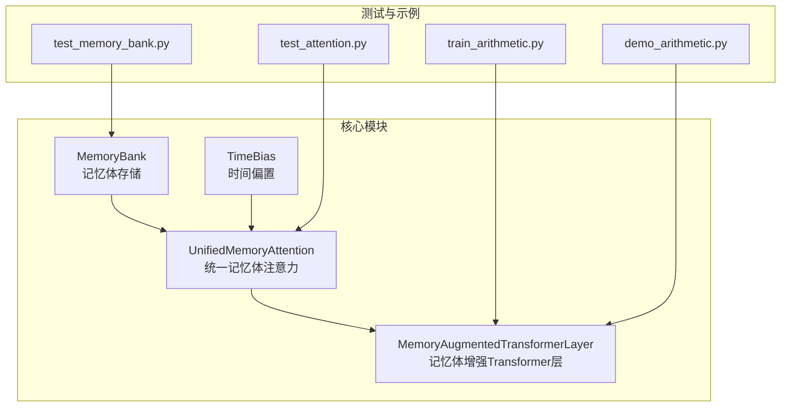
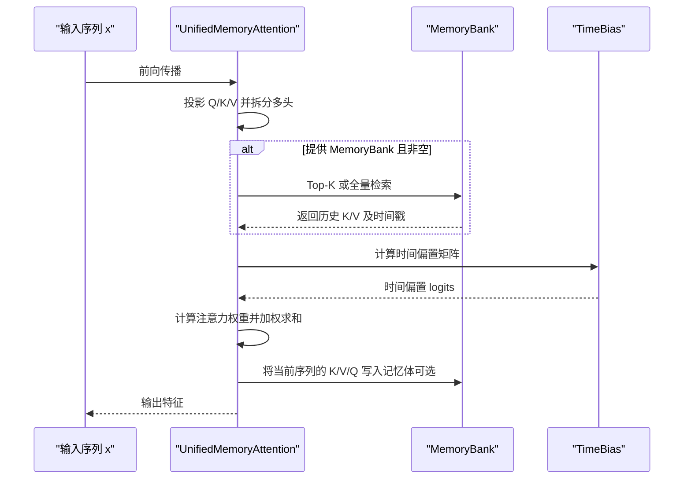
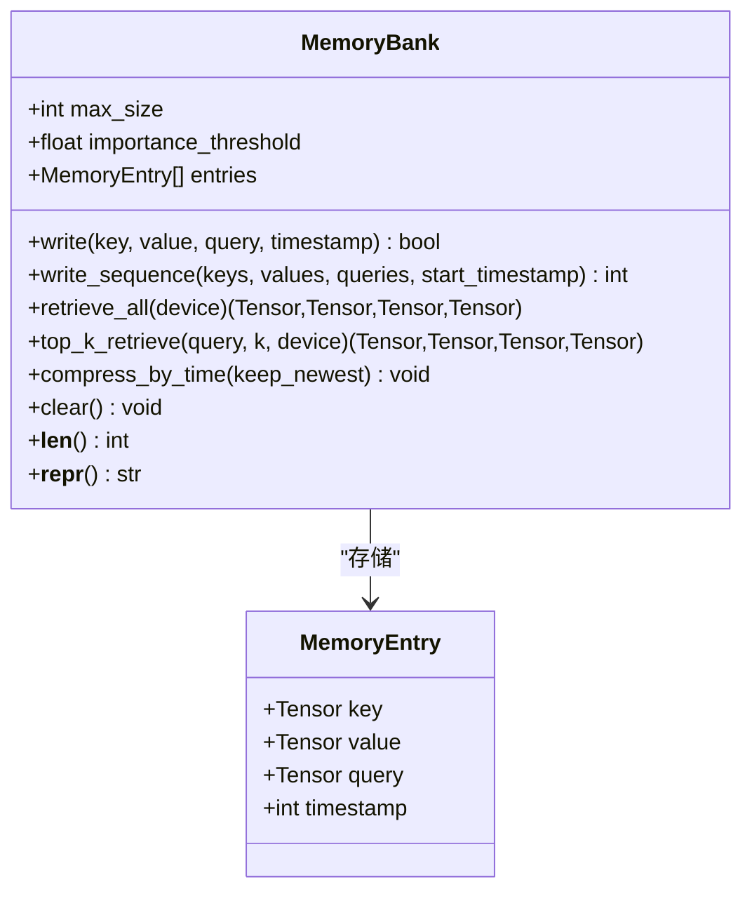
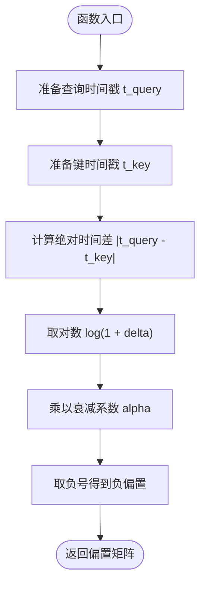
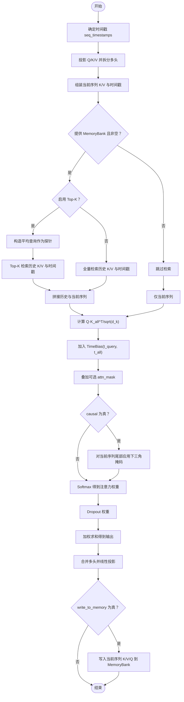
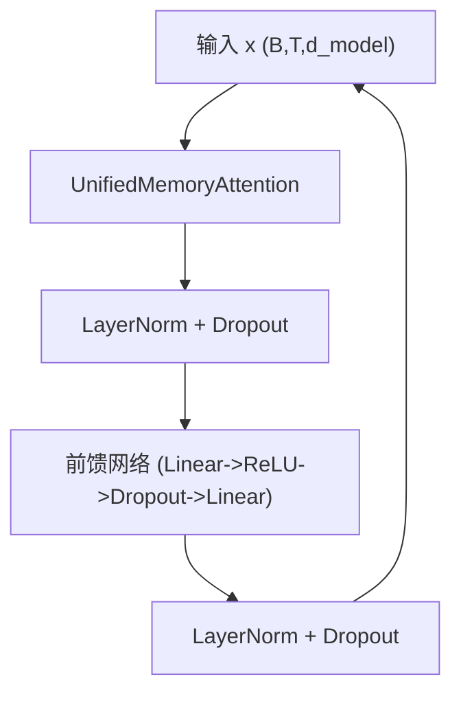
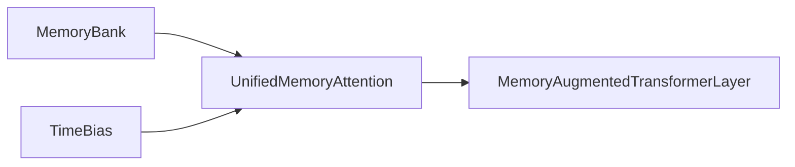

# 核心API参考

<cite>
**本文引用的文件**
- [src/memory_augmented_attention/__init__.py](file://src/memory_augmented_attention/__init__.py)
- [src/memory_augmented_attention/memory_bank.py](file://src/memory_augmented_attention/memory_bank.py)
- [src/memory_augmented_attention/attention.py](file://src/memory_augmented_attention/attention.py)
- [src/memory_augmented_attention/model.py](file://src/memory_augmented_attention/model.py)
- [tests/test_memory_bank.py](file://tests/test_memory_bank.py)
- [tests/test_attention.py](file://tests/test_attention.py)
- [README.md](file://README.md)
- [demo_arithmetic.py](file://demo_arithmetic.py)
- [train_arithmetic.py](file://train_arithmetic.py)
</cite>

## 目录
1. [简介](#简介)
2. [项目结构](#项目结构)
3. [核心组件](#核心组件)
4. [架构总览](#架构总览)
5. [详细组件分析](#详细组件分析)
6. [依赖分析](#依赖分析)
7. [性能考虑](#性能考虑)
8. [故障排查指南](#故障排查指南)
9. [结论](#结论)
10. [附录](#附录)

## 简介
本参考文档聚焦Memory-Augmented Attention（MAA）的核心API，系统性介绍以下组件：
- MemoryBank：统一记忆体的写入、检索、压缩与清理接口
- TimeBias：时间衰减偏置模块，提供可学习的时间衰减系数
- UnifiedMemoryAttention：统一记忆体的多头注意力，支持Top-K检索与因果掩码
- MemoryAugmentedTransformerLayer：基于统一记忆体注意力的Transformer编码器层

文档覆盖每个API的参数、返回值、使用示例与注意事项，并通过图示展示关键流程与数据流。

## 项目结构
- 模块组织采用按功能分层：memory_bank.py负责记忆体存储，attention.py实现注意力与时间偏置，model.py封装Transformer层；__init__.py导出公共API。
- 测试用例位于tests目录，涵盖MemoryBank与注意力模块的行为验证。
- 示例脚本演示了在算术教学任务中如何使用MemoryBank与MemoryAugmentedTransformerLayer进行训练与推理。

图表来源
- [src/memory_augmented_attention/memory_bank.py:43-284](file://src/memory_augmented_attention/memory_bank.py#L43-L284)
- [src/memory_augmented_attention/attention.py:40-322](file://src/memory_augmented_attention/attention.py#L40-L322)
- [src/memory_augmented_attention/model.py:27-134](file://src/memory_augmented_attention/model.py#L27-L134)
- [tests/test_memory_bank.py:1-189](file://tests/test_memory_bank.py#L1-L189)
- [tests/test_attention.py:1-231](file://tests/test_attention.py#L1-L231)
- [train_arithmetic.py:209-251](file://train_arithmetic.py#L209-L251)
- [demo_arithmetic.py:133-183](file://demo_arithmetic.py#L133-L183)

章节来源
- [src/memory_augmented_attention/__init__.py:1-28](file://src/memory_augmented_attention/__init__.py#L1-L28)
- [README.md:374-393](file://README.md#L374-L393)

## 核心组件
- MemoryBank：统一存储带时间戳的(K, V, Q)条目，支持重要性过滤、LRU逐出、Top-K检索与时间压缩。
- TimeBias：对注意力logits添加基于时间差的可学习对数衰减偏置。
- UnifiedMemoryAttention：在统一记忆池上执行多头注意力，支持Top-K检索、因果掩码与写回记忆体。
- MemoryAugmentedTransformerLayer：预层归一化风格的编码器层，包含注意力子层与前馈网络。

章节来源
- [src/memory_augmented_attention/memory_bank.py:43-284](file://src/memory_augmented_attention/memory_bank.py#L43-L284)
- [src/memory_augmented_attention/attention.py:40-322](file://src/memory_augmented_attention/attention.py#L40-L322)
- [src/memory_augmented_attention/model.py:27-134](file://src/memory_augmented_attention/model.py#L27-L134)

## 架构总览
统一记忆体注意力将当前序列与历史KV缓存视为同一时间维度下的记忆条目，通过TimeBias对较旧条目施加温和的时间惩罚，从而在不改变模型结构的前提下实现“持久记忆”。

图表来源
- [src/memory_augmented_attention/attention.py:181-321](file://src/memory_augmented_attention/attention.py#L181-L321)
- [src/memory_augmented_attention/memory_bank.py:203-253](file://src/memory_augmented_attention/memory_bank.py#L203-L253)
- [src/memory_augmented_attention/attention.py:73-93](file://src/memory_augmented_attention/attention.py#L73-L93)

## 详细组件分析

### MemoryBank 类
MemoryBank是统一记忆体的核心，负责存储带时间戳的键值查询三元组，并提供写入、检索、压缩与清理能力。

- 关键属性
  - entries：按时间顺序排列的记忆条目列表（最旧在前）
  - max_size：最大容量，满载时自动逐出最旧条目
  - importance_threshold：写入重要性阈值，低于阈值的条目被丢弃

- 写入接口
  - write(key, value, query, timestamp) -> bool
    - 参数：key/value/query形状为(..., d_k)或(..., d_v)，timestamp为全局步长整数
    - 返回：是否接受写入（可能因重要性过滤而拒绝）
    - 注意：当容量满时，会逐出最早条目
  - write_sequence(keys, values, queries, start_timestamp) -> int
    - 批量写入序列，返回下一个可用时间戳
    - 形状：keys/values/queries为(seq_len, ..., d_k/d_v)，queries为(seq_len, ..., d_k)

- 检索接口
  - retrieve_all(device=None) -> (keys, values, queries, timestamps)
    - 返回全部条目的堆叠张量，时间戳为长整型张量
    - 空库时抛出运行时错误
  - top_k_retrieve(query, k, device=None) -> (keys, values, queries, timestamps)
    - 使用点积相似度与L2归一化进行Top-K检索
    - 返回结果按时间顺序排序
    - 空库或k超过存储数量时有相应处理

- 清理与管理
  - clear()：清空所有条目
  - compress_by_time(keep_newest)：仅保留最新的keep_newest条目
  - __len__()：返回当前条目数量
  - __repr__()：返回可读的描述信息

- 使用示例路径
  - 写入单条与批量写入：[tests/test_memory_bank.py:48-83](file://tests/test_memory_bank.py#L48-L83)
  - Top-K检索与时间压缩：[tests/test_memory_bank.py:128-182](file://tests/test_memory_bank.py#L128-L182)
  - 重要性过滤与逐出行为：[tests/test_memory_bank.py:56-100](file://tests/test_memory_bank.py#L56-L100)

- 注意事项
  - 重要性阈值建议结合下游任务的表示强度设置
  - Top-K检索能显著降低注意力复杂度，适合长期记忆场景
  - compress_by_time可用于周期性降维以控制内存占用

章节来源
- [src/memory_augmented_attention/memory_bank.py:43-284](file://src/memory_augmented_attention/memory_bank.py#L43-L284)
- [tests/test_memory_bank.py:1-189](file://tests/test_memory_bank.py#L1-L189)

#### MemoryBank 类图

图表来源
- [src/memory_augmented_attention/memory_bank.py:33-77](file://src/memory_augmented_attention/memory_bank.py#L33-L77)
- [src/memory_augmented_attention/memory_bank.py:82-163](file://src/memory_augmented_attention/memory_bank.py#L82-L163)
- [src/memory_augmented_attention/memory_bank.py:169-253](file://src/memory_augmented_attention/memory_bank.py#L169-L253)
- [src/memory_augmented_attention/memory_bank.py:259-284](file://src/memory_augmented_attention/memory_bank.py#L259-L284)

### TimeBias 类
TimeBias为注意力logits添加基于时间差的可学习对数衰减偏置，模拟人类记忆的幂律遗忘曲线。

- 参数
  - init_alpha：初始衰减系数，alpha=0对应无时间衰减（标准注意力）

- 属性
  - alpha：可学习标量，通过log_alpha的指数映射得到

- 接口
  - forward(t_query, t_key) -> Tensor
    - 输入：查询时间戳tq与键时间戳tk（可为整数或浮点），形状分别为(tq,)与(tk,)
    - 输出：形状为(tq, tk)的时间偏置矩阵，负值用于惩罚远时间差
    - 计算公式：-alpha * log(1 + |t_query - t_key|)

- 使用示例路径
  - 形状与零滞后对角线：[tests/test_attention.py:18-33](file://tests/test_attention.py#L18-L33)
  - 衰减单调性与梯度更新：[tests/test_attention.py:42-59](file://tests/test_attention.py#L42-L59)

- 注意事项
  - alpha过大可能导致过强的时间惩罚，影响对历史信息的利用
  - 当alpha接近0时退化为标准注意力

章节来源
- [src/memory_augmented_attention/attention.py:40-94](file://src/memory_augmented_attention/attention.py#L40-L94)
- [tests/test_attention.py:17-59](file://tests/test_attention.py#L17-L59)

#### TimeBias 计算流程图

图表来源
- [src/memory_augmented_attention/attention.py:73-93](file://src/memory_augmented_attention/attention.py#L73-L93)

### UnifiedMemoryAttention 类
UnifiedMemoryAttention在统一记忆池上执行多头注意力，支持Top-K检索、因果掩码与可选写回记忆体。

- 参数
  - d_model：模型维度
  - n_heads：注意力头数，需整除d_model
  - dropout：注意力权重与子层Dropout概率
  - top_k：Top-K检索规模，None表示使用全部历史条目
  - init_alpha：TimeBias的初始衰减系数

- 子模块
  - q_proj/k_proj/v_proj/out_proj：线性投影层
  - time_bias：TimeBias模块
  - dropout：注意力权重Dropout

- 前向接口
  - forward(x, memory_bank=None, seq_timestamps=None, current_step=0, write_to_memory=True, attn_mask=None, causal=False) -> Tensor
    - x：形状(B, T, d_model)的当前序列
    - memory_bank：历史记忆体，None时退化为标准自注意力
    - seq_timestamps：形状(T,)的全局步长时间戳，未提供时从current_step递增
    - current_step：第一个token对应的全局步长
    - write_to_memory：是否将当前序列的K/V/Q写入记忆体
    - attn_mask：形状(T_q, T_all)或(B, H, T, T_all)的加性掩码
    - causal：是否对当前序列应用因果掩码（历史可见，未来屏蔽）

- 多头实现
  - _split_heads/_merge_heads：将(B, T, d_model)转换为(B, H, T, d_k)，再合并回(B, T, d_model)

- 注意力计算流程
  - 投影当前序列的Q/K/V并拆分多头
  - 若提供记忆体且非空：根据top_k或全量检索历史K/V与时间戳
  - 组合当前序列与历史条目形成统一的K_all/V_all/t_all
  - 计算logits = (Q·K_all^T)/sqrt(d_k)，加上TimeBias(t_query, t_all)与可选attn_mask
  - 应用因果掩码（仅作用于当前序列尾部）
  - softmax得到注意力权重并Dropout
  - 加权求和得到输出，合并多头并通过out_proj投影
  - 可选地将当前序列的K/V/Q写入记忆体

- 使用示例路径
  - 无记忆体的标准注意力：[tests/test_attention.py:66-94](file://tests/test_attention.py#L66-L94)
  - 与记忆体交互与Top-K限制：[tests/test_attention.py:101-177](file://tests/test_attention.py#L101-L177)
  - 因果掩码与掩码广播：[tests/test_attention.py:184-231](file://tests/test_attention.py#L184-L231)

- 注意事项
  - n_heads必须能整除d_model，否则抛出异常
  - top_k显著降低计算与内存开销，适合长上下文
  - causal掩码确保自回归训练/推理的正确性
  - write_to_memory=True会在每次前向后将当前序列写入记忆体

章节来源
- [src/memory_augmented_attention/attention.py:101-322](file://src/memory_augmented_attention/attention.py#L101-L322)
- [tests/test_attention.py:66-177](file://tests/test_attention.py#L66-L177)

#### UnifiedMemoryAttention 前向流程图

图表来源
- [src/memory_augmented_attention/attention.py:181-321](file://src/memory_augmented_attention/attention.py#L181-L321)

### MemoryAugmentedTransformerLayer 类
MemoryAugmentedTransformerLayer封装一个完整的编码器层，采用预层归一化风格，包含：
- 子层1：UnifiedMemoryAttention + 残差 + 层归一化
- 子层2：前馈网络（ReLU + Dropout）+ 残差 + 层归一化

- 参数
  - d_model：模型维度
  - n_heads：注意力头数
  - d_ff：前馈网络隐藏维度，默认4*d_model
  - dropout：注意力与子层Dropout
  - top_k：传递给UnifiedMemoryAttention的Top-K
  - init_alpha：传递给TimeBias的初始衰减系数

- 前向接口
  - forward(x, memory_bank=None, seq_timestamps=None, current_step=0, write_to_memory=True, attn_mask=None, causal=False) -> Tensor
    - 输入输出形状均为(B, T, d_model)
    - 支持与UnifiedMemoryAttention相同的参数与行为

- 使用示例路径
  - 单层与多层堆叠：[tests/test_attention.py:184-231](file://tests/test_attention.py#L184-L231)
  - 在ArithmeticMAA中的应用：[train_arithmetic.py:227-251](file://train_arithmetic.py#L227-L251)

- 注意事项
  - 预层归一化有助于稳定训练
  - 建议在训练时启用causal=True以保证自回归一致性

章节来源
- [src/memory_augmented_attention/model.py:27-134](file://src/memory_augmented_attention/model.py#L27-L134)
- [tests/test_attention.py:184-231](file://tests/test_attention.py#L184-L231)
- [train_arithmetic.py:209-251](file://train_arithmetic.py#L209-L251)

#### MemoryAugmentedTransformerLayer 结构图

图表来源
- [src/memory_augmented_attention/model.py:67-85](file://src/memory_augmented_attention/model.py#L67-L85)
- [src/memory_augmented_attention/model.py:87-133](file://src/memory_augmented_attention/model.py#L87-L133)

## 依赖分析
- MemoryBank独立于其他模块，仅依赖Python内置与PyTorch张量操作。
- TimeBias为nn.Module，依赖PyTorch的参数与自动微分机制。
- UnifiedMemoryAttention依赖MemoryBank与TimeBias，并通过线性层实现投影。
- MemoryAugmentedTransformerLayer依赖UnifiedMemoryAttention与MemoryBank，构建完整的编码器层。

图表来源
- [src/memory_augmented_attention/attention.py:32-32](file://src/memory_augmented_attention/attention.py#L32-L32)
- [src/memory_augmented_attention/model.py:23-24](file://src/memory_augmented_attention/model.py#L23-L24)

章节来源
- [src/memory_augmented_attention/attention.py:32-32](file://src/memory_augmented_attention/attention.py#L32-L32)
- [src/memory_augmented_attention/model.py:23-24](file://src/memory_augmented_attention/model.py#L23-L24)

## 性能考虑
- 复杂度与可扩展性
  - 全量注意力：O((L + M)² · d)，其中L为当前序列长度，M为历史条目数
  - Top-K检索：O(L · K · d)，K为固定超参数（推荐32–128）
  - 时间压缩：O(L · d)，周期性合并旧条目
  - LRU逐出：O(1)，满载时自动淘汰最旧条目
- 建议
  - 对近期token使用全量注意力，对历史使用Top-K检索
  - 定期调用compress_by_time减少内存占用
  - 合理设置importance_threshold避免低信息条目污染

章节来源
- [README.md:151-169](file://README.md#L151-L169)

## 故障排查指南
- MemoryBank
  - 写入被拒绝：检查importance_threshold是否过高导致低能量值被过滤
  - 检索时报空库错误：确认已写入或传入的MemoryBank非空
  - Top-K返回少于期望：当k大于存储数量时会返回全部条目
- TimeBias
  - alpha无法学习：确认初始化alpha>0，否则log_alpha被约束为极小值
  - 对角线不为0：确保t_query与t_key在相同位置比较
- UnifiedMemoryAttention
  - n_heads不能整除d_model：修正参数配置
  - 输出不稳定：检查dropout与层归一化的使用
  - 写回记忆体无效：确认write_to_memory=True且memory_bank非None
- MemoryAugmentedTransformerLayer
  - 梯度不流动：检查子层参数requires_grad与优化器设置
  - 多次前向累积记忆：确认current_step正确推进

章节来源
- [tests/test_memory_bank.py:33-100](file://tests/test_memory_bank.py#L33-L100)
- [tests/test_attention.py:25-59](file://tests/test_attention.py#L25-L59)
- [tests/test_attention.py:85-94](file://tests/test_attention.py#L85-L94)

## 结论
MemoryAugmentedAttention通过统一记忆体与时间偏置，实现了在不改变模型结构前提下的持久记忆与可控遗忘。MemoryBank提供灵活的记忆管理，TimeBias提供平滑的时间衰减，UnifiedMemoryAttention与MemoryAugmentedTransformerLayer则将这些能力无缝集成到标准Transformer架构中。合理配置Top-K、时间压缩与重要性阈值，可在长上下文与资源受限场景下取得良好平衡。

## 附录
- 快速开始与示例
  - 基础使用：[README.md:183-212](file://README.md#L183-L212)
  - 算术教学任务训练与评估：[train_arithmetic.py:312-357](file://train_arithmetic.py#L312-L357)，[demo_arithmetic.py:241-324](file://demo_arithmetic.py#L241-L324)
- API参考表格
  - MemoryBank：[README.md:215-233](file://README.md#L215-L233)
  - TimeBias：[README.md:234-242](file://README.md#L234-L242)
  - UnifiedMemoryAttention：[README.md:243-257](file://README.md#L243-L257)
  - MemoryAugmentedTransformerLayer：[README.md:258-270](file://README.md#L258-L270)