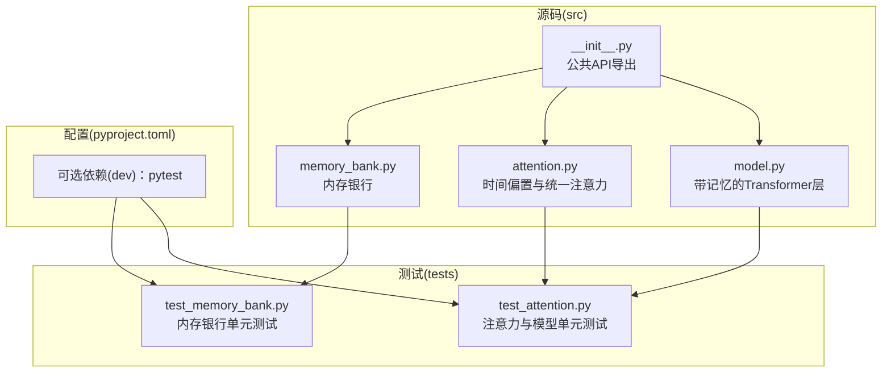
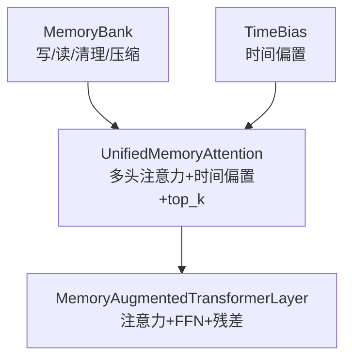
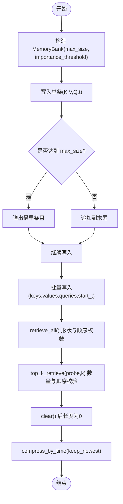
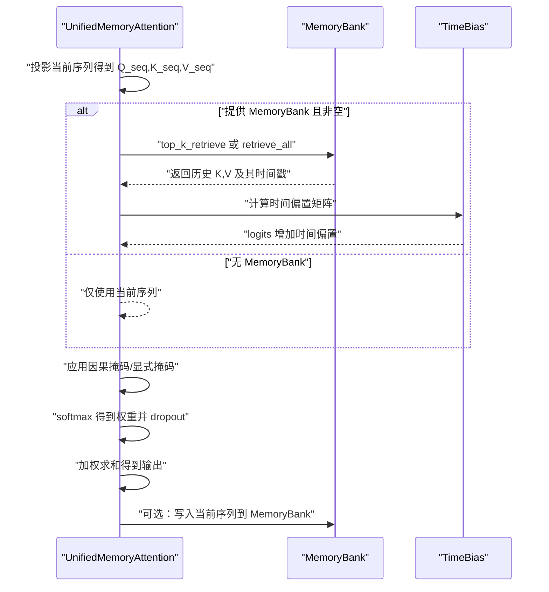
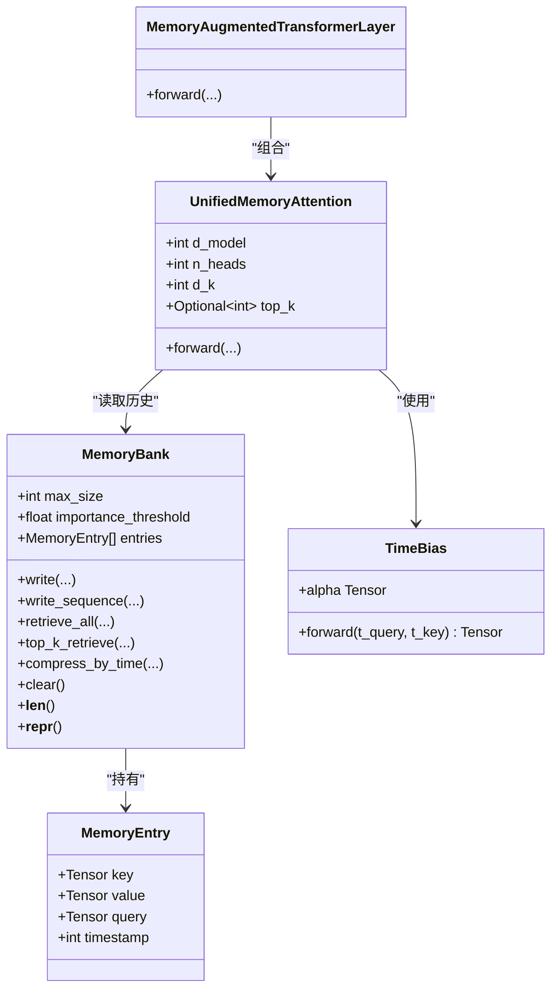
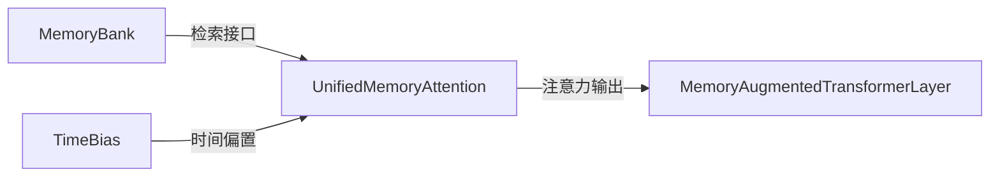

# 测试与质量保证

<cite>
**本文引用的文件**
- [src/memory_augmented_attention/__init__.py](file://src/memory_augmented_attention/__init__.py)
- [src/memory_augmented_attention/memory_bank.py](file://src/memory_augmented_attention/memory_bank.py)
- [src/memory_augmented_attention/attention.py](file://src/memory_augmented_attention/attention.py)
- [src/memory_augmented_attention/model.py](file://src/memory_augmented_attention/model.py)
- [tests/test_memory_bank.py](file://tests/test_memory_bank.py)
- [tests/test_attention.py](file://tests/test_attention.py)
- [pyproject.toml](file://pyproject.toml)
- [README.md](file://README.md)
- [.gitignore](file://.gitignore)
</cite>

## 目录
1. [引言](#引言)
2. [项目结构](#项目结构)
3. [核心组件](#核心组件)
4. [架构总览](#架构总览)
5. [详细组件分析](#详细组件分析)
6. [依赖分析](#依赖分析)
7. [性能考虑](#性能考虑)
8. [故障排查指南](#故障排查指南)
9. [结论](#结论)
10. [附录](#附录)

## 引言
本文件面向开发者与质量保障工程师，系统化阐述 Memory-Augmented Attention（MAA）项目的测试与质量保证策略。内容涵盖：
- 单元测试策略与覆盖范围：重点包括 MemoryBank 的完整测试用例与 Attention 模块的功能测试
- 测试方法论：边界条件测试、性能基准测试、回归测试
- 测试环境搭建与执行方法
- 测试结果标准与质量指标
- 测试驱动开发最佳实践与持续集成建议
- 编写新测试用例的指导原则

## 项目结构
项目采用“按功能分层”的组织方式，核心代码位于 src/memory_augmented_attention，测试位于 tests，构建与依赖在 pyproject.toml 中定义。

图表来源
- [src/memory_augmented_attention/memory_bank.py:1-284](file://src/memory_augmented_attention/memory_bank.py#L1-L284)
- [src/memory_augmented_attention/attention.py:1-322](file://src/memory_augmented_attention/attention.py#L1-L322)
- [src/memory_augmented_attention/model.py:1-134](file://src/memory_augmented_attention/model.py#L1-L134)
- [src/memory_augmented_attention/__init__.py:1-28](file://src/memory_augmented_attention/__init__.py#L1-L28)
- [tests/test_memory_bank.py:1-189](file://tests/test_memory_bank.py#L1-L189)
- [tests/test_attention.py:1-231](file://tests/test_attention.py#L1-L231)
- [pyproject.toml:15-18](file://pyproject.toml#L15-L18)

章节来源
- [README.md: 374-394:374-394](file://README.md#L374-L394)
- [pyproject.toml: 1-L22:1-22](file://pyproject.toml#L1-L22)

## 核心组件
- MemoryBank：统一存储带时间戳的 (K, V, Q, t) 条目，支持写入、序列写入、Top-K 检索、全量检索、清理与按时间压缩等操作；具备重要性阈值过滤与 LRU 淘汰机制。
- TimeBias：可学习的时间衰减偏置模块，基于对数形式模拟人类记忆的幂律遗忘曲线。
- UnifiedMemoryAttention：多头注意力，支持从 MemoryBank 检索历史上下文，结合时间偏置与可选因果掩码；支持 top_k 限制注意力池规模。
- MemoryAugmentedTransformerLayer：带预归一化的编码器层，整合注意力子层与前馈网络，并维护残差连接。

章节来源
- [src/memory_augmented_attention/memory_bank.py: 43-L284:43-284](file://src/memory_augmented_attention/memory_bank.py#L43-L284)
- [src/memory_augmented_attention/attention.py: 40-L322:40-322](file://src/memory_augmented_attention/attention.py#L40-L322)
- [src/memory_augmented_attention/model.py: 27-L134:27-134](file://src/memory_augmented_attention/model.py#L27-L134)

## 架构总览
下图展示测试覆盖到的核心模块及其交互关系。

图表来源
- [src/memory_augmented_attention/memory_bank.py: 43-L284:43-284](file://src/memory_augmented_attention/memory_bank.py#L43-L284)
- [src/memory_augmented_attention/attention.py: 40-L322:40-322](file://src/memory_augmented_attention/attention.py#L40-L322)
- [src/memory_augmented_attention/model.py: 27-L134:27-134](file://src/memory_augmented_attention/model.py#L27-L134)

## 详细组件分析

### MemoryBank 测试策略与覆盖范围
- 构造与参数校验：验证默认构造、非法 max_size、非法 importance_threshold 的异常抛出。
- 写入与淘汰：单条写入、满容量时淘汰最旧条目、序列写入的时间戳连续性与返回值。
- 重要性阈值：低于阈值的条目被拒绝，高于阈值的条目被接受。
- 检索：空库检索报错、全量检索形状与顺序、Top-K 检索数量与时间顺序保持。
- 清理与压缩：清空后长度为零、按时间保留最新条目的正确性。
- 表示：repr 包含关键状态信息。

图表来源
- [tests/test_memory_bank.py: 26-L189:26-189](file://tests/test_memory_bank.py#L26-L189)
- [src/memory_augmented_attention/memory_bank.py: 82-L277:82-277](file://src/memory_augmented_attention/memory_bank.py#L82-L277)

章节来源
- [tests/test_memory_bank.py: 26-L189:26-189](file://tests/test_memory_bank.py#L26-L189)

### Attention 模块测试策略与覆盖范围
- TimeBias：输出形状、零时滞对角线为零、随滞后增大惩罚更重、alpha 可学习（梯度存在）。
- UnifiedMemoryAttention（无 MemoryBank）：输出形状、数值稳定性（有限）、不可整除维度报错、梯度可流动。
- UnifiedMemoryAttention（有 MemoryBank）：输出形状、写入 bank 的增长、关闭写入标志不写入、top_k 限制注意力池大小、跨两次前向累积记忆导致输出差异。
- MemoryAugmentedTransformerLayer：输出形状、残差连接改变输出、带 MemoryBank 的多次前向累积、梯度可流动、无 MemoryBank 亦可用。

图表来源
- [src/memory_augmented_attention/attention.py: 181-L322:181-322](file://src/memory_augmented_attention/attention.py#L181-L322)
- [src/memory_augmented_attention/memory_bank.py: 203-L253:203-253](file://src/memory_augmented_attention/memory_bank.py#L203-L253)
- [src/memory_augmented_attention/attention.py: 73-L93:73-93](file://src/memory_augmented_attention/attention.py#L73-L93)

章节来源
- [tests/test_attention.py: 17-L231:17-231](file://tests/test_attention.py#L17-L231)

### 类关系与依赖（代码级）

图表来源
- [src/memory_augmented_attention/memory_bank.py: 33-L284:33-284](file://src/memory_augmented_attention/memory_bank.py#L33-L284)
- [src/memory_augmented_attention/attention.py: 40-L322:40-322](file://src/memory_augmented_attention/attention.py#L40-L322)
- [src/memory_augmented_attention/model.py: 27-L134:27-134](file://src/memory_augmented_attention/model.py#L27-L134)

## 依赖分析
- 组件内聚与耦合
  - MemoryBank 与 Attention 的耦合点在于检索接口与设备一致性；通过 retrieve_all/top_k_retrieve 返回张量并在 Attention 中进行拼接与注意力计算。
  - TimeBias 作为纯函数式模块，与 Attention 的耦合为简单调用，便于独立测试。
  - MemoryAugmentedTransformerLayer 将注意力与前馈网络组合，测试时可分别验证子模块行为。
- 外部依赖
  - PyTorch 为唯一硬依赖；可选依赖 pytest 用于测试。
- 潜在循环依赖
  - 当前模块间无循环导入，结构清晰。

图表来源
- [src/memory_augmented_attention/attention.py: 241-L322:241-322](file://src/memory_augmented_attention/attention.py#L241-L322)
- [src/memory_augmented_attention/memory_bank.py: 169-L253:169-253](file://src/memory_augmented_attention/memory_bank.py#L169-L253)
- [src/memory_augmented_attention/model.py: 87-L134:87-134](file://src/memory_augmented_attention/model.py#L87-L134)

章节来源
- [pyproject.toml: 11-L18:11-18](file://pyproject.toml#L11-L18)

## 性能考虑
- 复杂度与可扩展性
  - 全量注意力复杂度随历史长度线性增长，项目提供了三种缓解策略：Top-K 检索、按时间压缩、LRU 淘汰。测试应覆盖不同规模输入下的性能表现与内存占用。
- 计算热点
  - 注意力 logits 计算、时间偏置矩阵生成、Top-K 排序与堆栈操作是主要热点，需关注设备迁移与内存碎片。
- 基准测试建议
  - 使用不同 batch size、序列长度、历史容量、top_k 设置进行端到端吞吐与延迟测量。
  - 对比启用/禁用 MemoryBank、top_k 限制、因果掩码对性能的影响。
- 回归测试
  - 在关键超参变化（如 top_k、init_alpha、importance_threshold）时运行回归测试，确保性能不退化。

## 故障排查指南
- 常见错误与定位
  - 空 MemoryBank 检索：调用 retrieve_all/top_k_retrieve 前需确保 bank 非空，否则会抛出运行时错误。可在测试中复现该异常以验证处理逻辑。
  - 维度不匹配：当 d_model 不能被 n_heads 整除时，构造函数会抛出异常。可通过参数扰动测试快速发现。
  - 设备不一致：MemoryBank 支持指定设备，Attention 中对齐设备避免 CUDA/主机数据拷贝引发的性能问题。
- 调试技巧
  - 使用较小的 batch 和序列长度快速复现问题。
  - 打开梯度检查，确认反向传播路径正常。
  - 对比启用/禁用 MemoryBank 的输出差异，验证记忆是否按预期生效。

章节来源
- [tests/test_memory_bank.py: 107-L111:107-111](file://tests/test_memory_bank.py#L107-L111)
- [tests/test_attention.py: 85-L88:85-88](file://tests/test_attention.py#L85-L88)
- [src/memory_augmented_attention/attention.py: 27-L31:27-31](file://src/memory_augmented_attention/attention.py#L27-L31)

## 结论
本项目的测试体系围绕 MemoryBank 与 Attention 的核心功能展开，覆盖了构造、写入/淘汰、检索、时间偏置、注意力计算与 Transformer 层组合等关键环节。通过边界条件、形状与数值稳定性、梯度流动、跨前向累积记忆等多维测试，能够有效保障模块正确性与鲁棒性。建议在后续迭代中补充性能基准与回归测试，完善持续集成流程，并引入更多边界与压力场景以提升覆盖率。

## 附录

### 测试环境搭建与执行
- 安装
  - 使用可编辑安装包含开发依赖，以便运行测试。
- 运行
  - 使用 pytest 执行 tests 目录下的全部测试用例。
- 缓存与忽略
  - .pytest_cache 与 .cache 由 pytest 使用；.gitignore 已排除常见缓存与虚拟环境目录。

章节来源
- [README.md: 422-L427:422-427](file://README.md#L422-L427)
- [pyproject.toml: 15-L18:15-18](file://pyproject.toml#L15-L18)
- [.gitignore: 19-L27:19-27](file://.gitignore#L19-L27)

### 测试结果标准与质量指标
- 正确性
  - 形状一致性：输出张量形状与输入一致，符合模块文档描述。
  - 数值稳定性：输出应为有限值，无 NaN/Inf。
  - 语义正确性：时间偏置对角为零、随滞后增大惩罚更重、Top-K 保持时间顺序。
- 可靠性
  - 异常路径：非法参数触发明确异常；空 bank 检索抛出运行时错误。
  - 残差与梯度：残差连接使输出不同于输入；反向传播可产生梯度。
- 可维护性
  - 可读性：测试命名清晰，断言明确。
  - 可扩展性：新增功能时可复用现有测试模式与辅助函数。

### 测试驱动开发最佳实践
- 先写失败的测试，再实现最小可行逻辑
- 优先覆盖边界条件与异常路径
- 将复杂逻辑拆分为小而可测的子功能
- 使用参数化测试覆盖多种输入组合
- 保持测试独立，避免共享状态

### 持续集成配置建议
- 触发条件
  - push 到主分支与拉取请求
- 步骤
  - 安装依赖（含 dev）
  - 运行 pytest 并生成报告
  - 可选：覆盖率统计（如 pytest-cov）
- 缓存
  - 缓存 pip 依赖以加速构建

章节来源
- [pyproject.toml: 15-L18:15-18](file://pyproject.toml#L15-L18)
- [README.md: 422-L427:422-427](file://README.md#L422-L427)

### 编写新测试用例的指导原则
- 明确目标：每个测试聚焦单一行为或边界条件
- 参数化：对关键超参与输入规模进行参数化
- 辅助工具：复用现有辅助函数（如随机张量生成），减少重复
- 断言策略：优先断言关键属性（形状、设备、数值范围、顺序），其次断言异常类型
- 可重现：必要时设置随机种子，确保结果可复现
- 文档化：在测试类/方法中简要说明测试意图与期望结果