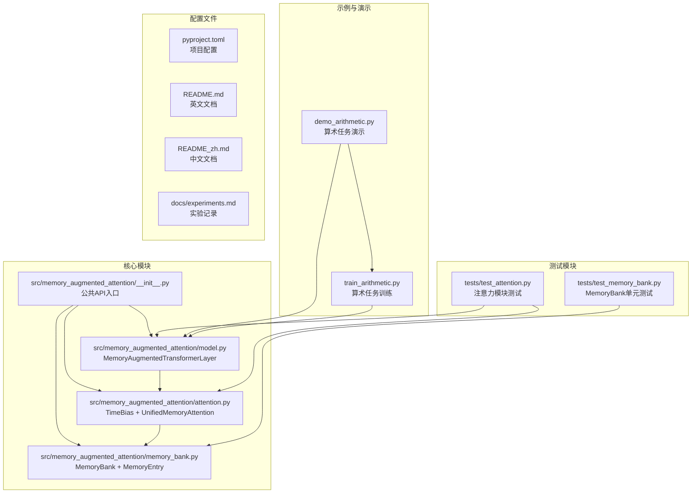
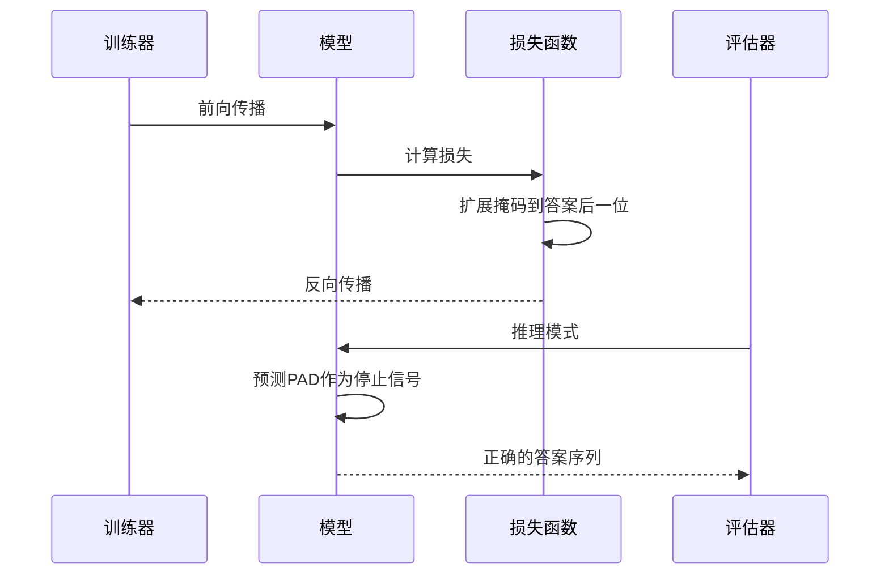
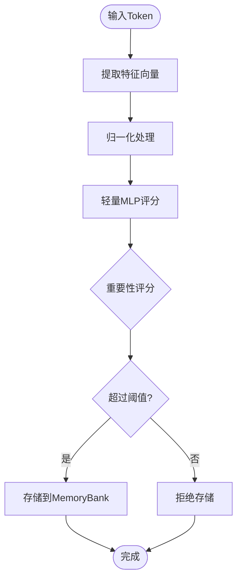
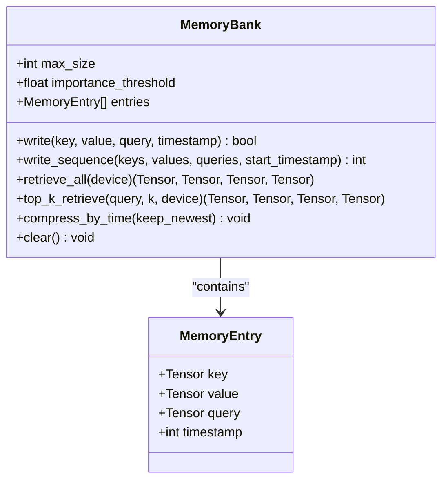
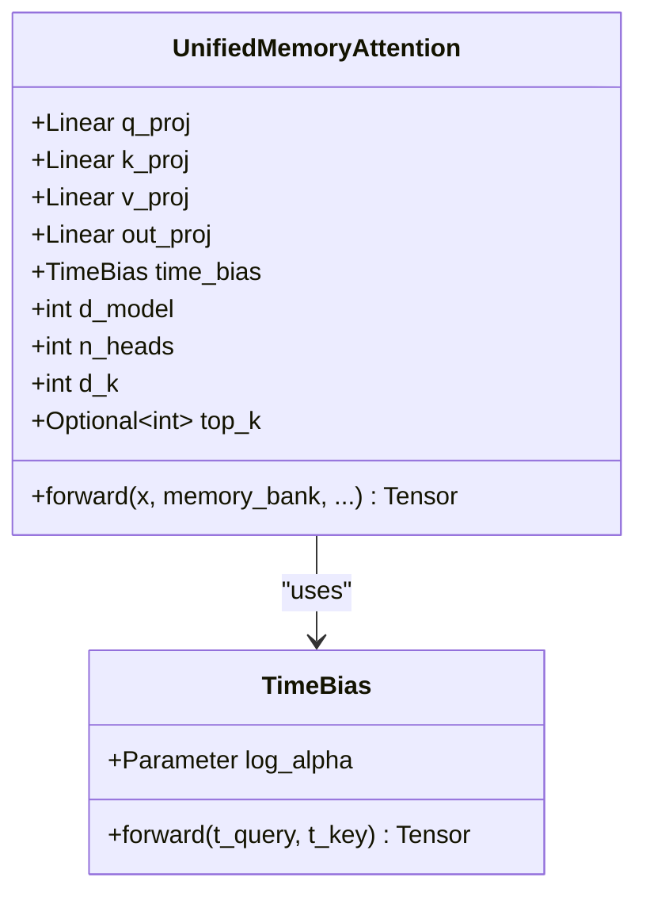
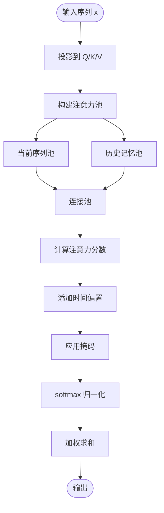
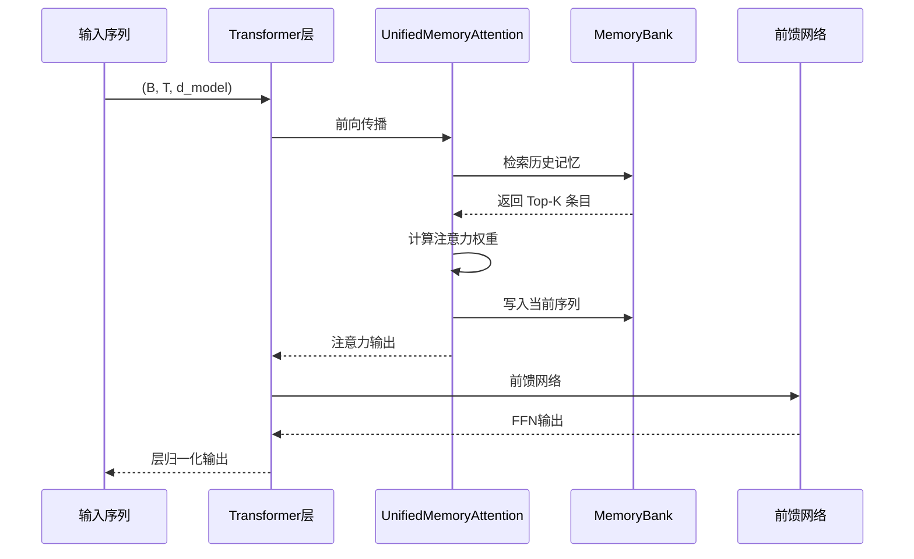
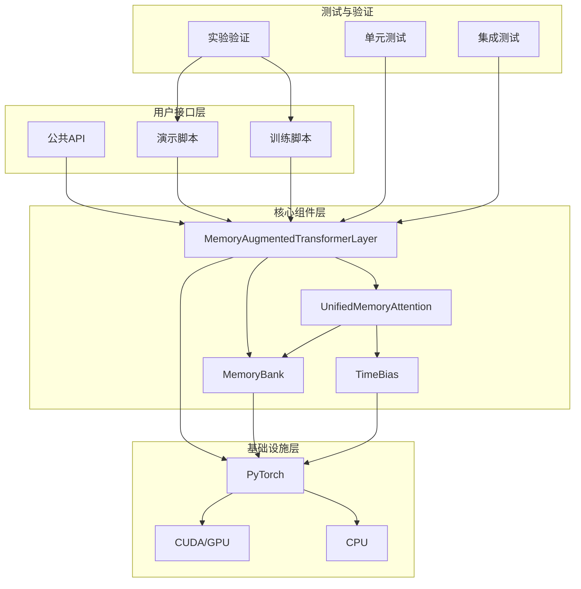

# 路线图与未来规划

<cite>
**本文档引用的文件**
- [README.md](file://README.md)
- [README_zh.md](file://README_zh.md)
- [docs/experiments.md](file://docs/experiments.md)
- [src/memory_augmented_attention/__init__.py](file://src/memory_augmented_attention/__init__.py)
- [src/memory_augmented_attention/memory_bank.py](file://src/memory_augmented_attention/memory_bank.py)
- [src/memory_augmented_attention/attention.py](file://src/memory_augmented_attention/attention.py)
- [src/memory_augmented_attention/model.py](file://src/memory_augmented_attention/model.py)
- [tests/test_attention.py](file://tests/test_attention.py)
- [tests/test_memory_bank.py](file://tests/test_memory_bank.py)
- [demo_arithmetic.py](file://demo_arithmetic.py)
- [train_arithmetic.py](file://train_arithmetic.py)
- [pyproject.toml](file://pyproject.toml)
</cite>

## 目录
1. [简介](#简介)
2. [项目结构](#项目结构)
3. [已完成里程碑](#已完成里程碑)
4. [进行中的开发工作](#进行中的开发工作)
5. [未来规划方向](#未来规划方向)
6. [技术挑战与预期收益](#技术挑战与预期收益)
7. [社区贡献指南](#社区贡献指南)
8. [版本发布计划](#版本发布计划)
9. [兼容性考虑](#兼容性考虑)
10. [详细组件分析](#详细组件分析)
11. [架构概览](#架构概览)
12. [性能考量](#性能考量)
13. [故障排除指南](#故障排除指南)
14. [结论](#结论)

## 简介

Memory-Augmented Attention (MAA) 是一个基于 PyTorch 的统一记忆增强注意力实现。该项目的核心创新在于将当前序列的 token（短期记忆）与历史 KV 对（长期记忆）统一存储在带时间戳的共享 Memory Bank 中，并通过时间衰减偏置进行联合注意力计算。

MAA 的设计理念源于对传统 Transformer 的深刻洞察：序列 token 本身就可以被视为短期记忆，无需将其与历史记忆视为两个独立的类别。通过引入时间维度，注意力机制能够自然地对更久远的记忆条目进行降权处理。

该项目已经通过算术教学任务验证了其核心假设，展示了在教学-测试分离场景下的强大能力。目前项目处于快速发展阶段，正在从单一时间维度扩展到多维度动态权重系统。

## 项目结构



**图表来源**
- [src/memory_augmented_attention/__init__.py:1-28](file://src/memory_augmented_attention/__init__.py#L1-L28)
- [src/memory_augmented_attention/memory_bank.py:1-284](file://src/memory_augmented_attention/memory_bank.py#L1-L284)
- [src/memory_augmented_attention/attention.py:1-322](file://src/memory_augmented_attention/attention.py#L1-L322)
- [src/memory_augmented_attention/model.py:1-134](file://src/memory_augmented_attention/model.py#L1-L134)

**章节来源**
- [README.md:374-393](file://README.md#L374-L393)
- [pyproject.toml:1-22](file://pyproject.toml#L1-L22)

## 已完成里程碑

### 1. 因果掩码支持

**技术实现**：
- 在 `UnifiedMemoryAttention` 中实现了完整的因果掩码支持
- 掩码仅应用于当前序列部分，历史记忆条目始终可见
- 支持 `(T, T_all)` 或 `(B, H, T, T_all)` 形状的注意力掩码

**功能特性**：
- 自回归训练和推理完全支持
- 防止注意力泄漏，确保 teacher-forcing 场景下的正确性
- 保持历史记忆的完整性，避免对过去信息的窥探

**预期收益**：
- 解决了训练过程中注意力泄漏的问题
- 使模型能够在自回归场景中正确学习
- 为后续的长序列建模奠定了基础

**章节来源**
- [src/memory_augmented_attention/attention.py:288-298](file://src/memory_augmented_attention/attention.py#L288-L298)
- [docs/experiments.md:96-113](file://docs/experiments.md#L96-L113)

### 2. 教学-测试分离验证

**实验设计**：
通过算术教学任务验证了三个核心假设：

| 条件 | 描述 | L2（训练内分布） |
|------|------|------------------|
| **Cold** | 无演示，纯权重 | **100%** |
| **Prefix** | 5条正确演示前置 | **100%** |
| **PrefixNoisy** | 3正确 + 2错误演示（标N） | **100%** |
| **Bank** | 演示预写入MemoryBank，查询单独输入 | **89.5%** |

**关键发现**：
- **统一记忆假设**：Bank 模式 89.5% 与 Prefix 模式 100% 接近，证明 demos 能够有效检索
- **可信度判决假设**：PrefixNoisy 100% 证明模型能读取 Y/N 标记并忽略错误演示
- **教学-测试分离假设**：训练内分布完美，OOD 泛化失败是模型容量问题

**章节来源**
- [docs/experiments.md:55-93](file://docs/experiments.md#L55-L93)
- [demo_arithmetic.py:266-320](file://demo_arithmetic.py#L266-L320)

### 3. 停止信号监督

**问题识别**：
- 训练时 eval_acc 1.0，但测试时答案多生成一位（如 `0+4=` → `44`）
- 原因：loss 只监督答案位置，答案后的 PAD 位置无监督

**解决方案**：
- 扩展掩码到 `ans_end + 1` 位置
- 让模型学会在答案结束后预测 PAD
- 解决了贪婪解码溢出问题

**技术实现**：


**图表来源**
- [train_arithmetic.py:186-193](file://train_arithmetic.py#L186-L193)
- [docs/experiments.md:106-112](file://docs/experiments.md#L106-L112)

**章节来源**
- [docs/experiments.md:106-112](file://docs/experiments.md#L106-L112)
- [train_arithmetic.py:186-193](file://train_arithmetic.py#L186-L193)

## 进行中的开发工作

### 1. 多维度动态权重

**设计演进**：
从单一 `TimeBias` 扩展为可学习的多维度权重系统：

```
MemoryBias(entry) = w_time·f_time + w_verdict·f_verdict + w_freq·f_freq + w_source·f_source
```

其中权重 `[w_time, w_verdict, w_freq, w_source]` 由当前查询通过轻量 MLP 动态决定。

**维度权重设计**：

| 维度 | 函数 | 典型场景权重 | 说明 |
|------|------|-------------|------|
| **时间** `f_time` | `exp(-Δt/τ)` | 对话历史高，数学教学低 | 最近信息更重要 |
| **可信度** `f_verdict` | `[-1, +1]`（N→Y） | 教学演示高，闲聊低 | 正确性优先于新旧 |
| **频率** `f_freq` | `log(1 + access_count)` | 代码补全高，一次性查询低 | 使用次数决定重要性 |
| **来源** `f_source` | `[0, 1]` 权威性 | 知识问答高，匿名论坛低 | 权威性影响可信度 |

**技术挑战**：
- 设计轻量级 MLP 来动态生成权重向量
- 确保不同维度的权重具有合适的尺度和范围
- 实现维度间的平衡，避免某些维度过度主导

**预期收益**：
- 更精确的记忆检索和排序
- 支持不同场景下的差异化记忆策略
- 提升模型在复杂任务中的表现

**章节来源**
- [README.md:117-140](file://README.md#L117-L140)
- [README_zh.md:97-115](file://README_zh.md#L97-L115)

### 2. 记忆类型系统

**类型划分**：

| 记忆类型 | 示例 | 主导维度 | 理由 |
|----------|------|----------|------|
| **情景型** (episodic) | "用户昨天说喜欢蓝色" | 时间 + 频率 | 旧信息价值下降，常用信息保留 |
| **知识型** (semantic) | "1+1=2" | 可信度 + 来源 | 正确性不因时间改变 |
| **程序型** (procedural) | "怎么骑自行车" | 频率 | 熟能生巧，使用次数决定熟练度 |

**实现策略**：
- 为不同记忆类型设置不同的维度权重先验
- 支持动态类型识别和分类
- 允许类型间的灵活转换

**技术挑战**：
- 设计有效的记忆类型识别机制
- 实现类型权重的自适应调整
- 处理跨类型的记忆融合

**预期收益**：
- 更精细的记忆管理
- 支持不同类型任务的专门化处理
- 提升长期记忆的组织效率

**章节来源**
- [README.md:285-294](file://README.md#L285-L294)
- [README_zh.md:268-277](file://README_zh.md#L268-L277)

### 3. 可学习归纳/总结

**设计目标**：
用小模型把若干旧条目聚合成语义摘要条目，实现真正的"无限记忆、有限显存"。

**技术方案**：
- 开发轻量级聚合模型
- 实现基于语义相似度的条目分组
- 设计高效的摘要向量生成机制

**技术挑战**：
- 确保摘要信息的完整性和准确性
- 控制聚合过程的计算开销
- 实现与现有注意力机制的无缝集成

**预期收益**：
- 实现真正的无限记忆容量
- 显著提升内存使用效率
- 支持更长时间跨度的上下文建模

**章节来源**
- [README.md:126-150](file://README.md#L126-L150)
- [README_zh.md:126-150](file://README_zh.md#L126-L150)

## 未来规划方向

### 1. 分层记忆

**架构设计**：
将记忆库按时效分为热/温/冷三层，分配不同检索预算：

```
近期 token（< N 步）   → 全量注意力
较旧 token             → 仅 Top-K 检索
超出物理上限           → 归纳/总结成摘要向量
```

**实现策略**：
- 热层：最近 1000 步，全量注意力
- 温层：1000-10000 步，Top-K 检索
- 冷层：>10000 步，压缩摘要或磁盘存储

**技术挑战**：
- 设计高效的时间分层机制
- 实现跨层级的统一检索接口
- 优化不同层级间的切换性能

**预期收益**：
- 更精细的记忆层次管理
- 提升大规模记忆场景的性能
- 支持跨时间尺度的灵活检索

**章节来源**
- [README.md:144-169](file://README.md#L144-L169)
- [README_zh.md:144-150](file://README_zh.md#L144-L150)

### 2. 可学习重要性评分

**现状分析**：
当前使用 L2 范数作为重要性过滤器，存在以下局限：
- 无法区分不同类型的有用信息
- 对噪声和异常值敏感
- 缺乏对语义重要性的考虑

**改进方案**：
用小型 MLP 替代 L2 范数过滤器，预测 token 是否值得存储。

**技术实现**：


**技术挑战**：
- 设计有效的特征表示
- 训练可学习的重要性评分模型
- 平衡存储成本和检索效果

**预期收益**：
- 更精确的存储决策
- 提升记忆库的质量
- 降低无效存储的空间开销

**章节来源**
- [README.md:141-148](file://README.md#L141-L148)
- [README_zh.md:117-122](file://README_zh.md#L117-L122)

### 3. 跨层共享记忆库

**设计目标**：
在多层 Transformer 的所有层共享同一个 MemoryBank，实现真正的端到端记忆增强。

**技术实现**：
- 在模型初始化时创建共享 MemoryBank
- 每层的注意力计算共享同一份记忆
- 统一的记忆更新和检索机制

**技术挑战**：
- 确保多层共享的一致性
- 设计高效的跨层通信机制
- 处理不同层的注意力权重差异

**预期收益**：
- 更强的记忆一致性
- 提升多层上下文的理解能力
- 简化记忆管理的复杂度

**章节来源**
- [README.md:415](file://README.md#L415)
- [README_zh.md:397](file://README_zh.md#L397)

### 4. 稀疏注意力集成

**结合策略**：
将 Top-K 检索与 Longformer 风格的局部窗口注意力相结合。

**实现方案**：
- 在局部窗口内使用全量注意力
- 在长距离依赖上使用 Top-K 检索
- 动态调整窗口大小和检索预算

**技术挑战**：
- 设计高效的混合注意力机制
- 优化计算和内存使用
- 实现自适应的窗口选择策略

**预期收益**：
- 更好的长距离依赖建模
- 提升大规模场景的性能
- 保持计算效率的同时扩大上下文

**章节来源**
- [README.md:416](file://README.md#L416)
- [README_zh.md:398](file://README_zh.md#L398)

### 5. 长对话基准

**评估目标**：
在 100+ 轮对话中验证 bank 的记忆持久性与时间衰减行为。

**评估指标**：
- 记忆保持率随对话轮次的变化
- 不同类型记忆的衰减模式
- 对话连贯性和一致性

**技术挑战**：
- 设计真实的长对话场景
- 量化记忆质量的评估方法
- 控制评估过程中的变量

**预期收益**：
- 更深入理解长期记忆机制
- 为记忆增强系统提供基准测试
- 指导记忆管理策略的优化

**章节来源**
- [README.md:417](file://README.md#L417)
- [README_zh.md:399](file://README_zh.md#L399)

### 6. 不确定性 token

**设计目标**：
扩展词表增加 `U`（Uncertain）token，让模型在记忆冲突时表达"无法判断"。

**实现机制**：
- 在词表中添加不确定性标记
- 训练模型识别和处理不确定信息
- 设计相应的推理策略

**技术挑战**：
- 确保不确定性标记的语义清晰
- 训练模型正确使用不确定性表达
- 实现与现有注意力机制的兼容

**预期收益**：
- 提升模型的诚实性和可靠性
- 改善在不确定情况下的表现
- 为用户提供更好的交互体验

**章节来源**
- [README.md:418](file://README.md#L418)
- [README_zh.md:400](file://README_zh.md#L400)

## 技术挑战与预期收益

### 技术挑战分析

**1. 复杂度与可扩展性**
- **挑战**：对整个记忆库做全量注意力的复杂度为 O((L + M)² · d)，随着 M 增长会爆炸
- **现状**：通过 Top-K 检索、归纳/总结和 LRU 兜底三种策略控制复杂度
- **未来**：需要更智能的分层管理和自适应策略

**2. 记忆质量与有效性**
- **挑战**：如何确保存储的记忆是有价值的，避免"信息污染"
- **现状**：使用 L2 范数作为重要性过滤器
- **未来**：开发可学习的重要性评分模型

**3. 记忆一致性与冲突处理**
- **挑战**：多来源、多时间的记忆可能存在冲突
- **现状**：通过时间衰减和权重机制进行平衡
- **未来**：需要更复杂的冲突检测和解决机制

**4. 计算效率与内存使用**
- **挑战**：在保持性能的同时扩大记忆容量
- **现状**：通过压缩和分层管理缓解压力
- **未来**：需要更高效的存储和检索算法

### 预期收益评估

**1. 性能提升**
- 更精确的记忆检索和排序
- 支持更长的有效上下文
- 提升复杂任务的处理能力

**2. 应用扩展**
- 更适合需要长期记忆的应用场景
- 支持多轮对话和个性化助手
- 为知识密集型任务提供更好的基础

**3. 系统稳定性**
- 更好的内存管理机制
- 更稳定的性能表现
- 更强的鲁棒性

## 社区贡献指南

### 贡献类型

**1. 代码贡献**
- 新功能实现（如多维度权重、记忆类型系统）
- Bug 修复和性能优化
- 文档改进和示例代码

**2. 测试贡献**
- 单元测试和集成测试
- 性能基准测试
- 边界情况测试

**3. 文档贡献**
- 使用指南和最佳实践
- 架构设计文档
- 教学材料和教程

### 开发流程

**1. 环境准备**
```bash
# 克隆仓库
git clone https://github.com/your-username/memory-augmented-attention.git
cd memory-augmented-attention

# 安装开发依赖
pip install -e ".[dev]"

# 运行测试
pytest tests/ -v
```

**2. 代码规范**
- 遵循 PEP 8 编码规范
- 提供详细的 docstring
- 添加必要的类型注解
- 编写对应的单元测试

**3. 提交流程**
```bash
# 创建功能分支
git checkout -b feature/multi-dimensional-weights

# 开发和测试
# ... 实现功能 ...

# 运行测试
pytest tests/ -v

# 提交代码
git add .
git commit -m "Add multi-dimensional dynamic weights support"

# 推送到远程
git push origin feature/multi-dimensional-weights

# 创建 Pull Request
```

### 开发建议

**1. 模块化设计**
- 保持模块间的低耦合
- 提供清晰的接口定义
- 考虑 backward compatibility

**2. 性能优化**
- 优先考虑内存效率
- 避免不必要的张量拷贝
- 利用 PyTorch 的优化特性

**3. 测试覆盖**
- 为每个新功能编写测试
- 覆盖边界情况和异常处理
- 包含性能基准测试

**章节来源**
- [README.md:422-427](file://README.md#L422-L427)
- [pyproject.toml:15-18](file://pyproject.toml#L15-L18)

## 版本发布计划

### 当前版本状态

**版本 0.1.0**
- 已完成核心功能实现
- 通过算术教学任务验证
- 提供完整的 API 和文档

### 版本规划

**版本 0.2.0（预计 2024年Q2）**
- 多维度动态权重系统
- 记忆类型识别机制
- 基础性能优化

**版本 0.3.0（预计 2024年Q3）**
- 可学习归纳/总结
- 分层记忆架构
- 长对话基准测试

**版本 0.4.0（预计 2024年Q4）**
- 稀疏注意力集成
- 跨层共享记忆库
- 生产环境优化

**版本 1.0.0（预计 2025年Q1）**
- 稳定的生产版本
- 完整的生态系统
- 商业应用支持

### 发布策略

**1. 版本号规则**
- 主版本号：重大架构变更
- 次版本号：新增功能
- 修订版本号：bug 修复和小改进

**2. 兼容性保证**
- 严格遵循语义化版本控制
- 提供迁移指南
- 保持向后兼容性

**3. 发布周期**
- 每季度发布一次主要版本
- 按需发布紧急修复版本
- 持续提供文档更新

## 兼容性考虑

### 向后兼容性

**1. API 兼容性**
- 保持现有 API 的稳定性
- 提供 deprecation warnings 而非 breaking changes
- 为重大变更提供迁移工具

**2. 数据格式兼容性**
- 保持 MemoryBank 的数据格式稳定
- 提供数据格式升级工具
- 支持旧版本数据的导入

**3. 训练兼容性**
- 保持训练脚本的向后兼容
- 提供预训练模型的迁移路径
- 支持不同版本间的权重转换

### 环境兼容性

**1. Python 版本**
- 支持 Python 3.9+
- 测试在主要 Python 版本上的兼容性
- 提供最低版本要求说明

**2. PyTorch 版本**
- 支持 PyTorch 2.0+
- 测试在不同 PyTorch 版本上的功能
- 提供版本特定的优化

**3. 硬件兼容性**
- 支持 CPU 和 GPU 训练
- 优化内存使用以支持不同硬件配置
- 提供混合精度训练支持

### 迁移指南

**1. 从旧版本升级**
```python
# 旧版本
from memory_augmented_attention import MemoryBank, UnifiedMemoryAttention

# 新版本（保持兼容）
from memory_augmented_attention import MemoryBank, UnifiedMemoryAttention
```

**2. 配置迁移**
- 检查过时的参数名称
- 更新默认参数值
- 验证新版本的性能

**3. 测试验证**
- 运行现有测试套件
- 验证功能的正确性
- 检查性能回归

## 详细组件分析

### MemoryBank 组件



**图表来源**
- [src/memory_augmented_attention/memory_bank.py:33-284](file://src/memory_augmented_attention/memory_bank.py#L33-L284)

**核心功能**：
- **存储管理**：维护固定容量的记忆条目列表
- **重要性过滤**：基于 L2 范数的重要度检查
- **检索机制**：支持全量检索和 Top-K 检索
- **压缩功能**：按时间保留最新条目

**性能特点**：
- 写入操作：O(1) 平均时间复杂度
- 检索操作：O(N) 线性复杂度
- 内存使用：固定上限，避免 OOM

**章节来源**
- [src/memory_augmented_attention/memory_bank.py:43-284](file://src/memory_augmented_attention/memory_bank.py#L43-L284)
- [tests/test_memory_bank.py:1-189](file://tests/test_memory_bank.py#L1-L189)

### UnifiedMemoryAttention 组件



**图表来源**
- [src/memory_augmented_attention/attention.py:40-322](file://src/memory_augmented_attention/attention.py#L40-L322)

**核心机制**：
- **统一注意力**：将当前序列和历史记忆统一处理
- **时间衰减**：通过对数函数实现幂律遗忘
- **因果掩码**：防止信息泄露到未来位置
- **Top-K 检索**：控制计算复杂度

**计算流程**：


**图表来源**
- [src/memory_augmented_attention/attention.py:181-322](file://src/memory_augmented_attention/attention.py#L181-L322)

**章节来源**
- [src/memory_augmented_attention/attention.py:101-322](file://src/memory_augmented_attention/attention.py#L101-L322)
- [tests/test_attention.py:66-231](file://tests/test_attention.py#L66-L231)

### MemoryAugmentedTransformerLayer 组件



**图表来源**
- [src/memory_augmented_attention/model.py:27-134](file://src/memory_augmented_attention/model.py#L27-L134)

**架构特点**：
- **预归一化**：采用 pre-norm 架构
- **残差连接**：两处残差连接
- **可配置性**：支持多种超参数配置
- **向后兼容**：可替代标准 Transformer 层

**章节来源**
- [src/memory_augmented_attention/model.py:27-134](file://src/memory_augmented_attention/model.py#L27-L134)

## 架构概览



**图表来源**
- [src/memory_augmented_attention/__init__.py:18-27](file://src/memory_augmented_attention/__init__.py#L18-L27)
- [src/memory_augmented_attention/model.py:27-134](file://src/memory_augmented_attention/model.py#L27-L134)
- [src/memory_augmented_attention/attention.py:101-322](file://src/memory_augmented_attention/attention.py#L101-L322)
- [src/memory_augmented_attention/memory_bank.py:43-284](file://src/memory_augmented_attention/memory_bank.py#L43-L284)

## 性能考量

### 计算复杂度分析

**注意力计算**：
- **全量注意力**：O((L + M)² · d)
- **Top-K 检索**：O(L · K · d)
- **归纳/总结**：O(L · d)

**内存使用**：
- **MemoryBank**：O(M · d)
- **注意力权重**：O(L · (M + L))
- **中间结果**：O(L · d)

### 优化策略

**1. 分层处理**
```
近期 token（< N 步）   → 全量注意力
较旧 token             → 仅 Top-K 检索
超出物理上限           → 归纳/总结成摘要向量
```

**2. 内存管理**
- 使用 LRU 作为兜底策略
- 定期压缩旧条目
- 支持手动清理和优化

**3. 计算优化**
- 利用 PyTorch 的优化特性
- 避免不必要的张量拷贝
- 实现高效的向量化操作

## 故障排除指南

### 常见问题诊断

**1. 记忆库过大导致内存不足**
- **症状**：OOM 错误或性能急剧下降
- **解决方案**：调用 `compress_by_time()` 或减少 `max_size`
- **预防**：定期监控 MemoryBank 大小

**2. 注意力泄漏问题**
- **症状**：训练准确率很高但测试效果差
- **解决方案**：确保 `causal=True` 参数正确设置
- **验证**：检查掩码的形状和值

**3. 记忆质量不佳**
- **症状**：模型无法有效利用历史信息
- **解决方案**：调整 `importance_threshold` 和 `top_k` 参数
- **优化**：考虑实现可学习的重要性评分

**4. 性能瓶颈**
- **症状**：计算时间过长或内存占用过高
- **解决方案**：使用 Top-K 检索和分层记忆
- **监控**：跟踪计算复杂度和内存使用

### 调试工具

**1. 日志和监控**
- 记录 MemoryBank 的大小变化
- 监控注意力权重的分布
- 跟踪计算时间消耗

**2. 性能分析**
- 使用 PyTorch Profiler 分析热点
- 检查内存使用模式
- 识别潜在的内存泄漏

**3. 单元测试**
- 验证核心组件的功能正确性
- 测试边界情况和异常处理
- 确保向后兼容性

**章节来源**
- [tests/test_attention.py:17-231](file://tests/test_attention.py#L17-L231)
- [tests/test_memory_bank.py:1-189](file://tests/test_memory_bank.py#L1-189)
- [docs/experiments.md:96-129](file://docs/experiments.md#L96-L129)

## 结论

Memory-Augmented Attention 项目展现了在统一记忆增强注意力领域的创新成果。通过已完成的功能里程碑，项目已经证明了其在教学-测试分离场景下的强大能力。

当前进行中的开发工作为项目奠定了更加坚实的基础，特别是多维度动态权重、记忆类型系统和可学习归纳/总结等特性，将显著提升系统的智能化水平和实用性。

未来规划的方向涵盖了从分层记忆到不确定性处理的完整生态，这些功能将使 MAA 能够更好地适应真实世界的复杂应用场景。

对于社区贡献者而言，项目提供了清晰的发展路径和完善的开发工具。通过遵循既定的开发流程和代码规范，任何人都可以为这个激动人心的项目做出贡献。

随着版本发布的推进和技术的不断演进，Memory-Augmented Attention 有望成为长序列建模和记忆增强领域的重要基石，为人工智能系统的能力提升开辟新的可能性。