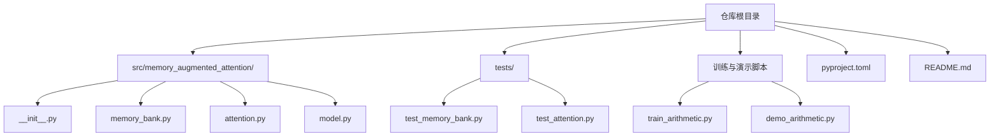
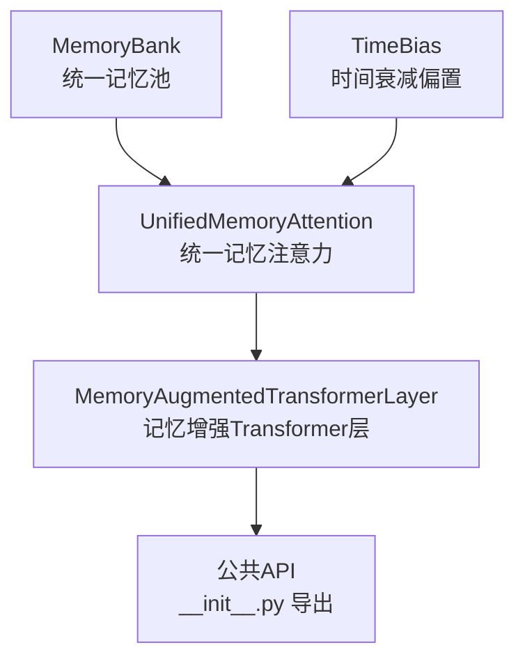
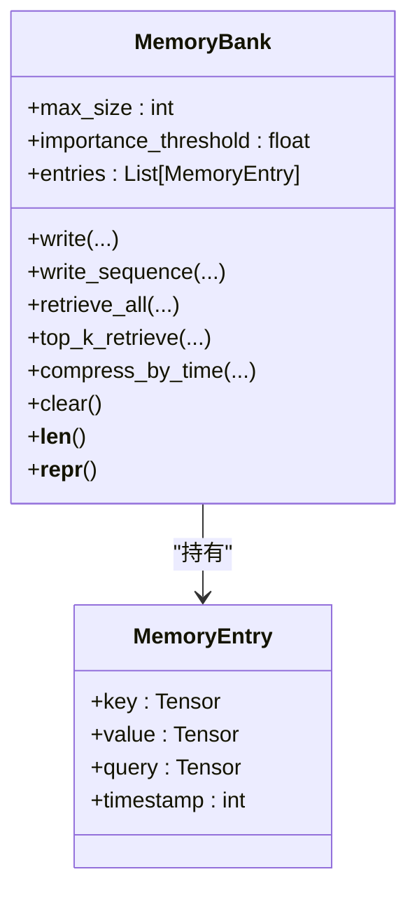
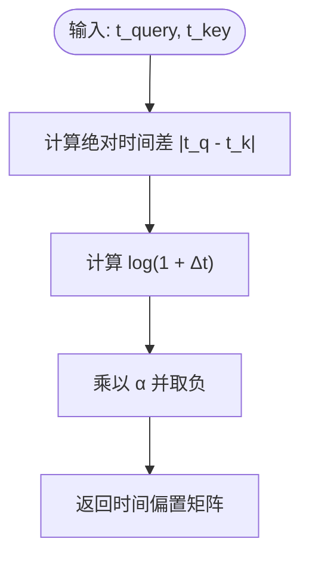
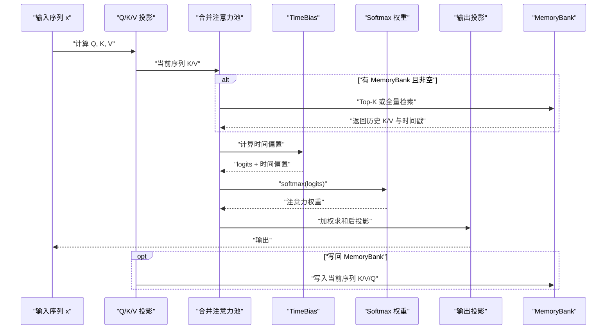
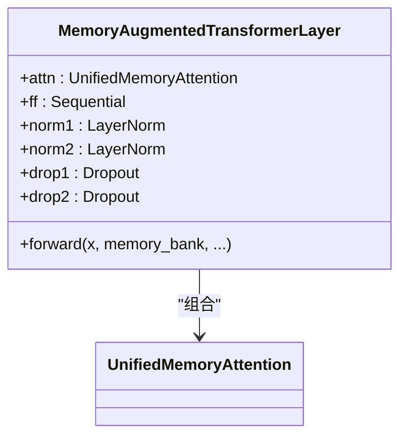
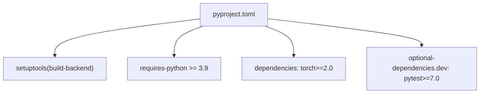

# 安装与配置

<cite>
**本文引用的文件**
- [README.md](file://README.md)
- [pyproject.toml](file://pyproject.toml)
- [src/memory_augmented_attention/__init__.py](file://src/memory_augmented_attention/__init__.py)
- [src/memory_augmented_attention/memory_bank.py](file://src/memory_augmented_attention/memory_bank.py)
- [src/memory_augmented_attention/attention.py](file://src/memory_augmented_attention/attention.py)
- [src/memory_augmented_attention/model.py](file://src/memory_augmented_attention/model.py)
- [tests/test_memory_bank.py](file://tests/test_memory_bank.py)
- [tests/test_attention.py](file://tests/test_attention.py)
- [demo_arithmetic.py](file://demo_arithmetic.py)
- [train_arithmetic.py](file://train_arithmetic.py)
</cite>

## 目录
1. [简介](#简介)
2. [项目结构](#项目结构)
3. [核心组件](#核心组件)
4. [架构总览](#架构总览)
5. [详细组件分析](#详细组件分析)
6. [依赖分析](#依赖分析)
7. [性能考虑](#性能考虑)
8. [故障排查指南](#故障排查指南)
9. [结论](#结论)
10. [附录](#附录)

## 简介
本指南面向首次安装与配置 Memory-Augmented Attention（MAA）项目的用户，覆盖以下内容：
- 环境要求：Python ≥ 3.9 和 PyTorch ≥ 2.0
- 完整安装步骤：可编辑安装 pip install -e ".[dev]"，包含测试依赖
- 项目配置文件 pyproject.toml 的关键信息解读：包元数据、依赖管理、构建配置
- 基本使用示例：导入 MemoryBank 与 MemoryAugmentedTransformerLayer 的简单代码片段路径
- 常见安装问题排查与解决方案
- 开发环境设置与测试运行方法
- 不同操作系统下的安装注意事项

## 项目结构
该项目采用标准的 Python 包结构，核心代码位于 src/memory_augmented_attention 下，测试位于 tests，训练与演示脚本位于根目录。

图表来源
- [pyproject.toml](file://pyproject.toml)
- [src/memory_augmented_attention/__init__.py](file://src/memory_augmented_attention/__init__.py)
- [tests/test_memory_bank.py](file://tests/test_memory_bank.py)
- [tests/test_attention.py](file://tests/test_attention.py)
- [train_arithmetic.py](file://train_arithmetic.py)
- [demo_arithmetic.py](file://demo_arithmetic.py)

章节来源
- [README.md:374-393](file://README.md#L374-L393)
- [pyproject.toml:1-22](file://pyproject.toml#L1-L22)

## 核心组件
- MemoryBank：统一存储当前序列与历史 KV 的时间戳化内存池，支持写入、检索（全量/Top-K）、压缩与清理等操作。
- TimeBias：可学习的时间衰减偏置模块，用于在注意力分数中加入对时间距离的惩罚项。
- UnifiedMemoryAttention：统一记忆增强多头注意力，将当前序列与 MemoryBank 合并为一个注意力池。
- MemoryAugmentedTransformerLayer：基于统一记忆注意力的完整编码器层（注意力 + 残差归一化 + 前馈网络）。

章节来源
- [src/memory_augmented_attention/__init__.py:10-27](file://src/memory_augmented_attention/__init__.py#L10-L27)
- [src/memory_augmented_attention/memory_bank.py:43-284](file://src/memory_augmented_attention/memory_bank.py#L43-L284)
- [src/memory_augmented_attention/attention.py:40-322](file://src/memory_augmented_attention/attention.py#L40-L322)
- [src/memory_augmented_attention/model.py:27-134](file://src/memory_augmented_attention/model.py#L27-L134)

## 架构总览
MAA 的核心思想是将“当前序列”和“历史 KV”统一到一个带时间戳的记忆池中，通过注意力联合计算，并引入时间衰减偏置以自然地降低旧记忆的影响。下图展示了模块间的依赖关系与调用链。

图表来源
- [src/memory_augmented_attention/memory_bank.py:43-284](file://src/memory_augmented_attention/memory_bank.py#L43-L284)
- [src/memory_augmented_attention/attention.py:40-322](file://src/memory_augmented_attention/attention.py#L40-L322)
- [src/memory_augmented_attention/model.py:27-134](file://src/memory_augmented_attention/model.py#L27-L134)
- [src/memory_augmented_attention/__init__.py:18-27](file://src/memory_augmented_attention/__init__.py#L18-L27)

## 详细组件分析

### 组件 A：MemoryBank（统一记忆池）
- 职责：存储带时间戳的 (K, V, Q) 条目；提供写入、序列写入、全量检索、Top-K 检索、按时间压缩、清空等能力。
- 关键点：最大容量限制触发 LRU 淘汰；可选重要性阈值过滤写入；Top-K 使用余弦相似度排序并保持时间顺序。
- 复杂度：写入 O(1)，序列写入 O(T)；Top-K 检索 O(N log N)（堆选择），N 为已存条目数。

图表来源
- [src/memory_augmented_attention/memory_bank.py:33-284](file://src/memory_augmented_attention/memory_bank.py#L33-L284)

章节来源
- [src/memory_augmented_attention/memory_bank.py:43-284](file://src/memory_augmented_attention/memory_bank.py#L43-L284)

### 组件 B：TimeBias（时间衰减偏置）
- 职责：对注意力 logits 加入时间衰减项，公式为 -α·log(1 + |t_query - t_key|)，其中 α 可学习。
- 关键点：对角线（自注意）为零；越远的时间惩罚越大但呈对数衰减；当 α=0 时退化为标准注意力。

图表来源
- [src/memory_augmented_attention/attention.py:73-93](file://src/memory_augmented_attention/attention.py#L73-L93)

章节来源
- [src/memory_augmented_attention/attention.py:40-94](file://src/memory_augmented_attention/attention.py#L40-L94)

### 组件 C：UnifiedMemoryAttention（统一记忆注意力）
- 职责：将当前序列与 MemoryBank 合并为注意力池，计算注意力权重并加权求和得到输出；可选 Top-K 限制记忆池规模。
- 关键点：支持因果掩码（仅对当前序列应用）；可选添加外部注意力掩码；支持写回当前序列到 MemoryBank。
- 数据流：投影 Q/K/V → 组合当前序列与 MemoryBank → 计算 logits（含时间偏置与可选掩码）→ 注意力权重 → 加权求和 → 输出投影。

图表来源
- [src/memory_augmented_attention/attention.py:181-321](file://src/memory_augmented_attention/attention.py#L181-L321)

章节来源
- [src/memory_augmented_attention/attention.py:101-322](file://src/memory_augmented_attention/attention.py#L101-L322)

### 组件 D：MemoryAugmentedTransformerLayer（记忆增强Transformer层）
- 职责：封装注意力子层与前馈子层，采用预归一化残差连接；支持传入 MemoryBank 实现跨步累积上下文。
- 关键点：可配置 top_k 控制记忆池大小；可启用因果掩码；可选择是否写回当前序列。

图表来源
- [src/memory_augmented_attention/model.py:27-134](file://src/memory_augmented_attention/model.py#L27-L134)

章节来源
- [src/memory_augmented_attention/model.py:27-134](file://src/memory_augmented_attention/model.py#L27-L134)

## 依赖分析
- 运行时依赖：torch（≥2.0）
- 构建系统：setuptools（≥61.0），使用 setuptools.build_meta
- 可选开发依赖：pytest（≥7.0）

图表来源
- [pyproject.toml:1-22](file://pyproject.toml#L1-L22)

章节来源
- [pyproject.toml:1-22](file://pyproject.toml#L1-L22)

## 性能考虑
- 复杂度与可扩展性：直接对全记忆池进行注意力计算复杂度较高，项目提供了三种互补策略：
  - Top-K 检索：每次仅关注最相关的 K 个条目，复杂度 O(L·K·d)
  - 时间压缩：周期性合并旧条目为摘要向量，复杂度 O(L·d)
  - LRU 淘汰：满载时自动淘汰最旧条目，复杂度 O(1)
- 推荐实践：近期 token 使用全注意力，旧 token 使用 Top-K，归档使用压缩摘要嵌入。

章节来源
- [README.md:151-169](file://README.md#L151-L169)

## 故障排查指南
- 安装失败（依赖版本不满足）
  - 症状：pip 报错提示 Python 版本或 PyTorch 版本过低
  - 解决：确保 Python ≥ 3.9，PyTorch ≥ 2.0；若使用 conda，请先安装符合要求的 PyTorch 再执行可编辑安装
- 可编辑安装失败（权限或虚拟环境问题）
  - 症状：Permission denied 或找不到 site-packages
  - 解决：在虚拟环境中执行安装；或使用 --user 参数；确认当前 shell 已激活目标环境
- 测试运行失败（pytest 未找到）
  - 症状：pytest: command not found 或无法发现测试
  - 解决：安装开发依赖 pip install -e ".[dev]"；或单独安装 pytest；确认已在项目根目录执行 pytest tests/
- 设备选择与 CUDA/MPS 兼容性
  - 症状：模型加载到 GPU 失败或速度异常
  - 解决：训练脚本会自动选择 CUDA/MPS/CPU；如需强制 CPU，可在脚本中修改设备选择逻辑
- 训练/推理报错（序列长度超限）
  - 症状：Forward 报错提示输入长度超过 MAX_SEQ_LEN
  - 解决：调整模型的 max_seq_len 配置或缩短输入序列长度

章节来源
- [README.md:173-180](file://README.md#L173-L180)
- [README.md:422-426](file://README.md#L422-L426)
- [train_arithmetic.py:67-75](file://train_arithmetic.py#L67-L75)
- [train_arithmetic.py:237-242](file://train_arithmetic.py#L237-L242)

## 结论
本指南提供了从环境准备、安装配置、基础使用到开发测试与问题排查的完整流程。建议在满足 Python ≥ 3.9 与 PyTorch ≥ 2.0 的前提下，优先使用可编辑安装以获得最佳开发体验，并通过测试套件验证安装正确性。针对大规模记忆池，结合 Top-K、时间压缩与 LRU 策略可有效控制计算与显存开销。

## 附录

### 环境要求与安装步骤
- 环境要求
  - Python ≥ 3.9
  - PyTorch ≥ 2.0
- 安装步骤
  - 在项目根目录执行可编辑安装：pip install -e ".[dev]"
  - 安装完成后，可通过 import memory_augmented_attention 验证安装
- 测试运行
  - 在项目根目录执行 pytest tests/ -v

章节来源
- [README.md:173-180](file://README.md#L173-L180)
- [README.md:422-426](file://README.md#L422-L426)
- [pyproject.toml:15-18](file://pyproject.toml#L15-L18)

### 项目配置文件 pyproject.toml 关键信息
- 构建系统
  - requires：setuptools≥61.0
  - build-backend：setuptools.build_meta
- 项目元数据
  - name：memory-augmented-attention
  - version：0.1.0
  - description：统一记忆增强注意力（MAA）
  - readme：README.md
  - requires-python：>=3.9
- 依赖管理
  - dependencies：torch>=2.0
  - optional-dependencies.dev：pytest>=7.0
- 包发现
  - where：src

章节来源
- [pyproject.toml:1-22](file://pyproject.toml#L1-L22)

### 基本使用示例（代码片段路径）
- 导入与初始化
  - 示例路径：[快速开始示例（导入与初始化）:185-197](file://README.md#L185-L197)
- 基本前向调用
  - 示例路径：[快速开始示例（前向循环）:199-211](file://README.md#L199-L211)
- 训练脚本中的使用
  - 示例路径：[ArithmeticMAA 模型定义与前向:209-251](file://train_arithmetic.py#L209-L251)
- 演示脚本中的使用
  - 示例路径：[演示脚本中的模型加载与推理:257-261](file://demo_arithmetic.py#L257-L261)

章节来源
- [README.md:183-211](file://README.md#L183-L211)
- [train_arithmetic.py:209-251](file://train_arithmetic.py#L209-L251)
- [demo_arithmetic.py:257-261](file://demo_arithmetic.py#L257-L261)

### 开发环境设置与测试运行
- 开发依赖
  - pytest（测试框架）：用于运行测试套件
- 测试运行
  - 在项目根目录执行 pytest tests/ -v
- 测试覆盖
  - MemoryBank 行为测试：写入、淘汰、Top-K、压缩、清空等
  - 注意力模块行为测试：TimeBias、UnifiedMemoryAttention、MemoryAugmentedTransformerLayer

章节来源
- [pyproject.toml:15-18](file://pyproject.toml#L15-L18)
- [tests/test_memory_bank.py:1-189](file://tests/test_memory_bank.py#L1-L189)
- [tests/test_attention.py:1-231](file://tests/test_attention.py#L1-L231)

### 不同操作系统下的安装注意事项
- Windows
  - 建议使用 PowerShell 或命令提示符，避免 WSL 子系统差异导致的路径问题
  - 若使用 Conda，优先在 Conda 环境中安装符合要求的 PyTorch，再执行可编辑安装
- macOS
  - 若使用 MPS（Metal Performance Shaders），确保系统版本与 PyTorch 版本兼容
  - 训练脚本会自动检测并选择可用设备（CUDA/MPS/CPU）
- Linux
  - 使用虚拟环境隔离依赖；若使用 CUDA，确保 PyTorch 与 CUDA 版本匹配
  - 可通过 pip install -e ".[dev]" 安装开发依赖

章节来源
- [train_arithmetic.py:67-75](file://train_arithmetic.py#L67-L75)
- [README.md:173-180](file://README.md#L173-L180)