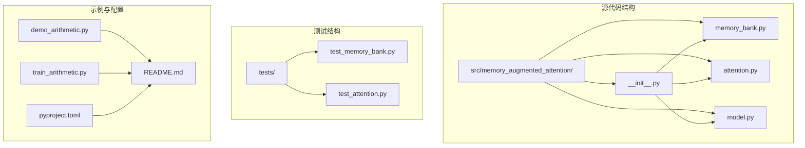
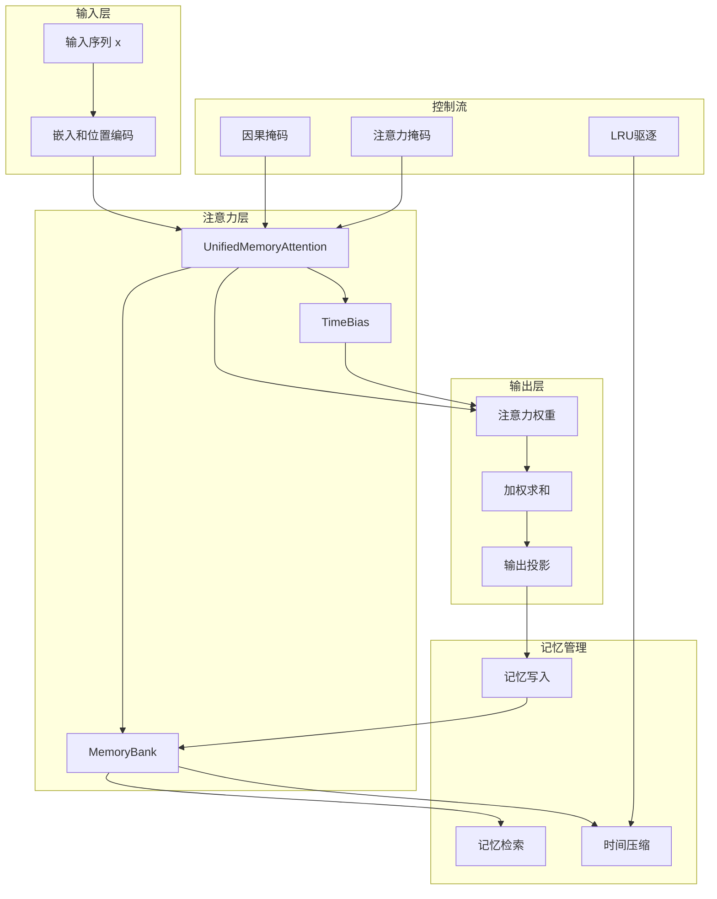
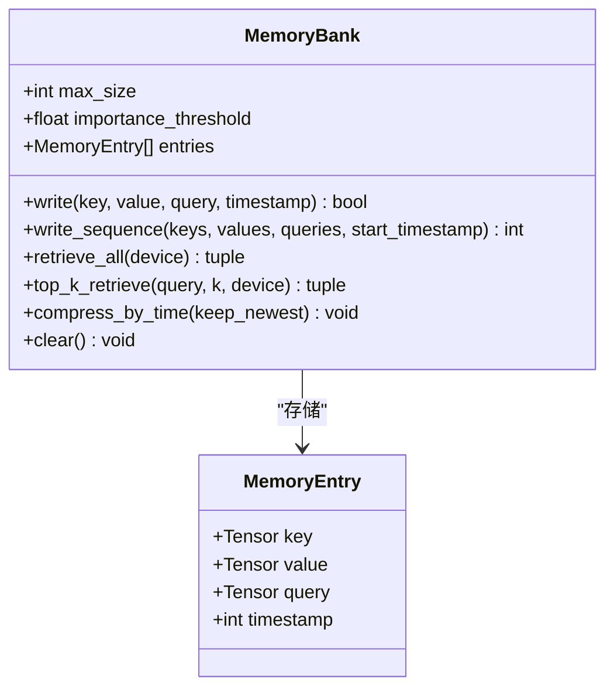
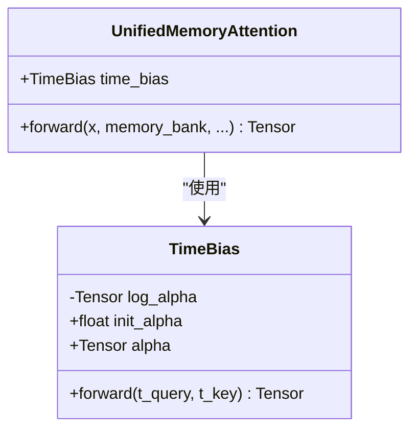
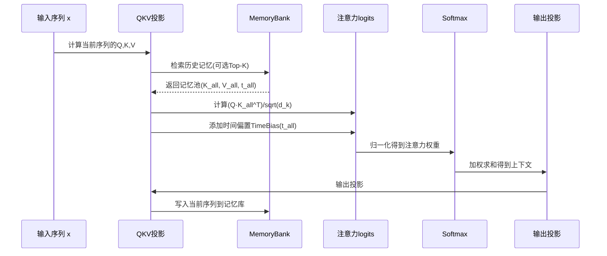
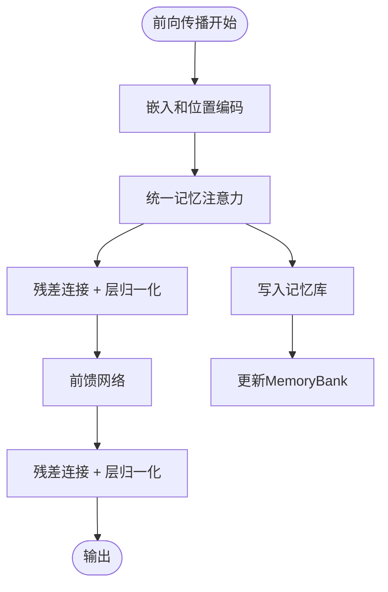
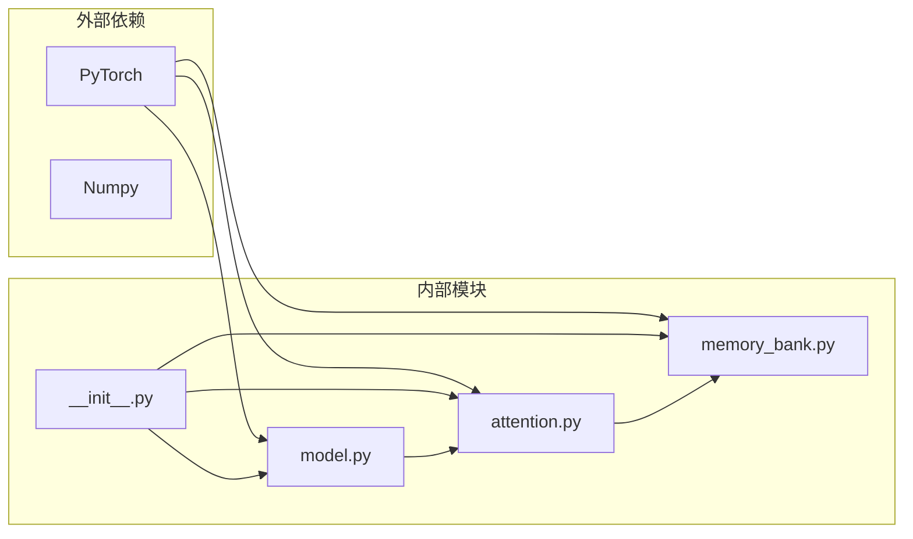
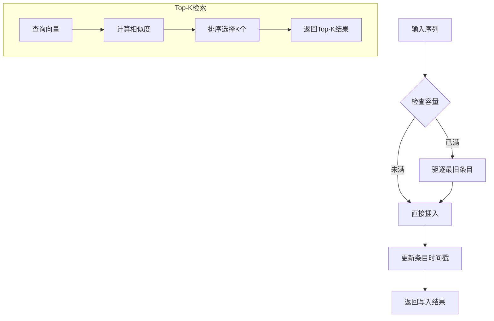

# 技术架构

<cite>
**本文档引用的文件**
- [src/memory_augmented_attention/__init__.py](file://src/memory_augmented_attention/__init__.py)
- [src/memory_augmented_attention/memory_bank.py](file://src/memory_augmented_attention/memory_bank.py)
- [src/memory_augmented_attention/attention.py](file://src/memory_augmented_attention/attention.py)
- [src/memory_augmented_attention/model.py](file://src/memory_augmented_attention/model.py)
- [README.md](file://README.md)
- [tests/test_memory_bank.py](file://tests/test_memory_bank.py)
- [tests/test_attention.py](file://tests/test_attention.py)
- [demo_arithmetic.py](file://demo_arithmetic.py)
- [train_arithmetic.py](file://train_arithmetic.py)
</cite>

## 目录
1. [引言](#引言)
2. [项目结构](#项目结构)
3. [核心组件](#核心组件)
4. [架构总览](#架构总览)
5. [详细组件分析](#详细组件分析)
6. [依赖关系分析](#依赖关系分析)
7. [性能与可扩展性](#性能与可扩展性)
8. [故障排除指南](#故障排除指南)
9. [结论](#结论)

## 引言

Memory-Augmented Attention (MAA) 是一个基于PyTorch的统一记忆增强注意力机制实现。该系统的核心创新在于将当前序列令牌（短期记忆）和历史KV缓存（长期记忆）统一存储在一个共享的时间戳记忆库中，并通过时间偏置项在注意力计算中自然地衰减较旧记忆的影响。

该项目解决了标准Transformer模型的根本局限性：状态不可持久化、权重在推理过程中保持冻结、仅能处理当前上下文窗口。MAA通过引入时间维度，使模型能够：
- 自动偏好近期上下文
- 理解事件顺序
- 实现遗忘机制
- 在多个前向传递之间累积历史上下文

## 项目结构

项目采用清晰的模块化组织结构，遵循Python包的标准约定：



**图表来源**
- [src/memory_augmented_attention/__init__.py:1-28](file://src/memory_augmented_attention/__init__.py#L1-L28)
- [src/memory_augmented_attention/memory_bank.py:1-284](file://src/memory_augmented_attention/memory_bank.py#L1-L284)
- [src/memory_augmented_attention/attention.py:1-322](file://src/memory_augmented_attention/attention.py#L1-L322)
- [src/memory_augmented_attention/model.py:1-134](file://src/memory_augmented_attention/model.py#L1-L134)

**章节来源**
- [src/memory_augmented_attention/__init__.py:1-28](file://src/memory_augmented_attention/__init__.py#L1-L28)
- [README.md:374-394](file://README.md#L374-L394)

## 核心组件

MAA系统由四个核心组件构成，每个组件都有明确的职责和接口：

### MemoryBank - 统一记忆存储
MemoryBank是整个系统的核心存储组件，负责：
- 存储时间戳化的(K, V, Q)条目
- 支持LRU驱逐策略
- 提供Top-K检索功能
- 实现时间压缩机制

### TimeBias - 时间偏置
TimeBias模块实现了学习性的时间衰减偏置：
- 基于对数形式的衰减函数
- 可学习的衰减系数α
- 自然匹配人类记忆的幂律遗忘曲线

### UnifiedMemoryAttention - 统一记忆注意力
统一记忆注意力机制：
- 同时处理当前序列和历史记忆
- 支持因果掩码和自定义注意力掩码
- 集成时间偏置到注意力分数
- 提供Top-K检索选项

### MemoryAugmentedTransformerLayer - 完整Transformer层
完整的Transformer编码器层：
- 包含统一记忆注意力和前馈网络
- 实现预归一化残差连接
- 支持跨层共享记忆库

**章节来源**
- [src/memory_augmented_attention/memory_bank.py:43-284](file://src/memory_augmented_attention/memory_bank.py#L43-L284)
- [src/memory_augmented_attention/attention.py:40-322](file://src/memory_augmented_attention/attention.py#L40-L322)
- [src/memory_augmented_attention/model.py:27-134](file://src/memory_augmented_attention/model.py#L27-L134)

## 架构总览

MAA的整体架构采用分层设计，从底层的记忆管理到高层的Transformer层：



**图表来源**
- [src/memory_augmented_attention/attention.py:181-322](file://src/memory_augmented_attention/attention.py#L181-L322)
- [src/memory_augmented_attention/memory_bank.py:82-163](file://src/memory_augmented_attention/memory_bank.py#L82-L163)
- [src/memory_augmented_attention/model.py:87-134](file://src/memory_augmented_attention/model.py#L87-L134)

## 详细组件分析

### MemoryBank组件分析

MemoryBank采用数据类设计，每个槽位存储一个完整的记忆条目：



**图表来源**
- [src/memory_augmented_attention/memory_bank.py:33-76](file://src/memory_augmented_attention/memory_bank.py#L33-L76)
- [src/memory_augmented_attention/memory_bank.py:43-284](file://src/memory_augmented_attention/memory_bank.py#L43-L284)

MemoryBank的关键特性：
- **固定容量管理**：当达到最大容量时，自动驱逐最旧的条目
- **重要性过滤**：可配置的价值向量L2范数阈值，避免低信息内容污染
- **时间戳一致性**：确保条目的时间顺序正确性
- **设备兼容性**：支持在不同设备间移动张量

**章节来源**
- [src/memory_augmented_attention/memory_bank.py:43-284](file://src/memory_augmented_attention/memory_bank.py#L43-L284)
- [tests/test_memory_bank.py:26-100](file://tests/test_memory_bank.py#L26-L100)

### TimeBias组件分析

TimeBias模块实现了学习性的时间衰减机制：



**图表来源**
- [src/memory_augmented_attention/attention.py:40-94](file://src/memory_augmented_attention/attention.py#L40-L94)
- [src/memory_augmented_attention/attention.py:101-162](file://src/memory_augmented_attention/attention.py#L101-L162)

TimeBias的数学公式：
```
TimeBias(t_q, t_k) = -α * log(1 + |t_q - t_k|)
```

其中α是可学习标量参数，当α=0时退化为标准注意力。

**章节来源**
- [src/memory_augmented_attention/attention.py:40-94](file://src/memory_augmented_attention/attention.py#L40-L94)
- [tests/test_attention.py:17-60](file://tests/test_attention.py#L17-L60)

### UnifiedMemoryAttention组件分析

UnifiedMemoryAttention是系统的核心注意力机制：



**图表来源**
- [src/memory_augmented_attention/attention.py:181-322](file://src/memory_augmented_attention/attention.py#L181-L322)

注意力计算的关键步骤：
1. **输入序列处理**：当前批次的Q、K、V投影
2. **记忆池组装**：将当前序列与历史记忆合并
3. **注意力分数计算**：包含点积相似性和时间偏置
4. **权重归一化**：Softmax处理注意力权重
5. **上下文聚合**：按权重对V进行加权求和
6. **输出生成**：线性投影得到最终输出

**章节来源**
- [src/memory_augmented_attention/attention.py:181-322](file://src/memory_augmented_attention/attention.py#L181-L322)
- [tests/test_attention.py:101-177](file://tests/test_attention.py#L101-L177)

### MemoryAugmentedTransformerLayer组件分析

完整的Transformer层实现：



**图表来源**
- [src/memory_augmented_attention/model.py:87-134](file://src/memory_augmented_attention/model.py#L87-L134)

该层的架构特点：
- **预归一化风格**：先进行层归一化再进行子层操作
- **残差连接**：每个多头注意力和前馈网络后都有残差
- **Dropout集成**：在注意力权重和子层输出处应用dropout
- **灵活的掩码支持**：支持因果掩码和自定义注意力掩码

**章节来源**
- [src/memory_augmented_attention/model.py:27-134](file://src/memory_augmented_attention/model.py#L27-L134)
- [tests/test_attention.py:184-231](file://tests/test_attention.py#L184-L231)

## 依赖关系分析

系统采用松耦合的设计，主要依赖关系如下：



**图表来源**
- [src/memory_augmented_attention/__init__.py:18-27](file://src/memory_augmented_attention/__init__.py#L18-L27)
- [src/memory_augmented_attention/attention.py:32](file://src/memory_augmented_attention/attention.py#L32)
- [src/memory_augmented_attention/model.py:23-24](file://src/memory_augmented_attention/model.py#L23-L24)

依赖关系特点：
- **单向依赖**：attention.py依赖memory_bank.py，model.py依赖attention.py
- **无循环依赖**：设计避免了循环导入问题
- **最小化外部依赖**：仅依赖PyTorch框架

**章节来源**
- [src/memory_augmented_attention/__init__.py:18-27](file://src/memory_augmented_attention/__init__.py#L18-L27)

## 性能与可扩展性

MAA系统实现了三种互补的复杂度管理策略：

### Top-K检索策略
- **复杂度**：O(L·K·d)，其中L是序列长度，K是检索数量
- **优势**：限制注意力池大小，避免全量计算
- **适用场景**：大规模历史记忆检索
- **推荐范围**：32-128个候选记忆

### 时间压缩策略
- **复杂度**：O(L·d)，仅对旧记忆进行处理
- **实现方式**：保留最新的N个条目，丢弃更旧的内容
- **效果**：显著减少内存占用和计算开销
- **配置**：通过`compress_by_time(keep_newest)`调用

### LRU驱逐策略
- **复杂度**：O(1)，自动维护固定容量
- **机制**：当满载时自动移除最旧条目
- **保证**：防止内存溢出，确保系统稳定性



**图表来源**
- [src/memory_augmented_attention/memory_bank.py:114-126](file://src/memory_augmented_attention/memory_bank.py#L114-L126)
- [src/memory_augmented_attention/memory_bank.py:203-253](file://src/memory_augmented_attention/memory_bank.py#L203-L253)

### 推荐运行模式

基于训练和推理场景的最佳实践：

**训练模式配置**：
- `top_k`: 64-128（平衡上下文丰富度和计算成本）
- `init_alpha`: 0.5-2.0（控制时间衰减强度）
- `max_size`: 2048-8192（根据GPU内存调整）
- `importance_threshold`: 0.1-0.3（过滤低信息内容）

**推理模式配置**：
- `top_k`: 32-64（减少延迟）
- `init_alpha`: 1.0（标准时间衰减）
- `max_size`: 8192-32768（持久记忆）
- `importance_threshold`: 0.1-0.5（严格过滤）

**资源配置建议**：
- **小规模部署**：d_model=128-256，n_heads=4-8
- **中等规模部署**：d_model=256-512，n_heads=8-16  
- **大规模部署**：d_model=512-1024，n_heads=16-32

**章节来源**
- [README.md:151-170](file://README.md#L151-L170)
- [README.md:331-339](file://README.md#L331-L339)
- [README.md:340-353](file://README.md#L340-L353)

## 故障排除指南

### 常见问题诊断

**内存相关问题**：
- **症状**：CUDA Out of Memory错误
- **原因**：MemoryBank容量过大或top_k设置过高
- **解决方案**：降低`max_size`或增加`top_k`，定期调用`compress_by_time()`

**数值稳定性问题**：
- **症状**：注意力权重出现NaN或Inf
- **原因**：时间戳不一致或数值溢出
- **解决方案**：检查时间戳序列，确保连续递增

**性能问题**：
- **症状**：推理速度过慢
- **原因**：MemoryBank过大或未启用Top-K
- **解决方案**：启用`top_k`检索，定期清理历史记忆

### 调试工具和技巧

**内存监控**：
```python
# 检查MemoryBank状态
print(f"MemoryBank: {len(bank)}/{bank.max_size} entries")
print(f"Importance threshold: {bank.importance_threshold}")
```

**注意力可视化**：
```python
# 获取注意力权重用于调试
with torch.no_grad():
    attn_weights = unified_attention.forward(
        x, memory_bank, return_weights=True
    )
    # 分析注意力分布
```

**章节来源**
- [tests/test_memory_bank.py:107-158](file://tests/test_memory_bank.py#L107-L158)
- [tests/test_attention.py:17-60](file://tests/test_attention.py#L17-L60)

## 结论

Memory-Augmented Attention项目展现了统一记忆增强注意力机制的完整实现。通过将当前序列和历史记忆统一存储在共享的时间戳记忆库中，该系统实现了：

**技术创新点**：
- **统一抽象**：消除了短期记忆和长期记忆的区分
- **时间感知**：通过时间偏置实现自然的遗忘机制
- **可扩展性**：三种互补的复杂度管理策略
- **实用性**：在字符级算术教学任务上验证了有效性

**系统优势**：
- **模块化设计**：清晰的组件分离和接口定义
- **性能优化**：多种策略协同实现高效的大规模记忆管理
- **易于集成**：作为标准TransformerEncoderLayer的直接替代品
- **可配置性强**：丰富的超参数调节空间

**应用场景**：
- 对话系统中的上下文记忆
- 长文档理解和问答
- 代码补全和知识检索
- 多轮对话的状态保持

该架构为构建具有持久记忆能力的AI系统提供了坚实的基础，为未来的多维动态权重和层级记忆系统奠定了重要基础。