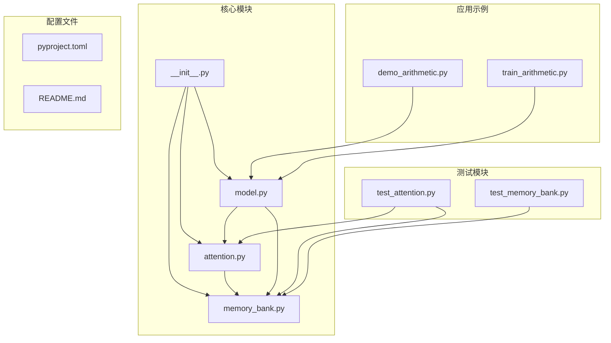
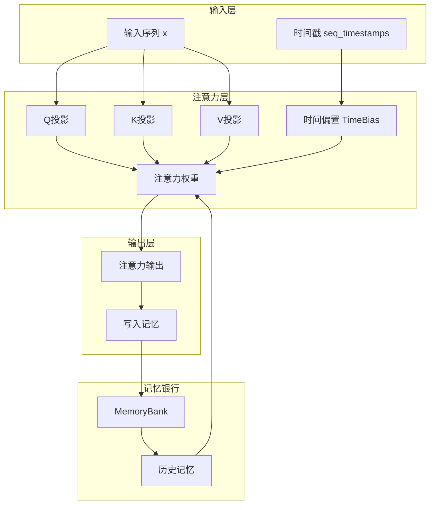
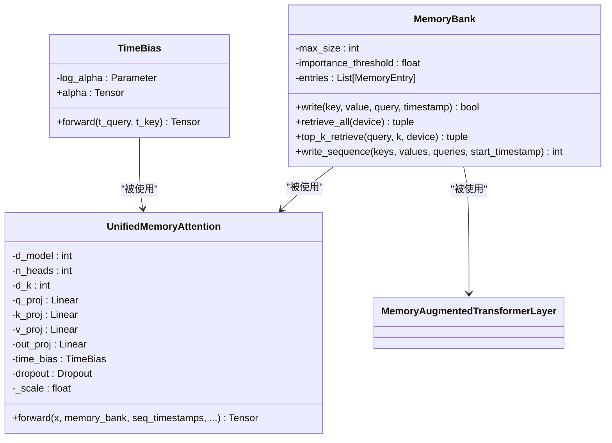
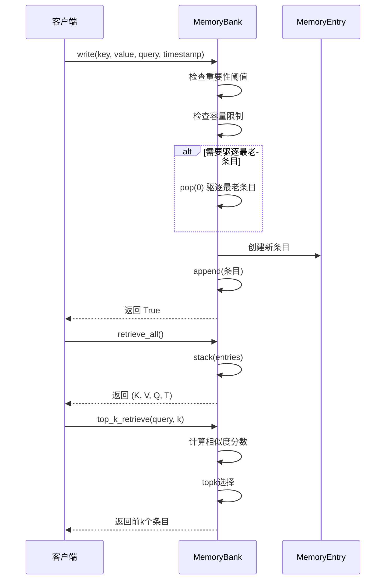
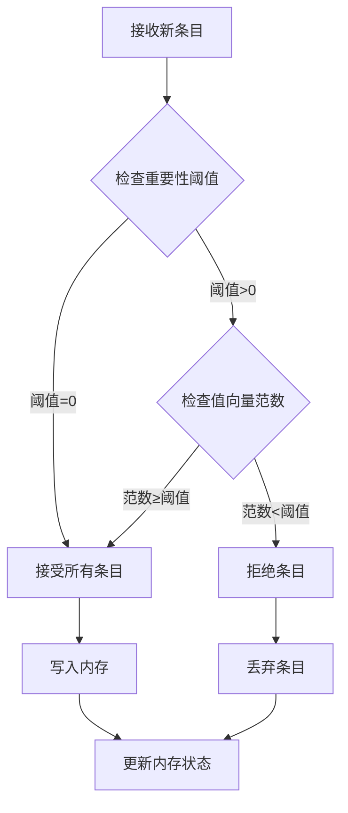
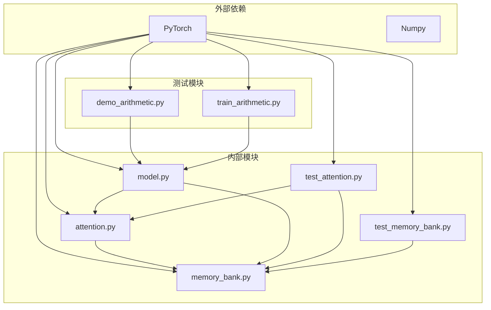
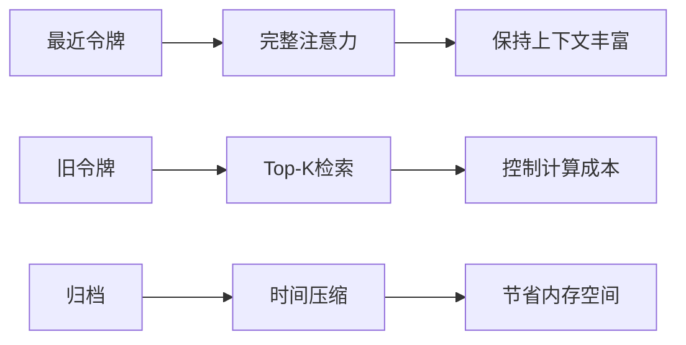

# 核心概念

<cite>
**本文档引用的文件**
- [README.md](file://README.md)
- [attention.py](file://src/memory_augmented_attention/attention.py)
- [memory_bank.py](file://src/memory_augmented_attention/memory_bank.py)
- [model.py](file://src/memory_augmented_attention/model.py)
- [test_attention.py](file://tests/test_attention.py)
- [test_memory_bank.py](file://tests/test_memory_bank.py)
- [demo_arithmetic.py](file://demo_arithmetic.py)
- [train_arithmetic.py](file://train_arithmetic.py)
</cite>

## 目录
1. [引言](#引言)
2. [项目结构](#项目结构)
3. [核心组件](#核心组件)
4. [架构概览](#架构概览)
5. [详细组件分析](#详细组件分析)
6. [依赖关系分析](#依赖关系分析)
7. [性能考量](#性能考量)
8. [故障排除指南](#故障排除指南)
9. [结论](#结论)

## 引言

Memory-Augmented Attention (MAA) 是一个创新的注意力机制，它将当前序列令牌和历史KV缓存都视为共享内存库中的时间戳化内存条目。该机制通过统一的记忆注意力计算，自然地对较旧的记忆进行降权处理，从而实现了类似人类记忆的幂律遗忘曲线。

该项目的核心价值在于：
- **统一记忆架构**：将短期记忆（当前序列）和长期记忆（历史KV对）合并到同一个时间维度中
- **时间衰减偏置**：通过可学习的时间衰减系数实现自然的遗忘机制
- **多维动态权重**：从单一时间维度扩展到多维动态权重系统
- **重要性过滤**：智能地选择值得存储的信息，避免内存污染

## 项目结构



**图表来源**
- [__init__.py:1-28](file://src/memory_augmented_attention/__init__.py#L1-L28)
- [attention.py:1-322](file://src/memory_augmented_attention/attention.py#L1-L322)
- [memory_bank.py:1-284](file://src/memory_augmented_attention/memory_bank.py#L1-L284)
- [model.py:1-134](file://src/memory_augmented_attention/model.py#L1-L134)

**章节来源**
- [__init__.py:1-28](file://src/memory_augmented_attention/__init__.py#L1-L28)
- [README.md:374-394](file://README.md#L374-L394)

## 核心组件

### 统一记忆注意力机制

MAA的核心是统一的记忆注意力公式：

```
M_all = M_memory ∪ { (K_seq, V_seq, Q_seq, t_seq) }
y_t = softmax( (Q_t · K_all^T) / sqrt(d_k) + TimeBias(t_t, t_all) ) · V_all
```

这个公式的关键创新在于：
- **统一池化**：将当前序列和历史记忆合并到同一个注意力池中
- **时间偏置**：通过TimeBias函数为不同时间间隔的记忆分配不同的权重
- **自然遗忘**：时间距离越远的记忆权重越低

### 时间衰减偏置实现

TimeBias类实现了可学习的时间衰减偏置：

```mermaid
flowchart TD
A[输入查询时间 t_q] --> B[计算绝对差值 |t_q - t_k|]
B --> C[计算 log(1 + |t_q - t_k|)]
C --> D[乘以学习参数 alpha]
D --> E[取负值得到偏置]
F[alpha 参数初始化] --> G[log(alpha) 存储]
G --> H[通过指数函数恢复 alpha]
H --> D
```

**图表来源**
- [attention.py:40-94](file://src/memory_augmented_attention/attention.py#L40-L94)

**章节来源**
- [attention.py:40-94](file://src/memory_augmented_attention/attention.py#L40-L94)
- [README.md:94-116](file://README.md#L94-L116)

### 多维动态权重设计

从单一时间维度到多维动态权重的演进：

```
MemoryBias(entry) = w_time·f_time + w_verdict·f_verdict + w_freq·f_freq + w_source·f_source
```

这种设计允许：
- **时间维度**：exp(-Δt/τ)，适用于对话历史
- **正确性维度**：[-1, +1]，N→Y，适用于教学演示
- **频率维度**：log(1 + access_count)，适用于代码补全
- **来源维度**：[0, 1]权威性，适用于问答场景

**章节来源**
- [README.md:117-140](file://README.md#L117-L140)

## 架构概览



**图表来源**
- [attention.py:181-322](file://src/memory_augmented_attention/attention.py#L181-L322)
- [memory_bank.py:43-284](file://src/memory_augmented_attention/memory_bank.py#L43-L284)

## 详细组件分析

### TimeBias 类分析

TimeBias类实现了可学习的时间衰减偏置，这是MAA的核心组件之一。



**图表来源**
- [attention.py:40-322](file://src/memory_augmented_attention/attention.py#L40-L322)
- [memory_bank.py:43-284](file://src/memory_augmented_attention/memory_bank.py#L43-L284)
- [model.py:27-134](file://src/memory_augmented_attention/model.py#L27-L134)

**章节来源**
- [attention.py:40-94](file://src/memory_augmented_attention/attention.py#L40-L94)

### MemoryBank 类分析

MemoryBank提供了统一的记忆存储和检索功能：



**图表来源**
- [memory_bank.py:82-253](file://src/memory_augmented_attention/memory_bank.py#L82-L253)

**章节来源**
- [memory_bank.py:43-284](file://src/memory_augmented_attention/memory_bank.py#L43-L284)

### 重要性过滤机制

MAA实现了智能的重要性过滤机制来避免内存污染：



**图表来源**
- [memory_bank.py:109-126](file://src/memory_augmented_attention/memory_bank.py#L109-L126)

**章节来源**
- [memory_bank.py:109-126](file://src/memory_augmented_attention/memory_bank.py#L109-L126)

### 信息保留策略

MAA提供了多种信息保留策略：

1. **LRU驱逐**：当内存满时自动驱逐最老的条目
2. **时间压缩**：定期将旧条目合并为摘要嵌入
3. **Top-K检索**：只关注与当前查询最相关的条目
4. **重要性过滤**：基于值向量范数的智能选择

**章节来源**
- [memory_bank.py:114-126](file://src/memory_augmented_attention/memory_bank.py#L114-L126)
- [README.md:151-169](file://README.md#L151-L169)

## 依赖关系分析



**图表来源**
- [attention.py:27-30](file://src/memory_augmented_attention/attention.py#L27-L30)
- [memory_bank.py:28-30](file://src/memory_augmented_attention/memory_bank.py#L28-L30)
- [model.py:19-24](file://src/memory_augmented_attention/model.py#L19-L24)

**章节来源**
- [attention.py:27-30](file://src/memory_augmented_attention/attention.py#L27-L30)
- [memory_bank.py:28-30](file://src/memory_augmented_attention/memory_bank.py#L28-L30)
- [model.py:19-24](file://src/memory_augmented_attention/model.py#L19-L24)

## 性能考量

### 复杂度分析

MAA提供了三种互补的复杂度管理策略：

| 策略 | 复杂度 | 说明 |
|------|--------|------|
| **Top-K检索** | O(L · K · d) | 只有K个最相关的条目参与注意力计算 |
| **时间压缩** | O(L · d) | 周期性地将旧条目合并为摘要向量 |
| **LRU驱逐** | O(1) | 当内存满时自动驱逐最老条目 |

### 推荐配置



**图表来源**
- [README.md:163-169](file://README.md#L163-L169)

**章节来源**
- [README.md:151-169](file://README.md#L151-L169)

## 故障排除指南

### 常见问题诊断

1. **内存溢出问题**
   - 检查 `max_size` 设置是否过小
   - 考虑启用 `compress_by_time` 进行定期压缩
   - 使用 `top_k` 限制注意力池大小

2. **梯度消失问题**
   - 确保 `alpha` 参数在合理范围内（0.5-2.0）
   - 检查 `dropout` 设置是否过高
   - 验证残差连接是否正常工作

3. **性能问题**
   - 评估 `top_k` 值是否过大
   - 检查 `importance_threshold` 是否设置过高
   - 考虑使用 `time_compression` 减少内存占用

**章节来源**
- [test_attention.py:51-58](file://tests/test_attention.py#L51-L58)
- [test_memory_bank.py:33-40](file://tests/test_memory_bank.py#L33-L40)

### 测试验证

项目包含完整的测试套件来验证核心功能：

- **TimeBias测试**：验证输出形状、零延迟偏置、负偏置性质
- **MemoryBank测试**：验证写入、驱逐、检索功能
- **注意力测试**：验证形状变换、梯度流动、Top-K限制

**章节来源**
- [test_attention.py:17-60](file://tests/test_attention.py#L17-L60)
- [test_memory_bank.py:26-41](file://tests/test_memory_bank.py#L26-L41)

## 结论

Memory-Augmented Attention项目成功地实现了统一的记忆注意力机制，通过以下关键创新解决了传统Transformer的局限性：

1. **统一记忆架构**：将短期和长期记忆合并到同一时间维度
2. **可学习时间衰减**：实现类似人类记忆的自然遗忘机制
3. **多维动态权重**：从单一时间维度扩展到多维权重系统
4. **智能内存管理**：提供多种策略来平衡性能和资源使用

该框架为构建具有持久记忆能力的AI系统奠定了坚实基础，特别适用于需要长期依赖和上下文理解的应用场景。