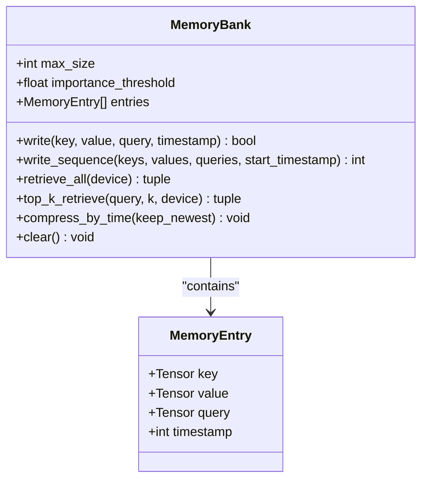
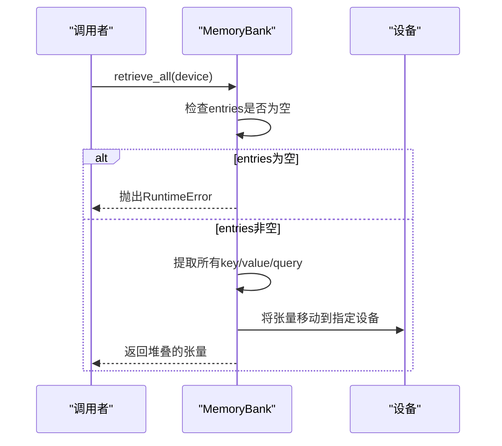
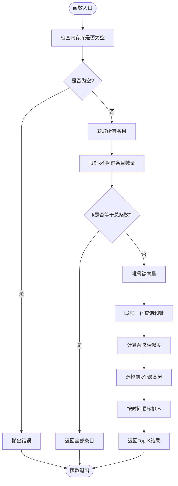
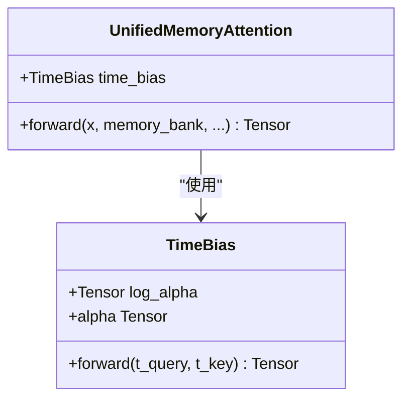
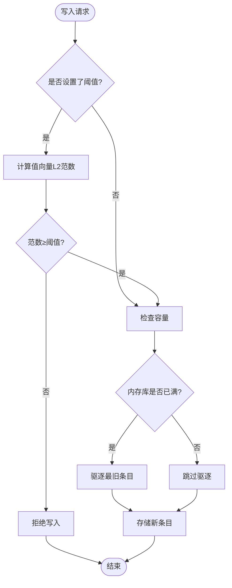
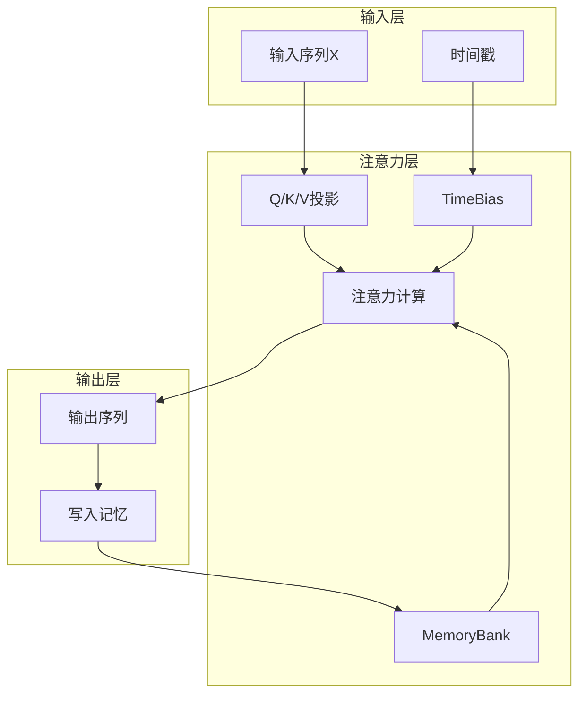
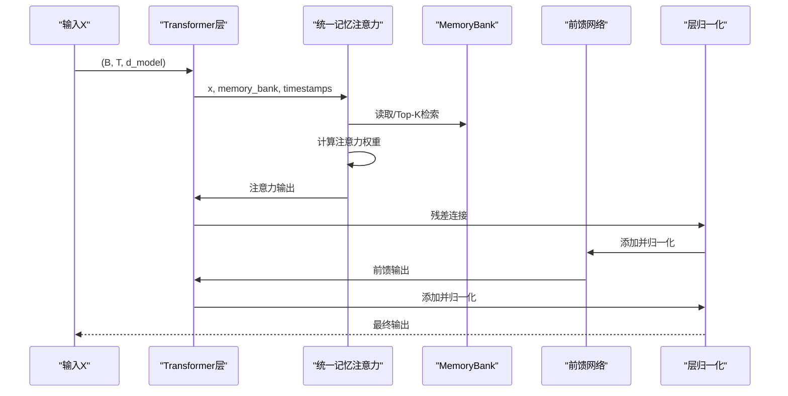
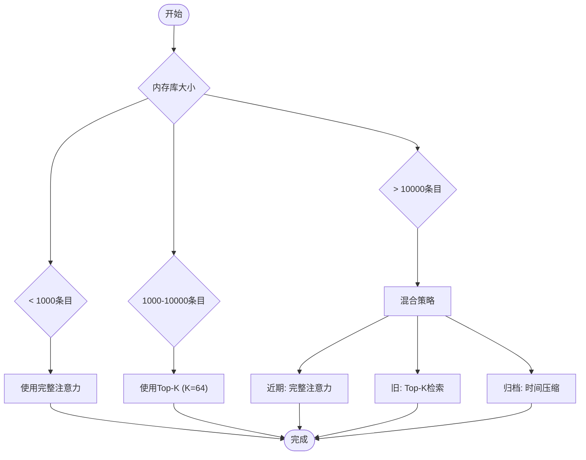
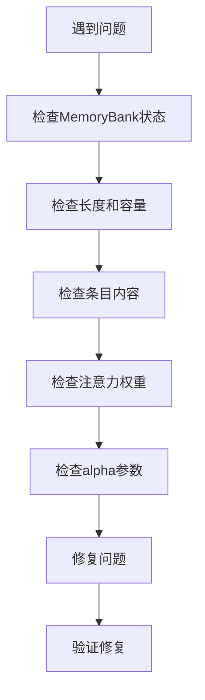

# 核心特性

<cite>
**本文档引用的文件**
- [memory_bank.py](file://src/memory_augmented_attention/memory_bank.py)
- [attention.py](file://src/memory_augmented_attention/attention.py)
- [model.py](file://src/memory_augmented_attention/model.py)
- [test_memory_bank.py](file://tests/test_memory_bank.py)
- [test_attention.py](file://tests/test_attention.py)
- [README.md](file://README.md)
- [demo_arithmetic.py](file://demo_arithmetic.py)
</cite>

## 目录
1. [简介](#简介)
2. [统一记忆管理](#统一记忆管理)
3. [时间感知注意力机制](#时间感知注意力机制)
4. [智能检索策略](#智能检索策略)
5. [重要性过滤机制](#重要性过滤机制)
6. [多维动态权重扩展](#多维动态权重扩展)
7. [架构概览](#架构概览)
8. [性能考虑](#性能考虑)
9. [故障排除指南](#故障排除指南)
10. [结论](#结论)

## 简介

Memory-Augmented Attention (MAA) 是一个创新的注意力机制实现，它将当前序列令牌和历史KV缓存统一存储在一个共享的时间戳记忆库中。该系统的核心理念是：**序列令牌本身就是短期记忆**，传统记忆增强变换器将它们视为两个独立类别，但MAA提供了一个统一的抽象，其中每个令牌——无论是来自当前输入还是过去交互——都是一个带有时间戳的`(Key, Value, Query, timestamp)`元组。

这种设计让模型能够：
- **偏好近期上下文** - 通过时间衰减偏置
- **理解事件顺序** - 模型可以学习`t_i < t_j`意味着事件i发生在事件j之前
- **实现遗忘** - 旧的、不相关的条目在没有显式删除的情况下被折扣

## 统一记忆管理

### MemoryBank架构设计

MemoryBank是MAA系统的核心组件，负责统一存储当前序列和历史KV对。其设计遵循以下原则：



**图表来源**
- [memory_bank.py:33-126](file://src/memory_augmented_attention/memory_bank.py#L33-L126)
- [memory_bank.py:43-284](file://src/memory_augmented_attention/memory_bank.py#L43-L284)

### LRU淘汰机制

MemoryBank实现了基于时间戳的LRU（最近最少使用）淘汰策略：

- **固定容量限制**：通过`max_size`参数设置最大存储容量
- **自动淘汰**：当内存库满时，最旧的条目（最小时间戳）首先被驱逐
- **时间戳一致性**：所有写入操作都附带全局步骤索引作为时间戳

### 全量检索与Top-K检索

MemoryBank提供了两种检索模式以平衡性能和准确性：

#### 全量检索模式


**图表来源**
- [memory_bank.py:169-201](file://src/memory_augmented_attention/memory_bank.py#L169-L201)

#### Top-K相关性检索
Top-K检索通过余弦相似度计算实现智能筛选：



**图表来源**
- [memory_bank.py:203-253](file://src/memory_augmented_attention/memory_bank.py#L203-L253)

**章节来源**
- [memory_bank.py:1-284](file://src/memory_augmented_attention/memory_bank.py#L1-L284)
- [test_memory_bank.py:107-158](file://tests/test_memory_bank.py#L107-L158)

### 时间感知注意力机制

TimeBias模块实现了可学习的时间偏置项，通过以下公式实现自然遗忘：

```
TimeBias(t_q, t_k) = -α * log(1 + |t_q - t_k|)
```

其中α是可学习标量，初始化为`init_alpha`。对数形式提供了缓慢、单调递减的衰减，这样非常旧的记忆相对于中等年龄的记忆只受到轻微惩罚，模拟了人类记忆中观察到的幂律遗忘曲线。



**图表来源**
- [attention.py:40-94](file://src/memory_augmented_attention/attention.py#L40-L94)
- [attention.py:101-322](file://src/memory_augmented_attention/attention.py#L101-L322)

### alpha参数的调节作用

alpha参数控制时间衰减强度：
- **α = 0**：无时间衰减（标准注意力）
- **α增大**：更强的时间衰减，近期记忆权重更大
- **α学习**：通过梯度下降自动调整最优值

**章节来源**
- [attention.py:40-94](file://src/memory_augmented_attention/attention.py#L40-L94)
- [test_attention.py:51-59](file://tests/test_attention.py#L51-L59)

## 智能检索策略

### 适用场景分析

#### 全量检索（无top_k限制）
**适用场景**：
- 内存库较小（< 1000条目）
- 需要最高精度的上下文访问
- 计算资源充足
- 关键任务（如医疗诊断、法律咨询）

**性能特征**：
- 复杂度：O((L + M)² · d)
- 准确性：最高
- 计算开销：最大

#### Top-K检索
**适用场景**：
- 大规模内存库（> 1000条目）
- 实时应用
- 资源受限环境
- 对延迟敏感的应用

**性能特征**：
- 复杂度：O(L · K · d)
- 准确性：高（K通常设置为32-128）
- 计算开销：中等

### 性能权衡

```mermaid
graph TB
subgraph "内存管理策略"
A[Top-K检索<br/>复杂度: O(L·K·d)<br/>K=32-128]
B[时间压缩<br/>复杂度: O(L·d)]
C[LRU驱逐<br/>复杂度: O(1)]
end
subgraph "推荐配置"
D[近期令牌<br/>完整注意力]
E[旧令牌<br/>Top-K检索]
F[归档<br/>压缩摘要嵌入]
end
A --> D
B --> E
C --> F
```

**图表来源**
- [README.md:151-169](file://README.md#L151-L169)

**章节来源**
- [README.md:151-169](file://README.md#L151-L169)
- [attention.py:127-131](file://src/memory_augmented_attention/attention.py#L127-L131)

## 重要性过滤机制

### 过滤原理

重要性过滤通过检查值向量的L2范数来防止低信息令牌污染记忆库：

```
write(entry) 仅当 ||V||₂ ≥ importance_threshold
```

### 实现细节



**图表来源**
- [memory_bank.py:82-126](file://src/memory_augmented_attention/memory_bank.py#L82-L126)

### 配置建议

| 场景类型 | importance_threshold建议 | 理由 |
|---------|-------------------------|------|
| 教学演示 | 0.1-0.5 | 需要保留高质量示例 |
| 对话系统 | 0.0-0.2 | 保持对话流畅性 |
| 代码生成 | 0.2-0.8 | 保留有意义的代码片段 |
| 噪声数据 | 0.3-1.0 | 过滤无用信息 |

**章节来源**
- [memory_bank.py:18-20](file://src/memory_augmented_attention/memory_bank.py#L18-L20)
- [test_memory_bank.py:85-100](file://tests/test_memory_bank.py#L85-L100)

## 多维动态权重扩展

### 设计演进

MAA正从单一时间偏置发展为多维动态权重系统：

```
MemoryBias(entry) = w_time·f_time + w_verdict·f_verdict + w_freq·f_freq + w_source·f_source
```

权重向量`[w_time, w_verdict, w_freq, w_source]`由当前查询通过轻量级MLP动态决定，不同问题自动激活不同的记忆过滤逻辑。

### 维度功能

| 维度 | 函数 | 典型场景权重 | 理由 |
|------|------|-------------|------|
| **时间** f_time | exp(-Δt/τ) | 高聊天历史，低数学教学 | 最近信息更重要 |
| **正确性** f_verdict | [-1, +1] (N→Y) | 高教学演示，低闲聊 | 正确性比时间更重要 |
| **频率** f_freq | log(1 + access_count) | 高代码补全，低一次性查询 | 使用频率反映重要性 |
| **来源** f_source | [0, 1]权威性 | 高问答，低匿名论坛 | 权威信息更可信 |

### 内存类型与维度权重

| 内存类型 | 示例 | 主导维度 | 理由 |
|----------|------|----------|------|
| **情景记忆** | "用户昨天说喜欢蓝色" | 时间 + 频率 | 旧信息随时间衰减；频繁使用的信息持久 |
| **语义记忆** | "1+1=2" | 正确性 + 来源 | 正确性不随时间变化 |
| **程序记忆** | "如何骑自行车" | 频率 | 练习造就完美 |

**章节来源**
- [README.md:117-140](file://README.md#L117-L140)
- [README.md:285-294](file://README.md#L285-L294)

## 架构概览

### 系统整体架构



**图表来源**
- [attention.py:181-322](file://src/memory_augmented_attention/attention.py#L181-L322)
- [model.py:87-134](file://src/memory_augmented_attention/model.py#L87-L134)

### 变换器层集成

MemoryAugmentedTransformerLayer将统一记忆注意力集成到标准变换器架构中：



**图表来源**
- [model.py:87-134](file://src/memory_augmented_attention/model.py#L87-L134)

**章节来源**
- [model.py:27-134](file://src/memory_augmented_attention/model.py#L27-L134)

## 性能考虑

### 复杂度分析

MAA提供了三种互补的策略来控制复杂度：

| 策略 | 复杂度 | 说明 | 推荐使用场景 |
|------|--------|------|-------------|
| **Top-K检索** | O(L · K · d) | 仅关注K个最相关条目 | 大规模内存库，实时应用 |
| **时间压缩** | O(L · d) | 定期合并旧条目为摘要向量 | 长期运行，内存压力大 |
| **LRU驱逐** | O(1) | 自动驱逐最旧条目 | 内存库接近容量上限 |

### 推荐配置



**图表来源**
- [README.md:163-169](file://README.md#L163-L169)

### 训练和推理建议

**训练阶段**：
- 使用`MemoryBank(max_size=2048)`创建每轮训练的新内存库
- 定期调用`bank.compress_by_time(keep_newest=512)`防止内存爆炸
- 设置`importance_threshold=0.1`过滤低质量信息

**推理阶段**：
- 使用持久化`MemoryBank(max_size=8192, importance_threshold=0.1)`
- 在用户回合之间保持内存库不变
- 启用`write_to_memory=True`累积历史上下文

**章节来源**
- [README.md:326-353](file://README.md#L326-L353)

## 故障排除指南

### 常见问题及解决方案

#### 内存库为空错误
**症状**：调用`retrieve_all()`或`top_k_retrieve()`时抛出`RuntimeError`
**原因**：内存库中没有任何条目
**解决方案**：确保先写入一些条目，或在调用前检查`len(memory_bank) > 0`

#### 无效的头部数量
**症状**：创建`UnifiedMemoryAttention`时抛出`ValueError`
**原因**：`d_model`不能被`n_heads`整除
**解决方案**：确保`d_model % n_heads == 0`

#### 重要性过滤导致信息丢失
**症状**：某些重要信息没有被存储
**解决方案**：降低`importance_threshold`或移除过滤器

### 调试技巧



**章节来源**
- [test_memory_bank.py:107-109](file://tests/test_memory_bank.py#L107-L109)
- [test_attention.py:85-87](file://tests/test_attention.py#L85-L87)

## 结论

Memory-Augmented Attention通过四个核心特性实现了真正的长期记忆能力：

1. **统一记忆管理**：通过MemoryBank将当前序列和历史KV统一存储，实现无缝的历史上下文访问
2. **时间感知注意力**：通过可学习的时间偏置项实现自然遗忘，alpha参数提供灵活的衰减控制
3. **智能检索策略**：结合Top-K检索和全量检索，在准确性和性能间取得最佳平衡
4. **重要性过滤机制**：防止低信息令牌污染记忆库，保持内存库的高质量

这些特性共同构成了一个强大而灵活的记忆增强注意力系统，适用于各种需要长期依赖和上下文记忆的应用场景。随着多维动态权重扩展的实现，MAA将继续演进为更智能、更适应性强的记忆增强系统。