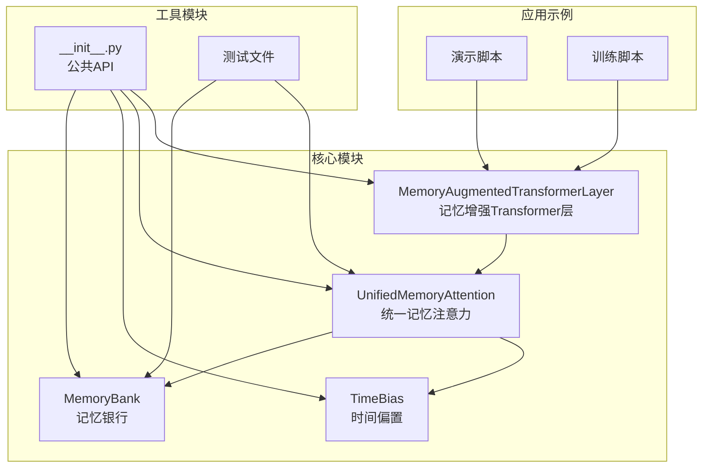
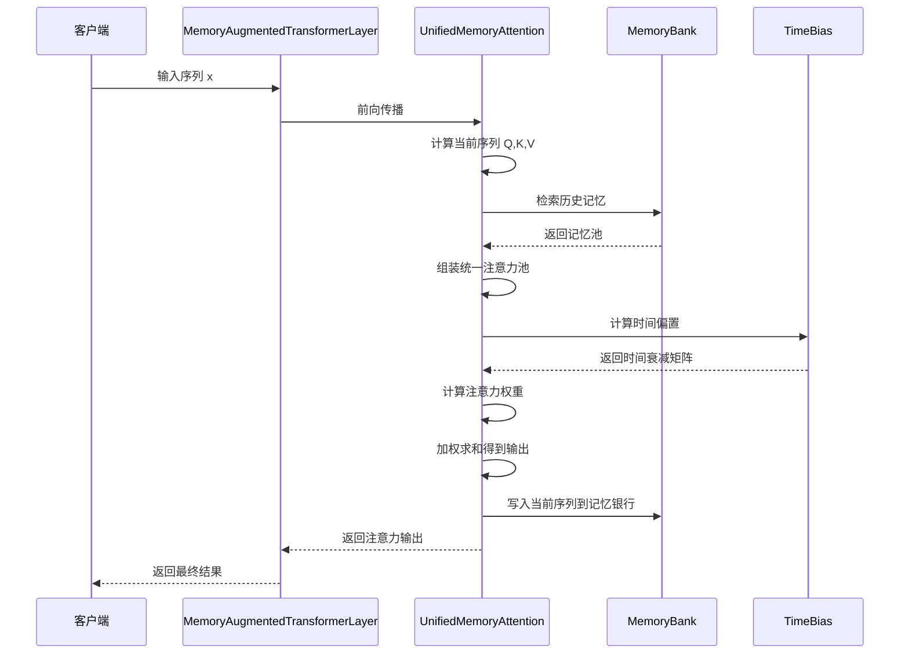
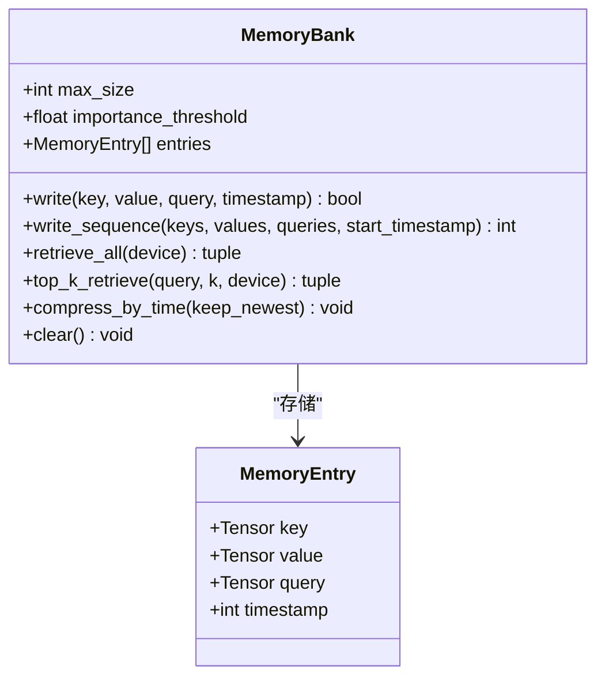
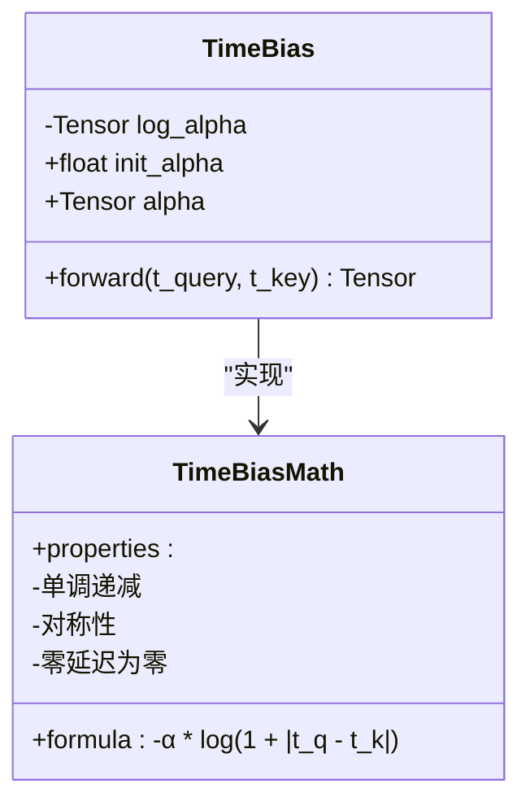
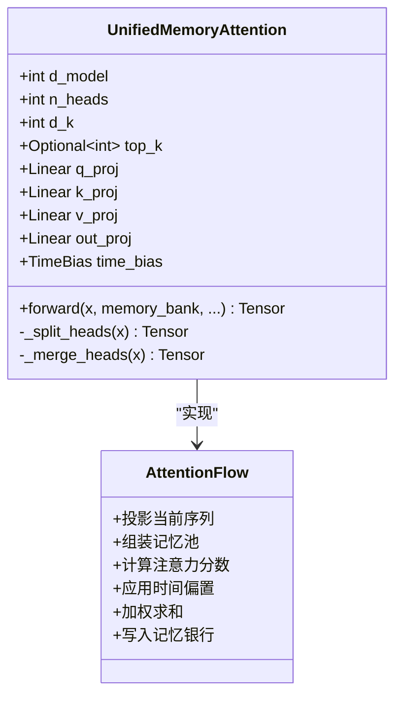
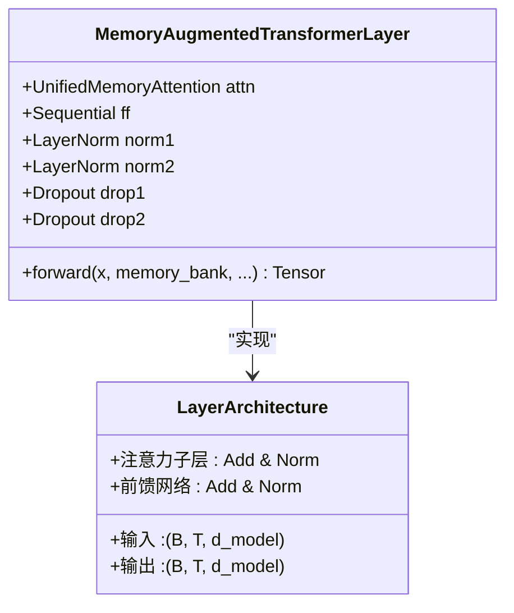
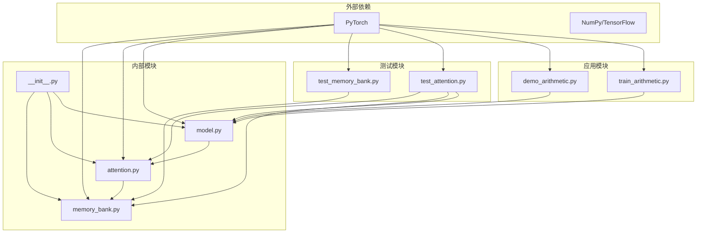

# 背景与动机

<cite>
**本文档引用的文件**
- [README.md](file://README.md)
- [memory_bank.py](file://src/memory_augmented_attention/memory_bank.py)
- [attention.py](file://src/memory_augmented_attention/attention.py)
- [model.py](file://src/memory_augmented_attention/model.py)
- [__init__.py](file://src/memory_augmented_attention/__init__.py)
- [test_memory_bank.py](file://tests/test_memory_bank.py)
- [test_attention.py](file://tests/test_attention.py)
- [demo_arithmetic.py](file://demo_arithmetic.py)
- [train_arithmetic.py](file://train_arithmetic.py)
</cite>

## 目录
1. [引言](#引言)
2. [项目结构](#项目结构)
3. [核心组件](#核心组件)
4. [架构概览](#架构概览)
5. [详细组件分析](#详细组件分析)
6. [依赖关系分析](#依赖关系分析)
7. [性能考量](#性能考量)
8. [故障排除指南](#故障排除指南)
9. [结论](#结论)

## 引言

Memory-Augmented Attention (MAA) 是一个创新的深度学习架构，旨在解决标准Transformer模型的根本局限性。该项目的核心目标是通过引入统一的记忆架构，使神经网络能够像人类大脑一样处理和利用长期依赖关系。

### 标准Transformer的局限性

标准Transformer模型存在三个根本性问题：

1. **无状态性**：每个前向传递只操作当前上下文窗口，无法保持跨调用的状态
2. **权重冻结**：推理过程中模型权重保持不变，没有任何"记忆"被保留
3. **上下文窗口限制**：只有提示词中的信息被视为记忆，且受最大序列长度约束

这些局限性导致标准Transformer只能进行纯函数计算：
```
y_t = P(token | current_context)
```

### 核心洞察：序列标记本身就是短期记忆

MAA项目的关键洞察是：**当前序列本身就是短期记忆的形式**。传统的记忆增强Transformer将序列标记和历史KV对视为不同的类别：

```
Attention(Q, [K_seq ; K_memory], [V_seq ; V_memory])   # 两个独立的池
```

但这种区分缺乏原则性理由。每个标记——无论是来自当前输入还是过去交互——都只是在特定时间点存储的`(Key, Value, Query, timestamp)`元组。

### 统一记忆架构设计理念

MAA通过以下统一抽象解决了这个问题：

```
M_all = M_memory ∪ { (K_seq, V_seq, Q_seq, t_seq) }
y_t   = Attention(Q_t, K_all, V_all, TimeBias(t_t, t_all))
```

时间成为每个记忆条目的显式维度，注意力机制自动降低距离过去更远的条目权重。

## 项目结构



**图表来源**
- [__init__.py:1-28](file://src/memory_augmented_attention/__init__.py#L1-L28)
- [memory_bank.py:1-284](file://src/memory_augmented_attention/memory_bank.py#L1-L284)
- [attention.py:1-322](file://src/memory_augmented_attention/attention.py#L1-L322)
- [model.py:1-134](file://src/memory_augmented_attention/model.py#L1-L134)

**章节来源**
- [README.md:374-393](file://README.md#L374-L393)

## 核心组件

### MemoryBank（记忆银行）

MemoryBank是MAA架构的核心组件，负责存储所有时间戳化的`(K, V, Q)`条目。其设计特点包括：

- **固定容量管理**：当达到最大容量时，最旧的条目（最小时间戳）会被逐出
- **重要性过滤**：可选的基于L2范数的重要性阈值，避免存储低信息量的条目
- **高效检索**：支持全量检索和Top-K检索两种模式

### TimeBias（时间偏置）

TimeBias模块实现了可学习的时间衰减偏置，采用对数形式的时间衰减：

```
TimeBias(t_q, t_k) = -α * log(1 + |t_q - t_k|)
```

其中α是可学习标量参数。对数形式模拟了人类记忆的幂律遗忘曲线。

### UnifiedMemoryAttention（统一记忆注意力）

统一记忆注意力模块将当前序列和历史记忆统一处理：

1. **投影阶段**：为当前序列计算Q、K、V投影
2. **记忆池组装**：将当前序列和历史记忆合并到统一的注意力池
3. **时间衰减**：为注意力分数添加时间偏置
4. **输出生成**：计算加权和得到最终输出

**章节来源**
- [memory_bank.py:43-284](file://src/memory_augmented_attention/memory_bank.py#L43-L284)
- [attention.py:40-322](file://src/memory_augmented_attention/attention.py#L40-L322)

## 架构概览



**图表来源**
- [model.py:87-134](file://src/memory_augmented_attention/model.py#L87-L134)
- [attention.py:181-322](file://src/memory_augmented_attention/attention.py#L181-L322)
- [memory_bank.py:128-163](file://src/memory_augmented_attention/memory_bank.py#L128-L163)

## 详细组件分析

### MemoryBank类分析



**图表来源**
- [memory_bank.py:33-284](file://src/memory_augmented_attention/memory_bank.py#L33-L284)

MemoryBank的关键特性：

1. **LRU逐出策略**：当内存满时，自动逐出最早的时间戳条目
2. **重要性过滤**：通过L2范数阈值避免存储低价值条目
3. **灵活检索**：支持全量检索和Top-K检索两种模式
4. **时间压缩**：提供按时间压缩功能以减少内存占用

**章节来源**
- [memory_bank.py:43-284](file://src/memory_augmented_attention/memory_bank.py#L43-L284)

### TimeBias类分析



**图表来源**
- [attention.py:40-94](file://src/memory_augmented_attention/attention.py#L40-L94)

TimeBias的数学实现确保了：

1. **单调递减特性**：时间差越大，惩罚越强
2. **对称性**：查询和键的时间差计算是对称的
3. **可学习参数**：α参数通过梯度下降自动优化

**章节来源**
- [attention.py:40-94](file://src/memory_augmented_attention/attention.py#L40-L94)

### UnifiedMemoryAttention类分析



**图表来源**
- [attention.py:101-322](file://src/memory_augmented_attention/attention.py#L101-L322)

统一记忆注意力的处理流程：

1. **序列投影**：为当前批次计算Q、K、V投影
2. **记忆池构建**：将当前序列和历史记忆合并
3. **注意力计算**：计算标准化的注意力分数
4. **时间衰减**：添加时间偏置项
5. **输出生成**：通过注意力权重加权求和

**章节来源**
- [attention.py:101-322](file://src/memory_augmented_attention/attention.py#L101-L322)

### MemoryAugmentedTransformerLayer类分析



**图表来源**
- [model.py:27-134](file://src/memory_augmented_attention/model.py#L27-L134)

该层实现了标准Transformer编码器层的预归一化变体，但使用统一记忆注意力替代了标准自注意力。

**章节来源**
- [model.py:27-134](file://src/memory_augmented_attention/model.py#L27-L134)

## 依赖关系分析



**图表来源**
- [__init__.py:18-27](file://src/memory_augmented_attention/__init__.py#L18-L27)
- [memory_bank.py:28-30](file://src/memory_augmented_attention/memory_bank.py#L28-L30)
- [attention.py:27-30](file://src/memory_augmented_attention/attention.py#L27-L30)
- [model.py:19-24](file://src/memory_augmented_attention/model.py#L19-L24)

**章节来源**
- [__init__.py:18-27](file://src/memory_augmented_attention/__init__.py#L18-L27)

## 性能考量

MAA提供了三种互补的复杂度管理策略：

| 策略 | 复杂度 | 注意事项 |
|------|--------|----------|
| **Top-K检索** | O(L · K · d) | 每次前向传递只关注K个最相关的条目，K是固定超参数（32-128） |
| **时间压缩** | O(L · d) | 周期性地将旧条目合并为摘要向量；调用`bank.compress_by_time(keep_newest)` |
| **LRU逐出** | O(1) | 当银行已满时，自动逐出最旧的条目 |

推荐的运行策略：
```
最近标记 (< N步)  → 完整注意力
较旧标记       → Top-K检索
存档         → 压缩的摘要嵌入
```

## 故障排除指南

### 常见问题及解决方案

1. **内存溢出问题**
   - 使用`compress_by_time()`定期压缩历史条目
   - 调整`max_size`参数控制最大容量
   - 启用重要性过滤减少低价值条目存储

2. **注意力权重异常**
   - 检查`alpha`参数是否合理初始化
   - 验证时间戳是否正确设置
   - 确认因果掩码配置正确

3. **性能问题**
   - 调整`top_k`参数平衡质量和速度
   - 考虑使用时间压缩策略
   - 监控内存使用情况

**章节来源**
- [test_memory_bank.py:33-41](file://tests/test_memory_bank.py#L33-L41)
- [test_attention.py:85-88](file://tests/test_attention.py#L85-L88)

## 结论

Memory-Augmented Attention项目通过引入统一记忆架构，成功解决了标准Transformer的核心局限性。其关键贡献包括：

1. **理论突破**：将序列标记和历史记忆统一到同一抽象框架下
2. **实现创新**：通过时间偏置实现自然的遗忘机制
3. **实用价值**：在算术教学任务中验证了统一记忆假设的有效性
4. **扩展潜力**：为多维动态权重和层次化记忆系统奠定了基础

该架构不仅在理论上具有重要意义，在实践中也展现出了强大的应用潜力，特别是在需要长期依赖建模和持续学习的场景中。