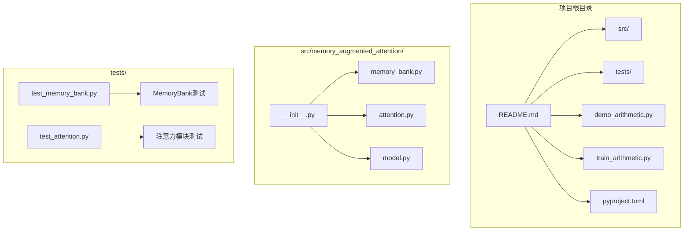
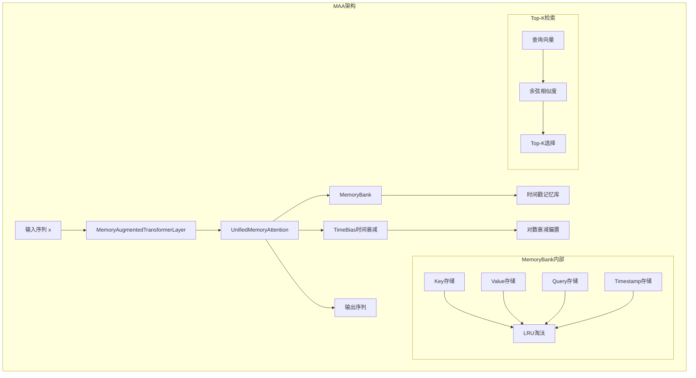
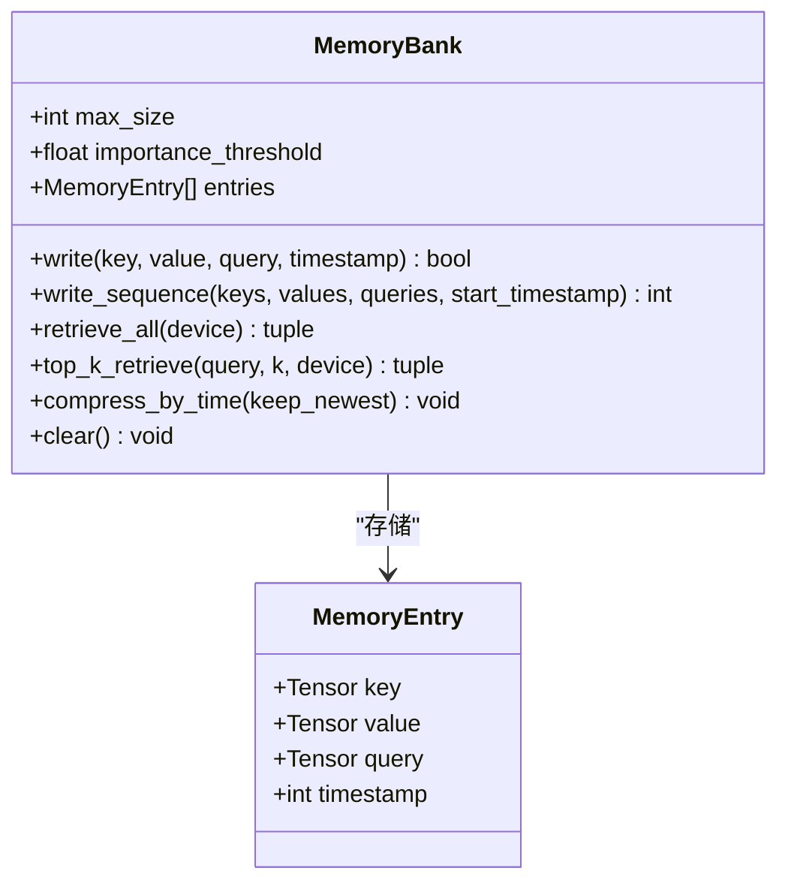
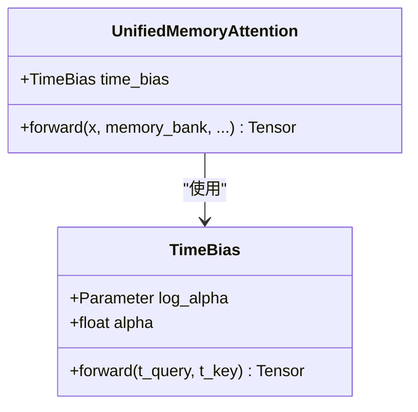
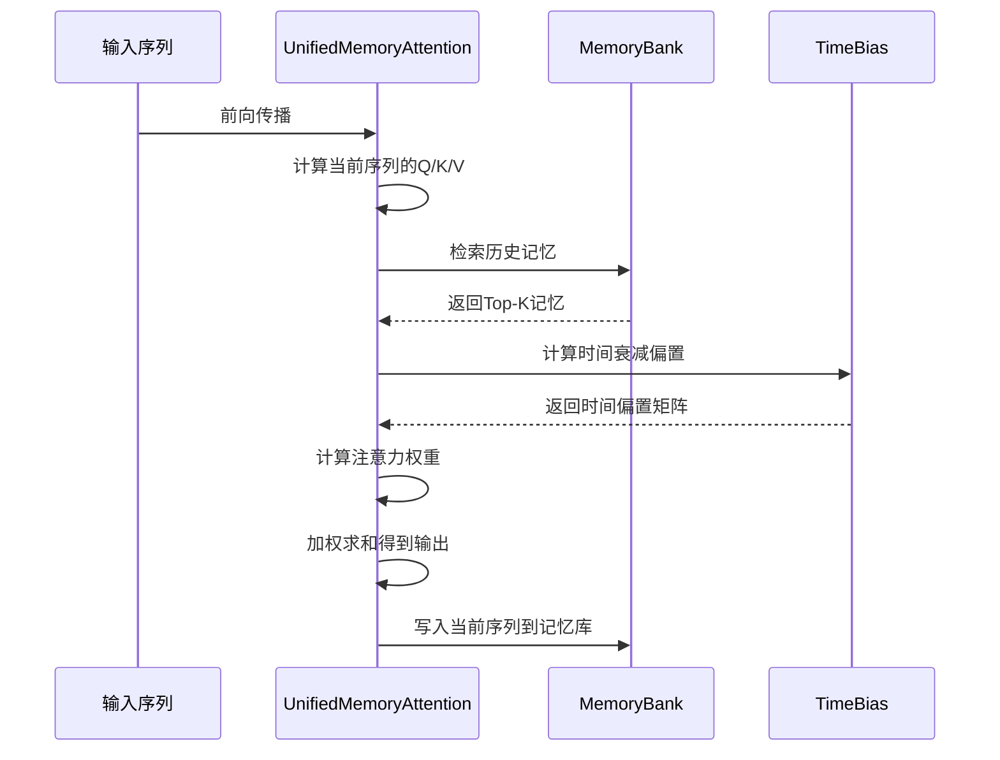
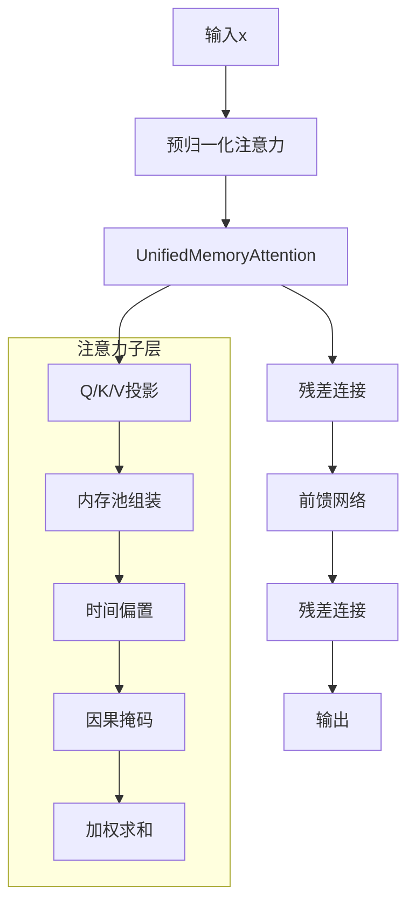
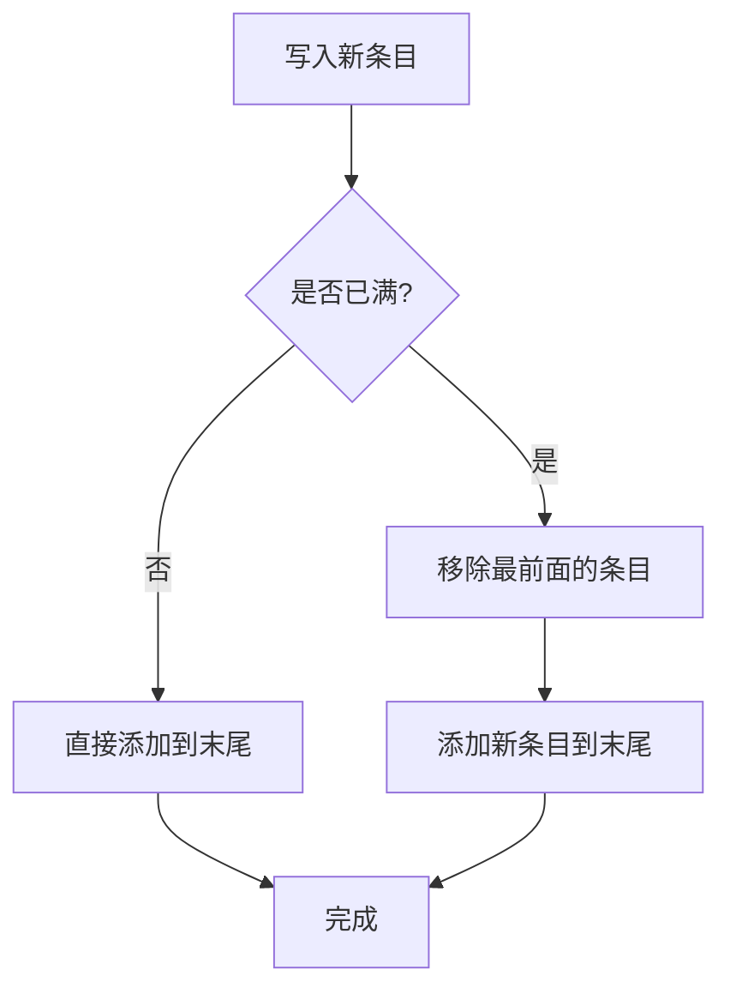
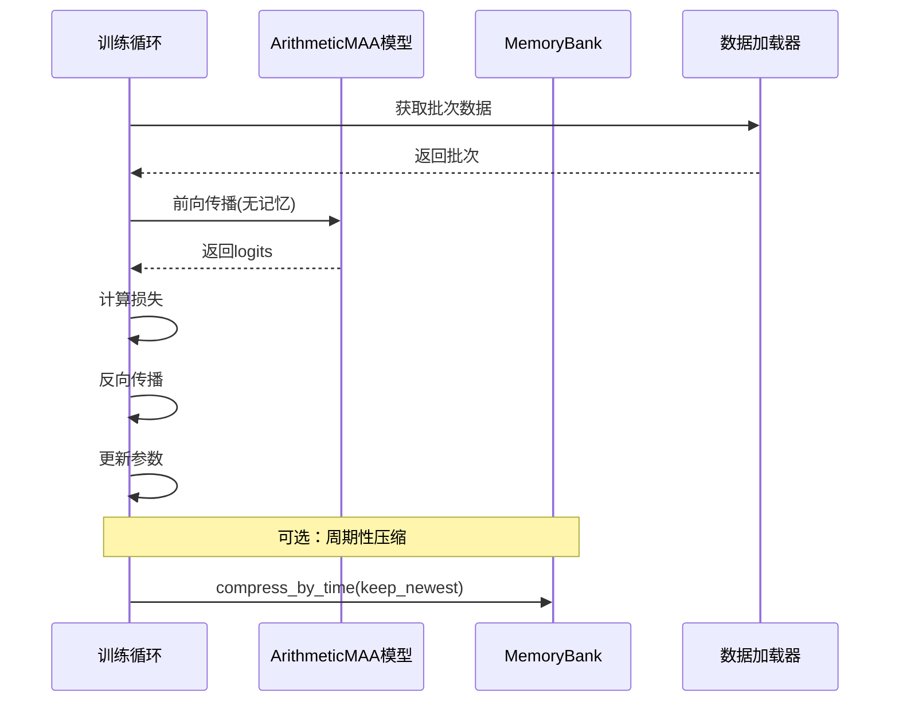
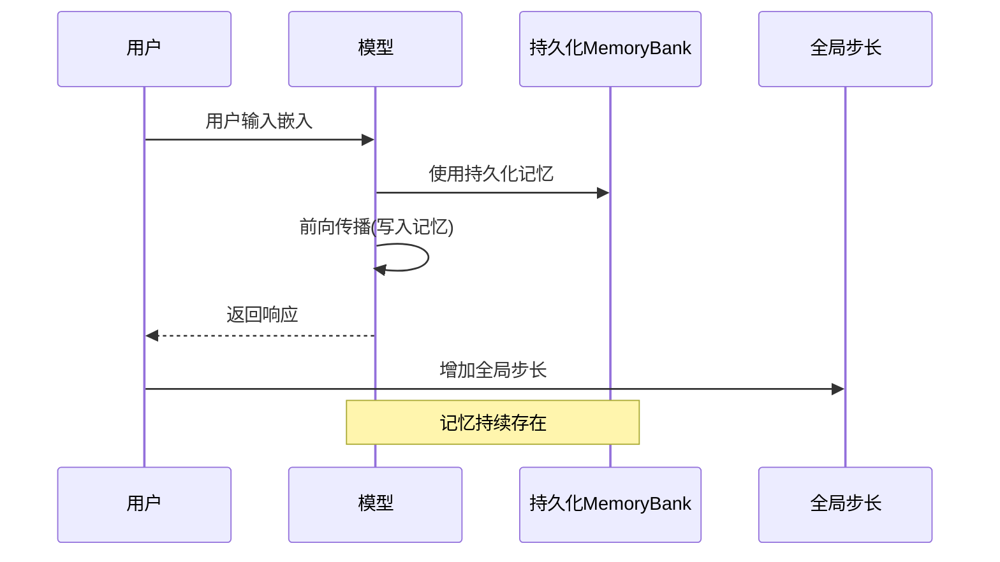

# Memory-Augmented Attention (MAA)项目概述

<cite>
**本文档引用的文件**
- [README.md](file://README.md)
- [__init__.py](file://src/memory_augmented_attention/__init__.py)
- [memory_bank.py](file://src/memory_augmented_attention/memory_bank.py)
- [attention.py](file://src/memory_augmented_attention/attention.py)
- [model.py](file://src/memory_augmented_attention/model.py)
- [test_memory_bank.py](file://tests/test_memory_bank.py)
- [test_attention.py](file://tests/test_attention.py)
- [demo_arithmetic.py](file://demo_arithmetic.py)
- [train_arithmetic.py](file://train_arithmetic.py)
- [pyproject.toml](file://pyproject.toml)
</cite>

## 目录
1. [简介](#简介)
2. [项目结构](#项目结构)
3. [核心理念与动机](#核心理念与动机)
4. [技术架构概览](#技术架构概览)
5. [核心组件详解](#核心组件详解)
6. [时间感知注意力机制](#时间感知注意力机制)
7. [Top-K检索策略](#top-k检索策略)
8. [智能遗忘机制](#智能遗忘机制)
9. [复杂度与可扩展性](#复杂度与可扩展性)
10. [训练与推理流程](#训练与推理流程)
11. [实验验证](#实验验证)
12. [与其他方法的对比](#与其他方法的对比)
13. [性能考虑](#性能考虑)
14. [故障排除指南](#故障排除指南)
15. [结论](#结论)

## 简介

Memory-Augmented Attention (MAA) 是一个基于PyTorch的创新注意力机制实现，它将当前序列令牌和历史KV对统一存储在一个共享的时间戳记忆库中，并通过时间衰减偏置实现注意力机制。该项目解决了标准Transformer的状态无记忆问题，通过统一的记忆架构实现了真正的持久化状态。

MAA的核心思想是：**序列令牌本身就是短期记忆**，传统记忆增强Transformer将它们视为不同的类别，但MAA认为每个令牌——无论是来自当前输入还是过去交互——都只是在特定时间点存储的`(Key, Value, Query, timestamp)`元组。这种统一抽象让模型能够自动降低时间较远条目的权重，实现自然的时间感知注意力。

## 项目结构



**图表来源**
- [README.md: 374-393:374-393](file://README.md#L374-L393)
- [__init__.py: 1-28:1-28](file://src/memory_augmented_attention/__init__.py#L1-L28)

**章节来源**
- [README.md: 374-393:374-393](file://README.md#L374-L393)
- [pyproject.toml: 1-22:1-22](file://pyproject.toml#L1-L22)

## 核心理念与动机

### 标准Transformer的问题

标准Transformer存在根本性的状态无记忆问题：
- 每次前向传播只作用于**当前上下文窗口**
- 推理期间模型权重保持**冻结**——跨调用没有任何"记住"的东西
- 唯一的"记忆"是输入提示——受`max_seq_len`限制

这意味着标准Transformer计算：
```
y_t = P(token | current_context)
```

这是一个纯函数，没有持久状态。

### 统一记忆的洞察

MAA的关键洞察是：**序列令牌本身就是短期记忆**。传统记忆增强Transformer将它们视为分离的类别：
```
Attention(Q, [K_seq ; K_memory], [V_seq ; V_memory])   # 两个独立池
```

但没有原则上的理由要区分它们。每个令牌——无论来自当前输入还是过去交互——都是简单地存储为`(Key, Value, Query, timestamp)`元组。

**章节来源**
- [README.md: 12-64:12-64](file://README.md#L12-L64)

## 技术架构概览



**图表来源**
- [model.py: 27-134:27-134](file://src/memory_augmented_attention/model.py#L27-L134)
- [attention.py: 101-322:101-322](file://src/memory_augmented_attention/attention.py#L101-L322)
- [memory_bank.py: 43-284:43-284](file://src/memory_augmented_attention/memory_bank.py#L43-L284)

## 核心组件详解

### MemoryBank类

MemoryBank是MAA的核心存储组件，负责统一管理所有记忆条目：



**图表来源**
- [memory_bank.py: 33-284:33-284](file://src/memory_augmented_attention/memory_bank.py#L33-L284)

MemoryBank的设计特点：
- 每个槽位存储键张量、值张量、查询张量和整数时间戳
- 银河系最大容量，满载时按时间戳淘汰最旧条目
- 支持Top-K检索，使用点积相似度测量相关性
- 可选的重要性写入过滤器，避免无信息条目污染

**章节来源**
- [memory_bank.py: 1-284:1-284](file://src/memory_augmented_attention/memory_bank.py#L1-L284)

### TimeBias类

TimeBias实现了可学习的时间衰减偏置：



**图表来源**
- [attention.py: 40-94:40-94](file://src/memory_augmented_attention/attention.py#L40-L94)

时间衰减公式：
```
TimeBias(t_q, t_k) = -α * log(1 + |t_q - t_k|)
```

其中α是可学习标量。对数形式匹配人类记忆中幂律遗忘曲线：近期条目受到温和惩罚，而非常久远的条目受到更严厉惩罚，但相对差距对于很大滞后会收缩。

**章节来源**
- [attention.py: 35-94:35-94](file://src/memory_augmented_attention/attention.py#L35-L94)

### UnifiedMemoryAttention类

UnifiedMemoryAttention实现了统一记忆注意力机制：



**图表来源**
- [attention.py: 181-322:181-322](file://src/memory_augmented_attention/attention.py#L181-L322)

**章节来源**
- [attention.py: 96-322:96-322](file://src/memory_augmented_attention/attention.py#L96-L322)

### MemoryAugmentedTransformerLayer类

MemoryAugmentedTransformerLayer提供了完整的Transformer编码器层：



**图表来源**
- [model.py: 27-134:27-134](file://src/memory_augmented_attention/model.py#L27-L134)

**章节来源**
- [model.py: 1-134:1-134](file://src/memory_augmented_attention/model.py#L1-L134)

## 时间感知注意力机制

### 时间衰减偏置的数学原理

MAA的时间感知注意力机制基于以下公式：

```
y_t = softmax((Q_t · K_all^T) / sqrt(d_k) + TimeBias(t_t, t_all)) · V_all
```

其中时间偏置定义为：
```
TimeBias(t_q, t_k) = -α * log(1 + |t_q - t_k|)
```

### 时间偏置的性质

1. **零滞后恒等性**：当t_q = t_k时，TimeBias = 0
2. **非正性**：所有非对角线偏置 ≤ 0（时间惩罚）
3. **递减性**：距离越远的键获得更负的偏置
4. **可学习性**：参数α通过梯度下降学习

### 多维动态权重设计

实验表明，时间只是记忆价值的一个维度。在算术教学中，演示的正确性(Y/N)比年龄更重要；在对话中，访问频率可能超过时效性。

MAA正在从单一TimeBias演进到多维动态权重：
```
MemoryBias(entry) = w_time·f_time + w_verdict·f_verdict + w_freq·f_freq + w_source·f_source
```

权重向量[w_time, w_verdict, w_freq, w_source]由当前查询通过轻量级MLP动态决定——不同问题自动激活不同的记忆过滤逻辑。

**章节来源**
- [README.md: 94-140:94-140](file://README.md#L94-L140)
- [attention.py: 40-94:40-94](file://src/memory_augmented_attention/attention.py#L40-L94)

## Top-K检索策略

### 检索算法流程

```mermaid
flowchart TD
A[查询向量q] --> B[归一化处理]
B --> C[计算与所有键的余弦相似度]
C --> D[选择Top-K个最相关条目]
D --> E[按时间顺序排序]
E --> F[返回结果]
subgraph "相似度计算"
G[q_flat] --> H[k_flat]
H --> I[F.normalize(q_flat)]
I --> J[F.normalize(k_flat)]
J --> K[I @ J.T]
end
C --> G
```

**图表来源**
- [memory_bank.py: 203-253:203-253](file://src/memory_augmented_attention/memory_bank.py#L203-L253)

### Top-K策略的优势

1. **计算效率**：将注意力复杂度从O((L + M)² · d)降低到O(L · K · d)
2. **可扩展性**：K是固定超参数，不随历史长度增长
3. **相关性保证**：只关注最相关的条目
4. **时间顺序保持**：Top-K结果按时间顺序排序

### 参数配置建议

| 参数 | 推荐范围 | 效果 |
|------|----------|------|
| top_k | 32 - 128 | 更大→更丰富的上下文，更高计算开销 |
| init_alpha | 0.5 - 2.0 | 更大→更强的时间衰减 |
| max_size | 1024 - 16384 | RAM中历史条目的最大数量 |
| importance_threshold | 0.0 - 0.5 | 更高→仅存储显著令牌 |

**章节来源**
- [README.md: 151-169:151-169](file://README.md#L151-L169)
- [memory_bank.py: 203-253:203-253](file://src/memory_augmented_attention/memory_bank.py#L203-L253)

## 智能遗忘机制

### LRU淘汰策略

当MemoryBank达到最大容量时，采用LRU（最近最少使用）策略淘汰最旧条目：



**图表来源**
- [memory_bank.py: 114-126:114-126](file://src/memory_augmented_attention/memory_bank.py#L114-L126)

### 重要性过滤

通过重要性阈值防止低信息令牌污染记忆库：
```
write(entry) 仅当 ||V||_2 ≥ importance_threshold
```

这确保只有有意义的信息被存储，避免噪声积累。

### 时间压缩

定期将旧条目合并为摘要向量，进一步减少存储需求：
```python
bank.compress_by_time(keep_newest)
```

**章节来源**
- [memory_bank.py: 114-126:114-126](file://src/memory_augmented_attention/memory_bank.py#L114-L126)
- [README.md: 274-284:274-284](file://README.md#L274-L284)

## 复杂度与可扩展性

### 复杂度分析

| 策略 | 复杂度 | 说明 |
|------|--------|------|
| **Top-K检索** | O(L · K · d) | 每前向传递仅注意K个最相关条目 |
| **时间压缩** | O(L · d) | 周期性合并旧条目为摘要向量 |
| **LRU淘汰** | O(1) | 当银行满时，自动淘汰最旧条目 |

### 推荐使用场景

```
recent tokens (< N steps)  → full attention
older tokens               → Top-K检索
archive                    → 压缩摘要嵌入
```

这种分层策略确保了：
- **实时响应**：最近令牌使用完整注意力
- **成本控制**：历史令牌使用Top-K检索
- **长期记忆**：归档使用压缩摘要

**章节来源**
- [README.md: 151-169:151-169](file://README.md#L151-L169)

## 训练与推理流程

### 训练流程



**图表来源**
- [train_arithmetic.py: 257-358:257-358](file://train_arithmetic.py#L257-L358)

### 推理流程



**图表来源**
- [README.md: 340-354:340-354](file://README.md#L340-L354)

**章节来源**
- [train_arithmetic.py: 257-358:257-358](file://train_arithmetic.py#L257-L358)
- [README.md: 297-354:297-354](file://README.md#L297-L354)

## 实验验证

### 算术教学任务

MAA的核心假设——**统一记忆使模型能够区分可信与不可信信息**——在字符级加法教学任务上得到了验证：

| 条件 | 描述 | L2(分布内) |
|------|------|------------|
| **Cold** | 无演示，仅权重 | **100%** |
| **Prefix** | 5个正确演示前置 | **100%** |
| **PrefixNoisy** | 3个正确 + 2个错误演示 | **100%** |
| **Bank** | 演示预先写入MemoryBank，单独查询 | **89.5%** |

### 关键发现

1. **Cold 100%** → 模型从权重中学习加法规则，而非记忆
2. **PrefixNoisy 100%** → 模型读取Y/N判断，**不会盲目复制错误演示**
3. **Bank 89.5% ≈ Prefix 100%** → 演示通过银行写入-检索存活；统一记忆假设成立
4. **L3/L4 (3-4位) ≈ 0%** → 1.4M参数的字符级模型无法泛化进位链；这是容量/数据问题，而非框架缺陷

**章节来源**
- [README.md: 65-91:65-91](file://README.md#L65-L91)
- [demo_arithmetic.py: 1-324:1-324](file://demo_arithmetic.py#L1-L324)

## 与其他方法的对比

### 相关工作对比

| 方法 | 与MAA的关系 |
|------|-------------|
| **记忆增强Transformer** | 系统性概述显式/隐式记忆、读写机制和容量管理——直接激励设计 |
| **∞-former** | 通过连续空间注意力和"粘性记忆"提出无限长期记忆；与MAA的无限上下文目标一致 |
| **Memformer** | 外部动态记忆模块，用于编码和检索过去信息，与MAA的写入-检索循环密切相关 |
| **RMT** | 将记忆令牌注入输入/输出序列以跨段携带状态；相当于将记忆条目作为第一类序列元素 |
| **Memory Transformer** | 在捕获长程依赖时prepend可学习全局记忆令牌 |
| **Longformer/BigBird** | 减少O(N²)复杂度的稀疏注意力模式——与MAA的Top-K检索策略互补 |
| **NTM/DNC** | 可微读写记忆；MAA采用相同直觉但使用软Top-K注意力而非单独寻址机制 |
| **RAG** | 检索-增强生成：在提示级别集成检索；MAA将检索**集成在**注意力层内 |

**章节来源**
- [README.md: 357-371:357-371](file://README.md#L357-L371)

## 性能考虑

### 计算优化

1. **注意力复杂度**：从O((L + M)² · d)降至O(L · K · d)
2. **内存使用**：通过Top-K检索和时间压缩控制
3. **并行化**：支持批量处理和多头注意力
4. **数值稳定性**：使用softmax和适当的缩放因子

### 超参数调优

- **top_k**：平衡上下文丰富性和计算成本
- **init_alpha**：控制时间衰减强度
- **max_size**：内存容量限制
- **importance_threshold**：信息质量过滤

## 故障排除指南

### 常见问题

1. **MemoryBank为空**：调用retrieve_all或top_k_retrieve时
   - 确保先写入条目或检查条件语句
   - 使用try-except处理空银行情况

2. **注意力形状错误**：维度不匹配
   - 检查d_model必须能被n_heads整除
   - 确认批次维度一致性

3. **梯度消失**：深度网络中的常见问题
   - 使用残差连接和层归一化
   - 调整dropout和学习率

### 调试技巧

- 使用pytest运行单元测试验证各组件功能
- 检查内存使用情况，避免OOM
- 监控alpha参数的学习过程
- 验证Top-K检索的相关性

**章节来源**
- [test_memory_bank.py: 1-189:1-189](file://tests/test_memory_bank.py#L1-L189)
- [test_attention.py: 1-231:1-231](file://tests/test_attention.py#L1-L231)

## 结论

Memory-Augmented Attention代表了注意力机制的重大进步，通过统一记忆架构解决了标准Transformer的状态无记忆问题。其核心贡献包括：

1. **统一记忆抽象**：将当前序列令牌和历史KV对视为同一时间戳记忆库中的条目
2. **时间感知注意力**：通过可学习的时间衰减偏置实现自然的时间权重
3. **高效检索策略**：Top-K检索结合时间压缩，实现可扩展的长期记忆
4. **智能遗忘机制**：LRU淘汰和重要性过滤确保记忆质量

实验验证表明，MAA在算术教学任务中表现出色，能够区分可信信息与不可信信息，并在多种设置下保持高准确率。随着多维动态权重和层次化记忆等未来功能的开发，MAA有望成为构建具有真正持久状态的AI系统的重要基础。

该实现为研究人员和开发者提供了一个清晰、高效的框架，用于探索记忆增强的注意力机制及其在各种下游任务中的应用潜力。