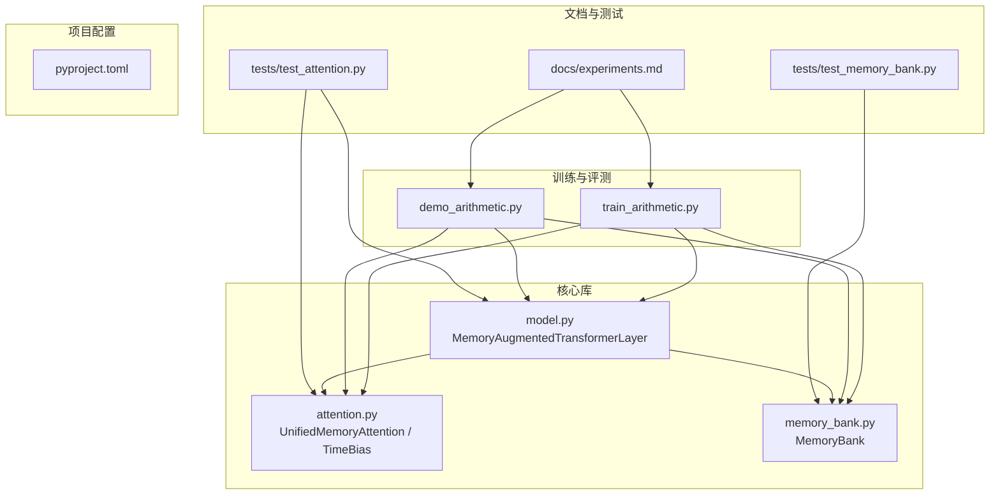
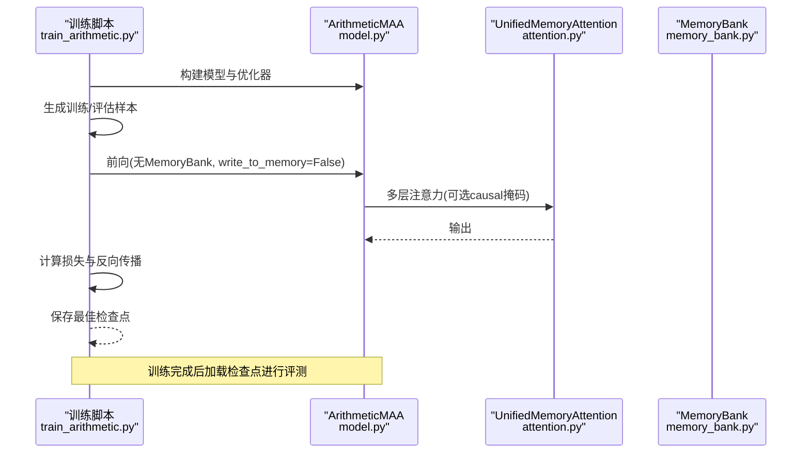
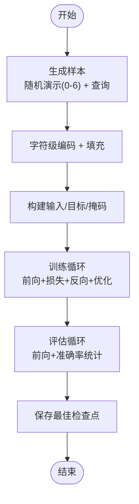
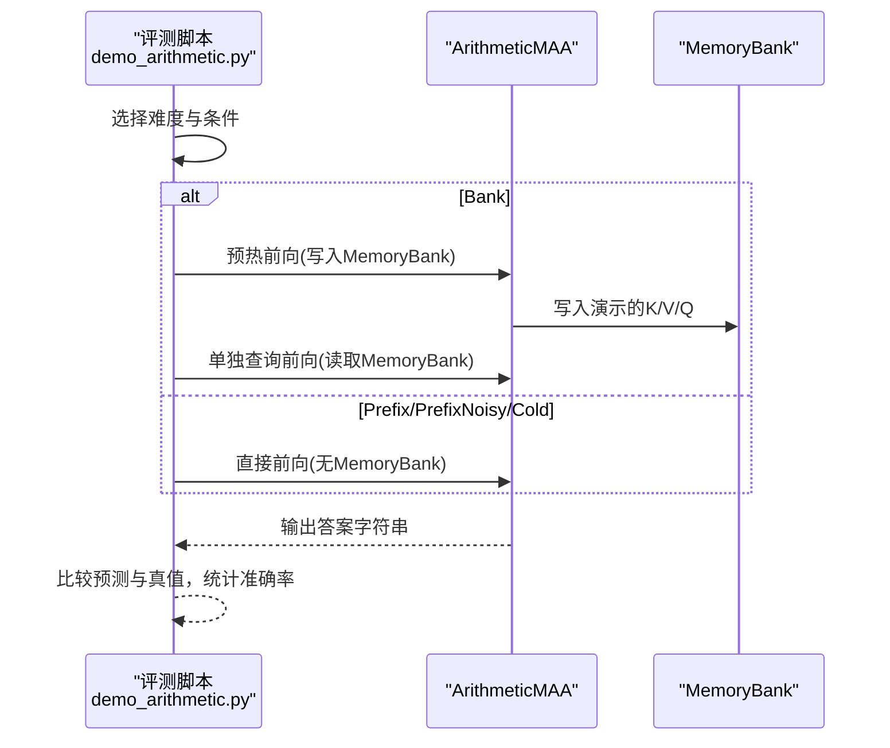
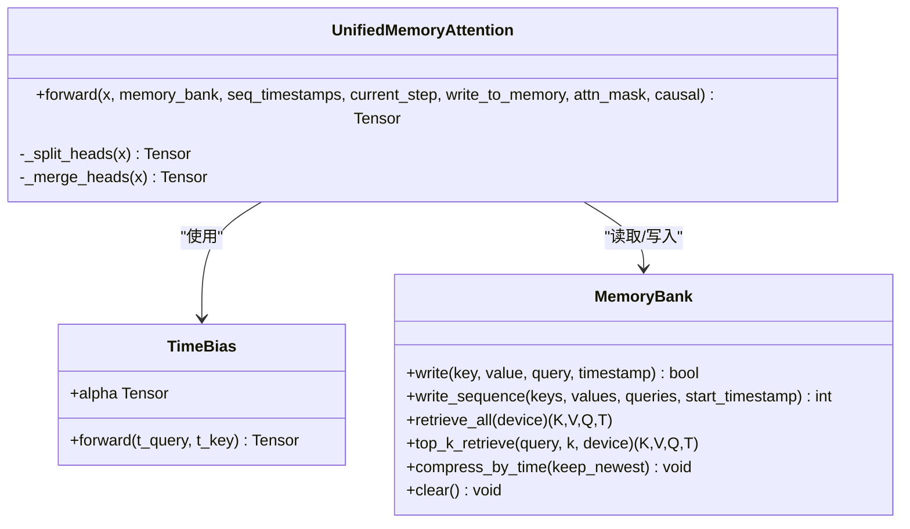
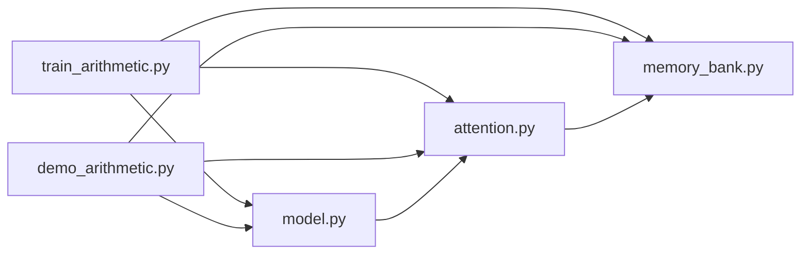

# 验证与实验

<cite>
**本文引用的文件**
- [README.md](file://README.md)
- [docs/experiments.md](file://docs/experiments.md)
- [train_arithmetic.py](file://train_arithmetic.py)
- [demo_arithmetic.py](file://demo_arithmetic.py)
- [src/memory_augmented_attention/model.py](file://src/memory_augmented_attention/model.py)
- [src/memory_augmented_attention/attention.py](file://src/memory_augmented_attention/attention.py)
- [src/memory_augmented_attention/memory_bank.py](file://src/memory_augmented_attention/memory_bank.py)
- [tests/test_memory_bank.py](file://tests/test_memory_bank.py)
- [tests/test_attention.py](file://tests/test_attention.py)
- [pyproject.toml](file://pyproject.toml)
</cite>

## 目录
1. [简介](#简介)
2. [项目结构](#项目结构)
3. [核心组件](#核心组件)
4. [架构总览](#架构总览)
5. [详细组件分析](#详细组件分析)
6. [依赖关系分析](#依赖关系分析)
7. [性能考量](#性能考量)
8. [故障排查指南](#故障排查指南)
9. [结论](#结论)
10. [附录](#附录)

## 简介
本文件围绕 Memory-Augmented Attention（MAA）在“算术教学任务”上的验证与实验进行系统化梳理，重点覆盖以下内容：
- 字符级加法任务的训练设置：混合1-2位数加法，包含0-6个上下文演示，约30%演示被故意标记错误（N）。
- 四种实验条件：Cold（无演示，仅权重）、Prefix（5个正确演示前置）、PrefixNoisy（3个正确+2个错误演示N）、Bank（预写入MemoryBank，仅查询）。
- 关键发现：Cold 100%（从权重学习加法规则）、PrefixNoisy 100%（模型读取Y/N判断并忽略错误演示）、Bank 89.5%≈Prefix 100%（统一记忆假设成立）；L3/L4（3-4位数）≈0%的原因在于1.4M参数字符级模型无法泛化进位链，属于容量/数据问题而非框架缺陷。
- 包含实验结果的统计分析与理论解释，以及训练/评测脚本与核心模块的代码级映射。

## 项目结构
该项目采用清晰的分层组织：
- 训练与评测脚本：train_arithmetic.py（训练）、demo_arithmetic.py（评测）
- 核心库模块：src/memory_augmented_attention/attention.py（注意力与时间偏置）、memory_bank.py（内存银行）、model.py（带记忆的Transformer层）
- 文档与测试：docs/experiments.md（实验记录）、tests/（单元测试）
- 项目元信息：pyproject.toml（构建与依赖）

图表来源
- [train_arithmetic.py:1-358](file://train_arithmetic.py#L1-L358)
- [demo_arithmetic.py:1-324](file://demo_arithmetic.py#L1-L324)
- [src/memory_augmented_attention/model.py:1-134](file://src/memory_augmented_attention/model.py#L1-L134)
- [src/memory_augmented_attention/attention.py:1-322](file://src/memory_augmented_attention/attention.py#L1-L322)
- [src/memory_augmented_attention/memory_bank.py:1-284](file://src/memory_augmented_attention/memory_bank.py#L1-L284)
- [docs/experiments.md:1-129](file://docs/experiments.md#L1-L129)
- [tests/test_memory_bank.py:1-189](file://tests/test_memory_bank.py#L1-L189)
- [tests/test_attention.py:1-231](file://tests/test_attention.py#L1-L231)
- [pyproject.toml:1-22](file://pyproject.toml#L1-L22)

章节来源
- [README.md:374-393](file://README.md#L374-L393)
- [pyproject.toml:1-22](file://pyproject.toml#L1-L22)

## 核心组件
- UnifiedMemoryAttention：统一的记忆增强多头注意力，将当前序列与MemoryBank的历史KV合并，使用可学习的时间衰减偏置TimeBias进行时间衰减。
- TimeBias：可学习的时间衰减模块，对远距离历史进行温和惩罚，模拟人类记忆的幂律遗忘曲线。
- MemoryBank：统一的内存银行，存储(K, V, Q, 时间戳)，支持全量检索、Top-K检索、按时间压缩、LRU淘汰等管理策略。
- MemoryAugmentedTransformerLayer：带记忆的Transformer编码器层，前向包含统一注意力+FFN+残差归一化，支持写入MemoryBank。

章节来源
- [src/memory_augmented_attention/attention.py:101-322](file://src/memory_augmented_attention/attention.py#L101-L322)
- [src/memory_augmented_attention/attention.py:40-94](file://src/memory_augmented_attention/attention.py#L40-L94)
- [src/memory_augmented_attention/memory_bank.py:43-284](file://src/memory_augmented_attention/memory_bank.py#L43-L284)
- [src/memory_augmented_attention/model.py:27-134](file://src/memory_augmented_attention/model.py#L27-L134)

## 架构总览
下图展示了训练与评测流程如何与核心模块交互，以及MemoryBank在推理阶段的作用。

图表来源
- [train_arithmetic.py:209-358](file://train_arithmetic.py#L209-L358)
- [src/memory_augmented_attention/model.py:87-134](file://src/memory_augmented_attention/model.py#L87-L134)
- [src/memory_augmented_attention/attention.py:181-322](file://src/memory_augmented_attention/attention.py#L181-L322)

## 详细组件分析

### 训练设置与数据管线（字符级加法）
- 数据分布：混合1-2位数加法，每个样本包含0–6条演示，演示格式为“a+b=cY/N”，其中约30%被标记为错误（N）。
- 采样结构：演示块以分号连接，用竖线分隔演示块与查询；查询来自与演示相同的分布，确保模型看到1/2位数加法作为预测目标。
- 词汇表：字符级，包含数字、运算符、分隔符及Y/N标记，共18个token。
- 损失掩码：仅对查询的答案位置进行监督，且扩展至答案后一位以强制模型输出PAD结束。
- 模型：ArithmeticMAA为多层带记忆的因果Transformer，嵌入+位置编码+多层MemoryAugmentedTransformerLayer+线性输出头。
- 训练超参：d_model=192、n_heads=6、n_layers=4、d_ff=512、MAX_SEQ_LEN=96、top_k=64、init_alpha=1.0、学习率3e-4、40轮。

图表来源
- [train_arithmetic.py:129-204](file://train_arithmetic.py#L129-L204)
- [train_arithmetic.py:257-307](file://train_arithmetic.py#L257-L307)
- [train_arithmetic.py:312-358](file://train_arithmetic.py#L312-L358)

章节来源
- [train_arithmetic.py:36-64](file://train_arithmetic.py#L36-L64)
- [train_arithmetic.py:78-86](file://train_arithmetic.py#L78-L86)
- [train_arithmetic.py:103-161](file://train_arithmetic.py#L103-L161)
- [train_arithmetic.py:163-204](file://train_arithmetic.py#L163-L204)
- [train_arithmetic.py:209-252](file://train_arithmetic.py#L209-L252)
- [train_arithmetic.py:257-307](file://train_arithmetic.py#L257-L307)
- [train_arithmetic.py:312-358](file://train_arithmetic.py#L312-L358)

### 评测矩阵与实验条件
- 难度级别：L1（1位）、L2（2位，训练内分布）、L3（3位，OOD）、L4（4位，远OOD）、L5（三操作数，语法OOD）。
- 条件：
  - Cold：无演示，仅权重。
  - Prefix：5条正确演示前置。
  - PrefixNoisy：3条正确+2条错误演示（N）。
  - Bank：先将5条正确演示写入MemoryBank，再单独输入查询。
- 解码策略：贪心字符级解码，遇到空格或非数字即停止；答案长度上限由各难度级别决定。

图表来源
- [demo_arithmetic.py:188-236](file://demo_arithmetic.py#L188-L236)
- [demo_arithmetic.py:167-183](file://demo_arithmetic.py#L167-L183)
- [demo_arithmetic.py:133-165](file://demo_arithmetic.py#L133-L165)

章节来源
- [demo_arithmetic.py:12-27](file://demo_arithmetic.py#L12-L27)
- [demo_arithmetic.py:58-105](file://demo_arithmetic.py#L58-L105)
- [demo_arithmetic.py:111-128](file://demo_arithmetic.py#L111-L128)
- [demo_arithmetic.py:133-165](file://demo_arithmetic.py#L133-L165)
- [demo_arithmetic.py:167-183](file://demo_arithmetic.py#L167-L183)
- [demo_arithmetic.py:188-236](file://demo_arithmetic.py#L188-L236)

### 统一记忆注意力与时间衰减
- 统一池：当前序列与MemoryBank的历史KV合并，形成统一的注意力池。
- 时间偏置：TimeBias对远距离历史进行对数衰减惩罚，alpha为可学习标量；alpha=0退化为标准注意力。
- Top-K检索：当top_k有限时，以平均查询向量为探针进行相似度排序，仅关注最相关的若干历史项，降低复杂度。
- 写入策略：每次前向结束后，当前序列的K/V/Q均值按token时间戳写入MemoryBank，供后续调用检索。

图表来源
- [src/memory_augmented_attention/attention.py:40-94](file://src/memory_augmented_attention/attention.py#L40-L94)
- [src/memory_augmented_attention/attention.py:101-322](file://src/memory_augmented_attention/attention.py#L101-L322)
- [src/memory_augmented_attention/memory_bank.py:43-284](file://src/memory_augmented_attention/memory_bank.py#L43-L284)

章节来源
- [src/memory_augmented_attention/attention.py:101-162](file://src/memory_augmented_attention/attention.py#L101-L162)
- [src/memory_augmented_attention/attention.py:181-322](file://src/memory_augmented_attention/attention.py#L181-L322)
- [src/memory_augmented_attention/memory_bank.py:82-164](file://src/memory_augmented_attention/memory_bank.py#L82-L164)
- [src/memory_augmented_attention/memory_bank.py:169-254](file://src/memory_augmented_attention/memory_bank.py#L169-L254)

### 关键实验结果与统计分析
- 训练内分布（L1/L2）：Cold 100%、Prefix 100%、PrefixNoisy 100%、Bank 89.5%（≈Prefix）。
- OOD（L3/L4）：均≈0%；语法OOD（L5）：约15%。
- 统计显著性：每条件200次trial，结果来源于评测脚本的批量运行与汇总打印。
- 理论解释：
  - Cold 100%：模型从权重中学习到加法规则，非记忆。
  - PrefixNoisy 100%：模型能读取Y/N标记并忽略错误演示，体现可信度判决。
  - Bank≈Prefix：demos写入MemoryBank后仍可被检索，验证统一记忆假设。
  - L3/L4≈0%：字符级1.4M参数模型无法泛化进位链，属容量/数据问题。

章节来源
- [docs/experiments.md:55-82](file://docs/experiments.md#L55-L82)
- [demo_arithmetic.py:274-309](file://demo_arithmetic.py#L274-L309)

### 训练过程中的关键Bug与修复
- Bug 1：注意力泄漏（Causal Mask）：默认双向注意力导致教师强制下当前位置能看到未来答案token，修复为对当前序列应用因果掩码，memory-bank列始终可见。
- Bug 2：缺少停止监督：loss仅监督答案位置，模型不知道何时停止，修复为将mask扩展至答案后一位，使模型学会预测PAD。
- Bug 3：Bank作弊：跨batch共享bank导致模型“查表复制答案”，修复为训练时memory_bank=None，评测时再使用。

章节来源
- [docs/experiments.md:96-122](file://docs/experiments.md#L96-L122)

## 依赖关系分析
- 训练脚本依赖MemoryAugmentedTransformerLayer、MemoryBank与UnifiedMemoryAttention。
- 评测脚本依赖ArithmeticMAA、MemoryBank与训练脚本中的编码/解码工具函数。
- 核心模块之间耦合度低，通过接口清晰分离：注意力负责统一池与时间衰减，MemoryBank负责存取与管理，Layer负责堆叠与残差。

图表来源
- [train_arithmetic.py:34-358](file://train_arithmetic.py#L34-L358)
- [demo_arithmetic.py:38-52](file://demo_arithmetic.py#L38-L52)
- [src/memory_augmented_attention/model.py:23-134](file://src/memory_augmented_attention/model.py#L23-L134)
- [src/memory_augmented_attention/attention.py:32-322](file://src/memory_augmented_attention/attention.py#L32-L322)
- [src/memory_augmented_attention/memory_bank.py:32-284](file://src/memory_augmented_attention/memory_bank.py#L32-L284)

章节来源
- [train_arithmetic.py:34-358](file://train_arithmetic.py#L34-L358)
- [demo_arithmetic.py:38-52](file://demo_arithmetic.py#L38-L52)

## 性能考量
- 复杂度与可扩展性：朴素注意力对全银行为O((L+M)²·d)，MAA提供三种策略控制成本：
  - Top-K检索：固定K（如32–128）限制注意力池大小。
  - 时间压缩：周期性合并旧条目为摘要向量，减少存储与计算。
  - LRU淘汰：满载时自动淘汰最早条目。
- 推荐实践：近期token使用全注意力，更旧token使用Top-K，归档区使用压缩摘要嵌入。
- 训练/评测中的设备选择：优先CUDA/MPS，回退CPU；模型参数量约140万，适合字符级小模型。

章节来源
- [README.md:151-169](file://README.md#L151-L169)
- [README.md:297-339](file://README.md#L297-L339)
- [train_arithmetic.py:67-76](file://train_arithmetic.py#L67-L76)

## 故障排查指南
- MemoryBank为空却尝试检索：retrieve_all/top_k_retrieve在空bank上会抛出异常，需确保写入后再读取。
- 写入被重要性阈值拒绝：当value的L2范数低于threshold时会被丢弃，适当提高importance_threshold可避免。
- Top-K不足：当k大于已存储数量时返回全部，注意顺序与时间戳一致性。
- 评测结果异常偏低：
  - 检查是否正确传入causal掩码与停止监督（答案后一位PAD）。
  - 确认评测时未跨batch共享MemoryBank，避免“查表复制”。

章节来源
- [tests/test_memory_bank.py:107-111](file://tests/test_memory_bank.py#L107-L111)
- [tests/test_memory_bank.py:153-158](file://tests/test_memory_bank.py#L153-L158)
- [tests/test_attention.py:17-59](file://tests/test_attention.py#L17-L59)
- [tests/test_attention.py:101-177](file://tests/test_attention.py#L101-L177)
- [docs/experiments.md:96-122](file://docs/experiments.md#L96-L122)

## 结论
- MAA在训练内分布上成功验证了统一记忆与可信度判决两大核心假设；Bank模式与Prefix模式在L2表现相近，表明demos经由MemoryBank仍可有效检索。
- L3/L4≈0%并非框架缺陷，而是字符级1.4M参数模型无法泛化进位链的容量/数据问题。
- 未来方向：在需要长期记忆的真实场景（如多轮对话、个性化助手）中进一步验证MAA的优势。

## 附录
- 项目安装与运行：支持可编辑安装与pytest测试；Python≥3.9，PyTorch≥2.0。
- API参考：MemoryBank、TimeBias、UnifiedMemoryAttention、MemoryAugmentedTransformerLayer的参数与行为均有明确文档与类型注释。

章节来源
- [README.md:173-180](file://README.md#L173-L180)
- [README.md:215-272](file://README.md#L215-L272)
- [pyproject.toml:1-22](file://pyproject.toml#L1-L22)