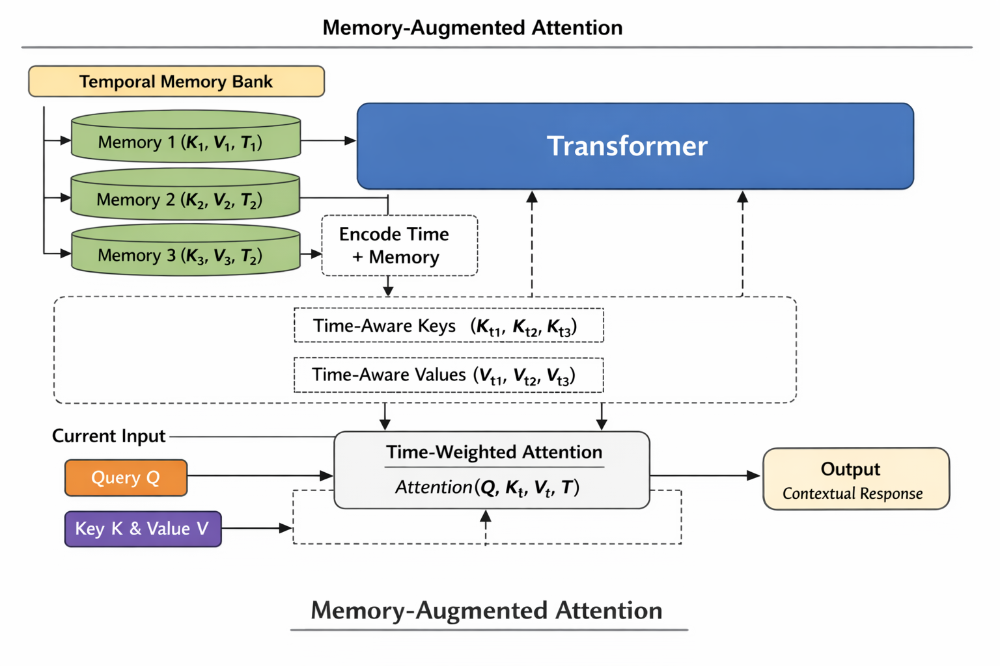

# Memory-Augmented Attention (MAA)

A PyTorch implementation of **Unified Memory-Augmented Attention (MAA)**, where
current-sequence tokens (short-term memory) and historical KV pairs
(long-term memory) are stored in one shared, timestamped **Memory Bank** and
attended over jointly with a **temporal decay bias**.



---

## Background & Motivation

### The Problem with Standard Transformers

Standard Transformers are powerful predictors but are fundamentally **stateless**:

- Each forward pass operates only on the **current context window**.
- Model **weights are frozen** during inference — nothing is "remembered" across calls.
- The only "memory" is the prompt fed in — bounded by `max_seq_len`.

This means a standard Transformer computes:

```
y_t = P(token | current_context)
```

It is a pure function with no persistent state.

### The Insight: Sequence Tokens ARE Memory

A key insight motivating this library is that **the current sequence is itself
a form of short-term memory**. Traditional Memory-Augmented Transformers treat
them as separate categories:

```
Attention(Q, [K_seq ; K_memory], [V_seq ; V_memory])   # two separate pools
```

But there is no principled reason to distinguish them. Every token — whether
from the current input or from a past interaction — is simply a
`(Key, Value, Query, timestamp)` tuple stored at a particular point in time.

This library unifies both under one abstraction:

```
M_all = M_memory ∪ { (K_seq, V_seq, Q_seq, t_seq) }
y_t   = Attention(Q_t, K_all, V_all, TimeBias(t_t, t_all))
```

Time becomes an explicit dimension of every memory entry, and the attention
mechanism automatically down-weights entries that are further in the past.

### Why Time Matters

Memory without time is unordered. Adding a timestamp `t` to each entry lets
the model:

1. **Prefer recent context** — via the temporal decay bias.
2. **Understand event ordering** — the model can learn that `t_i < t_j` implies
   event `i` happened before event `j`.
3. **Implement forgetting** — old, less-relevant entries are discounted without
   explicit deletion.

### Empirical Validation: Arithmetic Teaching Task

We validated MAA's core hypothesis — that **unified memory enables the model to
distinguish credible from non-credible information** — on a character-level
addition task:

- **Training**: Mixed 1- and 2-digit addition (operands 0–99), each sample
  carries 0–6 in-context demonstrations (~30% deliberately marked wrong with `N`).
- **Testing**: 5 difficulty levels (1-digit → 4-digit → 3-operand), 4 conditions:

| Condition       | Description                                  | L2 (in-distribution) |
| --------------- | -------------------------------------------- | -------------------- |
| **Cold**        | No demos, weights only                       | **100%**             |
| **Prefix**      | 5 correct demos prepended                    | **100%**             |
| **PrefixNoisy** | 3 correct + 2 wrong demos (`N`)              | **100%**             |
| **Bank**        | Demos pre-written to MemoryBank, query alone | **99.5%**            |
| **BankDynamic** | Mixed demos with verdict metadata in Bank    | **100%**             |

Key findings:

- **Cold 100%** → the model learned addition rules from weights, not memorisation.
- **PrefixNoisy 100%** → the model reads `Y/N` verdicts and **does not blindly
  copy wrong demos**.
- **Bank 99.5% ≈ Prefix 100%** → demos survive write-then-retrieve through the
  bank; the unified-memory hypothesis holds.
- **BankDynamic 100%** → DynamicMemoryBias correctly up-weights credible demos
  and suppresses wrong ones when verdict metadata is available.
- **L3/L4 (3-4 digit) ≈ 0%** → a 1.4M-parameter character-level model cannot
  generalise the carry chain; this is a capacity/data issue, not a framework flaw.

---

## Core Formula

### Unified Memory Attention

```
M_all = M_memory ∪ { (K_seq, V_seq, Q_seq, t_seq) }

y_t = softmax( (Q_t · K_all^T) / sqrt(d_k) + TimeBias(t_t, t_all) ) · V_all
```

### Temporal Decay Bias

```
TimeBias(t_q, t_k) = -alpha * log(1 + |t_q - t_k|)
```

`alpha` is a **learnable scalar**. The logarithmic form matches the
power-law forgetting curve observed in human memory: recent entries are
penalised gently while very distant entries are penalised more, but the
relative gap shrinks for very large lags.

Setting `alpha = 0` recovers **standard (time-agnostic) attention**.

### From Single Time to Multi-Dimensional Dynamic Weights (Design Evolution)

Experiments show that **time is only one dimension of memory value**. In
arithmetic teaching, a demo's correctness (`Y`/`N`) matters more than its age;
in dialogue, access frequency may outweigh recency.

MAA is therefore evolving from a single `TimeBias` to a
**multi-dimensional dynamic weighting**:

```
MemoryBias(entry) = w_time·f_time + w_verdict·f_verdict + w_freq·f_freq + w_source·f_source
```

The weight vector `[w_time, w_verdict, w_freq, w_source]` is **dynamically
decided by the current query** through a lightweight MLP — different questions
automatically activate different memory-filtering logic.

| Dimension               | Function                | Typical Scene Weight                              |
| ----------------------- | ----------------------- | ------------------------------------------------- | ---- | -------------------------------------------- |
| **Time** `f_time`       | `exp(-                  | Δt                                                | /τ)` | High for chat history, low for math teaching |
| **Verdict** `f_verdict` | `[-1, +1]` (`N`→`Y`)    | High for teaching demos, low for chitchat         |
| **Frequency** `f_freq`  | `log(1 + access_count)` | High for code completion, low for one-off queries |
| **Source** `f_source`   | `[0, 1]` authority      | High for QA, low for anonymous forums             |

### Not All Inputs Should Be Memorised

An importance filter prevents low-information tokens from polluting the bank:

```
write(entry) only if ||V||_2 >= importance_threshold
```

---

## Complexity & Scalability

The naive attention over the full bank is O((L + M)² · d), which explodes as
`M` grows. MAA ships three complementary strategies to keep complexity
manageable:

| Strategy                 | Complexity   | Notes                                                                                          |
| ------------------------ | ------------ | ---------------------------------------------------------------------------------------------- |
| **Top-K retrieval**      | O(L · K · d) | Only the K most relevant entries attend; K is a fixed hyperparameter (e.g. 32–128)             |
| **Temporal compression** | O(L · d)     | Periodically merge old entries into summary vectors; call `bank.compress_by_time(keep_newest)` |
| **LRU eviction**         | O(1)         | When the bank is full, the oldest entry is automatically evicted                               |

Recommended regime:

```
recent tokens (< N steps)  → full attention
older tokens               → Top-K retrieval only
archive                    → compressed summary embeddings
```

---

## Installation

```bash
pip install -e ".[dev]"   # editable install with test extras
```

Requires Python ≥ 3.9 and PyTorch ≥ 2.0.

---

## Quick Start

```python
import torch
from memory_augmented_attention import MemoryBank, MemoryAugmentedTransformerLayer

layer = MemoryAugmentedTransformerLayer(
    d_model=256,
    n_heads=8,
    d_ff=1024,
    dropout=0.1,
    top_k=64,        # attend to at most 64 historical entries per forward pass
    init_alpha=1.0,  # initial temporal-decay strength (learnable)
)
bank = MemoryBank(max_size=4096, importance_threshold=0.0)

global_step = 0
for batch in data_loader:
    x = batch["embeddings"]   # (B, T, 256)

    out = layer(
        x,
        memory_bank=bank,
        current_step=global_step,
        write_to_memory=True,  # write current seq into bank after attention
    )

    global_step += x.shape[1]   # advance timestamp by sequence length
```

---

## API Reference

### `MemoryBank`

```python
MemoryBank(max_size=1024, importance_threshold=0.0)
```

Each slot stores `(key, value, query, timestamp)` for one token.

| Method                                                   | Returns                | Description                                                   |
| -------------------------------------------------------- | ---------------------- | ------------------------------------------------------------- |
| `write(key, value, query, timestamp)`                    | `bool`                 | Write one entry; `False` if rejected by the importance filter |
| `write_sequence(keys, values, queries, start_timestamp)` | `int`                  | Write a full sequence; returns next available timestamp       |
| `retrieve_all(device=None)`                              | `(K, V, Q, T)` tensors | All entries as stacked tensors                                |
| `top_k_retrieve(query, k, device=None)`                  | `(K, V, Q, T)` tensors | Top-K most relevant entries by cosine similarity              |
| `compress_by_time(keep_newest)`                          | —                      | Discard old entries, keep `keep_newest` most recent           |
| `clear()`                                                | —                      | Remove all entries                                            |

### `TimeBias`

```python
TimeBias(init_alpha=1.0)
```

Learnable temporal-decay module with a single parameter `alpha`.
`alpha = 0` → no decay (standard attention).

### `UnifiedMemoryAttention`

```python
UnifiedMemoryAttention(
    d_model, n_heads,
    dropout=0.0,
    top_k=None,       # None → use all stored entries
    init_alpha=1.0,
)
```

Multi-head attention over the unified memory pool. After each forward pass
the current sequence's K/V/Q projections are written into `MemoryBank`
(when `write_to_memory=True`).

### `MemoryAugmentedTransformerLayer`

```python
MemoryAugmentedTransformerLayer(
    d_model, n_heads,
    d_ff=None,         # defaults to 4 * d_model
    dropout=0.1,
    top_k=None,
    init_alpha=1.0,
)
```

Full encoder layer: `UnifiedMemoryAttention → Add & Norm → FFN → Add & Norm`.

---

## Memory Management Details

| Mechanism                | Config                          | Behaviour                                                |
| ------------------------ | ------------------------------- | -------------------------------------------------------- |
| **Physical guardrail**   | `max_size`                      | Prevents OOM; triggers LRU eviction when full            |
| **Importance filter**    | `importance_threshold`          | Entries with `‖V‖₂ < threshold` are discarded on write   |
| **Verdict tag**          | `verdict` (per entry)           | `+1.0`=confirmed correct, `-1.0`=wrong, `0.0`=unverified |
| **Temporal compression** | `compress_by_time(keep_newest)` | Aggressively trims the bank between inference steps      |
| **Top-K retrieval**      | `top_k` on the attention layer  | Limits the attention pool to the K most relevant entries |
| **LRU fallback**         | (automatic)                     | Drops oldest entry only when consolidation lags behind   |

### Memory Types and Dimension Weights

Different memory types are sensitive to different dimensions:

| Memory Type    | Example                              | Dominant Dimensions | Rationale                                      |
| -------------- | ------------------------------------ | ------------------- | ---------------------------------------------- |
| **Episodic**   | "User said they like blue yesterday" | Time + Frequency    | Old info decays; frequently used info persists |
| **Semantic**   | "1+1=2"                              | Verdict + Source    | Correctness does not change with time          |
| **Procedural** | "How to ride a bike"                 | Frequency           | Practice makes perfect                         |

---

## Training Guide

MAA layers are drop-in replacements for standard `nn.TransformerEncoderLayer`.
The only additional concern is managing the `MemoryBank` across steps.

### Supervised fine-tuning on sequences

```python
import torch
import torch.nn as nn
from memory_augmented_attention import MemoryBank, MemoryAugmentedTransformerLayer

model = MemoryAugmentedTransformerLayer(d_model=512, n_heads=8, top_k=64)
optimizer = torch.optim.AdamW(model.parameters(), lr=1e-4)

for epoch in range(num_epochs):
    bank = MemoryBank(max_size=2048)   # fresh bank each epoch
    global_step = 0

    for x, y in train_loader:          # x: (B, T, 512)
        optimizer.zero_grad()

        out = model(x, memory_bank=bank, current_step=global_step)
        loss = criterion(out, y)
        loss.backward()
        optimizer.step()

        global_step += x.shape[1]

        # Optional: periodically compress to prevent memory explosion
        if global_step % 4096 == 0:
            bank.compress_by_time(keep_newest=512)
```

### Key hyperparameters

| Parameter              | Recommended range | Effect                                  |
| ---------------------- | ----------------- | --------------------------------------- |
| `top_k`                | 32 – 128          | Larger → richer context, higher compute |
| `init_alpha`           | 0.5 – 2.0         | Larger → stronger temporal decay        |
| `max_size`             | 1024 – 16384      | Max historical entries in RAM           |
| `importance_threshold` | 0.0 – 0.5         | Higher → only salient tokens stored     |

### Inference with persistent memory

```python
# Persistent bank survives across user turns
bank = MemoryBank(max_size=8192, importance_threshold=0.1)
global_step = 0

def respond(user_input_embedding):
    global global_step
    out = model(user_input_embedding, memory_bank=bank,
                current_step=global_step, write_to_memory=True)
    global_step += user_input_embedding.shape[1]
    return out
```

---

## Related Work

MAA sits at the intersection of several active research areas:

| Paper / System                             | Relation to MAA                                                                                                                                                         |
| ------------------------------------------ | ----------------------------------------------------------------------------------------------------------------------------------------------------------------------- |
| **Memory-Augmented Transformers** (survey) | Systematic overview of explicit/implicit memory, read-write mechanisms, and capacity management — directly motivates the design                                         |
| **∞-former** (Martins et al., 2022)        | Proposes unbounded long-term memory via continuous-space attention and "sticky memories"; aligns with MAA's goal of infinite context                                    |
| **Memformer** (Wu et al., 2022)            | External dynamic memory module for encoding and retrieving past information with Memory Replay Back-Propagation; closely related to the write-then-retrieve loop in MAA |
| **Recurrent Memory Transformer (RMT)**     | Injects memory tokens into input/output sequences to carry state across segments; equivalent to treating memory entries as first-class sequence elements                |
| **Memory Transformer**                     | Prepends learnable global memory tokens to capture long-range dependencies                                                                                              |
| **Longformer / BigBird**                   | Sparse attention patterns that reduce O(N²) complexity — complementary to MAA's Top-K retrieval strategy                                                                |
| **Neural Turing Machine / DNC**            | Differentiable read/write memory; MAA adopts the same intuition but uses soft Top-K attention instead of a separate addressing mechanism                                |
| **RAG** (Lewis et al., 2020)               | Retrieval-augmented generation: retrieve-then-attend; MAA integrates retrieval _inside_ the attention layer rather than at the prompt level                             |

---

## Project Structure

```
memory-augmented-attention/
├── src/memory_augmented_attention/
│   ├── __init__.py          # public API
│   ├── memory_bank.py       # MemoryBank + MemoryEntry
│   ├── attention.py         # TimeBias + UnifiedMemoryAttention + CausalMask
│   └── model.py             # MemoryAugmentedTransformerLayer
├── tests/
│   ├── test_memory_bank.py
│   └── test_attention.py
├── train_arithmetic.py      # Training script: in-context teaching with Y/N verdicts
├── demo_arithmetic.py       # Evaluation: Cold/Prefix/Noisy/Bank × L1–L5
├── arithmetic_maa_best.pt   # Trained checkpoint (1.4M params)
├── MAA.png                  # architecture diagram
├── pyproject.toml
├── README.md
└── README_zh.md
```

---

## Roadmap

### Completed

- [x] **Causal mask support** — autoregressive training & inference (`causal=True`)
- [x] **Teaching-test separation validation** — arithmetic task validates unified memory, Y/N verdicts, Bank/Prefix dual channel
- [x] **Stop-signal supervision** — teach model to emit PAD after answer, fixing greedy overflow
- [x] **Multi-dimensional dynamic weights** — DynamicMemoryBias: learnable [time, verdict, frequency, source] weighting, Bank L2 improved from 89.5% to 99.5%
- [x] **Memory type system** — MemoryType enum (Episodic/Semantic/Procedural) with dimension priors
- [x] **Learnable consolidation** — ConsolidationNetwork: cross-attention compression, 256→88 entries (~3:1)

### In Progress

- [ ] **Hierarchical memory** — split bank into recency tiers (hot / warm / cold) with different retrieval budgets

### Planned

- [ ] **Learnable importance scoring** — replace L2-norm filter with a small MLP that predicts whether a token is worth storing
- [ ] **Cross-layer shared bank** — share one `MemoryBank` across all layers of a multi-layer transformer
- [ ] **Sparse attention integration** — combine Top-K retrieval with Longformer-style local windows
- [ ] **Long-dialogue benchmark** — measure memory persistence and temporal decay over 100+ turn conversations
- [ ] **Uncertainty token** — extend vocabulary with `U` (Uncertain) so the model can express "cannot judge" when memories conflict

---

## Running Tests

```bash
pytest tests/ -v
```
